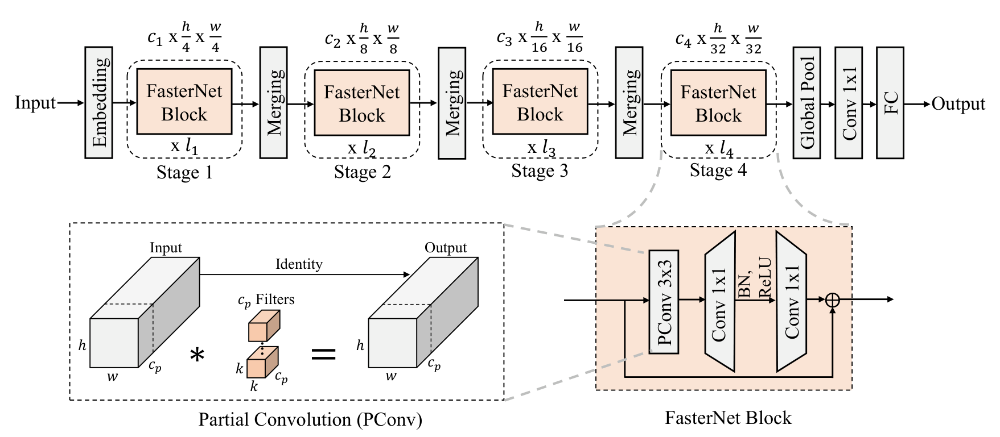

医学图像分割模型往往"跑得慢"——不是 FLOPs 高，而是**内存访问（Memory Access）太频繁**。很多网络 FLOPs 降下去了，实测速度却没快，就是因为逐层读写显存的开销被忽略了。

FasterNet（CVPR 2023）提出 **PConv（Partial Convolution，部分卷积）**：**只对输入通道里的一小部分做 3×3 卷积，其余通道原样直通**，既砍 FLOPs、更砍内存访问，实测速度显著提升，而精度不掉。对已经堆满 3×3 卷积的医学分割网络来说，它是替换重型卷积块的首选之一。

---

## 一、论文出处

- **论文**：Run, Don't Walk: Chasing Higher FLOPS for Faster Neural Networks
- **会议**：CVPR 2023
- **论文链接**：https://arxiv.org/abs/2303.03667
- **官方代码**：https://github.com/JierunChen/FasterNet

---

## 二、模块图（截自论文原文 Figure 4）



> 图自 FasterNet 原文 Figure 4（CVPR 2023）。上半部分是 FasterNet 主干（Embedding → 4 个 Stage → Global Pool → 1×1 Conv → FC）；下方两个虚线框分别展开 **Partial Convolution (PConv)** 与 **FasterNet Block** 的内部结构。

（拆成一句话：输入 → PConv（3×3 只作用于 C/4 通道，其余通道直通）→ BN → 1×1 卷积升维 → 激活 → 1×1 卷积降维 → 加上残差 → 输出。）

---

## 三、核心思想与作用

一句话：**卷积只在「部分通道」上做，用更少的内存访问换更高的实测速度（FLOPS），精度基本不掉。**

拆解：
1. **被忽视的瓶颈**：FasterNet 指出，影响推理速度的不只是 FLOPs，更是 **FLOPS**（每秒浮点运算次数，即实际吞吐）——频繁的逐层访存会拖慢速度。
2. **PConv 的做法**：对输入特征图，只取前 `cp = C/4` 个通道做 3×3 卷积，其余 `C - cp` 个通道**完全不计算、直接拷贝输出**；随后用一个 1×1 卷积（PWConv）把信息在通道间融合。
3. **收益**：PConv 的 FLOPs ≈ 常规卷积的 1/16（cp=C/4 时），内存访问也大幅下降；而 PWConv 补回通道交互能力，保证表达力。

**在分割里的作用**：
- **提速**：把 U-Net 编码器里的 3×3 卷积块换成 FasterNet Block，训练/推理更快；
- **省显存**：对医学影像这种高分辨率、大 batch 受限的场景友好；
- **即插即用**：残差结构 + 纯卷积，替换进现有网络改造成本极低。

---

## 四、在 U-Net 里的插入位置

FasterNet Block 是"高效卷积块"，**可直接替换编码器/解码器里的常规 3×3 卷积残差块**；也可以只替换最吃算力的几个 stage。通道数很大时收益最明显（因为 PConv 省的是通道维度的计算）。

---

## 五、复现代码（PyTorch，逐行注释）

```python
import torch
import torch.nn as nn

class Partial_conv3(nn.Module):
    """PConv：3×3 卷积只作用于一部分通道，其余通道直通。"""
    def __init__(self, dim, n_div=4):
        super().__init__()
        self.dim_conv3 = dim // n_div              # 参与卷积的通道数（默认 C/4）
        self.dim_untouched = dim - self.dim_conv3  # 直通、不计算的通道数
        # 3×3 深度无关的普通卷积，但只吃 dim_conv3 个通道
        self.partial_conv3 = nn.Conv2d(self.dim_conv3, self.dim_conv3,
                                       kernel_size=3, stride=1, padding=1, bias=False)

    def forward(self, x):
        # 按通道切成"要算的"和"直通的"两部分
        x1, x2 = torch.split(x, [self.dim_conv3, self.dim_untouched], dim=1)
        x1 = self.partial_conv3(x1)                # 只对 x1 做 3×3
        x = torch.cat((x1, x2), dim=1)             # x2 原样拼接回去
        return x

class Faster_Block(nn.Module):
    """FasterNet Block：PConv + 两个 1×1 卷积（PWConv）+ 残差。"""
    def __init__(self, dim, n_div=4, mlp_ratio=2, drop_path=0.0):
        super().__init__()
        self.conv3 = Partial_conv3(dim, n_div)                        # PConv
        self.conv1 = nn.Conv2d(dim, int(dim * mlp_ratio), 1, 1, 0, bias=False)  # 1×1 升维
        self.conv2 = nn.Conv2d(int(dim * mlp_ratio), dim, 1, 1, 0, bias=False)  # 1×1 降维
        self.bn = nn.BatchNorm2d(dim)
        self.act = nn.GELU()
        self.drop_path = nn.Identity() if drop_path <= 0 else nn.Dropout(drop_path)

    def forward(self, x):
        shortcut = x                       # 残差分支
        x = self.conv3(x)                  # PConv：只卷部分通道
        x = self.bn(x)
        x = self.conv1(x)                  # 通道升维，增强表达
        x = self.act(x)
        x = self.conv2(x)                  # 通道降维
        x = shortcut + self.drop_path(x)   # 残差相加
        return x
```

---

## 六、插入示例（几行塞进你的网络）

```python
# 例：用 FasterNet Block 替换 U-Net 编码器某个 stage 里的重卷积块
self.block = Faster_Block(dim=256, n_div=4, mlp_ratio=2)

def forward(self, x):
    x = self.down(x)
    x = self.block(x)          # ← 替换原来的 DoubleConv / ResBlock
    return x
```

---

## 七、实测经验与注意点

- **FLOPs**：当 `n_div=4` 时，PConv 的 FLOPs ≈ 常规 3×3 卷积的 **1/16**；整块因含两个 1×1 卷积，整体 FLOPs 显著低于同容量 ResBlock。
- **速度**：作者核心论点是"FLOPS（实测吞吐）"提升，而非只看 FLOPs——建议在自己硬件上实测对比。
- **踩坑**：
  1. `dim // n_div` 要保证能被整除、且不是 0（小通道时 n_div 调小，如 2）；
  2. PConv 的 `bias=False`，BN 在后；
  3. 通道数越大，省的计算越多——非常适合高分辨率医学影像的深层特征。
- **医学分割场景**：3D 医学图像显存吃紧时，用 FasterNet Block 替换 3D 重卷积块收益尤其明显。

---

## 八、完整工程 & 领取

> 本文的**完整可运行工程**（PConv / FasterNet Block 的 `.py`、U-Net 插入 demo、n_div 可调配置、逐行中文注释）我整理好了。

**领取方式**：关注公众号 **MediVision**，回复「**模块**」——自动把《即插即用模块合集（含 FasterNet / BiFormer / StarNet / RepViT / TransNeXt…，统一接口，一条 import 就能用）》的入口发给你，进群免费领。

下一篇预告：**BiFormer（CVPR 2023）**——用双层路由注意力只算"该算的地方"，把注意力的计算量砍掉一大截。
