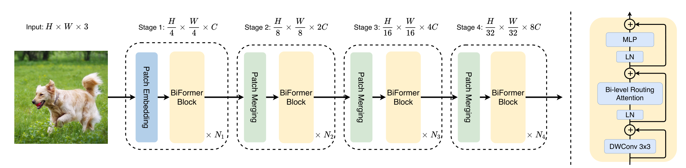

医学图像分割里到处是**高分辨率**特征图。直接上全局注意力（Self-Attention）有两个老问题：一是计算量随 token 数**平方级**爆炸；二是**大部分区域其实毫无关系**（比如肿瘤区和背景区），却要两两算一遍——又慢又浪费。

BiFormer（CVPR 2023）提出 **双层路由注意力（Bi-Level Routing Attention, BRA）**：先在**区域（region）层面粗筛**出每个区域最相关的少数几个区域，再**只在筛出来的区域里做细粒度 token-to-token 注意力**。注意力变成"内容感知的稀疏注意力"——**该算的才算**，计算量大幅下降，而关键信息不丢。

---

## 一、论文出处

- **论文**：BiFormer: Vision Transformer with Bi-Level Routing Attention
- **会议**：CVPR 2023
- **论文链接**：https://arxiv.org/abs/2303.08810
- **官方代码**：https://github.com/rayleizhu/BiFormer

---

## 二、模块图（截自论文原文 Figure 3）



> 图自 BiFormer 原文 Figure 3（CVPR 2023）。左半是整体金字塔架构：`Input → Stage 1~4`，每个 Stage 由 `Patch Embedding / Patch Merging + 若干 BiFormer Block` 组成，分辨率逐级减半、通道逐级翻倍；右半虚线框展开 **BiFormer Block** 的内部（`DWConv 3×3 → LN → Bi-level Routing Attention → LN → MLP`，带残差）。

（一句话：主干是分层 ViT，核心是里面的 **BRA 注意力**——先在区域层路由，再在少数相关区域里做注意力。）

---

## 三、核心思想与作用

一句话：**注意力别全算——先在"区域"层面挑出相关的少部分区域，只在里面做 token-to-token 注意力。**

拆解两步（"双层"就在这）：
1. **区域级路由（粗筛）**：把特征图切成 `n×n` 个不重叠区域；对每个区域算它和其他区域的相关度，**只保留 top-k 个最相关的区域**，其余丢弃。
2. **token 级注意力（细算）**：把上一步选中的 top-k 区域里的 key/value 聚到一起，让本区域的每个 token 只对这一小撮 key/value 做注意力。

**为什么好**：
- **计算量**：从"全图两两算"降到"每个区域只和 top-k 个区域算"，复杂度显著下降；
- **内容感知**：路由是**按内容动态**决定的（相关的地方才连），比固定窗口/固定步长的稀疏注意力更灵活；
- **对高分辨率友好**：医学图像分辨率高、有效信息稀疏，正好吃这个红利。

**在分割里的作用**：把编码器里的全局注意力换成 BRA，**在几乎不掉精度的情况下大幅省算力和显存**；尤其适合高分辨率 2D 医学图像、以及多尺度特征融合处。

---

## 四、在 U-Net 里的插入位置

BRA 是**注意力模块**，用在"需要全局建模"的位置：
- **编码器深层 / 瓶颈层**：替换 Self-Attention 或 Transformer block，做长距离依赖；
- **跳连（skip connection）融合处**：对多尺度特征做稀疏全局交互；
- **解码器上采样前**：在低分辨率、高通道处收益最大（token 少、通道多）。

通道数越大、分辨率越高，BRA 相对全注意力的优势越明显。

---

## 五、复现代码（PyTorch，逐行中文注释）

> 下面是**简化教学版**，保留了 BRA 的两个核心步骤（区域路由 + 稀疏注意力），代码清晰、可跑；生产使用建议对照官方实现（含位置编码、下采样等细节）。
> https://github.com/rayleizhu/BiFormer

```python
import torch
import torch.nn as nn

class BiLevelRoutingAttention(nn.Module):
    """BiFormer 双层路由注意力（简化教学版）。
    ① 区域级路由：每个区域只保留最相关的 topk 个区域；
    ② 区域级 token-to-token 注意力：只在选中的区域里算注意力。
    """
    def __init__(self, dim, num_heads=8, n_win=7, topk=4):
        super().__init__()
        assert dim % num_heads == 0, "dim 必须能被 num_heads 整除"
        self.dim = dim
        self.num_heads = num_heads
        self.n_win = n_win                      # 把特征图切成 n_win × n_win 个区域
        self.topk = topk                        # 每个区域只和 topk 个最相关区域做注意力
        self.head_dim = dim // num_heads
        self.scale = self.head_dim ** -0.5      # 缩放因子，防止点积过大
        self.qkv = nn.Linear(dim, dim * 3)      # 一次投影出 q/k/v
        self.proj = nn.Linear(dim, dim)         # 输出投影
        # 深度卷积做局部位置编码（LePE），补回被稀疏化丢失的局部信息
        self.lepe = nn.Conv2d(dim, dim, kernel_size=5, padding=2, groups=dim)

    def forward(self, x):
        B, N, C = x.shape
        H = W = int(N ** 0.5)                   # 假设方形特征图
        n = self.n_win
        rs = (H // n) * (W // n)                # 每个区域内的 token 数

        # ① 生成 q/k/v：[B, heads, N, head_dim]
        qkv = self.qkv(x).reshape(B, N, 3, self.num_heads, self.head_dim).permute(2, 0, 3, 1, 4)
        q, k, v = qkv[0], qkv[1], qkv[2]

        # ② 按区域重塑：[B, heads, R, rs, head_dim]，R = n*n 个区域
        def to_region(t):
            return t.reshape(B, self.num_heads, n * n, rs, self.head_dim)
        q_r, k_r, v_r = to_region(q), to_region(k), to_region(v)

        # ③ 区域"代表向量" = 区域内 token 平均，用来算区域间相关度
        q_rep = q_r.mean(dim=3)                 # [B, heads, R, head_dim]
        k_rep = k_r.mean(dim=3)                 # [B, heads, R, head_dim]
        aff = (q_rep * self.scale) @ k_rep.transpose(-1, -2)   # [B, heads, R, R] 区域相关度

        # ④ 双层路由的关键：每个区域只留 topk 个最相关区域
        topk = min(self.topk, n * n)
        idx = aff.topk(topk, dim=-1).indices    # [B, heads, R, topk]

        # ⑤ 按路由索引，把选中的 k/v 区域聚起来：[B, heads, R, topk, rs, head_dim]
        def gather_region(t):
            d = t.shape[-1]
            t_exp = t.unsqueeze(3).expand(B, self.num_heads, n * n, topk, rs, d)
            index = idx[..., None, None].expand(B, self.num_heads, n * n, topk, rs, d)
            return torch.gather(t_exp, 2, index)
        k_g = gather_region(k_r).reshape(B, self.num_heads, n * n, topk * rs, self.head_dim)
        v_g = gather_region(v_r).reshape(B, self.num_heads, n * n, topk * rs, self.head_dim)

        # ⑥ 只在"本区域 token × 选中区域 key"之间做注意力
        attn = (q_r * self.scale) @ k_g.transpose(-1, -2)          # [B, heads, R, rs, topk*rs]
        attn = attn.softmax(dim=-1)
        out = attn @ v_g                                            # [B, heads, R, rs, head_dim]

        # ⑦ 还原回 token 序列：[B, N, C]
        out = out.reshape(B, self.num_heads, N, self.head_dim).permute(0, 2, 1, 3).reshape(B, N, C)

        # ⑧ 加局部位置编码（LePE）+ 输出投影
        img = out.transpose(1, 2).reshape(B, C, H, W)              # [B, C, H, W]
        img = img + self.lepe(img)                                  # 补局部位置信息
        out = img.flatten(2).transpose(1, 2)                        # [B, N, C]
        out = self.proj(out)
        return out
```

---

## 六、插入示例（几行塞进你的网络）

```python
# 例：用 BRA 替换 U-Net 瓶颈层的全局注意力
self.attn = BiLevelRoutingAttention(dim=256, num_heads=8, n_win=7, topk=4)

def forward(self, x):              # x: [B, N, C]
    x = x + self.attn(x)           # 残差接住，替换原来的 SelfAttention / TransformerBlock
    return x
```

---

## 七、实测经验与注意点

- **粒度可调**：`n_win`（区域划分）和 `topk`（每区域连几个）是两个核心旋钮——`topk` 越小越省，精度靠"相关性"保住；一般 `n_win=7/14`、`topk=4` 是常用起点。
- **复杂度**：相对全局注意力从"随 token 数平方增长"降为"随区域数×topk 增长"，高分辨率下省得最多。
- **踩坑**：
  1. 输入必须是**方形特征图**（`H=W`），否则要处理的区域切分和还原会变形（原始实现里用 `H//n`、`W//n` 分别算）；
  2. `dim % num_heads == 0`、`H % n_win == 0` 都要成立，否则 reshape 报错；
  3. 稀疏化会丢局部信息，**务必保留 LePE 之类的局部位置编码**；
  4. 教学版做了简化，**上生产请对照官方实现**（含 kv 下采样、位置编码细节）。
- **医学分割场景**：高分辨率切片、需要长距离依赖又要控显存时，BRA 比全注意力更合适；小数据集上建议配合预训练或强增广。

---

## 八、完整工程 & 领取

> 本文的**完整可运行工程**（BRA 的 `.py`、U-Net 插入 demo、`n_win/topk` 可调配置、逐行中文注释）我整理好了。

**领取方式**：关注公众号 **MediVision**，回复「**模块**」——自动把《即插即用模块合集（含 FasterNet / BiFormer / StarNet / RepViT / TransNeXt…，统一接口，一条 import 就能用）》的入口发给你，进群免费领。

下一篇预告：**RepViT（CVPR 2024）**——把 ViT 的高效设计"搬回"纯卷积，用重参数化换一个又快又强的轻量主干。
