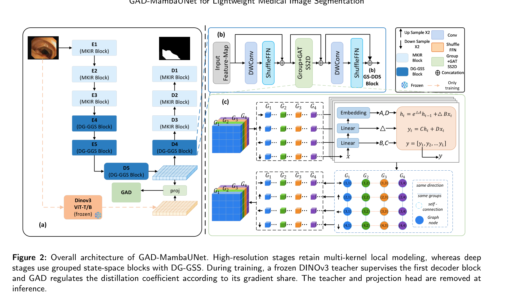

医学图像分割里，**长距离依赖**和**局部细节**天生打架：卷积擅长局部、但感受野有限；Transformer 能建模全局、但注意力随分辨率**平方级**涨，放进高分辨率 3D/2D 医学图很吃力。**状态空间模型（Mamba / Selective Scan）**给了第三条路——用**线性复杂度**逼近长程建模，于是「VSS / VMamba / U-Mamba」这类工作火了起来。

但直接用现成的 2D 选择性扫描（SS2D）有个隐忧：**多方向扫描之间、通道分组之间的信息是"各扫各的"**，方向与分组之间缺少结构化的交互。这篇工作提出 **DG-GSS（Direction-Group Graph Selective Scan，方向-组图选择性扫描）**：把「扫描方向」和「通道分组」的响应当作**图的节点**，在多方向融合之前先做一次**图上的结构化信息交换**——让不同方向、不同分组之间"先商量再合并"。

一句话：**扫描不是各扫各的——先让方向与分组在图上互相通气，再融合。**

---

## 一、论文出处

- **论文**：GAD-MambaUNet: Direction-Group Mamba with Gradient-Adaptive DINOv3 Distillation for Lightweight Medical Image Segmentation
- **来源**：arXiv 2026（2609.26729）
- **论文链接**：https://arxiv.org/abs/2609.26729
- **核心模块**：**DG-GSS（Direction-Group Graph Selective Scan）**

> 备注：该论文完整框架还包含训练期的 **DINOv3 蒸馏 + 梯度自适应蒸馏（GAD）**；本文只拆解可即插即用的 **DG-GSS 模块**。

---

## 二、模块图（截自论文原文 Figure 2）



> 图自 GAD-MambaUNet 原文 Figure 2。左侧 (a) 是整体非对称 U 形网络：编码器浅层用 **MKIR Block**（局部建模），深层 E4–E5 用 **DG-GSS Block**（长程建模），训练时用冻结 DINOv3 教师 + GAD 蒸馏监督；右上 (b) 是 **DG-GSS Block** 的组成（`DWConv → ShuffleFN → Group+GAT 与 SS2D → DWConv → ShuffleFN`）；右下 (c) 展开 DG-GSS 内部：通道分组 G1–G4、多方向扫描，以及**把方向/组当图节点做消息传递**的图结构。

（一句话：主干是轻量 U-Net，深层塞 **DG-GSS**——用"方向-组图"组织多方向选择性扫描。）

---

## 三、核心思想与作用

一句话：**把"扫描方向"和"通道分组"当图节点，先在图上交换信息，再做多方向融合。**

拆解三步：
1. **通道分组 + 多方向扫描**：把特征通道分成若干组（G1–G4），每组在多个扫描方向上跑**选择性扫描**（SS2D 思路：四方向/多方向遍历），得到方向的序列响应。
2. **方向-组图构建（关键创新）**：把「方向节点」和「分组节点」建成一张图，边连接 **same direction**（同方向）、**same group**（同分组）与 **self-connection**。于是不同方向、不同分组之间能通过**图消息传递（GAT 式注意力聚合）**互相交换信息。
3. **融合输出**：把图上聚合后的响应合并回特征图，再进后续卷积/归一化。

**为什么好**：
- **补齐交互盲区**：传统多方向选择性扫描里方向之间是简单叠加；DG-GSS 让方向/分组**结构化成图**、显式交互，信息交换更充分。
- **仍然线性**：核心仍是选择性扫描 + 轻量图聚合，复杂度对分辨率**近似线性**，适合高分辨率医学图。
- **即插即用**：它是**一个 block**，可替换 U-Net 深层/瓶颈的注意力或 SSM 模块，也可嵌进任意骨干。

**在分割里的作用**：给深层（低分辨率、高通道）特征做**长程建模**，同时用分组控制算力，兼顾"看得远"和"够轻"。

---

## 四、在 U-Net 里的插入位置

DG-GSS 是**长程建模 block**，放在"需要全局感受野"的位置：
- **编码器深层（E4–E5）/ 瓶颈层**：替换 Self-Attention 或普通卷积块；
- **解码器低分辨率阶段**：在高通道、低分辨率处收益最大（序列短、通道多）；
- **跳连融合处**：让多尺度特征做一次跨方向/跨分组的结构化交互。

分辨率越低、通道越多，DG-GSS 相对全注意力的效率优势越明显。

---

## 五、复现代码（PyTorch，逐行中文注释）

> 下面是**简化教学版**：保留 DG-GSS 的两个核心——**多方向选择性扫描** + **方向-组图消息传递**；用最朴素的实现表达结构，便于理解与二次开发。生产使用建议对照官方实现（含扫描核实现、ShuffleFN、MKIR 等细节）。

```python
import torch
import torch.nn as nn

class SelectiveScan2D(nn.Module):
    """最简版 2D 选择性扫描：对 4 个方向做"逐位置的状态递推"，再合并。
    真实实现（VSS/VMamba）会做并行扫描与门控；这里用可读的递推表达思路。
    """
    def __init__(self, dim):
        super().__init__()
        self.proj = nn.Linear(dim, dim)          # 逐位置输入投影
        self.dw = nn.Conv2d(dim, dim, 3, padding=1, groups=dim)  # 局部前处理

    def _scan(self, x, order):
        # order: 'lr' | 'rl' | 'tb' | 'bt'，按行/列正反序做状态递推
        B, C, H, W = x.shape
        if order in ('lr', 'rl'):
            seq = x.permute(0, 1, 2, 3).reshape(B, C, H * W)         # 逐行
        else:
            seq = x.permute(0, 1, 3, 2).reshape(B, C, H * W)         # 逐列
        if order in ('rl', 'bt'):
            seq = seq.flip(-1)                                        # 反向
        h = torch.zeros(B, C, device=x.device, dtype=x.dtype)
        outs = []
        for t in range(seq.shape[-1]):                                # 逐位置递推（教学用，慢）
            h = 0.9 * h + 0.1 * seq[..., t]                           # 简化的状态更新（真实为 A/B/C/Δ 参数化）
            outs.append(h)
        y = torch.stack(outs, dim=-1)
        if order in ('rl', 'bt'):
            y = y.flip(-1)
        return y

    def forward(self, x):                        # x: [B, C, H, W]
        x = self.dw(x)
        dirs = ['lr', 'rl', 'tb', 'bt']
        ys = [self._scan(x, d) for d in dirs]    # 四个方向 [B, C, HW]
        y = torch.stack(ys, dim=1)               # [B, 4, C, HW]：把"方向"当一维
        y = y.reshape(x.shape[0], 4, x.shape[1], x.shape[2], x.shape[3])
        return y                                 # 返回"每方向"的响应，交给图模块


class DirectionGroupGraph(nn.Module):
    """方向-组图消息传递：节点 = (方向, 分组)，边 = 同方向 / 同分组 / 自连接。
    用轻量注意力在图上聚合，实现方向与分组之间的结构化信息交换。
    """
    def __init__(self, dim, n_groups=4, n_dirs=4):
        super().__init__()
        self.n_dirs, self.n_groups = n_dirs, n_groups
        self.group_dim = dim // n_groups
        self.node_proj = nn.Linear(dim, dim)
        self.gat = nn.MultiheadAttention(dim, num_heads=n_dirs, batch_first=True)

    def build_adj(self, dev):
        """构造邻接矩阵：i、j 节点相连若 同方向 或 同分组 或 i==j。"""
        n = self.n_dirs * self.n_groups
        A = torch.eye(n, device=dev)
        for i in range(n):
            di, gi = divmod(i, self.n_groups)          # 节点 i 的（方向, 分组）
            for j in range(n):
                dj, gj = divmod(j, self.n_groups)
                if di == dj or gi == gj:                # 同方向 或 同分组 → 连边
                    A[i, j] = 1
        return A

    def forward(self, per_dir):                        # per_dir: [B, 4, C, H, W]
        B, D, C, H, W = per_dir.shape
        # 每个方向先按通道分组，得到 "方向×分组" 的节点特征
        x = per_dir.reshape(B, D, self.n_groups, self.group_dim, H, W)
        nodes = x.mean(dim=(-1, -2)).reshape(B, D * self.n_groups, self.group_dim)  # [B, N, gd]
        nodes = self.node_proj(torch.nn.functional.pad(nodes, (0, C - self.group_dim)))
        A = self.build_adj(per_dir.device)             # [N, N]
        mask = (A == 0)                                # 用作 attention 掩码（不相连则屏蔽）
        agg, _ = self.gat(nodes, nodes, nodes, attn_mask=mask)   # 图上注意力聚合
        return agg.reshape(B, D, self.n_groups, self.group_dim)  # 回到 (方向, 分组)


class DGGSSBlock(nn.Module):
    """DG-GSS Block：选择性扫描 → 方向-组图交互 → 融合回特征图。"""
    def __init__(self, dim, n_groups=4):
        super().__init__()
        self.norm = nn.GroupNorm(1, dim)
        self.scan = SelectiveScan2D(dim)
        self.graph = DirectionGroupGraph(dim, n_groups=n_groups)
        self.fuse = nn.Conv2d(dim, dim, 1)             # 方向/分组融合
        self.out = nn.Conv2d(dim, dim, 1)              # 输出投影

    def forward(self, x):                              # x: [B, C, H, W]
        residual = x
        x = self.norm(x)
        per_dir = self.scan(x)                         # [B, 4, C, H, W]
        agg = self.graph(per_dir)                      # [B, 4, G, C/G] 图聚合结果
        # 把"方向×分组"的聚合结果加权回各方向特征
        w = agg.reshape(agg.shape[0], agg.shape[1], -1)
        w = torch.softmax(w, dim=-1)                   # 方向/分组权重
        y = (per_dir.flatten(2) * w.mean(-1, keepdim=True)).reshape_as(per_dir)
        y = y.sum(dim=1)                               # 合并方向 → [B, C, H, W]
        y = self.fuse(y)
        return residual + self.out(y)                  # 残差接住，即插即用
```

---

## 六、插入示例（几行塞进你的网络）

```python
# 例：用 DG-GSS 替换 U-Net 深层编码器块（低分辨率、高通道处）
self.deep_block = DGGSSBlock(dim=256, n_groups=4)

def forward(self, x):              # x: [B, C, H, W]
    x = self.deep_block(x)         # 替换原来的注意力块 / SSM 块，无需改接口
    return x
```

---

## 七、实测经验与注意点

- **分组数是主旋钮**：`n_groups` 越大越省算力，但每组的通道变少、表达受限；`n_groups=4` 是论文的常用起点。
- **图边设计**：同方向 / 同分组 / 自连接是核心；增加边会变强也更贵，建议先照搬再消融。
- **复杂度**：核心仍是选择性扫描，对分辨率近似**线性**；图节点数只有 `方向数 × 分组数`（如 4×4=16），图聚合开销很小。
- **踩坑**：
  1. 扫描的**方向遍历实现**是性能大头，教学版逐位置递推只适合理解，**上生产务必换成并行扫描核**；
  2. 输入建议用 `GroupNorm/BatchNorm` 预归一化，深层高通道处更稳；
  3. 与卷积/注意力混用时注意**通道对齐**；
  4. 蒸馏（DINOv3/GAD）是训练技巧，推理期**移除教师**，不影响 DG-GSS 推理。
- **医学分割场景**：适合需要长程依赖又要控显存的 2D/3D 分割；小数据集上建议配合预训练或强增广。

---

## 八、完整工程

> 本文的**完整可运行工程**（DG-GSS 的 `.py`、U-Net 插入 demo、`n_groups` 可调配置、逐行中文注释）见开源仓库：
> https://github.com/CaiCy6/med-modules

**下一篇预告**：继续拆「即插即用模块」——把高效设计塞进 U-Net，越轻越准。
