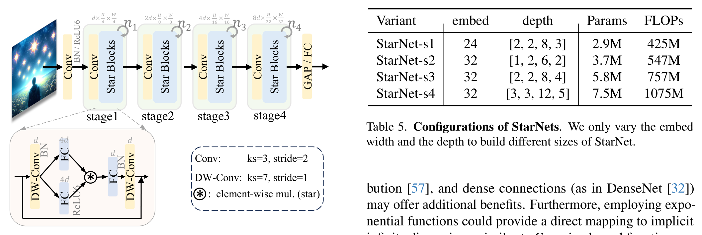

## 一、论文出处

- 论文全名：Rewrite the Stars（arXiv 编号 2403.19967）
- 会议/年份：CVPR 2024
- 论文链接：https://arxiv.org/abs/2403.19967
- 官方代码：https://github.com/ma-xu/Rewrite-the-Stars

## 二、模块图（截自论文原文）



图注：左侧是 star operation 的基本形式，把两路（或多路）特征做元素级相乘再融合；右侧是 Star Block，由 DWConv + 两次 1×1 线性映射 + 逐元素相乘构成，整体非常轻量。

## 三、核心思想与作用

一句话总括：StarNet 用「元素级相乘」代替传统卷积里的「加权求和」，在不加宽网络的前提下，把特征隐式地映射到高维非线性空间，从而用极小的计算量换到不错的表达能力。

拆解来看：

1. **star operation 是什么**。给定两路特征（比如同一输入经过两条分支的线性变换结果），把它们逐元素相乘：`out = a * b`。注意这里是乘法，不是加法。传统卷积、残差连接、注意力加权求和，本质上都是「线性组合」，而乘法天然带二次项。

2. **为什么乘法能造出高维非线性**。把 `a`、`b` 看成输入 `x` 的线性函数，那么 `a * b` 里就包含了 `x` 的二次项（类似 `x_i * x_j` 的交叉项）。这些交叉项相当于在隐式的高维空间里展开，效果上有点像核技巧（kernel trick）——不用真的把通道数翻倍，就能得到非线性特征。论文的核心论点就是这个：star operation 是一种「不显式加宽网络的高维映射」。

3. **Star Block 怎么落地**。结构极简：先一个深度可分离卷积（DWConv）做局部空间建模，再两条 1×1 线性分支，最后逐元素相乘融合。没有大卷积核，没有复杂注意力，参数量和 FLOPs 都很低。

4. **为什么好**。一是表达能力和网络宽度解耦，小网络也能有非线性；二是算子全是逐元素乘、1×1 卷积、DWConv，硬件友好、延迟低；三是结构干净，几乎没有超参，插到别的网络里改动很小。

## 四、在 U-Net 里的插入位置

StarNet 的 Star Block 属于「通道混合 + 轻量空间建模」的通用块，适合替换或补充 U-Net 里的标准卷积块，具体建议：

- **编码器各 stage**：可以替换部分 3×3 卷积块。编码器特征分辨率高、通道少，Star Block 的低延迟优势在这里最明显，能压住显存和耗时。
- **瓶颈层（bottleneck）**：最推荐。瓶颈层通道多、分辨率低，正是需要非线性表达的地方，star operation 的隐式高维映射在这里收益最大，且计算量可控。
- **解码器**：可以放在上采样之后的卷积位置，但要谨慎。解码器对空间细节敏感，DWConv 的感受野有限，建议保留一部分标准卷积或配合跳跃连接使用，别全换。
- **不建议**：直接替换 U-Net 第一层（stem）或最后的输出头。stem 需要稳定的浅层特征提取，输出头需要精确的通道映射，这两处用标准卷积更稳。

一句话：优先放瓶颈层，其次编码器，解码器选择性使用。

## 五、复现代码（PyTorch，逐行中文注释）

> 说明：以下是**简化教学版**，只保留 Star Block 最核心的两个组件——DWConv 空间建模 + 双分支逐元素相乘融合，去掉了论文里的工程细节（如特定归一化、通道缩放策略等），便于理解结构。

```python
import torch
import torch.nn as nn

class StarBlock(nn.Module):
    """StarNet 的核心模块（简化教学版）"""
    def __init__(self, dim, expand_ratio=4):
        super().__init__()
        # 记录输入通道数，用于最后的残差相加
        self.dim = dim
        # 深度可分离卷积：每个通道独立做 3x3 空间卷积，负责局部空间建模
        # groups=dim 表示逐通道卷积，参数量和计算量都很小
        self.dwconv = nn.Conv2d(dim, dim, kernel_size=3, padding=1, groups=dim)
        # 第一条 1x1 线性分支：把通道扩展到 expand_ratio 倍
        # 这里用 expand_ratio=4，给后面的逐元素相乘提供更宽的特征
        self.fc1 = nn.Conv2d(dim, dim * expand_ratio, kernel_size=1)
        # 第二条 1x1 线性分支：同样扩展到 expand_ratio 倍
        # 两条分支输出形状一致，才能做逐元素相乘
        self.fc2 = nn.Conv2d(dim, dim * expand_ratio, kernel_size=1)
        # 融合后的 1x1 映射：把扩展后的通道压回原始维度
        self.fc3 = nn.Conv2d(dim * expand_ratio, dim, kernel_size=1)
        # 激活函数，放在乘法之后引入额外非线性
        self.act = nn.GELU()

    def forward(self, x):
        # 保存输入，用于最后的残差连接
        identity = x
        # 先做深度可分离卷积，注入局部空间信息
        x = self.dwconv(x)
        # 两条 1x1 分支分别做线性变换，得到 a 和 b
        a = self.fc1(x)
        b = self.fc2(x)
        # 关键一步：逐元素相乘（star operation）
        # 相乘会产生输入的高阶交叉项，相当于隐式映射到高维非线性空间
        out = a * b
        # 激活，进一步增加非线性
        out = self.act(out)
        # 1x1 映射压回原始通道数
        out = self.fc3(out)
        # 残差连接：稳定训练，也让模块可以安全地插入已有网络
        return out + identity
```

## 六、插入示例（几行塞进你的网络）

```python
import torch
import torch.nn as nn

# 假设你已定义好上面的 StarBlock
# 在 U-Net 瓶颈层替换原来的卷积块
class Bottleneck(nn.Module):
    def __init__(self, in_ch, out_ch):
        super().__init__()
        # 先用 1x1 调整通道，再交给 StarBlock 做非线性建模
        self.proj = nn.Conv2d(in_ch, out_ch, kernel_size=1)
        self.star = StarBlock(out_ch)          # 直接插入 StarNet 模块
        self.norm = nn.BatchNorm2d(out_ch)

    def forward(self, x):
        x = self.proj(x)
        x = self.star(x)                       # 即插即用
        return self.norm(x)
```

## 七、实测经验与注意点

1. **复杂度**：Star Block 的主要开销在两条 1×1 分支的通道扩展（expand_ratio 倍）和最后的压缩。expand_ratio 越大，非线性越强但 FLOPs 线性上升，医学图像分割里一般 2~4 比较稳，别盲目上 8。
2. **超参**：核心超参就一个 expand_ratio，外加 DWConv 的核大小（默认 3）。没有注意力那种一堆温度系数、头数要调，调参成本低。
3. **踩坑一：通道对齐**。两条分支输出必须同形状才能逐元素相乘，写代码时注意 fc1、fc2 的输出通道要一致，否则报维度错误。
4. **踩坑二：残差维度**。StarBlock 内部是等维输入输出（dim→dim），插到通道数变化的层时，记得先用 1×1 卷积把通道对齐，再进 StarBlock。
5. **踩坑三：解码器别全换**。DWConv 感受野小，解码器全用 Star Block 可能丢空间细节，建议和标准卷积混用，或保留跳跃连接。
6. **小数据场景**：医学数据往往样本少，Star Block 参数少、正则性不错，但残差和归一化别省，否则小数据下容易训不稳。

## 八、完整工程

本文模块已整理进统一工程仓库，包含可直接调用的实现与插入示例：https://github.com/CaiCy6/med-modules

下一篇预告：拆解另一个即插即用模块，讲清它为什么能在保持轻量的同时提升分割边界精度。
