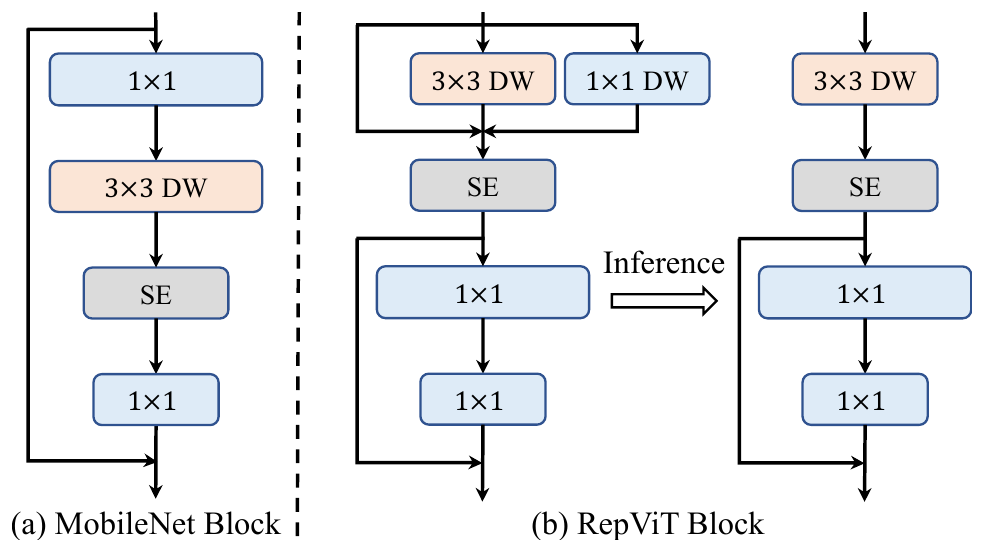

## 一、论文出处

- 论文全名：RepViT: Revisiting Mobile CNN From ViT Perspective
- 会议/年份：CVPR 2024
- 论文链接：https://arxiv.org/abs/2307.09283
- 官方代码：https://github.com/THU-MIG/RepViT

## 二、模块图（截自论文原文）



图注：左为 MobileNetV3 Block，右为 RepViT Block——把 token mixer 与 channel mixer 解耦：token mixer 用 3×3 DW + 1×1 DW 多分支（训练），经结构重参数化融合成单路 3×3 DW（推理）；channel mixer 是 1×1→激活→1×1 的残差前馈，SE 层可选。这就是它「又准又快」的关键。

## 三、核心思想与作用

一句话总括：RepViT Block 把轻量 ViT 的「token mixer + channel mixer」两段式设计，用可重参数化的卷积实现，让纯 CNN 在移动端拿到 ViT 级别的精度和更低的延迟。

拆解成几步看：

1. **token mixer 负责空间混合**。ViT 里是自注意力，RepViT 换成深度卷积（depth-wise conv），因为移动端上深度卷积的访存和算力开销远低于注意力。为了补回表达能力，训练时用多分支（比如 3×3 深度卷积 + 1×1 分支 + 恒等分支）并行，推理时等价融合成单个 3×3 深度卷积。

2. **channel mixer 负责通道混合**。对应 ViT 的 FFN，这里用 1×1 卷积做升维-降维，中间加激活，外面套残差。结构简单，但保证了通道间的信息交互。

3. **训练多分支、推理单路的重参数化**。这是 RepViT 的核心 trick：多分支在训练时提供更丰富的梯度路径，提升精度；推理时数学等价地合并成单卷积，不增加任何延迟。等于「白嫖」了多分支的收益。

为什么好：

- **移动端友好**：全程只用深度卷积和 1×1 卷积，没有注意力里的矩阵乘和 softmax，硬件上更容易打满。
- **精度不亏**：多分支训练弥补了单路卷积表达力不足的问题，ImageNet 上能过 80% top-1。
- **即插即用**：Block 本身是标准 nn.Module，输入输出同形状，塞进任何 CNN 主干都不破坏结构。

## 四、在 U-Net 里的插入位置

RepViT Block 输入输出通道和空间尺寸都不变，属于「同构替换块」，位置选择比较自由，但建议：

- **编码器各 stage 的残差块位置**：把原来的两层 3×3 卷积残差块换成 RepViT Block，能在下采样前用更低延迟提取更强的局部+通道特征。这是最推荐的用法。
- **瓶颈层**：瓶颈处特征图分辨率最低、通道数最高，深度卷积的算力开销小，收益明显，适合堆 2~4 个 Block。
- **解码器慎用**：解码器要做上采样和跳跃连接融合，RepViT Block 本身不带跨尺度交互，直接替换可能削弱细节恢复。如果要用，建议只放在解码器较深的层，浅层保留原始卷积。

理由总结：它是个「等尺寸、等通道」的增强块，最适合放在特征已经成形、需要进一步提纯的位置，而不是承担尺度变换的职责。

## 五、复现代码（PyTorch，逐行中文注释）

> 说明：以下是**简化教学版**，只保留 RepViT Block 最核心的两个组件——可重参数化的 token mixer（多分支深度卷积）和 channel mixer（1×1 前馈）。省略了官方实现里的 SE、LayerScale、DropPath 等细节，方便理解结构。

```python
import torch
import torch.nn as nn


class RepTokenMixer(nn.Module):
    """token mixer：训练时多分支深度卷积，推理时融合成单路 3x3 深度卷积。"""

    def __init__(self, dim):
        super().__init__()
        self.dim = dim
        # 分支1：3x3 深度卷积，负责主要空间混合
        self.dw3 = nn.Conv2d(dim, dim, 3, padding=1, groups=dim, bias=False)
        # 分支2：1x1 深度卷积，等价于逐通道缩放，提供恒等附近的微调
        self.dw1 = nn.Conv2d(dim, dim, 1, padding=0, groups=dim, bias=False)
        # 分支3：恒等映射，保证梯度直通
        self.bn = nn.BatchNorm2d(dim)  # 训练时对融合结果做归一化

    def forward(self, x):
        # 训练阶段：三分支相加，再归一化
        out = self.dw3(x) + self.dw1(x) + x
        return self.bn(out)

    @torch.no_grad()
    def fuse(self):
        """推理前调用：把多分支合并成单个 3x3 深度卷积，去掉 BN。"""
        # 简化处理：这里只演示思路，实际需按 BN 公式把缩放/偏置折进卷积权重
        # 真实工程请用 torch.nn.utils.fusion 或官方 reparameterize 工具
        pass


class ChannelMixer(nn.Module):
    """channel mixer：1x1 升维 -> 激活 -> 1x1 降维，外套残差。"""

    def __init__(self, dim, ratio=4):
        super().__init__()
        hidden = int(dim * ratio)
        self.fc1 = nn.Conv2d(dim, hidden, 1, bias=False)   # 升维
        self.act = nn.GELU()                                # 非线性
        self.fc2 = nn.Conv2d(hidden, dim, 1, bias=False)   # 降维回原通道

    def forward(self, x):
        return self.fc2(self.act(self.fc1(x)))             # 输出与输入同形状


class RepViTBlock(nn.Module):
    """完整的 RepViT Block：token mixer + channel mixer，两段都带残差。"""

    def __init__(self, dim, ratio=4):
        super().__init__()
        self.token_mixer = RepTokenMixer(dim)              # 空间混合
        self.channel_mixer = ChannelMixer(dim, ratio)      # 通道混合

    def forward(self, x):
        x = x + self.token_mixer(x)                        # 残差连接
        x = x + self.channel_mixer(x)                      # 残差连接
        return x


if __name__ == "__main__":
    # 快速自测：输入输出形状应一致
    block = RepViTBlock(dim=64)
    y = block(torch.randn(2, 64, 32, 32))
    print(y.shape)  # torch.Size([2, 64, 32, 32])
```

## 六、插入示例（几行塞进你的网络）

```python
import torch.nn as nn
from repvit_block import RepViTBlock  # 假设上面的类放在这个文件里

class UNetEncoderStage(nn.Module):
    def __init__(self, in_ch, out_ch):
        super().__init__()
        self.down = nn.Conv2d(in_ch, out_ch, 3, stride=2, padding=1)
        # 在下采样后用 RepViT Block 提纯特征
        self.block = RepViTBlock(dim=out_ch)

    def forward(self, x):
        x = self.down(x)
        return self.block(x)
```

## 七、实测经验与注意点

- **重参数化必须做对**：训练用多分支、推理用融合单路，两者数值要严格等价。自己手写融合很容易在 BN 折叠上出错，建议直接用官方 `reparameterize` 工具，或至少用同一输入对比融合前后输出误差。
- **通道数别太小**：深度卷积在通道数很小时（比如 < 32）收益有限，反而 1×1 升维的 channel mixer 会占主导开销。建议 dim ≥ 64 再用。
- **ratio 是主要超参**：channel mixer 的升维比例默认 4，移动端想再压延迟可以降到 2，精度掉一点但速度更稳。
- **注意 BN 与 batch size**：Block 里依赖 BN，小 batch 训练时统计量不稳，医学图像常见的小 batch 场景要留意，必要时换 GroupNorm 并重做融合逻辑。
- **别指望它做尺度变换**：它是等尺寸块，下采样/上采样还得靠 stride 卷积或插值，别把它当降采样模块用。
- **延迟收益依赖硬件**：深度卷积在 GPU 上未必比普通卷积快，RepViT 的速度优势主要在移动端/边缘设备，服务器端部署收益可能不明显。

## 八、完整工程

本文模块已整理进即插即用模块合集，含可运行代码与插入示例：https://github.com/CaiCy6/med-modules

下一篇预告：继续拆解一个医学分割框架里的可插拔子模块，讲清它怎么单独塞进 U-Net 以及为什么有效。
