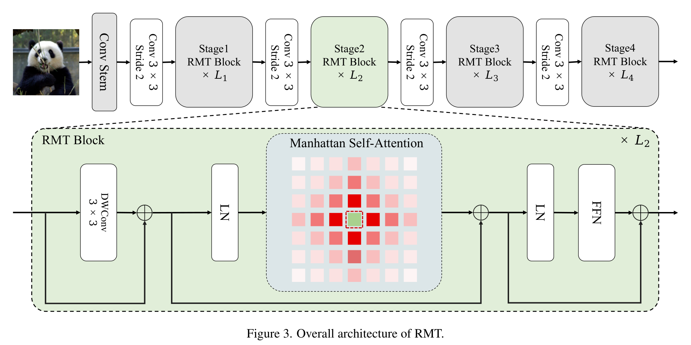

## 一、论文出处

- 论文全名：*RMT: Retentive Networks Meet Vision Transformers*
- 会议/年份：CVPR 2024
- 论文链接：https://arxiv.org/abs/2309.11523
- 官方代码：https://github.com/qhfan/RMT

> 说明：RMT 把 NLP 里 Retentive Network（RetNet）的「显式衰减」思想搬进视觉骨干，提出 **Manhattan Self-Attention（MaSA，曼哈顿自注意力）**——用与曼哈顿距离挂钩的二维空间衰减矩阵，给 ViT 补上一个显式的空间先验。本合集只取其中可插拔的 **RMT Block / MaSA** 来讲。

## 二、模块图（截自论文原文 Figure 3）



图注：RMT 整体四阶段架构（上）；下为 RMT Block 展开——`DWConv 3×3 → LN → Manhattan Self-Attention → LN → FFN`，两条残差。MaSA 用一个按曼哈顿距离衰减的矩阵 `D` 调制注意力权重，让空间先验「显式」地进入模型。

## 三、核心思想与作用

一句话总括：**MaSA 在标准自注意力 `Softmax(QKᵀ)V` 外面乘上一个按「曼哈顿距离」指数衰减的矩阵 `D`，让离得近的 token 权重大、离得远的 token 权重指数级变小，从而给模型一个显式的二维空间先验——注意力算的还是全局的，但先验告诉它「谁更重要」。**

拆解成几步：

1. **从 RetNet 的「衰减」出发**。RetNet 在语言模型里用 `D_nm = γ^(n-m)`（n≥m，因果、一维）给历史 token 降权，带来显式的时序先验。RMT 把这个思想迁移到视觉。
2. **从一维到二维：曼哈顿距离**。图像里每个 token 有 (x, y) 坐标，RMT 把衰减改成按 **曼哈顿距离** 计算：`D_nm = γ^(|xₙ-xₘ| + |yₙ-yₘ|)`。距离越远，衰减越狠，且横竖两个方向分别累积——这就是「Manhattan」的由来。
3. **注意力公式**：`MaSA(X) = (Softmax(QKᵀ) ⊙ D) · V`。注意一个反直觉的点：RMT 试验后发现**去掉 RetNet 的门控（gating）、保留 Softmax** 反而在视觉上更好——所以 MaSA 并没有像很多线性注意力那样把 softmax 干掉，而是「Softmax 注意力 × 空间衰减」。
4. **可分解（Decomposed MaSA）**。前三个阶段用分解版：把注意力得分与衰减矩阵沿横、纵两个轴分别拆开算（`Attn_H`、`Attn_W`），再接 `DWConv` 的局部上下文增强（LCE），在保留显式空间先验的同时把早期阶段的开销压下来；最后一个阶段用原始 MaSA。整个 Block 就是「DWConv → LN → MaSA → LN → FFN」。

为什么好：

- **显式空间先验**。普通 ViT 的自注意力天生没有任何空间归纳偏置，RMT 用衰减矩阵把「距离近的更相关」直接写进注意力，比纯数据学出来的位置关系更稳。
- **保留 Softmax 的非线性**。不像线性注意力为了省算力丢掉 softmax，MaSA 保留 softmax，实验上精度更好。
- **全局感受野 + 局部增强**。曼哈顿衰减负责长程的「软」加权，DWConv(LCE) 补局部纹理，粗细结合。
- **即插即用**。Block 只依赖特征张量，可整块替换进现有 ViT / U-Net 的注意力位置。

## 四、在 U-Net 里的插入位置

推荐放在**瓶颈层（bottleneck）**，其次可放在**解码器的高层（低分辨率层）**。

理由：

- 瓶颈层特征图最小、通道最多，全局建模需求最强，而这里正是把「显式空间先验」发挥出来的地方——医学图像里器官/病灶的空间关系是先验知识，用曼哈顿衰减天然贴合。
- 解码器低分辨率层同样适合，能在恢复空间细节前先整合全局上下文。
- 不建议放在编码器浅层：那里分辨率高、token 多，自注意力本身开销大（分解版可缓解），且浅层更依赖局部纹理。

一句话：**瓶颈层放一个，解码器低分辨率层可选放，编码器浅层别放。**

## 五、复现代码（PyTorch，逐行中文注释）

> 说明：以下是**简化教学版**，只保留 MaSA 最核心的「曼哈顿衰减矩阵 + 空间调制」两个组件，去掉了官方实现里的多头分组、分轴向分解、DWConv(LCE) 等工程细节，方便理解结构。

```python
import torch
import torch.nn as nn

class ManhattanSelfAttention(nn.Module):
    """简化版曼哈顿自注意力：标准 softmax 注意力 × 曼哈顿距离衰减矩阵"""
    def __init__(self, dim, num_heads=4, gamma=0.9):
        super().__init__()
        self.dim = dim                      # 输入特征维度
        self.num_heads = num_heads          # 头数
        self.head_dim = dim // num_heads    # 每头维度
        self.gamma = gamma                  # 衰减因子，越接近 1 空间衰减越慢
        self.q_proj = nn.Linear(dim, dim)   # Q 投影
        self.k_proj = nn.Linear(dim, dim)   # K 投影
        self.v_proj = nn.Linear(dim, dim)   # V 投影
        self.out_proj = nn.Linear(dim, dim) # 输出投影
        self.scale = self.head_dim ** -0.5  # softmax 缩放

    def forward(self, x, hw=None):
        # x: (B, N, C)，N = H*W；hw=(H, W) 用于计算 token 的 (x, y) 坐标
        B, N, C = x.shape
        H = self.num_heads
        D = self.head_dim
        if hw is None:
            Hh = int(N ** 0.5); hw = (Hh, Hh)
        h, w = hw
        assert h * w == N, 'token 数需等于 H*W'

        # 多头投影: (B, H, N, D)
        q = self.q_proj(x).view(B, N, H, D).transpose(1, 2)
        k = self.k_proj(x).view(B, N, H, D).transpose(1, 2)
        v = self.v_proj(x).view(B, N, H, D).transpose(1, 2)

        # 标准自注意力得分: (B, H, N, N)
        attn = (q @ k.transpose(-2, -1)) * self.scale
        attn = attn.softmax(dim=-1)

        # 构造曼哈顿距离衰减矩阵 D_nm = gamma^(|xn-xm| + |yn-ym|)
        ys = torch.arange(h, device=x.device).repeat_interleave(w)  # (N,)
        xs = torch.arange(w, device=x.device).repeat(h)             # (N,)
        dist = (ys[:, None] - ys[None, :]).abs() + (xs[:, None] - xs[None, :]).abs()  # (N, N)
        decay = (self.gamma ** dist.float()).to(x.dtype)            # (N, N)

        # 用空间衰减调制注意力权重，再做归一化
        attn = attn * decay                      # (B, H, N, N) * (N, N)
        attn = attn / (attn.sum(dim=-1, keepdim=True) + 1e-6)

        # 加权聚合: (B, H, N, D)
        out = attn @ v

        # 合并多头 + 输出投影
        out = out.transpose(1, 2).reshape(B, N, C)
        return self.out_proj(out)
```

> 注：官方实现把上面的 `dist` 拆成横、纵两个一维衰减矩阵分别作用（Decomposed MaSA），并加了一个 `DWConv` 的局部上下文增强（LCE），早期阶段用它降开销。教学版把两步合成一步显式计算，重点是理解**「softmax 注意力 × 曼哈顿距离衰减」**这个核心设计。

## 六、插入示例（几行塞进你的网络）

```python
from torch import nn

class BottleneckWithRMT(nn.Module):
    def __init__(self, channels):
        super().__init__()
        self.norm = nn.LayerNorm(channels)
        self.masa = ManhattanSelfAttention(dim=channels, num_heads=4, gamma=0.9)

    def forward(self, x):
        B, C, H, W = x.shape
        # 展平成 token 序列: (B, H*W, C)
        tokens = x.flatten(2).transpose(1, 2)
        tokens = tokens + self.masa(self.norm(tokens), hw=(H, W))  # 残差
        # 还原回特征图
        return tokens.transpose(1, 2).view(B, C, H, W)

# 用法：替换掉 U-Net 瓶颈层的普通卷积或自注意力
# bottleneck = BottleneckWithRMT(512)
```

## 七、实测经验与注意点

- **γ（衰减因子）是关键超参**：越接近 1，空间衰减越慢、感受野越大但远距离噪声也越多；建议从 0.9 附近试起，分割任务可略小（0.8~0.9）。
- **token 数别太大**：原始 MaSA 是 O(N²) 的（毕竟保留了 softmax），瓶颈层展平后 token 数控制在 1k~4k 比较舒服；token 再多就上分解版 MaSA。
- **不要盲目去掉 Softmax**：RMT 的实验显示，视觉任务上保留 softmax 反而比换成 RetNet 的门控更好——这点和很多「线性注意力」教程的直觉相反，别照搬。
- **和卷积互补**：曼哈顿衰减负责长程加权，DWConv(LCE) 负责局部，俩一起用比只换注意力更稳。
- **别在浅层硬塞**：编码器浅层分辨率高、token 多，收益低开销大，优先放瓶颈和解码器低分辨率层。

## 八、完整工程

完整可运行代码与更多即插即用模块已整理在仓库：https://github.com/CaiCy6/med-modules

下一篇预告：拆解另一个可插拔子模块——「通道-空间双路注意力块」，看它如何在不增加太多参数的前提下同时建模通道与空间依赖。
