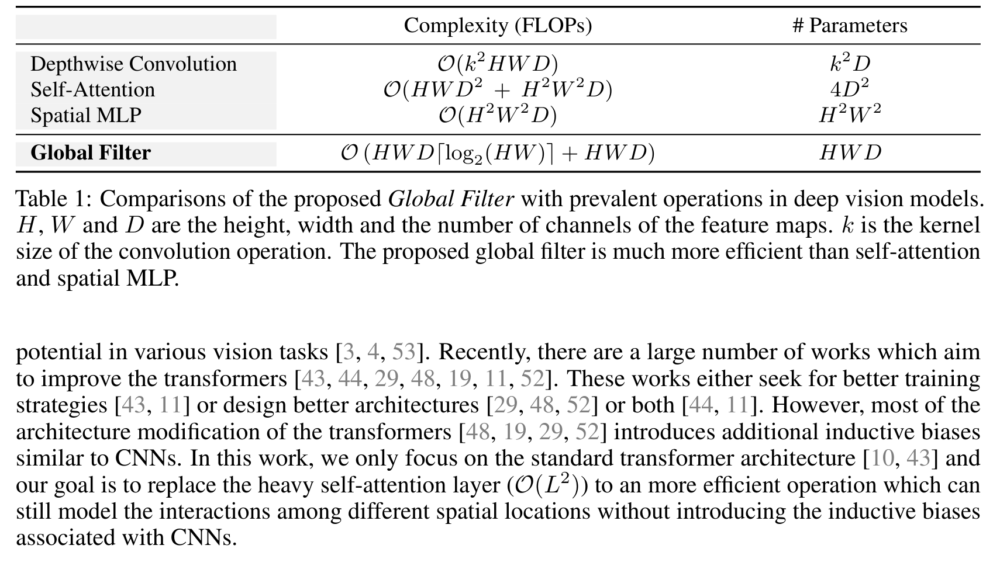

## 一、论文出处

- 论文全名：Global Filter Networks for Image Classification
- 会议/年份：NeurIPS 2021
- 论文链接：https://arxiv.org/abs/2107.00645
- 官方代码：https://github.com/raoyongming/GFNet

## 二、模块图（截自论文原文）



图注：GFNet 的核心就是把 Transformer 里的自注意力换成「2D FFT → 频域逐元素乘可学习全局滤波器 → 2D IFFT」这一条支路，token mixing 全程在频域完成。

## 三、核心思想与作用

一句话总括：GFNet 用「频域里的可学习全局滤波器」替代自注意力，让每个 token 以 O(N log N) 的代价和全图所有 token 交互。

拆解成几步看：

1. **变换到频域**：对特征图做 2D 实数 FFT（`torch.fft.rfft2`），把空间特征搬到频率域。空间上分散的全局信息，在频域里被压缩成一组频率分量。
2. **逐元素乘全局滤波器**：频域特征和一个形状为 `(H, W//2+1)` 的可学习复数张量做逐元素相乘。这一步就是 token mixing——每个频率分量被独立地缩放/旋转，等价于在空间域做一次全局卷积（global circular convolution）。
3. **逆变换回空间域**：做 2D 逆 FFT（`torch.fft.irfft2`）回到原分辨率，再走后面的通道 MLP。

**为什么好：**

- **全局感受野，代价却很低**。自注意力和 MLP-mixer 的 token mixing 是 O(N²)（N 是 token 数），GFNet 是 O(N log N)，因为 FFT 本身是 log-linear 的，中间那步乘法是 O(N)。高分辨率特征图上这个差距非常明显。
- **参数极少**。可学习的只有那个滤波器张量，参数量是 H×(W//2+1)，跟通道数无关，比 QKV 投影轻得多。
- **频域乘法 = 空间域全局卷积**。这是信号处理里的卷积定理，所以它天然建模的是「长程依赖」，而不是局部窗口。
- **归纳偏置介于 CNN 和 Transformer 之间**。它不像卷积那样锁死局部性，也不像纯注意力那样完全无先验，鲁棒性和泛化在论文里表现都不错。

## 四、在 U-Net 里的插入位置

GFNet 这个子模块（频域 token mixing 块）最适合放在**编码器深层和瓶颈层**，理由：

- **瓶颈层最划算**。瓶颈处分辨率最低、通道最多，但 token 数仍然可观，全局建模收益大；而且这里算力预算相对宽松，O(N log N) 相比 O(N²) 的优势在高分辨率下才最突出，放在瓶颈能吃到「全局依赖」的红利又不炸显存。
- **编码器浅层慎用**。浅层特征分辨率高、以边缘纹理为主，全局混合收益有限，反而 FFT/IFFT 的固定开销占比高。真要用，建议只在 stage3/stage4 之后替换。
- **解码器可选**。解码器要恢复空间细节，频域操作会引入轻微的空间模糊（因为全局卷积是循环卷积，边界处理不完美），如果任务对边界极敏感（如细小病灶分割），建议只在解码器最深层放一个，别每层都塞。

一句话：**瓶颈层放 1~2 个 GFNet 块做全局建模，编码器深层按需加，浅层和解码器浅层保持卷积。**

## 五、复现代码（PyTorch，逐行中文注释）

> 说明：这是**简化教学版**，只保留 GFNet 最核心的两个组件——频域全局滤波（`GlobalFilter`）和它外面的残差块（`GFNetBlock`）。省略了论文里的多尺度滤波、LayerScale、DropPath 等训练技巧，方便直接读懂结构。

```python
import torch
import torch.nn as nn


class GlobalFilter(nn.Module):
    """频域全局滤波：2D FFT -> 逐元素乘可学习滤波器 -> 2D IFFT"""

    def __init__(self, dim, h, w):
        super().__init__()
        # 可学习的全局滤波器，形状为 (dim, h, w//2+1)
        # 用复数存储：实部 + 虚部两个实数张量
        # rfft2 的输出频率维度是 w//2+1（实数输入的厄米对称性）
        self.complex_weight = nn.Parameter(
            torch.randn(dim, h, w // 2 + 1, 2) * 0.02
        )
        self.h = h
        self.w = w

    def forward(self, x):
        # x: (B, H, W, C) —— 注意这里用 channels-last，方便和 rfft2 对齐
        B, H, W, C = x.shape

        # 1) 2D 实数 FFT，输出复数张量 (B, H, W//2+1, C)
        x = torch.fft.rfft2(x, dim=(1, 2), norm='ortho')

        # 2) 把可学习滤波器拼成复数：real + i*imag
        weight = torch.view_as_complex(self.complex_weight)  # (C, H, W//2+1)

        # 3) 频域逐元素相乘（广播到 batch 维）—— 这一步就是 token mixing
        x = x * weight

        # 4) 2D 逆 FFT，回到空间域 (B, H, W, C)
        x = torch.fft.irfft2(x, s=(H, W), dim=(1, 2), norm='ortho')
        return x


class GFNetBlock(nn.Module):
    """一个最小的 GFNet 块：全局滤波 + 通道 MLP + 残差"""

    def __init__(self, dim, h, w, mlp_ratio=4.0):
        super().__init__()
        self.filter = GlobalFilter(dim, h, w)
        self.norm1 = nn.LayerNorm(dim)
        self.norm2 = nn.LayerNorm(dim)
        # 通道 MLP，和 Transformer 里的 FFN 一个作用
        hidden = int(dim * mlp_ratio)
        self.mlp = nn.Sequential(
            nn.Linear(dim, hidden),
            nn.GELU(),
            nn.Linear(hidden, dim),
        )

    def forward(self, x):
        # x: (B, C, H, W) —— 对外保持 NCHW，方便塞进 U-Net
        B, C, H, W = x.shape

        # 转成 channels-last 给频域滤波用
        x_ = x.permute(0, 2, 3, 1)  # (B, H, W, C)
        x_ = self.norm1(x_)
        x_ = self.filter(x_)
        x = x + x_.permute(0, 3, 1, 2)  # 残差，转回 NCHW

        # 通道 MLP 分支（同样走残差）
        x_ = x.permute(0, 2, 3, 1)
        x_ = self.norm2(x_)
        x_ = self.mlp(x_)
        x = x + x_.permute(0, 3, 1, 2)
        return x
```

## 六、插入示例（几行塞进你的网络）

```python
# 假设你的 U-Net 瓶颈层特征图是 (B, 512, 16, 16)
bottleneck = nn.Sequential(
    nn.Conv2d(256, 512, 3, padding=1),
    nn.BatchNorm2d(512),
    nn.ReLU(inplace=True),
    GFNetBlock(dim=512, h=16, w=16),   # 直接插在瓶颈
    GFNetBlock(dim=512, h=16, w=16),
)
```

## 七、实测经验与注意点

1. **h、w 必须和输入分辨率严格对齐**。`GlobalFilter` 里的滤波器形状是写死的，输入尺寸变了就会广播报错。如果训练时用多尺度裁剪，要么固定 crop size，要么在 forward 里按实际 H、W 动态生成滤波器（会牺牲一点速度）。
2. **复杂度是真的低，但常数不小**。理论 O(N log N)，但 FFT/IFFT 的常数因子比一次矩阵乘大，在小分辨率（如 7×7）上未必比注意力快。**分辨率越高越划算**，这也是建议放瓶颈/深层的原因。
3. **channels-last 和 NCHW 的来回 permute 有开销**。教学版为了可读性做了 permute，工程里如果整网都是 channels-last 可以省掉。别小看这几次 permute，在浅层高分辨率下会明显拖速度。
4. **`norm='ortho'` 建议保留**。正交归一化让 FFT/IFFT 前后能量一致，数值更稳，也方便和论文对齐。
5. **滤波器初始化别用默认的 randn**。论文用较小方差初始化（教学版里乘了 0.02），否则频域乘积一开始就把特征放大/缩小得离谱，训练前期容易不稳。
6. **边界效应**。频域乘法等价于**循环卷积**，图像边界会被「卷」到对面。分割任务里如果病灶贴近图像边缘，可能出现轻微伪影，必要时配合 padding 或只在深层使用。

## 八、完整工程

以上代码已整理进即插即用模块仓库，可直接 clone 取用：https://github.com/CaiCy6/med-modules

下一篇预告：拆解另一个频域/全局建模方向的即插即用模块，讲清它和 GFNet 在 token mixing 上的差异与适用场景。
