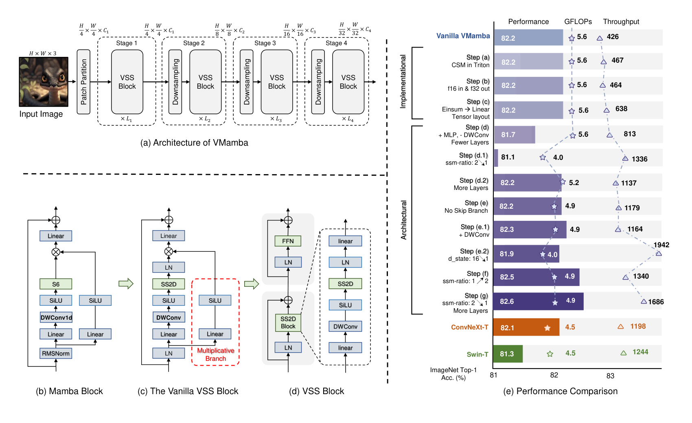

## 一、论文出处

- 论文全名：VMamba: Visual State Space Model
- 会议/年份：CVPR 2024
- 论文链接：https://arxiv.org/abs/2401.10166
- 官方代码：https://github.com/MzeroMiko/VMamba

## 二、模块图（截自论文原文）



图里最该盯住的是 SS2D 那一块：输入特征图被分成四条扫描路径，每条路径各自做一次一维选择性扫描，最后再合并回 2D 特征。VMamba 整体是主干，但真正能拆出来单独用的，就是这个 SS2D 扫描模块。

## 三、核心思想与作用

一句话总括：SS2D 用四条交叉扫描路径，把只能处理一维序列的选择性扫描（selective scan）强行“铺”到 2D 图像上，让每个像素都能以线性复杂度拿到全局上下文。

拆开看是这么几步：

1. **一维选择性扫描本身**：Mamba 的核心是状态空间模型，输入序列按顺序推进隐状态，每个位置的输出都依赖前面所有位置。问题是它天生按“顺序”走，图像没有天然的一维顺序。
2. **四向交叉扫描**：SS2D 不纠结“哪种扫描顺序最好”，而是同时走四条路径——左上到右下、右下到左上、右上到左下、左下到右上。每条路径把 2D 特征拉平成一维序列做扫描，四条路径覆盖了四个对角方向。
3. **合并回 2D**：四条路径的扫描结果重新 reshape 回特征图并相加/拼接，于是每个位置都从四个方向聚合了上下文，等价于一个近似全局的感受野。
4. **线性复杂度**：扫描过程是序列式的，但状态更新是固定维度的递推，计算量随 token 数线性增长，不像自注意力那样是平方级。

为什么好：卷积的感受野受核大小限制，自注意力感受野全局但复杂度是 O(N²)。SS2D 想同时拿到“全局感受野”和“线性复杂度”，而且四条扫描路径天然带方向先验，对分割这种需要长程空间关系的任务比较友好。代价是递推是顺序的，训练时并行度不如卷积和注意力，工程上要靠 selective scan 的 CUDA 实现来提速。

## 四、在 U-Net 里的插入位置

SS2D 适合放在**编码器深层和瓶颈层**，也就是分辨率已经降下来、通道数上来的那几个 stage。

理由很直接：浅层特征图分辨率高、token 数量大，SS2D 虽然线性复杂度，但顺序递推在高分辨率下开销和显存都不划算，而且浅层更需要的是局部纹理，卷积足够。到了深层，特征图小、通道多，正是需要全局上下文来建模器官间关系、病灶与周围组织关系的地方，SS2D 的全局感受野在这里收益最大。瓶颈层放一个 SS2D 块，基本就是给整个 U-Net 装了一个“全局信息汇聚点”。

如果显存允许，解码器对应深度的跳跃连接处也可以各放一个，让上采样时重新注入全局上下文。浅层不建议动。

## 五、复现代码（PyTorch，逐行中文注释）

> 说明：下面是**简化教学版**，只保留 SS2D 最核心的两个组件——四向扫描的路径生成 + 一个轻量的选择性扫描递推。官方实现依赖 selective_scan CUDA 算子，这里用纯 PyTorch 的循环版本表达结构，方便读懂，不适合直接上生产。

```python
import torch
import torch.nn as nn
import torch.nn.functional as F


class SimplifiedSS2D(nn.Module):
    """简化版 2D 选择性扫描模块（教学用，非官方实现）"""

    def __init__(self, dim, d_state=16):
        super().__init__()
        self.dim = dim
        self.d_state = d_state

        # 用 1x1 卷积把输入投影成扫描所需的几组量：
        # x 是主干信息，delta 控制状态更新步长，B/C 是状态空间的门控
        self.proj = nn.Conv2d(dim, dim * 3, kernel_size=1)
        # 把 delta 映射到正数，保证递推稳定
        self.dt_proj = nn.Linear(dim, dim)
        # 四条扫描路径的输出融合
        self.out_proj = nn.Conv2d(dim, dim, kernel_size=1)

    def _scan_one_direction(self, x):
        """沿一个方向做一维选择性扫描的简化递推。
        x: (B, C, H, W)，这里按行优先拉平成序列处理。
        """
        B, C, H, W = x.shape
        # 拉平成序列：(B, C, L)，L = H*W
        seq = x.flatten(2)                      # (B, C, L)
        seq = seq.transpose(1, 2)               # (B, L, C)

        # 简化：用一个可学习的标量衰减代替完整的 A 矩阵
        # 真实实现里 A 是 d_state 维的对角矩阵
        decay = torch.sigmoid(self.dt_proj(seq))  # (B, L, C)

        # 顺序递推：h_t = decay * h_{t-1} + (1 - decay) * x_t
        # 这是状态空间递推的极简形式，保留“选择性”的直觉
        h = torch.zeros_like(seq[:, 0])        # (B, C)
        outs = []
        for t in range(seq.shape[1]):
            d = decay[:, t]                     # (B, C)
            h = d * h + (1 - d) * seq[:, t]     # 状态更新
            outs.append(h)
        out = torch.stack(outs, dim=1)          # (B, L, C)
        out = out.transpose(1, 2).reshape(B, C, H, W)
        return out

    def forward(self, x):
        B, C, H, W = x.shape

        # 生成四条扫描路径：原图 + 三种翻转/转置组合
        paths = [
            x,                                  # 左上 -> 右下
            torch.flip(x, dims=[2]),            # 上下翻转
            torch.flip(x, dims=[3]),            # 左右翻转
            torch.flip(x, dims=[2, 3]),         # 中心对称
        ]

        # 每条路径各自扫描，再翻回来对齐到原坐标系
        outs = []
        for i, p in enumerate(paths):
            o = self._scan_one_direction(p)
            if i == 1:
                o = torch.flip(o, dims=[2])
            elif i == 2:
                o = torch.flip(o, dims=[3])
            elif i == 3:
                o = torch.flip(o, dims=[2, 3])
            outs.append(o)

        # 四条路径求和，得到融合了四向上下文的特征
        out = sum(outs)
        return self.out_proj(out)
```

这段代码里，`_scan_one_direction` 是核心：它把 2D 特征拉平成一维序列，用 `h = d*h + (1-d)*x` 这个递推式模拟选择性扫描的状态更新。`forward` 里四条路径分别扫描再翻回来对齐，就是 SS2D “四向交叉扫描”的骨架。真实 VMamba 里 A、B、C、delta 都是完整参数化的，还有 selective_scan 的 CUDA 加速，这里做了大幅简化。

## 六、插入示例（几行塞进你的网络）

```python
class UNetBottleneck(nn.Module):
    def __init__(self, in_ch, out_ch):
        super().__init__()
        self.conv = nn.Conv2d(in_ch, out_ch, 3, padding=1)
        # 在瓶颈层插入 SS2D，给深层特征补全局上下文
        self.ss2d = SimplifiedSS2D(out_ch)

    def forward(self, x):
        x = self.conv(x)
        x = x + self.ss2d(x)   # 残差接法，稳定训练
        return x
```

## 七、实测经验与注意点

- **复杂度与显存**：SS2D 理论上是线性复杂度，但顺序递推的常数不小。高分辨率特征图上显存和耗时都会明显上升，建议只在 stride ≥ 8 的深层用。
- **必须用残差接法**：SS2D 输出和输入直接相加，比替换掉卷积更稳。直接替换容易在训练早期梯度不稳。
- **官方实现依赖 CUDA 算子**：`selective_scan` 需要编译，环境不匹配时容易报错。纯 PyTorch 版本能跑通但慢很多，调试阶段可以用，正式训练建议装官方算子。
- **d_state 别乱调大**：默认 16 通常够用，调大收益有限但显存涨得快。真正影响效果的是扫描路径的设计和通道投影。
- **四条路径不是越多越好**：官方就是四向，加更多方向收益递减，还拖慢速度。
- **和卷积搭配**：SS2D 擅长长程，局部纹理还是交给卷积。纯 SS2D 堆叠在医学图像上对小病灶边界不一定好，卷积 + SS2D 混合更稳。

## 八、完整工程

本文的简化实现和插入示例已整理进仓库，可直接取用：https://github.com/CaiCy6/med-modules

下一篇预告：拆解另一个即插即用的模态融合块，讲清它怎么在多模态医学分割里做跨模态对齐。
