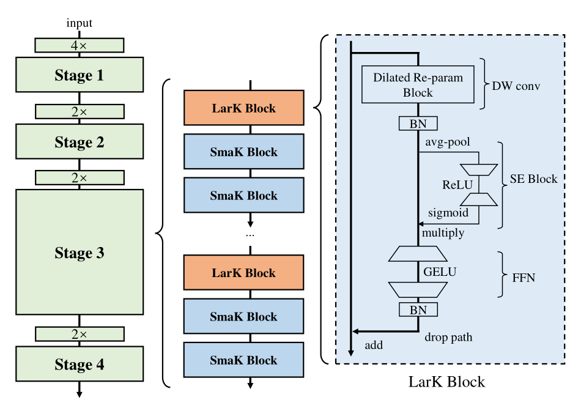

## 一、论文出处

- 论文全名：UniRepLKNet: A Universal Perception Large-Kernel ConvNet for Audio, Video, Point Cloud, Time-Series and Image Recognition
- 会议/年份：CVPR 2024
- 论文链接：https://arxiv.org/abs/2311.15599
- 官方代码：https://github.com/AILab-CVC/UniRepLKNet

## 二、模块图（截自论文原文）



图注：Dilated Reparam Block 是 UniRepLKNet 的核心可插拔单元，训练时由多个小核（含膨胀卷积）并行相加，推理时通过重参数化等价融合成单个大核深度卷积，从而在不增加推理延迟的前提下扩大有效感受野。

## 三、核心思想与作用

一句话总括：用「训练时小核膨胀并行、推理时融合成大核」的重参数化技巧，让大核卷积既能吃到超大感受野的红利，又不背上大核带来的推理延迟和优化困难。

拆解成几步：

1. **大核卷积的两个老问题**：一是直接上 13×13、31×31 这种大核，参数量和 FLOPs 会爆炸，推理变慢；二是大核在训练初期梯度稀疏、优化困难，容易训不动。
2. **训练期并行小核 + 膨胀**：把一个大核深度卷积拆成若干个小核深度卷积并行相加，其中一部分小核带膨胀率（dilation），用膨胀来“撑开”感受野。比如 3×3 加 dilation=3，等效覆盖范围接近 7×7，但参数只有 3×3。
3. **推理期重参数化融合**：因为卷积是线性的，多个并行的深度卷积在推理时可以等价合并成单个大核深度卷积。这一步是纯数学等价变换，不改变输出，只改变计算形式。
4. **结果**：训练时享受小核好优化的特性，推理时享受单个大核的高效实现（大核深度卷积在 GPU 上比多个小核并行更快）。

为什么好：

- **不涨延迟**：推理阶段只有一个大核深度卷积，融合后计算量比训练时的并行结构更小，实际推理速度往往比同感受野的堆叠小核更快。
- **有效感受野更大**：膨胀并行让训练时就能覆盖大范围空间，融合后的大核天然具备大感受野，对需要长程依赖的分割、检测任务友好。
- **即插即用**：它本身就是一个深度卷积的替换件，输入输出通道一致，可以直接替换 U-Net 里的普通 3×3 卷积。

## 四、在 U-Net 里的插入位置

Dilated Reparam Block 本质是一个「深度卷积替换块」，输入输出通道数不变，所以插入位置很灵活：

- **编码器各层**：适合放在每个下采样阶段的主卷积位置，替换原来的 3×3 卷积。编码器需要逐层扩大感受野，大核能让浅层就“看得很宽”，减少深层堆叠压力。
- **瓶颈层**：最推荐。瓶颈层空间分辨率最低、通道数最多，大核深度卷积在这里计算代价相对可控，同时能捕获全局上下文，对分割任务帮助明显。
- **解码器上采样后**：可以放，但要注意解码器特征图分辨率较高，大核的计算量会上升，建议只在较深的解码层用，浅层解码仍用小核。
- **不建议**：放在第一层（分辨率最高、通道最少），此时大核收益有限且显存开销大。

理由总结：这个模块的核心价值是「用大感受野换长程依赖」，所以放在特征图已经降采样、通道数较多的中深层最划算。

## 五、复现代码（PyTorch，逐行中文注释）

> 说明：以下是简化教学版，只保留 Dilated Reparam Block 最核心的两个组件——训练期的多分支膨胀深度卷积、推理期的重参数化融合。省略了官方实现里的 BN 融合细节和多种核尺寸组合，便于理解结构。

```python
import torch
import torch.nn as nn

class DilatedReparamBlock(nn.Module):
    """
    简化版 Dilated Reparam Block。
    训练时：多个深度卷积分支并行相加（部分带膨胀）。
    推理时：调用 reparameterize() 融合成单个大核深度卷积。
    """
    def __init__(self, channels, kernel_size=7, dilations=(1, 2, 3)):
        super().__init__()
        self.channels = channels
        self.kernel_size = kernel_size
        self.dilations = dilations

        # 训练期的并行分支：每个分支是一个深度卷积 + BN
        # 分支1：普通小核深度卷积（dilation=1），负责局部细节
        self.branches = nn.ModuleList()
        self.branches.append(
            nn.Sequential(
                nn.Conv2d(channels, channels, kernel_size=3, padding=1,
                          groups=channels, bias=False),  # 深度卷积，groups=channels
                nn.BatchNorm2d(channels)                   # BN 用于训练稳定，融合时可吸收
            )
        )
        # 其余分支：带膨胀的小核深度卷积，用膨胀撑开感受野
        for d in dilations:
            self.branches.append(
                nn.Sequential(
                    nn.Conv2d(channels, channels, kernel_size=3,
                              padding=d, dilation=d,
                              groups=channels, bias=False),  # 膨胀深度卷积
                    nn.BatchNorm2d(channels)
                )
            )

        # 推理时使用的融合大核（初始为空，reparameterize 后赋值）
        self.fused_conv = None

    def forward(self, x):
        # 训练/推理统一走并行分支相加，保证行为一致
        out = 0
        for branch in self.branches:
            out = out + branch(x)   # 多分支输出逐元素相加
        return out

    @torch.no_grad()
    def reparameterize(self):
        """
        将多个并行分支等价融合成单个大核深度卷积。
        核心思路：把每个分支的卷积核通过零填充放到统一的大核尺寸上，再相加。
        """
        # 计算融合后大核的实际尺寸：最大膨胀覆盖范围
        max_dilation = max(self.dilations) if self.dilations else 1
        # 单个 3x3 核在膨胀 d 下的等效尺寸 = 3 + (3-1)*(d-1) = 2d+1
        fused_size = max(3, 2 * max_dilation + 1)

        # 初始化融合核权重，形状 [channels, 1, fused_size, fused_size]
        fused_weight = torch.zeros(self.channels, 1, fused_size, fused_size,
                                   device=next(self.parameters()).device)

        for branch in self.branches:
            conv = branch[0]          # 取出卷积分支
            bn = branch[1]            # 取出 BN
            # 把 BN 吸收进卷积：w' = w * gamma / sqrt(var + eps)
            bn_scale = bn.weight / torch.sqrt(bn.running_var + bn.eps)
            w = conv.weight * bn_scale.view(-1, 1, 1, 1)  # 逐通道缩放卷积核

            # 计算该分支等效核尺寸
            k = conv.kernel_size[0]
            d = conv.dilation[0]
            eff = k + (k - 1) * (d - 1)   # 膨胀后的等效尺寸

            # 把等效核放到融合核的中心位置（零填充对齐）
            start = (fused_size - eff) // 2
            # 注意：膨胀核需要按 dilation 展开填充，这里用步长写入
            for i in range(k):
                for j in range(k):
                    fused_weight[:, :, start + i * d, start + j * d] += w[:, :, i, j]

        # 构造融合后的深度卷积
        self.fused_conv = nn.Conv2d(self.channels, self.channels,
                                    kernel_size=fused_size,
                                    padding=fused_size // 2,
                                    groups=self.channels, bias=False)
        self.fused_conv.weight.copy_(fused_weight)
        self.fused_conv.eval()

    def forward_fused(self, x):
        """推理时调用：使用融合后的大核深度卷积，速度更快。"""
        assert self.fused_conv is not None, "请先调用 reparameterize()"
        return self.fused_conv(x)
```

## 六、插入示例（几行塞进你的网络）

```python
import torch.nn as nn
from torch import Tensor

class UNetBlock(nn.Module):
    """一个简化的 U-Net 卷积块，用 DilatedReparamBlock 替换普通 3x3 卷积。"""
    def __init__(self, in_ch, out_ch):
        super().__init__()
        self.conv1 = nn.Conv2d(in_ch, out_ch, 3, padding=1)
        self.drb = DilatedReparamBlock(out_ch, kernel_size=7, dilations=(1, 2, 3))  # 插入点
        self.bn = nn.BatchNorm2d(out_ch)
        self.relu = nn.ReLU(inplace=True)

    def forward(self, x: Tensor) -> Tensor:
        x = self.relu(self.bn(self.conv1(x)))
        x = self.drb(x)          # 大核深度卷积，扩大感受野
        return self.relu(x)

# 使用：直接替换 U-Net 编码器/瓶颈里的普通卷积块
# block = UNetBlock(64, 128)
```

## 七、实测经验与注意点

1. **重参数化只在推理时生效**：训练阶段必须走并行分支，否则 BN 统计和梯度行为会不一致。部署前记得调用 `reparameterize()` 并切到 `eval()`。
2. **大核尺寸别贪大**：官方常用 7×7、13×13，再大显存和延迟收益比会变差。医学图像分辨率高时，建议瓶颈层用 13×13，编码器浅层用 7×7。
3. **膨胀率组合要覆盖不同尺度**：dilations 建议包含 1、2、3 这类小膨胀，避免全用大膨胀导致网格伪影（gridding artifact）。
4. **深度卷积的通道数限制**：groups=channels 的深度卷积在通道数很少时（如 <32）收益有限，建议只在通道数 ≥64 的层使用。
5. **BN 融合精度**：重参数化时 BN 的 running_var 要足够稳定，训练不充分就融合会掉点，建议训练收敛后再导出。
6. **和普通卷积的替换关系**：它是深度卷积，不改变通道数，所以只能替换同样输入输出通道的卷积层，不能直接替换升维/降维卷积。

## 八、完整工程

完整可运行代码与更多即插即用模块已整理在仓库：https://github.com/CaiCy6/med-modules

下一篇预告：拆解另一个医学分割里的可插拔模块，讲清它怎么塞进 U-Net 解码器并提升边界精度。
