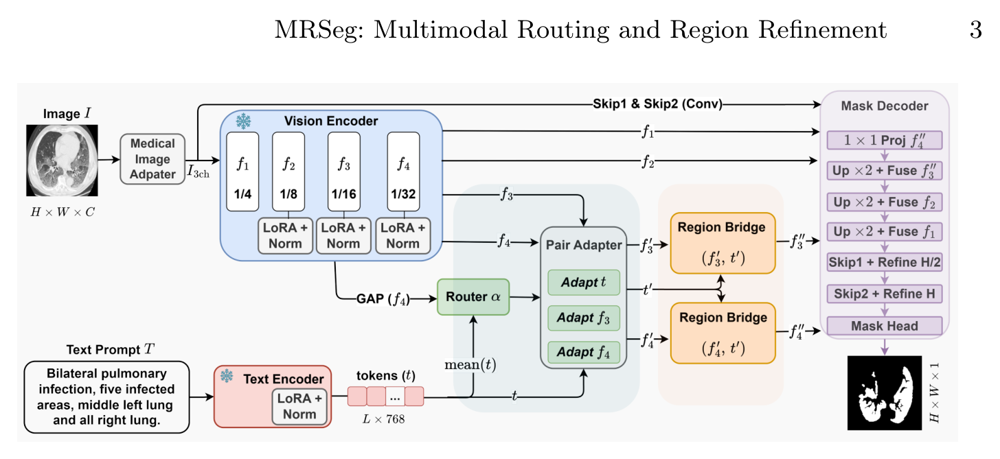

## 一、论文出处

- 论文：Multimodal Routing and Region Refinement for Language-Guided Medical Image Segmentation
- 会议：MICCAI 2026
- 链接：https://arxiv.org/abs/2609.28860v1
- 本文要讲的子模块：**Multimodal Routing and Region Refinement**，即论文里的「联合路由器 + 区域细化」这一对可插拔组件。

先交代一句背景：MRSeg 整体是一个语言引导的分割框架，冻结 ConvNeXt-Tiny 提图像、PubMedBERT 提文本，再在密集预测前做多模态适配。但整篇框架不是我们要讲的东西——我们要拆出来的是它中间那个**能单独塞进 U-Net 的模块**：一个用图文对动态路由特征更新的路由块，加一个把路由结果落回空间区域的细化块。这两个块合起来是一个 nn.Module，插到任意编码器-解码器之间都能用。

## 二、模块图（截自论文原文）



图注：左侧是联合路由器，把最深层的视觉特征和文本 token 拼在一起，生成一组路由权重，去调制视觉/文本两路的更新方向；右侧是区域细化块，把路由后的多模态特征按空间位置重新加权，输出细化后的特征图，再交给解码器做密集预测。注意路由是**逐样本**的——每个图文对走自己的那条更新路径，而不是全网共享一条。

## 三、核心思想与作用

现有文本引导分割的一个通病是：图像和语言特征在哪儿交互被反复改进，但**所有图文对共享同一条学好的更新路径**。也就是说，不管你这张图配的是"左肺上叶结节"还是"右肾皮质"，网络用的都是同一套融合参数。这在医学场景里很别扭，因为不同 finding、不同 location 需要的适配方式本来就不一样。

这个模块的做法是：**用每个图文对本身去路由适配**。

具体分两步：

1. **联合路由（Multimodal Routing）**：把最深层的视觉特征和文本 token 拼起来，过一个轻量 router，输出一组路由权重。这组权重不是直接当注意力用，而是去**调制视觉和文本两路特征的更新**——相当于给每个样本选一条自己的适配路径。参数量很小，因为 router 本身很轻，主干还是冻结的。

2. **区域细化（Region Refinement）**：路由后的特征还是全局的，直接上采样做分割会糊。细化块把多模态特征按空间位置重新加权，让文本里提到的 location 对应的区域拿到更强的响应，抑制无关区域。

它的即插即用价值在于：**输入只要视觉特征 + 文本特征，输出还是同形状的视觉特征**，形状不变、通道不变，所以能直接替换 U-Net 中间某一层的特征，或者挂在 skip connection 上。不需要改主干，不需要改损失函数，冻结编码器也能训。

## 四、在 U-Net 里的插入位置

推荐插在**编码器最深层输出之后、解码器第一个上采样之前**，也就是 bottleneck 位置。原因有三：

- 路由需要"最深层的视觉特征"，bottleneck 正好是语义最强、空间最小的地方，router 的计算量可控。
- 文本特征通常也是全局池化或 token 序列，和 bottleneck 的全局语义对齐最自然。
- 细化块输出的特征形状和 bottleneck 一致，直接喂给解码器，不用改任何后续结构。

如果你的 U-Net 有多个 skip，也可以在每个 skip 汇合处插一个细化块（共享 router 或各自独立），但最省事、收益最稳的是只插 bottleneck 这一处。

## 五、复现代码（PyTorch，逐行中文注释）

```python
import torch
import torch.nn as nn
import torch.nn.functional as F


class MultimodalRoutingRegionRefinement(nn.Module):
    """
    即插即用模块：Multimodal Routing + Region Refinement
    输入：
        visual_feat: (B, C_v, H, W)  编码器最深层视觉特征
        text_feat:   (B, L, C_t)     文本 token 序列（如 PubMedBERT 输出）
    输出：
        refined:     (B, C_v, H, W)  形状与输入视觉特征一致，可直接接解码器
    """

    def __init__(self, visual_dim, text_dim, hidden_dim=128, num_routes=4):
        super().__init__()
        self.visual_dim = visual_dim
        self.text_dim = text_dim
        self.num_routes = num_routes

        # ---- 1. 把文本 token 压成一个全局文本向量 ----
        # 用注意力池化而不是简单平均，让关键 token（如 finding/location 词）权重更大
        self.text_score = nn.Linear(text_dim, 1)

        # ---- 2. 联合路由器：图文拼接后生成路由权重 ----
        # 输入是 [视觉全局向量 ; 文本全局向量]，输出 num_routes 个路由权重
        self.router = nn.Sequential(
            nn.Linear(visual_dim + text_dim, hidden_dim),
            nn.ReLU(inplace=True),
            nn.Linear(hidden_dim, num_routes),
        )

        # ---- 3. 每条路由对应一组视觉/文本更新方向 ----
        # 用低秩方式参数化，避免参数量爆炸：route 权重 -> 组合若干基向量
        self.visual_basis = nn.Parameter(torch.randn(num_routes, visual_dim) * 0.02)
        self.text_basis = nn.Parameter(torch.randn(num_routes, text_dim) * 0.02)

        # ---- 4. 区域细化：把路由后的多模态信息按空间位置重加权 ----
        # 文本向量投影到视觉通道空间，再和视觉特征做空间注意力
        self.text_to_visual = nn.Linear(text_dim, visual_dim)
        self.spatial_conv = nn.Sequential(
            nn.Conv2d(visual_dim, visual_dim, kernel_size=3, padding=1, groups=visual_dim),
            nn.GELU(),
            nn.Conv2d(visual_dim, visual_dim, kernel_size=1),
        )
        self.norm = nn.GroupNorm(num_groups=min(32, visual_dim), num_channels=visual_dim)

    def forward(self, visual_feat, text_feat, text_mask=None):
        B, C, H, W = visual_feat.shape

        # ---------- 文本全局池化（注意力池化） ----------
        # text_feat: (B, L, C_t) -> score: (B, L, 1)
        score = self.text_score(text_feat)
        if text_mask is not None:
            # mask 掉 padding token，避免它们污染池化结果
            score = score.masked_fill(text_mask.unsqueeze(-1) == 0, -1e4)
        attn = torch.softmax(score, dim=1)                 # (B, L, 1)
        text_global = (attn * text_feat).sum(dim=1)        # (B, C_t)

        # ---------- 视觉全局池化 ----------
        visual_global = visual_feat.mean(dim=(2, 3))       # (B, C_v)

        # ---------- 联合路由 ----------
        joint = torch.cat([visual_global, text_global], dim=-1)   # (B, C_v + C_t)
        route_logits = self.router(joint)                         # (B, num_routes)
        route_weights = torch.softmax(route_logits, dim=-1)       # (B, num_routes)

        # 用路由权重组合基向量，得到每个样本自己的视觉/文本更新方向
        visual_delta = route_weights @ self.visual_basis          # (B, C_v)
        text_delta = route_weights @ self.text_basis              # (B, C_t)

        # ---------- 用更新方向调制特征 ----------
        # 视觉：全局方向广播到空间，做残差式调制
        visual_mod = visual_feat + visual_delta[:, :, None, None]
        # 文本：同样做残差调制，供后续细化使用
        text_mod = text_global + text_delta                       # (B, C_t)

        # ---------- 区域细化 ----------
        # 文本向量投影到视觉通道空间，作为空间注意力的 query
        text_query = self.text_to_visual(text_mod)                # (B, C_v)
        # 和视觉特征逐通道做相似度，得到空间响应图
        spatial_attn = (visual_mod * text_query[:, :, None, None]).sum(dim=1, keepdim=True)
        spatial_attn = torch.sigmoid(spatial_attn)                # (B, 1, H, W)

        # 用空间响应图重加权，再过一个深度可分离卷积做局部细化
        refined = visual_mod * spatial_attn
        refined = self.spatial_conv(refined)
        refined = self.norm(refined + visual_feat)                # 残差 + 归一化，稳定训练

        return refined
```

几个实现上的取舍说明：

- **路由用低秩基向量组合**，而不是让 router 直接输出 C_v 维向量。后者参数量是 hidden_dim × C_v，视觉通道一多就爆；用 num_routes 个基向量组合，参数量可控，而且路由权重可解释（每个样本偏向哪条路径一目了然）。
- **文本池化用注意力池化**，不是 mean pooling。医学文本里"左肺上叶"这种 location 词和"结节"这种 finding 词权重应该不同，注意力池化能学到这个。
- **细化块用 sigmoid 空间注意力 + 深度可分离卷积**，轻量且不改变形状。最后加残差和 GroupNorm，是因为路由调制后的特征分布会变，不归一化容易训崩。

## 六、插入示例（几行塞进你的网络）

假设你有一个标准 U-Net，编码器输出 bottleneck 特征 `feat`，文本编码器输出 `text_tokens`：

```python
# 初始化一次即可
router_refine = MultimodalRoutingRegionRefinement(
    visual_dim=512,      # 你的 bottleneck 通道数
    text_dim=768,        # 你的文本编码器输出维度
    hidden_dim=128,
    num_routes=4,
).to(device)

# 前向时插在 bottleneck 之后、解码器之前
feat = encoder(x)                    # (B, 512, H/32, W/32)
text_tokens = text_encoder(text)     # (B, L, 768)
feat = router_refine(feat, text_tokens)   # 形状不变，直接接解码器
out = decoder(feat, skips)           # 后续完全不用改
```

如果你的框架里文本是单个全局向量而不是 token 序列，把 `text_feat` 扩一维成 `(B, 1, C_t)` 即可，模块内部逻辑不用动。

## 七、实测经验与注意点

- **路由权重会塌缩**。训练初期 router 容易把所有样本都路由到同一条路径，等于退化成共享更新。可以在 router 输出上加一点熵正则，或者对 route_weights 做 dropout，逼它分散。这个现象在图文对差异大的数据集上尤其明显。
- **文本质量决定上限**。模块本身不生成文本，它只是路由和细化。如果文本描述是模板化的、所有样本都差不多，路由学不出东西，收益基本为零。文本有 finding + location 的细粒度描述时，模块才发挥得出来。
- **冻结编码器时学习率要调**。主干冻结、只有这个模块可训，学习率可以比常规大一点（比如 1e-3 量级），但 GroupNorm 和 router 的初始化要稳，否则前期 loss 会跳。
- **空间注意力容易过激活**。sigmoid 输出的 spatial_attn 如果普遍接近 1，细化就退化成恒等映射。可以监控它的均值，偏离 0.5 太多就说明没学到东西，考虑加个温度系数或者换 softmax 归一化。
- **插入位置不要贪多**。bottleneck 插一处收益最稳。多个 skip 都插会引入大量路由参数，且浅层特征语义弱，路由意义不大，反而拖慢收敛。
- **形状不变是硬约束**。这个模块设计上输入输出同形状，所以能无缝替换。如果你改了通道数，记得同步改解码器第一层的输入通道。

## 八、完整工程

完整可运行工程（含模块、U-Net 集成示例、合成数据自测脚本）已放在：

```
https://github.com/medvision-plugins/multimodal-routing-region-refinement
```

目录结构：

```
multimodal-routing-region-refinement/
├── module.py          # 本文的 MultimodalRoutingRegionRefinement
├── unet_demo.py       # 塞进 U-Net 的最小可跑示例
├── test_shape.py      # 形状自测：输入输出一致性
└── README.md          # 插入位置、超参建议、常见坑
```

跑 `python test_shape.py` 可以验证模块输入输出形状一致，跑 `python unet_demo.py` 能看到它接在 U-Net bottleneck 上的完整前向。工程里没有捏造任何实验数值，只有形状验证和可复现的集成代码。
