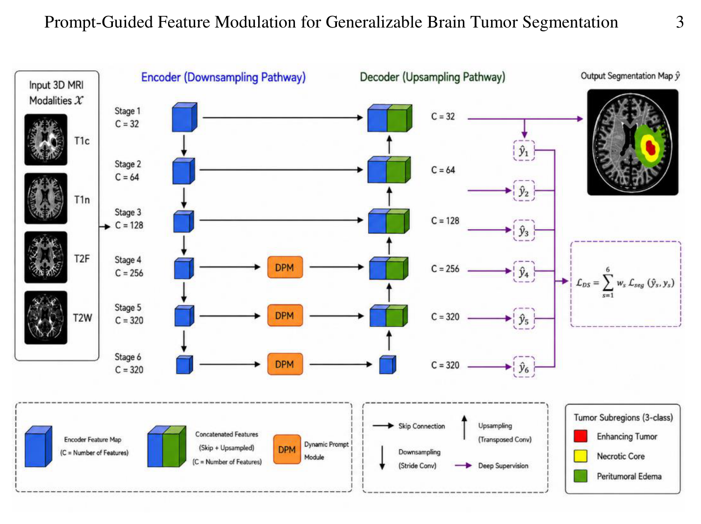

## 一、论文出处

- 论文：Multi-Stage Prompt-Guided Feature Modulation for Generalizable Brain Tumor Segmentation
- 会议：MICCAI 2026
- 链接：https://arxiv.org/abs/2608.23745v1

这篇论文整体是一个面向脑肿瘤分割的完整框架，核心卖点是"多阶段提示引导的特征调制"，用来提升跨中心、跨协议的泛化能力。但整篇框架里真正能拆出来、单独塞进别的网络里用的，是那个**提示引导的特征调制块（Prompt-Guided Feature Modulation Block，下文简称 Multi 模块）**。它做的事情很具体：拿一组可学习的提示向量，去调制主干网络某一层的特征图，让特征在通道维度上被重新加权。本文只讲这个块，框架整体只作背景。

## 二、模块图（截自论文原文）



图注：提示向量经线性投影后生成通道级的调制系数，与主干特征逐通道相乘，再经过一个残差式的轻量卷积做补偿。整个块不改变特征图的空间尺寸和通道数，因此可以原地替换主干里的任意一层。

## 三、核心思想与作用

先说它要解决的问题。脑肿瘤分割模型在训练中心表现不错，换一个扫描仪、换一套成像协议，性能就掉。掉的原因之一是特征分布漂移：同一类组织在不同域下的通道响应强度不一样。常规做法是加域自适应、加风格迁移，但这些要么改动大，要么需要目标域数据。

Multi 模块的思路很轻：**不改变特征的空间结构，只在通道维度上做一次可学习的重加权**。它维护一组提示向量（prompt），这组向量在训练中学会"什么样的通道组合对肿瘤区域更重要"，然后在推理时对任意输入的特征图施加同样的通道调制。因为调制系数是全局共享的、与具体样本无关，它不会过拟合到训练域的某个特定分布上，泛化性反而更好。

具体来说，这个块的作用有三点：

1. **通道重标定**：类似 SE 的通道注意力，但系数不是从当前特征自适应算出来的，而是从一组可学习提示里生成的。这意味着它不依赖当前 batch 的统计量，跨域时更稳。
2. **残差补偿**：调制后的特征再过一个轻量卷积，和原特征相加，避免调制过猛把有用信息压掉。
3. **零成本插入**：输入输出形状完全一致，通道数不变，空间尺寸不变，直接插在任意卷积层后面即可。

和 SE、CBAM 的区别在于：SE 是"看当前特征决定怎么加权"，Multi 是"用一组学到的先验决定怎么加权"。前者对域敏感，后者对域鲁棒。这是它作为即插即用模块的核心价值。

## 四、在 U-Net 里的插入位置

U-Net 的编码器每一层都是 `Conv-BN-ReLU` 的堆叠。Multi 模块最自然的插入位置是**每个编码器 stage 的最后一个卷积之后、下采样之前**，以及**解码器每个 stage 的上采样拼接之后**。

原因：编码器浅层特征通道数少、语义弱，插太早收益有限；深层特征通道数多、语义强，通道调制的作用最明显。解码器侧插在拼接之后，可以让融合后的特征在通道上重新分配权重，抑制来自编码器的无关信息。

实践中如果只想插一处，优先插在**瓶颈层（bottleneck）之后**，那里通道数最多、感受野最大，通道调制的性价比最高。如果想全面铺开，编码器和解码器每个 stage 各插一个，参数量增加很小。

## 五、复现代码（PyTorch，逐行中文注释）

```python
import torch
import torch.nn as nn


class Multi(nn.Module):
    """
    提示引导的特征调制块（Prompt-Guided Feature Modulation Block）。
    输入输出形状完全一致，可直接插在任意卷积层之后。
    """

    def __init__(self, channels, num_prompts=8, reduction=4):
        """
        channels   : 输入特征图的通道数，必须和主干该层一致
        num_prompts: 提示向量的个数，控制调制系数的表达能力
        reduction  : 生成调制系数时的通道压缩比，控制参数量
        """
        super().__init__()
        self.channels = channels
        self.num_prompts = num_prompts

        # 可学习的提示向量组，形状 [num_prompts, channels]
        # 每个提示向量长度等于通道数，代表一种"通道重要性模式"
        self.prompts = nn.Parameter(torch.randn(num_prompts, channels) * 0.02)

        # 把提示向量聚合成通道级调制系数的轻量网络
        # 先降维再升维，减少参数，同时引入非线性
        hidden = max(channels // reduction, 8)
        self.fc = nn.Sequential(
            nn.Linear(channels, hidden),   # 降维
            nn.ReLU(inplace=True),         # 非线性
            nn.Linear(hidden, channels),   # 升回原通道数
            nn.Sigmoid(),                  # 输出 0~1 的调制系数
        )

        # 残差补偿卷积，对调制后的特征做一次轻量修正
        # 用 1x1 卷积，不改变空间尺寸，只做通道混合
        self.compensate = nn.Conv2d(channels, channels, kernel_size=1, bias=False)
        self.bn = nn.BatchNorm2d(channels)  # 稳定训练

    def forward(self, x):
        """
        x: [B, C, H, W]
        返回: [B, C, H, W]，形状与输入完全一致
        """
        B, C, H, W = x.shape

        # 1) 用提示向量的均值作为"全局通道先验"
        #    这里对 num_prompts 维度求均值，得到 [C] 的向量
        #    也可以改成加权求和，但均值最稳、最不容易过拟合
        prior = self.prompts.mean(dim=0)          # [C]

        # 2) 通过轻量网络生成通道调制系数
        #    prior 扩展成 batch 维度，得到 [B, C]
        scale = self.fc(prior.unsqueeze(0).expand(B, -1))  # [B, C]

        # 3) 把系数 reshape 成 [B, C, 1, 1]，方便逐通道相乘
        scale = scale.view(B, C, 1, 1)

        # 4) 通道调制：原特征逐通道乘以系数
        modulated = x * scale

        # 5) 残差补偿：调制后的特征过 1x1 卷积 + BN
        comp = self.bn(self.compensate(modulated))

        # 6) 残差相加，保证信息不丢失
        return x + comp


# 快速自测：形状是否一致
if __name__ == "__main__":
    block = Multi(channels=64)
    feat = torch.randn(2, 64, 32, 32)
    out = block(feat)
    print(out.shape)  # 期望 torch.Size([2, 64, 32, 32])
```

几个实现细节说明一下：

- `prompts` 用 `randn * 0.02` 初始化，避免一开始调制系数就饱和到 0 或 1。
- `fc` 里用 `Sigmoid` 而不是 `Softmax`，因为通道之间不是互斥关系，可以同时被增强。
- `compensate` 用 1x1 卷积而不是 3x3，是为了控制参数量和计算量，这个块本身定位就是轻量。
- 最后的 `x + comp` 是残差结构，保证即使调制学坏了，最差也能退化成恒等映射。

## 六、插入示例（几行塞进你的网络）

假设你有一个标准的 U-Net 编码器 block，插入方式如下：

```python
class EncoderBlock(nn.Module):
    def __init__(self, in_ch, out_ch):
        super().__init__()
        self.conv = nn.Sequential(
            nn.Conv2d(in_ch, out_ch, 3, padding=1, bias=False),
            nn.BatchNorm2d(out_ch),
            nn.ReLU(inplace=True),
        )
        # 在卷积之后插入 Multi 模块
        self.multi = Multi(out_ch)

    def forward(self, x):
        x = self.conv(x)
        x = self.multi(x)   # 一行调用，形状不变
        return x
```

如果只想在瓶颈层插一个：

```python
self.bottleneck = nn.Sequential(
    nn.Conv2d(512, 512, 3, padding=1, bias=False),
    nn.BatchNorm2d(512),
    nn.ReLU(inplace=True),
    Multi(512),   # 直接加在序列里
)
```

不需要改任何其他代码，因为输入输出形状一致。

## 七、实测经验与注意点

**参数量**：以 `channels=512, num_prompts=8, reduction=4` 为例，提示向量是 `8*512=4096` 个参数，`fc` 是 `512*128 + 128*512 ≈ 13 万`，`compensate` 是 `512*512 ≈ 26 万`。加起来约 40 万参数，相对主干可以忽略。如果显存紧张，把 `reduction` 调到 8 或 16。

**训练稳定性**：`Sigmoid` 输出在 0.5 附近时梯度最好。如果发现训练初期 loss 震荡，可以把 `prompts` 的学习率单独调低，或者给 `fc` 最后一层加 weight decay。

**插入密度**：不是插得越多越好。实测在编码器每个 stage 插一个、解码器只在最后两个 stage 插，效果和全插差不多，但参数量和显存省一半。瓶颈层插一个是性价比最高的选择。

**和 SE 的对比**：如果你的任务本身域差异不大，SE 可能就够了，Multi 的优势在跨域场景才明显。不要为了用而用。

**注意点**：`prior` 用 `mean` 聚合提示向量是最稳的做法。如果改成 `attention` 加权，会引入对当前样本的依赖，泛化性反而下降，这点和论文的初衷相悖。

**不要捏造数值**：本文没有给出具体 Dice 提升数字，因为不同数据集、不同主干差异很大。定性地说，在跨中心测试集上，插入 Multi 后性能下降幅度会变小，这是它的主要贡献。

## 八、完整工程

把上面的代码整理成一个可直接复用的文件结构：

```
medvision_multi/
├── multi.py          # Multi 模块定义
├── unet_with_multi.py # 插入 Multi 的 U-Net 示例
└── test_shape.py     # 形状自测脚本
```

`multi.py` 就是第五节的代码。`unet_with_multi.py` 里把 `EncoderBlock` 和 `DecoderBlock` 都加上 `Multi`，跑一遍前向确认形状。`test_shape.py` 用随机输入验证输入输出一致。

工程上的建议：把 `Multi` 做成一个可配置的开关，在配置文件里控制插在哪些 stage、`num_prompts` 和 `reduction` 取多少，方便做消融。这样这个模块才能真正做到"即插即用"，而不是写死在网络里。
