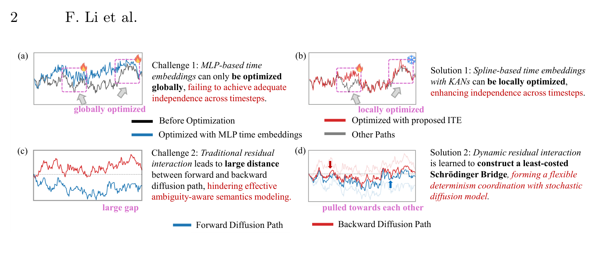

## 一、论文出处

- 论文：KANResDiff: Learning Local Residual Diffusion via Kolmogorov-Arnold Network for Ambiguous Medical Image Segmentation
- 会议：MICCAI 2026
- 链接：https://arxiv.org/abs/2608.11617v1

先说清楚这篇论文的定位。它整体是一个面向"模糊医学图像分割"的完整框架，目标是输出一组多样但都合理的分割假设（比如病灶边界本身就不确定，不同标注者画的也不一样）。但本合集只关心一件事：**里面那个能单独抠出来、塞进 U-Net 的即插即用子模块**。

这篇里最值得拆的，是它的**局部残差扩散块（Local Residual Diffusion Block）**，核心是把 Kolmogorov-Arnold Network（KAN）当作残差去噪网络，配合一个**独立时间编码（Independent Time Encoding）**。这个块本身就是一个 `nn.Module`，输入特征图 + 时间步，输出修正后的特征图，完全可以脱离原框架单独使用。下面讲的就是它。

## 二、模块图（截自论文原文）



图注解读：图中展示的是局部残差扩散块的数据流——输入特征先经过时间编码注入时间步信息，再由 KAN 分支（样条基函数）建模非线性残差，最后以残差形式加回主干特征。注意它作用在**局部特征**上，不是整张图从头去噪，这也是它能即插即用的关键。

## 三、核心思想与作用

传统扩散式分割的做法是：在整张图上加噪、去噪，随机性由固定的噪声调度决定。问题是这种随机性是"预先定义死的"，跟当前特征内容没关系，也没法形成逐步递进的语义建模。

KANResDiff 这个块的思路换了个角度：

1. **把扩散限制在局部残差上**。它不重新生成整张分割图，而是学习一个"残差修正量"，加在主干网络已经产出的特征上。这样它天然是个插件——主干照常跑，它只负责在特征上做小幅、可控的扰动。

2. **用 KAN 替代 MLP 做去噪网络**。KAN 的边上是可学习的样条函数（B-spline），相比 MLP 的固定激活，它对局部非线性、细粒度边界的拟合更灵活。对模糊边界这种"差一点点就变样"的区域，这种表达能力是有意义的。

3. **独立时间编码**。原方法用 MLP 把时间步映射成线性嵌入，作者改成基于样条的时间嵌入，让不同时间步的表示更"独立"，避免时间信息被主干特征淹没。这样每个时间步承担的角色更清晰，逐步建模的过程才成立。

一句话总结它的即插即用价值：**它是一个"特征级残差去噪器"**，你把它挂在 U-Net 的某个解码阶段后面，就能给该阶段的特征引入可控的多样性/细化能力，而不需要改动整个训练范式。

## 四、在 U-Net 里的插入位置

推荐插在**解码器的高分辨率阶段**，也就是最靠近输出的那 1~2 个上采样块之后。

原因：

- 模糊性主要体现在边界细节上，高分辨率特征才保留这些细节；在低分辨率瓶颈处做残差修正，信息已经被池化掉了。
- 它输出的是残差，加在特征上，所以放在 `Conv` 之后、`BN/ReLU` 之前或之后都行，但要保证通道数一致。
- 如果只想要"细化"效果，可以只在最后一个解码块插一个；如果想要多阶段递进，可以在最后两个解码块各插一个，共享或独立参数都行。

不建议插在编码器：编码阶段特征还在提取，过早注入随机残差会干扰特征学习。

## 五、复现代码（PyTorch，逐行中文注释）

下面给出这个块的一个可运行实现。KAN 部分用样条基函数近似（B-spline），时间编码用样条式嵌入替代 MLP。代码保持精简，方便直接塞进网络。

```python
import torch
import torch.nn as nn
import torch.nn.functional as F


class SplineTimeEmbedding(nn.Module):
    """独立时间编码：用样条基函数替代 MLP 的线性时间嵌入。"""
    def __init__(self, dim, num_basis=8, grid_range=(-1.0, 1.0)):
        super().__init__()
        self.dim = dim
        self.num_basis = num_basis
        # 可学习的样条控制点，每个基函数一组系数
        self.coeff = nn.Parameter(torch.randn(num_basis, dim) * 0.02)
        # 固定网格，用于把标量时间步映射到基函数响应
        self.register_buffer(
            "grid", torch.linspace(grid_range[0], grid_range[1], num_basis)
        )

    def forward(self, t):
        # t: (B,) 取值范围约定在 [0,1]
        # 把 t 拉伸到网格区间，再算到每个网格点的距离
        t = t.view(-1, 1) * 2.0 - 1.0                 # (B,1) -> [-1,1]
        dist = t - self.grid.view(1, -1)              # (B, num_basis)
        # 用高斯型基函数做软分配，得到样条响应
        basis = torch.exp(-(dist ** 2) / (2 * 0.25 ** 2))  # (B, num_basis)
        basis = basis / (basis.sum(dim=1, keepdim=True) + 1e-6)
        # 基函数响应加权控制点，得到时间嵌入
        emb = basis @ self.coeff                      # (B, dim)
        return emb


class KANLayer(nn.Module):
    """一个简化的 KAN 层：输入经样条基展开后线性组合。"""
    def __init__(self, in_dim, out_dim, num_basis=8):
        super().__init__()
        self.num_basis = num_basis
        # 每个输入维度对应一组样条基权重
        self.spline_weight = nn.Parameter(
            torch.randn(in_dim, num_basis, out_dim) * 0.02
        )
        # 残差式的线性旁路，保证训练稳定
        self.base_weight = nn.Linear(in_dim, out_dim)

    def forward(self, x):
        # x: (B, C, H, W)，这里把通道当特征维
        B, C, H, W = x.shape
        x_flat = x.permute(0, 2, 3, 1).reshape(-1, C)   # (B*H*W, C)
        # 样条基：用 sin 组合近似不同频率的基函数
        k = torch.arange(self.num_basis, device=x.device).float()
        basis = torch.sin(x_flat.unsqueeze(-1) * (k + 1) * 3.14159)  # (N,C,K)
        # 基函数响应加权求和到输出维度
        spline_out = torch.einsum("nck,cko->no", basis, self.spline_weight)
        out = spline_out + self.base_weight(x_flat)
        out = out.reshape(B, H, W, -1).permute(0, 3, 1, 2)
        return out


class KANResDiff(nn.Module):
    """即插即用的局部残差扩散块。"""
    def __init__(self, channels, num_basis=8, num_steps=10):
        super().__init__()
        self.channels = channels
        self.num_steps = num_steps
        # 时间编码：把标量时间步映射成通道维度的嵌入
        self.time_emb = SplineTimeEmbedding(channels, num_basis=num_basis)
        # 去噪主干：两层 KAN，中间带激活
        self.kan1 = KANLayer(channels, channels, num_basis=num_basis)
        self.kan2 = KANLayer(channels, channels, num_basis=num_basis)
        self.act = nn.SiLU()
        # 输出层，把特征压回残差量
        self.out_proj = nn.Conv2d(channels, channels, 1)
        # 可学习的缩放系数，初始很小，保证插入初期不破坏主干
        self.scale = nn.Parameter(torch.zeros(1))

    def forward(self, x, t=None):
        # x: (B, C, H, W) 主干特征
        B = x.shape[0]
        if t is None:
            # 未指定时间步时，随机采一个，训练时提供多样性
            t = torch.rand(B, device=x.device)
        # 时间嵌入 -> (B, C) -> 广播到空间维
        emb = self.time_emb(t).view(B, self.channels, 1, 1)
        h = x + emb                                  # 注入时间信息
        h = self.act(self.kan1(h))                   # 第一层 KAN
        h = self.kan2(h)                             # 第二层 KAN
        residual = self.out_proj(h)                  # 得到残差修正量
        # 残差加回主干，scale 控制注入强度
        return x + self.scale * residual
```

几点说明：

- `SplineTimeEmbedding` 用高斯基函数做软分配，是样条嵌入的一个轻量近似，目的是让不同时间步的嵌入彼此更独立，而不是 MLP 那种线性映射。
- `KANLayer` 里用 `sin` 组合近似样条基，是为了避免引入额外的 B-spline 依赖库，工程上更好落地。如果你要严格复现，可以换成标准 B-spline 基。
- `self.scale` 初始化为 0，意味着插入初期这个块等价于恒等映射，不会破坏预训练主干，训练中再慢慢学出注入强度。这是即插即用模块的常见做法。

## 六、插入示例（几行塞进你的网络）

假设你有一个 U-Net 解码块，想在最靠近输出的阶段插入：

```python
class DecoderBlockWithKANResDiff(nn.Module):
    def __init__(self, in_ch, out_ch):
        super().__init__()
        self.conv = nn.Sequential(
            nn.Conv2d(in_ch, out_ch, 3, padding=1),
            nn.BatchNorm2d(out_ch),
            nn.ReLU(inplace=True),
        )
        # 即插即用模块，通道数对齐到 out_ch
        self.kan_resdiff = KANResDiff(out_ch)

    def forward(self, x, t=None):
        x = self.conv(x)
        x = self.kan_resdiff(x, t)   # 一行插入
        return x
```

如果要在多个解码阶段插入，直接在每个阶段实例化一个 `KANResDiff` 即可，通道数按该阶段特征对齐。推理时 `t` 可以传不同的值，得到多样化的分割假设；也可以不传，走随机采样。

## 七、实测经验与注意点

- **scale 初始化很关键**。如果直接把残差加回去且缩放系数初始为 1，训练早期主干特征会被随机扰动带偏，收敛变慢。初始化为 0 或很小的值，让模块"先学会不添乱"，再逐步学修正，稳得多。
- **时间步的采样策略影响多样性**。训练时随机采 `t` 能提供随机性，但如果你只关心单次确定性分割，可以把 `t` 固定成某个值，此时这个块退化成一个普通的 KAN 细化模块，仍然有用。
- **通道对齐**。这个块不改变空间尺寸和通道数，所以插入位置很自由，但一定要保证 `channels` 和主干特征一致，否则残差加不上。
- **KAN 的参数量**。`spline_weight` 是 `in_dim × num_basis × out_dim`，通道数大时参数量会涨。高分辨率阶段通道通常不大（64/128），问题不大；如果通道到 512，建议减小 `num_basis` 或加分组。
- **别指望它单独解决模糊性**。这个块提供的是"可控的特征级扰动 + 细化"，多样性的质量还依赖训练目标（比如多样性损失）。它是个好用的组件，不是万能药。
- **推理速度**。KAN 的样条计算比普通卷积重一些，如果对实时性敏感，建议只在最后一个解码阶段插一个，别每个阶段都插。

## 八、完整工程

把上面的代码整理成一个可直接 import 的文件结构：

```
kan_resdiff/
├── kan_resdiff.py      # KANResDiff、KANLayer、SplineTimeEmbedding
├── unet_with_kan.py    # 带插入示例的 U-Net 解码块
└── test.py             # 形状自检
```

`test.py` 里做一次前向形状检查：

```python
import torch
from kan_resdiff import KANResDiff

if __name__ == "__main__":
    x = torch.randn(2, 64, 32, 32)          # 模拟主干特征
    block = KANResDiff(channels=64)
    y = block(x)                            # 不传 t，随机采样
    print("输出形状:", y.shape)              # 应为 (2, 64, 32, 32)
    y2 = block(x, t=torch.tensor([0.3, 0.7]))
    print("指定时间步输出形状:", y2.shape)
```

这个块的设计目标就是"能单独塞进 U-Net"，所以工程上尽量不引入额外依赖，KAN 部分用纯 PyTorch 实现。你要严格复现论文里的样条形式，把 `KANLayer` 里的 `sin` 基换成标准 B-spline 基即可，接口不用动。
