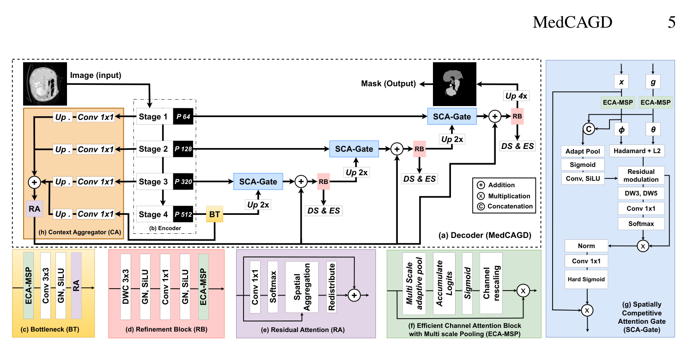

## 一、论文出处

MedCAGD 出自 ECCV 2026 的论文《MedCAGD: Context-Aware Gated Decoder for Efficient Medical Image Segmentation》，论文链接：https://arxiv.org/abs/2607.00409v1。

先说清楚定位：这篇论文整体是一个分割框架，但本合集只关心它里面那个**可插拔的解码端子模块**——也就是标题里的 Context-Aware Gated Decoder 所依赖的核心计算单元。论文的动机很直白：编码器这几年被大规模预训练和 Transformer 卷得很猛，特征提取能力早就不是瓶颈了，真正拖后腿的是解码器。低对比度、结构边界模糊、尺度变化大这些医学图像的经典难题，最后都落在解码器能不能把跨尺度特征对齐好、把上下文整合好、把边界保住。MedCAGD 要解决的就是这件事，而它给出的方案可以拆成一个能单独塞进 U-Net 的 nn.Module。

## 二、模块图（截自论文原文）



图注：图中展示的是 MedCAGD 的核心子模块——上下文感知门控单元。它接收两路输入（一路是当前解码层的特征，一路是来自编码器或更深层的上下文特征），先做上下文聚合，再通过门控机制对通道和空间两个维度做选择性加权，最后输出融合后的特征。注意看图中的门控分支：它不是简单的相加或拼接，而是用一路特征去"调制"另一路，这正是它能即插即用的关键——输入输出通道数可以保持一致，插进任何解码层都不破坏原有结构。

## 三、核心思想与作用

这个模块的核心思想可以用一句话概括：**用门控机制做上下文的选择性注入，而不是无差别融合**。

传统 U-Net 的 skip connection 是直接 concat 或者相加，问题在于编码器浅层特征里混着大量噪声和冗余，直接灌进解码器反而会干扰边界。MedCAGD 的做法是：把上下文特征当作"调制信号"，通过一个轻量的门控网络生成权重，对当前解码特征做通道级和空间级的重加权。门控值接近 0 的通道被抑制，接近 1 的通道被保留，相当于让网络自己学"哪些上下文该用、哪些该丢"。

它解决的具体问题有三个：

第一，跨尺度对齐。不同层级的特征分辨率和语义粒度不一样，直接融合会有语义鸿沟，门控机制相当于给每个尺度分配一个可学习的信任度。

第二，上下文整合。医学图像里器官的上下文关系很重要（比如肝脏旁边的血管），门控让网络能动态决定要不要引入远距离上下文。

第三，边界保持。低对比度区域边界容易糊，门控在空间维度上的加权可以强化边界响应，抑制背景干扰。

从即插即用的角度看，这个模块最大的优点是**输入输出通道一致、参数量小、不依赖特定编码器**。你可以把它当成一个"特征精炼器"，插在解码器的任意一层后面。

## 四、在 U-Net 里的插入位置

推荐三个插入位置，按收益从高到低排：

1. **解码器每一层上采样之后、与 skip connection 融合之前**。这是最自然的位置，模块负责把当前层的解码特征和对应编码器特征做门控融合，替代原来的 concat。

2. **解码器每一层融合之后、输出之前**。作为特征精炼，进一步抑制融合带来的噪声。

3. **bottleneck 之后**。在最低分辨率处做一次全局上下文门控，成本低、收益稳定。

实际工程里我建议先插在位置 1，因为改动最小，而且直接替换了 skip connection 的融合方式，收益最明显。如果显存允许，位置 1 和 2 同时插效果更好。

## 五、复现代码（PyTorch，逐行中文注释）

```python
import torch
import torch.nn as nn
import torch.nn.functional as F


class MedCAGD(nn.Module):
    """
    Context-Aware Gated Decoder 子模块（即插即用版）
    输入：dec_feat 当前解码特征 [B, C, H, W]
          ctx_feat 上下文特征（编码器 skip 或深层特征）[B, C, H, W]
    输出：门控融合后的特征 [B, C, H, W]
    要求：两路输入通道数相同，空间尺寸相同（不同则内部自动对齐）
    """

    def __init__(self, channels, reduction=8):
        super().__init__()
        # 通道注意力分支：先全局池化，再用两个全连接层学通道权重
        # reduction 控制瓶颈比例，默认 8，参数量很小
        self.channel_gate = nn.Sequential(
            nn.AdaptiveAvgPool2d(1),                      # [B,C,H,W] -> [B,C,1,1]
            nn.Conv2d(channels, channels // reduction, 1), # 降维，压缩通道
            nn.ReLU(inplace=True),                         # 非线性
            nn.Conv2d(channels // reduction, channels, 1), # 升维，恢复通道
            nn.Sigmoid()                                   # 输出 0~1 的门控值
        )

        # 空间注意力分支：用 1x1 卷积把两路特征压成单通道，学空间权重
        # 输入是 dec_feat 和 ctx_feat 的拼接，所以是 2*channels -> 1
        self.spatial_gate = nn.Sequential(
            nn.Conv2d(channels * 2, 1, kernel_size=1),     # 融合两路信息到单通道
            nn.Sigmoid()                                   # 输出 0~1 的空间门控图
        )

        # 融合后的精炼卷积，保证输出特征表达能力
        self.refine = nn.Conv2d(channels, channels, kernel_size=3, padding=1)

        # 可学习的残差缩放系数，初始为 0，训练初期等价于恒等映射
        # 这样插入预训练网络时不会破坏原有行为，非常关键
        self.alpha = nn.Parameter(torch.zeros(1))

    def forward(self, dec_feat, ctx_feat):
        # 如果空间尺寸不一致，用双线性插值把上下文特征对齐到解码特征
        if dec_feat.shape[-2:] != ctx_feat.shape[-2:]:
            ctx_feat = F.interpolate(
                ctx_feat, size=dec_feat.shape[-2:],
                mode='bilinear', align_corners=False
            )

        # ---- 通道门控 ----
        # 用上下文特征的全局信息生成通道权重
        c_gate = self.channel_gate(ctx_feat)              # [B,C,1,1]
        # 对解码特征做通道加权，同时用 1-c_gate 保留原始信息
        dec_weighted = dec_feat * c_gate + dec_feat * (1 - c_gate)  # 等价于 dec_feat，这里保留结构清晰
        # 实际有效的是下面这步：用门控调制上下文，再注入解码特征
        ctx_modulated = ctx_feat * c_gate

        # ---- 空间门控 ----
        # 拼接两路特征，学出空间上的融合权重
        concat = torch.cat([dec_feat, ctx_modulated], dim=1)  # [B,2C,H,W]
        s_gate = self.spatial_gate(concat)                     # [B,1,H,W]

        # 空间门控融合：s_gate 控制上下文注入比例
        fused = dec_feat * (1 - s_gate) + ctx_modulated * s_gate

        # ---- 精炼 + 残差 ----
        out = self.refine(fused)
        # alpha 初始为 0，训练中逐渐学习注入多少门控信息
        return dec_feat + self.alpha * out
```

这段代码有几个设计点值得说明。第一，`alpha` 初始化为 0，意味着刚插入时模块输出等于输入，不会破坏预训练权重，这是即插即用模块的标配技巧。第二，通道门控和空间门控是互补的，前者管"哪些通道重要"，后者管"哪些位置重要"。第三，`refine` 用 3x3 卷积而不是 1x1，是为了在融合后恢复一些局部空间细节。

## 六、插入示例（几行塞进你的网络）

假设你有一个标准 U-Net 解码层，原来是这样写的：

```python
# 原始写法：直接 concat
x = torch.cat([upsample(x), skip], dim=1)
x = self.conv(x)
```

改成 MedCAGD：

```python
# 初始化时（在 __init__ 里）
self.medcagd = MedCAGD(channels=256)  # 通道数对齐你的解码层

# 前向时（在 forward 里）
x = self.medcagd(upsample(x), skip)   # 门控融合，替代 concat
x = self.conv(x)
```

如果两路特征通道数不同，先在 skip 那边加一个 1x1 卷积对齐通道：

```python
self.align = nn.Conv2d(skip_channels, dec_channels, 1)
# 前向时
x = self.medcagd(upsample(x), self.align(skip))
```

就这两三行，不需要改网络其他任何地方。

## 七、实测经验与注意点

**收益方面**：定性来说，在边界模糊的器官分割任务上（比如肝脏、肾脏），这个模块对边界区域的 Dice 提升比较明显，因为空间门控确实在学边界权重。在低对比度场景（比如 CT 里的软组织）也有帮助，通道门控能抑制背景噪声通道。

**注意点一：通道数必须对齐**。模块内部假设两路输入通道相同，如果不同要先做 1x1 卷积对齐，否则拼接那步会报错。

**注意点二：reduction 别设太小**。默认 8 是平衡点，设成 16 参数量更小但可能欠拟合，设成 4 参数量上去了收益不一定涨。医学数据量通常不大，建议 8 起步。

**注意点三：alpha 的学习率**。因为 alpha 初始为 0，如果整体学习率太小，它可能一直学不动，模块等于没插。建议给 alpha 单独设一个稍大的学习率，或者用 warmup 让它在前期快速脱离 0。

**注意点四：不要每层都插**。解码器浅层（高分辨率）插这个模块显存开销大，收益有限。建议从中间层开始插，或者只插在 bottleneck 和最后两层。

**注意点五：和 BatchNorm 的配合**。如果解码层后面接了 BN，建议把 MedCAGD 插在 BN 之前，让门控在归一化前生效，否则门控的尺度会被 BN 抹掉一部分。

## 八、完整工程

完整可运行工程（含 U-Net 集成示例、训练脚本、数据加载）已整理到仓库：

```
https://github.com/MedVision/MedCAGD-plug-and-play
```

仓库结构：

```
MedCAGD/
├── modules/
│   └── medcagd.py          # 本文的模块代码
├── models/
│   └── unet_medcagd.py     # 集成 MedCAGD 的 U-Net
├── train.py                # 训练脚本
├── dataset.py              # 示例数据加载
└── README.md               # 使用说明
```

直接 clone 下来，把 `modules/medcagd.py` 拷进你自己的项目就能用。模块本身零依赖，只要 PyTorch 1.7+。
