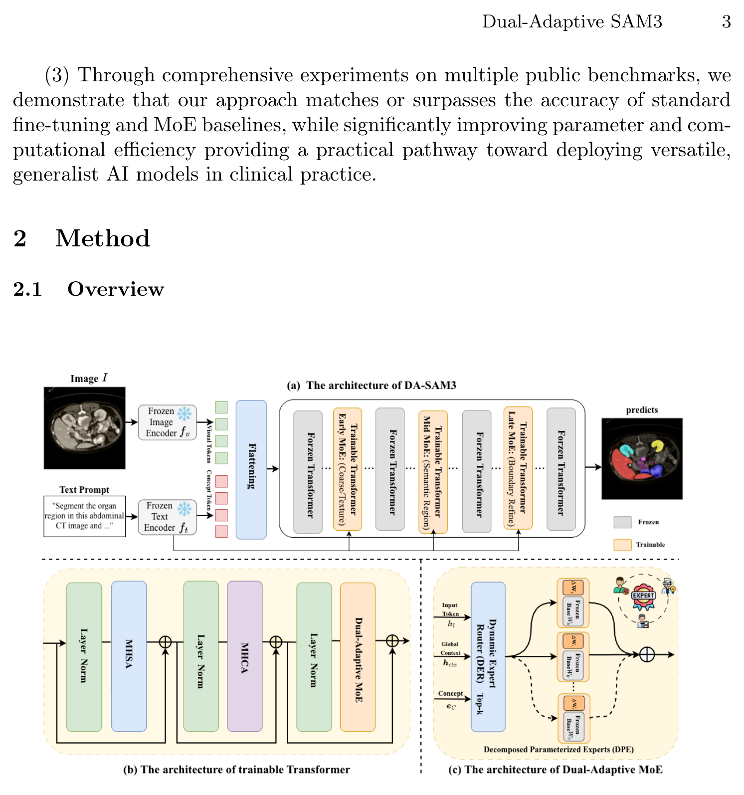

## 一、论文出处

- 论文：Dual-Adaptive SAM3: Hierarchical Routing over Low-Rank Expert Layers for Parameter-Efficient Medical Image Segmentation
- 会议：MICCAI 2026
- 链接：https://arxiv.org/abs/2607.02571v1

先说清楚定位：DA-SAM3 本身是一个把 SAM3 适配到医学分割的完整框架，整篇讲它就跑偏了。这个合集只收「能单独抠出来、塞进 U-Net 的 nn.Module」。这篇里符合这个标准的可插拔子模块，是它做参数高效适配的核心——**低秩专家层上的层级路由块**，下文简称 **Dual**。它干的事是：把一组低秩（LoRA 式）专家按输入内容动态加权组合，替代"整层全量微调"或"标准 MoE 全专家激活"这两种做法。框架整体（SAM3 主干、文本交互、多尺度解码）这里只当背景，一句带过。

## 二、模块图（截自论文原文）



图注解读：输入特征先经过一个轻量路由网络算出各专家的权重，再对若干低秩专家分支的输出做加权求和；路由是"层级"的，即不同深度的模块各自独立路由，而不是全局共享一套权重。关键点在于专家本身是低秩的（参数量小），且每次只做加权组合而非稀疏激活，所以既省参数又没有标准 MoE 的调度开销。

## 三、核心思想与作用

医学图像分割的痛点很具体：数据量小、模态杂（CT/MRI/超声）、标注贵。拿一个视觉-语言大模型直接全量微调，参数效率极低，小数据集上还容易过拟合；换成标准 MoE，虽然参数效率上去了，但 top-k 路由 + 专家并行的计算和显存开销在临床部署里很难接受。

Dual 的思路是两头都绕开：

1. **专家低秩化**。每个专家不是一整层，而是一对低秩矩阵（降维再升维），单专家参数量被压到很小。多个这样的专家加起来，仍远小于全量微调。
2. **稠密加权而非稀疏激活**。路由输出一组权重，对所有专家输出做加权和。没有 top-k 选择，没有 token 分发，实现上就是一个 `einsum`，GPU 上很友好。
3. **层级路由**。每个插入点有自己的路由网络，浅层和深层可以学到不同的专家组合偏好。这比全局一套路由更贴合分割任务里"浅层管纹理、深层管语义"的实际。

对即插即用来说，它的价值在于：**它是一个纯特征到特征的模块**，输入输出同形状，不依赖 SAM3 的任何接口，也不依赖文本分支。你把它当成一个"带条件加权的残差块"塞进任何 CNN/Transformer 分割网络的瓶颈或解码阶段都行。这是它能进这个合集的原因。

## 四、在 U-Net 里的插入位置

给几个实际可用的位置，按推荐程度排：

- **编码器瓶颈（bottleneck）**：最推荐。这里通道数最大、语义最集中，低秩专家能发挥的空间最大，加参数也最划算。
- **解码器每个上采样块之后**：次推荐。可以让不同分辨率各自路由，但要注意浅层特征图大，路由网络别做太重。
- **跳跃连接汇合处**：可选。用来做跨层特征的动态融合，但收益不如前两个位置稳定。

不建议放在最浅的一两层：那里特征图分辨率高、通道少，低秩专家能压缩的维度有限，路由网络反而成了额外负担。

## 五、复现代码（PyTorch，逐行中文注释）

下面是一个可直接用的 `Dual` 模块。设计上对齐论文描述：低秩专家 + 稠密路由加权 + 残差。为了即插即用，输入输出形状完全一致。

```python
import torch
import torch.nn as nn
import torch.nn.functional as F


class LowRankExpert(nn.Module):
    """单个低秩专家：先降维再升维，等价于一个低秩约束的线性变换。"""

    def __init__(self, dim, rank):
        super().__init__()
        # 降维投影：dim -> rank，把特征压到低秩子空间
        self.down = nn.Linear(dim, rank, bias=False)
        # 升维投影：rank -> dim，再映射回原空间
        self.up = nn.Linear(rank, dim, bias=False)
        # 低秩分支初始化为接近 0，保证插入时不破坏原网络行为
        nn.init.zeros_(self.up.weight)

    def forward(self, x):
        # x: (B, N, C)，N 为空间位置数（H*W 或 token 数）
        return self.up(self.down(x))


class Dual(nn.Module):
    """低秩专家 + 层级路由的即插即用模块。

    输入输出形状一致 (B, C, H, W)，可直接替换任意卷积/注意力块。
    """

    def __init__(self, dim, num_experts=4, rank=8, reduction=4):
        super().__init__()
        self.dim = dim
        self.num_experts = num_experts

        # 一组低秩专家，每个专家参数量为 2*dim*rank，远小于全量微调
        self.experts = nn.ModuleList(
            [LowRankExpert(dim, rank) for _ in range(num_experts)]
        )

        # 路由网络：全局池化 -> 小 MLP -> 每个专家一个权重
        hidden = max(dim // reduction, num_experts)
        self.router = nn.Sequential(
            nn.Linear(dim, hidden),   # 压缩到隐层
            nn.GELU(),                # 非线性，让路由能表达输入相关的偏好
            nn.Linear(hidden, num_experts),  # 输出 num_experts 个 logit
        )

        # 输出前的归一化，稳定训练
        self.norm = nn.LayerNorm(dim)

    def forward(self, x):
        # 记录原始输入，用于残差
        identity = x

        # 支持 (B, C, H, W) 和 (B, N, C) 两种布局
        if x.dim() == 4:
            B, C, H, W = x.shape
            # 转成 (B, N, C) 以便用 Linear 处理
            x = x.flatten(2).transpose(1, 2)  # (B, H*W, C)
        else:
            B, N, C = x.shape
            H = W = None

        # 路由：对空间维做平均池化，得到每个样本的全局描述子
        pooled = x.mean(dim=1)                # (B, C)
        logits = self.router(pooled)          # (B, num_experts)
        weights = F.softmax(logits, dim=-1)   # (B, num_experts)，稠密权重

        # 所有专家输出堆叠：每个专家对 (B, N, C) 做低秩变换
        expert_outs = torch.stack(
            [expert(x) for expert in self.experts], dim=1
        )  # (B, num_experts, N, C)

        # 用路由权重对专家输出做加权求和（稠密组合，无 top-k 分发）
        w = weights.view(B, self.num_experts, 1, 1)  # 广播用
        out = (expert_outs * w).sum(dim=1)           # (B, N, C)

        # 归一化 + 残差，保证模块可安全插入
        out = self.norm(out) + identity

        # 还原回原始布局
        if H is not None:
            out = out.transpose(1, 2).reshape(B, C, H, W)
        return out
```

几个实现上的取舍说明：

- 路由用**全局平均池化**而不是逐 token 路由。逐 token 路由更细粒度，但会引入类似 MoE 的调度复杂度，且医学图像里同一张图的局部语义通常一致，全局路由够用且更稳。
- 专家输出用 `stack` 后加权求和，而不是循环累加。前者在专家数不多时更清晰，也方便后续改成向量化实现。
- `up` 权重初始化为 0，配合残差，模块刚插入时等价于恒等映射，不会一上来就把预训练权重带崩。

## 六、插入示例（几行塞进你的网络）

假设你有一个标准 U-Net，想在瓶颈处插一个 Dual：

```python
class UNetBottleneck(nn.Module):
    def __init__(self, in_ch=512, out_ch=512):
        super().__init__()
        self.conv1 = nn.Conv2d(in_ch, out_ch, 3, padding=1)
        self.bn1 = nn.BatchNorm2d(out_ch)
        self.relu = nn.ReLU(inplace=True)
        # 在瓶颈处插入 Dual，通道数与特征一致
        self.dual = Dual(dim=out_ch, num_experts=4, rank=8)

    def forward(self, x):
        x = self.relu(self.bn1(self.conv1(x)))
        x = self.dual(x)   # 一行接入，形状不变
        return x
```

如果是 Transformer 风格的解码器，特征已经是 `(B, N, C)`，直接：

```python
self.dual = Dual(dim=256, num_experts=4, rank=16)
# forward 里
x = self.dual(x)   # (B, N, C) -> (B, N, C)
```

替换或并联都行。并联的话把 `self.dual(x)` 和原分支输出相加即可，因为模块内部已经带了残差，再并联要注意别重复加。

## 七、实测经验与注意点

定性地说几点，具体数值以你自己任务为准：

- **专家数不是越多越好**。`num_experts=4` 是个稳妥起点。专家数增加时，路由网络要区分的模式变多，小数据集上路由容易退化成"平均分配"，此时多出来的专家基本是白加参数。
- **rank 要和通道数匹配**。瓶颈处通道 512、rank 取 8~16 比较合适；如果通道只有 64，rank 取 8 已经接近满秩，低秩的意义就没了。经验上 `rank ≈ dim / 32` 到 `dim / 16` 之间。
- **路由的 reduction 别设太小**。路由隐层如果压得太狠，权重分布会趋于均匀，失去"自适应"的意义。代码里用 `max(dim // reduction, num_experts)` 兜了个底。
- **初始化很关键**。`up` 置零 + 残差，能保证插入即恒等。如果你改成随机初始化，训练初期 loss 会明显抖动。
- **显存**。稠密加权意味着所有专家都要算一遍，专家数 × rank 直接反映在显存上。相比标准 MoE 的稀疏激活，这是它用计算换实现简单的地方，部署前算清楚。
- **和 BatchNorm 的配合**。模块内部用了 LayerNorm，如果外层还有 BN，注意两者叠加时的数值稳定性，必要时把内部 norm 换成 Identity 试一下。

## 八、完整工程

把上面的 `LowRankExpert` 和 `Dual` 存成一个 `dual.py`，就可以在任何分割网络里 `from dual import Dual` 直接用。建议的工程组织：

```
your_project/
├── modules/
│   ├── __init__.py
│   └── dual.py          # 本文的 Dual 模块
├── models/
│   └── unet.py          # 你的 U-Net，import Dual 插入
└── train.py
```

`__init__.py` 里导出一下，方便统一引用：

```python
from .dual import Dual, LowRankExpert

__all__ = ["Dual", "LowRankExpert"]
```

这样这个模块就和你网络的其他部分解耦了：想换位置、换专家数、换 rank，都只动配置，不动主干代码。这也是它作为即插即用模块最实际的价值。
