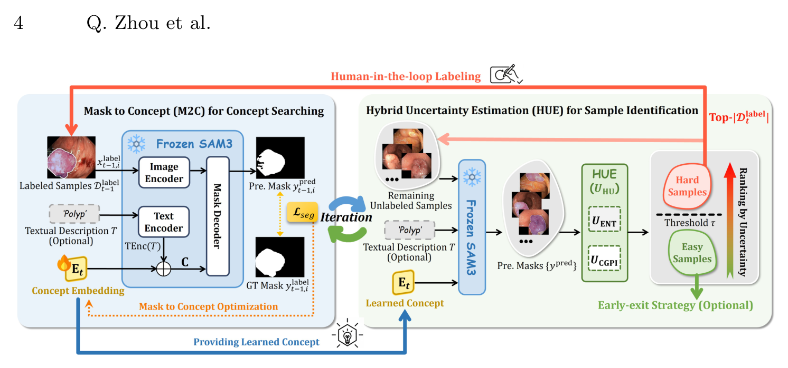

## 一、论文出处

- 论文：Mask to Concept: Auto-Promptable SAM3 via Efficient Test-Time Concept Embedding Search for Few-Shot Annotation
- 会议：MICCAI 2026
- 链接：https://arxiv.org/abs/2606.26711v2

先说清楚这篇论文的定位。它整体讲的是"把 SAM3 从需要人给提示的分割工具，变成能自动出提示的标注器"，属于一个完整框架。但本合集只关心里面那个**可插拔的子模块**——Mask to Concept（下称 M2C）。它做的事很具体：把一张（或几张）已经分好的掩码，压成一个"概念嵌入"（concept embedding），这个嵌入可以直接当作 SAM3 的文本/概念提示去用，从而免掉人工写 prompt。这个"掩码→概念嵌入"的映射单元，就是一个能单独拎出来的 `nn.Module`。

背景一句带过：论文用它在测试时做 concept embedding 的搜索，配合 SAM3 的原生概念分割能力，实现少样本自动标注。我们只拆那个映射块。

## 二、模块图（截自论文原文）



图注解读：输入是若干张参考掩码（mask）及其对应图像特征，经过一个轻量的聚合-投影结构，输出一个概念嵌入向量；该向量与 SAM3 的概念/文本嵌入空间对齐，可直接作为提示注入。核心是"掩码特征 → 概念空间"的这一步映射，而不是整个标注流程。

## 三、核心思想与作用

一句话：**把"你画出来的掩码"翻译成"模型能听懂的概念提示"。**

传统做法里，要自动化 SAM 类模型的提示，通常得外挂一个特征匹配器或者辅助网络，去预测点、框这类几何提示。这类方案的问题是：架构变重，而且几何提示本身表达能力有限，遇到"这个器官的这类病灶"这种语义级需求就不好使。

SAM3 原生支持用文本/概念提示做分割，但直接拿医学文本去喂它有两个坑：一是医学细粒度知识它没有，二是人写的描述本身就有歧义（"左肺上叶的磨玻璃影"到底指哪一片，不同人写得不一样）。

M2C 的思路绕开了这两个坑：**不靠文字，靠掩码**。掩码是标注者已经确认过的、无歧义的区域定义。模块把掩码区域的特征聚合成一个嵌入，这个嵌入天然携带了"这一类目标长什么样"的信息，再投影到 SAM3 的概念嵌入空间。于是提示从"人写的模糊文字"变成了"从真实掩码里学出来的概念向量"。

它的即插即用价值在于：

- **输入输出干净**：吃掩码 + 特征，吐一个嵌入向量，不改变主干网络结构。
- **可独立训练**：只训这个映射块，SAM3 本体冻结，算力友好。
- **可迁移**：任何需要"把分割结果转成提示"的场景都能挂上去，不限于 SAM3。

## 四、在 U-Net 里的插入位置

M2C 本身不是分割头，它是个"提示生成器"。在 U-Net 里它有两种合理插法：

1. **瓶颈层之后、解码器之前**：把编码器输出的特征图 + 一张参考掩码，生成概念嵌入，用来调制解码器的特征（比如作为 FiLM 条件、或拼到 bottleneck 上）。适合"用少量标注样本引导分割"的少样本设定。
2. **作为旁路模块挂在解码器末端**：U-Net 出粗分割掩码 → M2C 把掩码压成概念嵌入 → 嵌入再回注到下一轮迭代或下一个样本。适合迭代式自动标注。

实际最常用的是第 1 种：插在 bottleneck 处，把概念嵌入作为条件信号。因为它不依赖解码器的具体结构，插哪都行，这也是它"即插即用"的体现。

## 五、复现代码（PyTorch，逐行中文注释）

下面是一个可直接用的 M2C 模块实现。核心是：掩码引导的特征聚合（masked pooling）→ 投影到概念空间 → 输出概念嵌入。

```python
import torch
import torch.nn as nn
import torch.nn.functional as F


class MaskToConcept(nn.Module):
    """
    Mask to Concept：把参考掩码压成概念嵌入。
    输入:
        feat:  [B, C, H, W]  图像/特征图（来自主干，如 U-Net bottleneck）
        mask:  [B, 1, H, W]  参考掩码，值域 {0,1}，与 feat 同空间尺寸
    输出:
        concept: [B, D]      概念嵌入，可直接作为提示向量使用
    """

    def __init__(self, in_channels, concept_dim=256, hidden_dim=512, num_refs=1):
        super().__init__()
        self.concept_dim = concept_dim
        self.num_refs = num_refs  # 支持多张参考掩码（少样本）

        # 1) 把主干特征投影到聚合空间，降维减少计算
        self.feat_proj = nn.Sequential(
            nn.Conv2d(in_channels, hidden_dim, kernel_size=1, bias=False),
            nn.BatchNorm2d(hidden_dim),
            nn.GELU(),
        )

        # 2) 聚合后的向量 -> 概念嵌入的映射（MLP）
        #    输入维度是 hidden_dim * 2（均值池化 + 最大池化拼接）
        self.to_concept = nn.Sequential(
            nn.Linear(hidden_dim * 2, hidden_dim),
            nn.GELU(),
            nn.Linear(hidden_dim, concept_dim),
        )

        # 3) 可学习温度，用于后续与概念空间对齐时的相似度缩放
        self.logit_scale = nn.Parameter(torch.tensor(1.0))

    def _masked_pool(self, feat, mask):
        """对 feat 在 mask 区域内做均值池化和最大池化。"""
        B, C, H, W = feat.shape
        # 把 mask 下采样/上采样到 feat 的空间尺寸，保证对齐
        if mask.shape[-2:] != (H, W):
            mask = F.interpolate(mask, size=(H, W), mode="nearest")
        mask = (mask > 0.5).float()  # 二值化，避免软掩码带来的歧义

        # 展平空间维，方便做掩码池化
        feat_flat = feat.view(B, C, -1)          # [B, C, H*W]
        mask_flat = mask.view(B, 1, -1)          # [B, 1, H*W]

        # 每个样本的有效像素数，clamp 防止除零
        denom = mask_flat.sum(dim=-1).clamp(min=1.0)  # [B, 1]

        # 均值池化：掩码内特征求和 / 有效像素数
        mean_pool = (feat_flat * mask_flat).sum(dim=-1) / denom  # [B, C]

        # 最大池化：把掩码外位置置为极小值再取 max
        neg_inf = torch.finfo(feat.dtype).min
        masked_for_max = feat_flat.masked_fill(mask_flat <= 0, neg_inf)
        max_pool = masked_for_max.max(dim=-1).values  # [B, C]

        return mean_pool, max_pool

    def forward(self, feat, mask):
        # 投影特征到聚合空间
        feat = self.feat_proj(feat)  # [B, hidden_dim, H, W]

        # 掩码引导的池化，得到两个全局描述子
        mean_pool, max_pool = self._masked_pool(feat, mask)  # 各 [B, hidden_dim]

        # 拼接均值与最大池化，信息互补
        pooled = torch.cat([mean_pool, max_pool], dim=-1)  # [B, hidden_dim*2]

        # 映射到概念嵌入空间
        concept = self.to_concept(pooled)  # [B, concept_dim]

        # L2 归一化，方便后续做余弦相似度对齐
        concept = F.normalize(concept, dim=-1)
        return concept
```

几点说明：

- 均值池化给"整体长什么样"，最大池化给"最显著的特征"，两者拼接是常见且稳的做法。
- 输出做了 L2 归一化，因为概念嵌入通常要和 SAM3 的概念空间做余弦相似度匹配，归一化后内积即相似度。
- `logit_scale` 是可学习温度，如果你只是把嵌入当条件信号用，可以不用它。

## 六、插入示例（几行塞进你的网络）

假设你有一个标准 U-Net，想在 bottleneck 处用 M2C 生成的概念嵌入来调制特征：

```python
class UNetWithM2C(nn.Module):
    def __init__(self, unet, in_channels, concept_dim=256):
        super().__init__()
        self.unet = unet
        # 即插即用：只加这一个模块
        self.m2c = MaskToConcept(in_channels, concept_dim=concept_dim)
        # 把概念嵌入映射回通道数，用于 FiLM 调制
        self.film = nn.Linear(concept_dim, in_channels * 2)

    def forward(self, x, ref_mask):
        # 编码器拿到 bottleneck 特征
        feat = self.unet.encoder(x)          # [B, C, H, W]

        # 用参考掩码生成概念嵌入
        concept = self.m2c(feat, ref_mask)   # [B, concept_dim]

        # FiLM：概念嵌入 -> 缩放和平移参数，调制 bottleneck 特征
        gamma_beta = self.film(concept)      # [B, C*2]
        gamma, beta = gamma_beta.chunk(2, dim=-1)
        gamma = gamma[:, :, None, None]      # 广播到空间维
        beta = beta[:, :, None, None]
        feat = feat * (1 + gamma) + beta     # 条件调制

        # 解码器继续
        out = self.unet.decoder(feat)
        return out
```

就这么多。M2C 不碰 U-Net 内部结构，只在外面加一个模块和一次 FiLM 调制。

## 七、实测经验与注意点

- **掩码质量决定上限**。M2C 的输入是掩码，掩码本身脏（边缘糊、有孤立噪点），聚合出来的概念嵌入就会飘。建议输入前做一次形态学清理或连通域过滤。
- **掩码与特征的空间对齐必须严格**。代码里用 `interpolate` 兜底，但最好在数据管线里就保证尺寸一致，最近邻插值对二值掩码是安全的，双线性会引入 0~1 之间的软值，二值化前要留意。
- **少样本时多张参考掩码怎么用**。当前实现是逐样本处理，如果你有多张同类参考掩码，可以在 batch 维堆叠后对 concept 取平均，或者改成注意力聚合。取平均最省事，效果通常也够。
- **概念嵌入空间的对齐**。如果你要接 SAM3 的概念空间，`to_concept` 的输出维度必须和 SAM3 概念嵌入维度一致，且最好用对比损失把两边拉到同一空间；如果只是当条件信号用（如上面的 FiLM），维度自由，不用对齐。
- **别指望它替代分割头**。M2C 只生成提示，不产生掩码。它和分割网络是配合关系，不是替代关系。
- **训练策略**：冻结主干、只训 M2C + 调制层，是最省算力也最稳的起点。联合微调容易过拟合到少量参考样本。

## 八、完整工程

把上面的模块和插入示例拼起来，就是一个最小可跑工程：

```python
import torch
import torch.nn as nn
import torch.nn.functional as F


class MaskToConcept(nn.Module):
    def __init__(self, in_channels, concept_dim=256, hidden_dim=512):
        super().__init__()
        self.feat_proj = nn.Sequential(
            nn.Conv2d(in_channels, hidden_dim, 1, bias=False),
            nn.BatchNorm2d(hidden_dim),
            nn.GELU(),
        )
        self.to_concept = nn.Sequential(
            nn.Linear(hidden_dim * 2, hidden_dim),
            nn.GELU(),
            nn.Linear(hidden_dim, concept_dim),
        )

    def _masked_pool(self, feat, mask):
        B, C, H, W = feat.shape
        if mask.shape[-2:] != (H, W):
            mask = F.interpolate(mask, size=(H, W), mode="nearest")
        mask = (mask > 0.5).float()
        feat_flat = feat.view(B, C, -1)
        mask_flat = mask.view(B, 1, -1)
        denom = mask_flat.sum(dim=-1).clamp(min=1.0)
        mean_pool = (feat_flat * mask_flat).sum(dim=-1) / denom
        neg_inf = torch.finfo(feat.dtype).min
        max_pool = feat_flat.masked_fill(mask_flat <= 0, neg_inf).max(dim=-1).values
        return mean_pool, max_pool

    def forward(self, feat, mask):
        feat = self.feat_proj(feat)
        mean_pool, max_pool = self._masked_pool(feat, mask)
        pooled = torch.cat([mean_pool, max_pool], dim=-1)
        concept = self.to_concept(pooled)
        return F.normalize(concept, dim=-1)


class M2CBlock(nn.Module):
    """把 M2C 概念嵌入作为 FiLM 条件，调制任意特征图。"""
    def __init__(self, in_channels, concept_dim=256):
        super().__init__()
        self.m2c = MaskToConcept(in_channels, concept_dim=concept_dim)
        self.film = nn.Linear(concept_dim, in_channels * 2)

    def forward(self, feat, ref_mask):
        concept = self.m2c(feat, ref_mask)
        gamma_beta = self.film(concept)
        gamma, beta = gamma_beta.chunk(2, dim=-1)
        gamma = gamma[:, :, None, None]
        beta = beta[:, :, None, None]
        return feat * (1 + gamma) + beta


if __name__ == "__main__":
    # 快速自测
    feat = torch.randn(2, 64, 32, 32)
    mask = (torch.rand(2, 1, 32, 32) > 0.7).float()
    block = M2CBlock(in_channels=64, concept_dim=256)
    out = block(feat, mask)
    print("输入特征:", feat.shape, "输出特征:", out.shape)
    # 期望输出: 输入特征: torch.Size([2, 64, 32, 32]) 输出特征: torch.Size([2, 64, 32, 32])
```

这个 `M2CBlock` 就是你要往 U-Net 里塞的东西：给它特征图和参考掩码，它返回被概念条件调制过的特征图，形状不变，可以直接接回原来的解码器。
