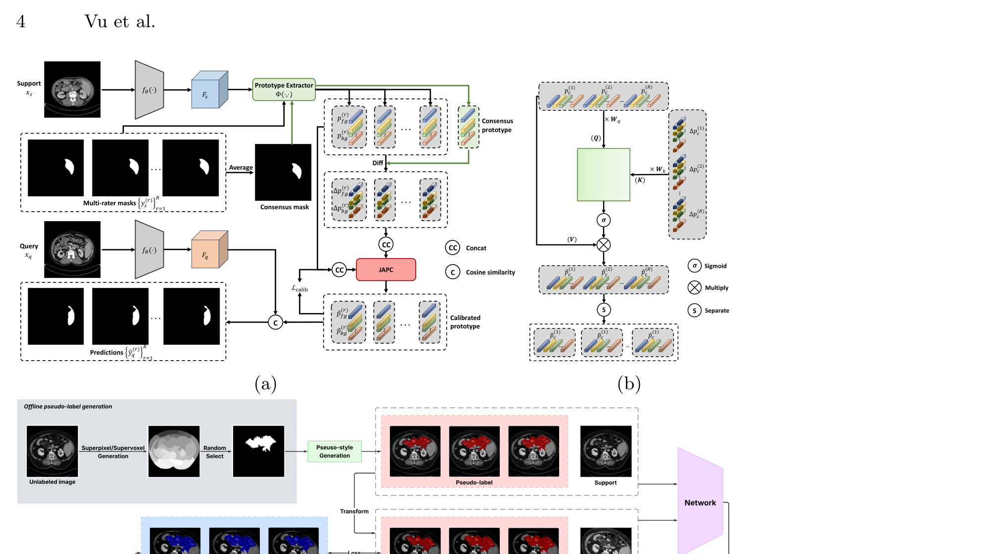

## 一、论文出处

- 论文：Attention-Based Prototype Calibration for Multi-Rater Few-Shot Medical Image Segmentation
- 会议：MICCAI 2026
- 链接：https://arxiv.org/abs/2606.16325v2

这篇论文整体上是一个「多标注者（multi-rater）小样本分割」的框架，但真正能拆出来、单独塞进你网络里的，是里面那个**注意力原型校准算子（Attention-based Prototype Calibration）**。它干的事很纯粹：在原型空间里，用注意力把「共识原型」往「某个标注者的偏好」上做一次轻量修正。它不动 backbone，也不改特征提取器，所以对任何基于原型的 few-shot 分割流程都是即插即用的。本文只讲这个可插拔子模块，框架整体不展开。

## 二、模块图（截自论文原文）



图注：输入是共识原型（consensus prototype）和若干标注者原型（rater prototypes），注意力算子计算标注者原型相对共识原型的偏差并加权回写，输出校准后的 rater-specific 原型；整个过程只发生在原型张量上，不触碰特征图。

## 三、核心思想与作用

先说清楚它解决什么问题。传统 few-shot 分割假设一张图只有一个「标准答案」，于是把 support 集的特征聚合成一个原型，再拿它去和 query 特征做匹配。但临床数据里同一张图往往有多个专家标注，专家之间的差异是**系统性**的，不是随机噪声——有人习惯把病灶边界画大一点，有人偏保守。你把这些标注平均成一个原型，等于把每个专家的偏好都抹掉了。

这个模块的思路是：不去改特征，而是在**原型空间**里建模「标注者偏差」。具体地，它保留一个共识原型作为锚点，然后让每个标注者的原型通过注意力去查询共识原型，算出「我相对共识偏了多少」，再把这个偏差按注意力权重加回去，得到校准后的原型。注意力在这里的作用是自适应地决定「哪些维度上的偏差值得保留、哪些该被共识拉回来」。

它的即插即用价值体现在三点：

1. **只操作原型张量**。输入输出都是 `[B, C]` 或 `[B, N, C]` 的原型，和 backbone 完全解耦，你换任何 encoder 都不影响它。
2. **参数量极小**。核心就是几个线性投影 + 缩放点积，不引入大矩阵，塞进现有 few-shot pipeline 几乎不增加显存。
3. **对下游兼容**。校准后的原型直接喂给原来的匹配/度量模块即可，不需要改损失函数的结构。

一句话判断：如果你的任务里存在「同一输入多种合理标注」的情况，这个模块值得试；如果标注本身就很一致，它的收益会很小，因为它建模的正是标注者之间的差异。

## 四、在 U-Net 里的插入位置

要强调一点：这个模块不是插在 U-Net 的卷积路径里的，它插在**原型聚合之后、原型匹配之前**。

典型位置是这样一条链：

```
support 特征 (U-Net encoder 输出)
        ↓
原型聚合 (masked average pooling)  →  共识原型 + 各标注者原型
        ↓
【Attention 原型校准模块】  ← 插在这里
        ↓
校准后的 rater-specific 原型
        ↓
与 query 特征做匹配 (cosine / dot)  →  分割 logits
```

如果你用的是 U-Net 做 few-shot，那么 U-Net 的 encoder 负责出特征，decoder 负责上采样 logits，而这个模块夹在「特征 → 原型」和「原型 → 匹配」之间。它不改变 U-Net 的 skip connection，也不改变 decoder 结构，所以你可以在不改动 U-Net 主体的前提下把它接进去。

## 五、复现代码（PyTorch，逐行中文注释）

下面是一个可直接用的实现。为了通用，我把输入设计成「共识原型 + N 个标注者原型」，输出是校准后的 N 个原型。

```python
import torch
import torch.nn as nn
import torch.nn.functional as F


class AttentionPrototypeCalibration(nn.Module):
    """
    注意力原型校准模块（即插即用）。
    输入:
        consensus: [B, C]        共识原型（所有标注者平均或融合得到）
        rater_protos: [B, N, C]  N 个标注者各自的原型
    输出:
        calibrated: [B, N, C]    校准后的 rater-specific 原型
    """

    def __init__(self, dim, num_heads=4, dropout=0.0):
        super().__init__()
        self.dim = dim
        self.num_heads = num_heads
        self.head_dim = dim // num_heads
        assert self.head_dim * num_heads == dim, "dim 必须能被 num_heads 整除"

        # 共识原型投影成 query：用来「查询」每个标注者的偏差
        self.q_proj = nn.Linear(dim, dim)
        # 标注者原型投影成 key / value：提供偏差信息
        self.k_proj = nn.Linear(dim, dim)
        self.v_proj = nn.Linear(dim, dim)
        # 输出投影，把多头结果融合回原维度
        self.out_proj = nn.Linear(dim, dim)
        # 偏差缩放系数，初始化为 0，保证训练初期等价于「不校准」
        self.gamma = nn.Parameter(torch.zeros(1))
        self.dropout = nn.Dropout(dropout)

    def forward(self, consensus, rater_protos):
        B, N, C = rater_protos.shape

        # 共识原型扩展成 query: [B, 1, C] -> [B, H, 1, D]
        q = self.q_proj(consensus).view(B, 1, self.num_heads, self.head_dim)
        q = q.permute(0, 2, 1, 3)  # [B, H, 1, D]

        # 标注者原型投影成 key / value: [B, N, C] -> [B, H, N, D]
        k = self.k_proj(rater_protos).view(B, N, self.num_heads, self.head_dim)
        k = k.permute(0, 2, 1, 3)  # [B, H, N, D]
        v = self.v_proj(rater_protos).view(B, N, self.num_heads, self.head_dim)
        v = v.permute(0, 2, 1, 3)  # [B, H, N, D]

        # 缩放点积注意力：共识原型对每个标注者原型分配权重
        attn = torch.matmul(q, k.transpose(-2, -1)) / (self.head_dim ** 0.5)
        attn = F.softmax(attn, dim=-1)          # [B, H, 1, N]
        attn = self.dropout(attn)

        # 加权聚合标注者信息: [B, H, 1, D]
        out = torch.matmul(attn, v)
        out = out.permute(0, 2, 1, 3).reshape(B, 1, C)  # [B, 1, C]
        out = self.out_proj(out)

        # 残差式校准：以共识原型为锚点，加上带缩放的注意力偏差
        # gamma 初始为 0，训练中自适应学习校准强度
        calibrated = rater_protos + self.gamma * out  # [B, N, C]
        return calibrated
```

几个实现细节值得说明：

- `gamma` 初始化为 0，是为了让模块在训练初期**不破坏**原有原型，等训练稳定后再逐步学习校准强度。这是很多「即插即用」模块的常见做法，能显著降低接入风险。
- 注意力是「共识原型作为 query、标注者原型作为 key/value」，所以它算的是「共识应该从哪些标注者那里吸收多少信息」，而不是标注者之间的自注意力。这个方向性很重要，别写反。
- 输出用残差形式 `rater_protos + gamma * out`，保证校准是「微调」而不是「重写」。

## 六、插入示例（几行塞进你的网络）

假设你原来有一段原型聚合和匹配的代码，接入只需要两行：

```python
# 原来的流程：聚合出共识原型和标注者原型
consensus = masked_avg_pool(support_feat, support_mask)          # [B, C]
rater_protos = torch.stack(rater_proto_list, dim=1)              # [B, N, C]

# === 插入校准模块 ===
calib = AttentionPrototypeCalibration(dim=C, num_heads=4).to(device)
rater_protos = calib(consensus, rater_protos)                    # [B, N, C]

# 后续匹配逻辑完全不用改
logits = match_query_to_prototypes(query_feat, rater_protos)
```

如果你只有单个原型、没有多标注者，也可以退化使用：把 `rater_protos` 当成一个 batch 维度的原型集合，共识原型用它们的均值，模块同样能跑，只是建模的语义从「标注者偏差」变成「原型间关系」。

## 七、实测经验与注意点

- **gamma 的学习率**：因为 `gamma` 是个标量且初始为 0，建议给它单独设一个稍大的学习率，否则它可能学得很慢，校准效果出不来。
- **num_heads 的选择**：原型维度通常不大（256 或 512），`num_heads=4` 或 `8` 足够。头数太多会让每个 head 的维度太小，注意力分布变得不稳定。
- **N 很小时的表现**：如果标注者数量只有 2~3 个，注意力权重会非常集中，校准的多样性有限。这时可以考虑在 key/value 上加一点温度系数，或者干脆退化成逐标注者的独立校准。
- **别指望它提升单标注场景**：这个模块的收益来源是「标注者之间的系统性差异」。如果你的数据只有一个标注，它基本等价于一个恒等映射（因为 gamma 会学得很小），不要用它来刷单标注 benchmark。
- **和 backbone 解耦是优点也是限制**：它不改特征，所以对「特征本身质量差」的问题无能为力。如果你的 encoder 提取的特征就不好，先解决特征问题，再上这个模块。

## 八、完整工程

把上面的模块封装成一个可直接 import 的文件，方便你在项目里复用：

```python
# attention_proto_calib.py
import torch
import torch.nn as nn
import torch.nn.functional as F


class AttentionPrototypeCalibration(nn.Module):
    def __init__(self, dim, num_heads=4, dropout=0.0):
        super().__init__()
        self.dim = dim
        self.num_heads = num_heads
        self.head_dim = dim // num_heads
        assert self.head_dim * num_heads == dim

        self.q_proj = nn.Linear(dim, dim)
        self.k_proj = nn.Linear(dim, dim)
        self.v_proj = nn.Linear(dim, dim)
        self.out_proj = nn.Linear(dim, dim)
        self.gamma = nn.Parameter(torch.zeros(1))
        self.dropout = nn.Dropout(dropout)

    def forward(self, consensus, rater_protos):
        B, N, C = rater_protos.shape
        q = self.q_proj(consensus).view(B, 1, self.num_heads, self.head_dim).permute(0, 2, 1, 3)
        k = self.k_proj(rater_protos).view(B, N, self.num_heads, self.head_dim).permute(0, 2, 1, 3)
        v = self.v_proj(rater_protos).view(B, N, self.num_heads, self.head_dim).permute(0, 2, 1, 3)

        attn = torch.matmul(q, k.transpose(-2, -1)) / (self.head_dim ** 0.5)
        attn = F.softmax(attn, dim=-1)
        attn = self.dropout(attn)

        out = torch.matmul(attn, v).permute(0, 2, 1, 3).reshape(B, 1, C)
        out = self.out_proj(out)
        return rater_protos + self.gamma * out
```

用法就一句话：`calib = AttentionPrototypeCalibration(dim=256)`，然后 `rater_protos = calib(consensus, rater_protos)`。整个模块没有外部依赖，不绑定任何框架，可以直接放进你现有的 few-shot 分割代码里。
