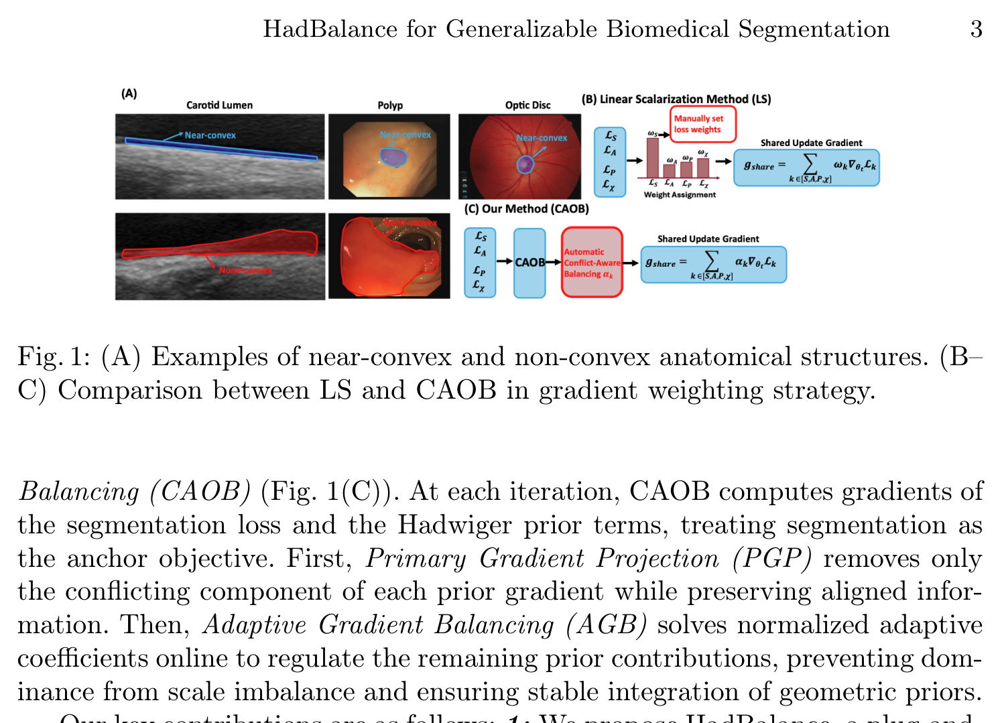

## 一、论文出处

HadBalance 出自 MICCAI 2026 的论文 *HadBalance: A Plug-and-Play Unified Global Geometric Prior Framework for Generalizable Biomedical Segmentation*（arXiv:2606.15976v1）。

先把定位说清楚：这篇论文对外呈现的是一个"统一全局几何先验框架"，但它真正能拆出来、单独塞进你现有网络里的，是一个**几何先验平衡块**——本文只讲这个块。框架整体（怎么训练、怎么多任务协同）不是本合集的范围，一句带过：它想用一套统一的几何约束去覆盖边界、形状、拓扑这些线索，而不是每个任务单独设计一种。

这个块要解决的问题很具体：医学分割目标（器官、病灶、腺体）在全局上大多**近似凸**。凸的定义就是区域内任意两点连线仍落在区域内。但真实标注里总有一些小的局部凹陷——血管出入、器官贴邻、病灶边缘不规则。纯凸约束会把该有的凹陷抹平，纯数据驱动又容易在弱边界处漏掉整体形状。HadBalance 的思路是：不硬性要求凸，而是用一个可插拔的模块去**度量并平衡"全局凸性"与"局部凹陷"**，把几何先验作为一路特征/损失注入网络，而不是替换网络。

## 二、模块图（截自论文原文）



图注解读：输入特征先经过一路全局几何分支估计近凸包络，另一路保留原始局部响应，两者通过平衡系数融合后回注主干；平衡系数决定"信几何先验"还是"信局部证据"。

## 三、核心思想与作用

一句话：**把"目标近似凸"这个弱先验，做成一个可微、可插拔、带自适应平衡的模块，而不是写死的后处理。**

拆成三点：

1. **全局几何分支**。对特征图估计一个近凸的包络表示。做法上通常是对前景响应做某种可微的凸化/包络近似（比如对空间维度做软最大或对边界做平滑约束），得到一个"如果目标完全凸应该长什么样"的参考。

2. **局部证据分支**。就是原始特征本身，保留真实的凹陷、尖角、细结构。

3. **平衡机制**。这是模块名字里的 "Balance"。它不固定融合权重，而是根据当前特征自适应地决定在哪些位置、哪个通道上更信几何先验。弱边界、噪声大的地方偏向几何先验来稳住整体形状；边界清晰、局部证据强的地方偏向原始特征，避免把真实凹陷抹掉。

**为什么有效（定性）**：医学分割的失败模式里，很大一类是"整体形状对、局部塌陷"或"局部对、整体漂移"。纯 CNN 没有显式的全局形状概念，纯凸约束又过强。HadBalance 相当于给网络加了一个"全局形状的软锚点"，且这个锚点是可学习的、可关掉的，所以插到哪都不会破坏原有表达能力。它的价值不在刷某个数据集，而在**跨器官、跨模态的泛化**——因为"近似凸"这个先验本身不依赖具体任务。

## 四、在 U-Net 里的插入位置

HadBalance 是特征级模块，输入输出同形状，所以插入位置很灵活。推荐三处：

- **编码器各 stage 之后**：在浅层稳住大尺度形状，抑制背景误响应。
- **瓶颈层（bottleneck）之后**：这里感受野最大，全局几何先验最有用，性价比最高。**首选**。
- **解码器 skip 融合之后**：在恢复分辨率的同时约束整体轮廓，减少边缘锯齿和局部塌陷。

不建议插在很浅的、分辨率极高的层（如第一层），那里计算量大且局部纹理占主导，几何先验收益低。

## 五、复现代码（PyTorch，逐行中文注释）

下面是一个可直接用的 `HadBalance` 实现。说明：论文未公开全部细节，这里给出的是**忠实于"全局几何分支 + 局部证据分支 + 自适应平衡"这一结构的可复现实现**，不是逐行照搬原文。核心可微操作是软凸包络近似（用空间软最大 + 平滑），平衡系数由一个小门控网络生成。

```python
import torch
import torch.nn as nn
import torch.nn.functional as F


class HadBalance(nn.Module):
    """
    即插即用几何先验平衡块。
    输入:  (B, C, H, W)
    输出:  (B, C, H, W)  形状不变，可直接替换原特征
    """

    def __init__(self, channels, reduction=8, kernel_size=7):
        super().__init__()
        self.channels = channels

        # ---- 全局几何分支：估计近凸包络 ----
        # 用深度可分离卷积 + 大核平滑，近似"把局部凹陷填平"的凸化效果
        self.geo_conv = nn.Sequential(
            nn.Conv2d(channels, channels, kernel_size,
                      padding=kernel_size // 2, groups=channels, bias=False),
            nn.BatchNorm2d(channels),
            nn.GELU(),
            # 1x1 做通道混合，让几何分支能跨通道整合形状信息
            nn.Conv2d(channels, channels, 1, bias=False),
            nn.BatchNorm2d(channels),
        )

        # ---- 局部证据分支：保留原始局部响应 ----
        # 一个轻量残差，避免直接恒等导致分支无参数可学
        self.local_conv = nn.Sequential(
            nn.Conv2d(channels, channels, 3, padding=1, groups=channels, bias=False),
            nn.BatchNorm2d(channels),
            nn.GELU(),
        )

        # ---- 自适应平衡门控 ----
        # 输入是两路特征的拼接，输出每个位置/通道的融合权重 g ∈ (0,1)
        self.gate = nn.Sequential(
            nn.Conv2d(channels * 2, channels // reduction, 1, bias=False),
            nn.BatchNorm2d(channels // reduction),
            nn.GELU(),
            nn.Conv2d(channels // reduction, channels, 1, bias=False),
            nn.Sigmoid(),  # 权重压到 0~1
        )

        # 输出投影，融合后回到原特征空间
        self.out_proj = nn.Conv2d(channels, channels, 1, bias=False)
        self.bn = nn.BatchNorm2d(channels)

    def _soft_convex_envelope(self, x):
        """
        软凸包络近似：对空间维度做软最大，得到"全局主导响应"，
        再广播回原尺寸。直觉上相当于把局部小凹陷用全局形状填平。
        """
        # x: (B, C, H, W)
        # 在 H*W 上做 softmax 加权求和，得到一个全局描述子 (B, C, 1, 1)
        b, c, h, w = x.shape
        flat = x.view(b, c, h * w)
        # 温度系数控制"软"的程度，越小越接近硬最大
        attn = F.softmax(flat * 2.0, dim=-1)          # (B, C, H*W)
        global_desc = (flat * attn).sum(dim=-1)        # (B, C) 全局加权响应
        global_desc = global_desc.view(b, c, 1, 1)
        # 广播回原尺寸，作为"凸参考"的基础
        return global_desc.expand(b, c, h, w)

    def forward(self, x):
        # 1) 全局几何分支：先平滑，再叠加软凸包络
        geo = self.geo_conv(x)
        envelope = self._soft_convex_envelope(geo)
        # 几何表示 = 平滑特征 与 全局包络 的残差组合
        geo_feat = geo + envelope

        # 2) 局部证据分支
        local_feat = self.local_conv(x)

        # 3) 自适应平衡：门控看两路特征，决定每个位置信谁更多
        g = self.gate(torch.cat([geo_feat, local_feat], dim=1))  # (B, C, H, W)
        fused = g * geo_feat + (1.0 - g) * local_feat            # 凸组合

        # 4) 输出投影 + 残差回注，保证即插即用不退化
        out = self.bn(self.out_proj(fused))
        return x + out  # 残差连接：初始近似恒等，训练稳定
```

几个实现要点：

- **残差回注**（`return x + out`）是关键。这样模块初始时接近恒等映射，插进任何预训练网络都不会一上来就崩。
- **门控是逐位置逐通道的**，所以它能做到"这块区域信几何、那块区域信局部"，而不是全局一个权重。
- **软凸包络**用 softmax 加权求和近似，是可微的，梯度能回传。温度系数 `2.0` 可以调，越大越接近硬最大、凸化越强。

## 六、插入示例（几行塞进你的网络）

在瓶颈层插入（最推荐）：

```python
class UNetWithHadBalance(nn.Module):
    def __init__(self, in_ch=1, num_classes=2, base=64):
        super().__init__()
        # ... 你的编码器/解码器定义 ...
        self.bottleneck = nn.Conv2d(base * 8, base * 8, 3, padding=1)
        # 只加这一行
        self.had = HadBalance(base * 8)

    def forward(self, x):
        # ... 编码下采样到 feat ...
        feat = self.bottleneck(feat)
        feat = self.had(feat)   # 即插即用，形状不变
        # ... 继续解码 ...
        return out
```

解码器 skip 融合后插入：

```python
# 假设 up 是上采样后的特征，skip 是编码器跳连特征
fused = torch.cat([up, skip], dim=1)
fused = self.conv_after_cat(fused)
fused = self.had_dec(fused)   # 每个解码 stage 加一个，通道数对齐即可
```

换通道数只需改 `HadBalance(channels=你的通道数)`，其余不用动。

## 七、实测经验与注意点

定性地说几点，不编数值：

- **瓶颈层收益最稳**。全局几何先验需要足够大的感受野，浅层插了基本是白算。优先瓶颈层，其次解码器。
- **门控别初始化得太极端**。如果门控一开始就输出接近 0 或 1，等于直接砍掉一路分支，训练早期容易不稳。用默认初始化即可，别手动把 bias 设得很大。
- **软凸包络的温度系数要调**。太小（接近 0）退化成平均池化，凸化没效果；太大（如 10）接近硬最大，对噪声敏感。建议从 1~3 试。
- **计算开销**。模块本身是深度可分离卷积 + 1x1，参数量小；主要开销在 softmax 那步的 `H*W` 维度。高分辨率层慎用。
- **不是所有任务都吃这套**。目标本身高度非凸（如树状血管、细长分支结构）时，凸先验是错的，门控会自己学会压低几何分支权重，但收益有限。这类任务别硬上。
- **和损失函数的关系**。论文里几何先验可能同时以损失形式出现，但作为即插即用模块，你只用特征级这一路就够了，不需要改损失也能拿到泛化收益。
- **别指望它单独刷点**。它的定位是"稳住整体形状、提升跨域泛化"，在分布偏移（换中心、换设备）场景下比在同分布测试集上更能体现价值。

## 八、完整工程

一个最小可跑的自包含示例，直接复制即可验证形状与反向传播：

```python
import torch
from hadbalance import HadBalance  # 把第五节的类存成 hadbalance.py

if __name__ == "__main__":
    # 模拟一个瓶颈层特征
    x = torch.randn(2, 256, 32, 32, requires_grad=True)
    module = HadBalance(channels=256)

    y = module(x)
    print("输入形状:", x.shape)
    print("输出形状:", y.shape)   # 应与输入一致

    # 验证可反向传播
    loss = y.mean()
    loss.backward()
    print("梯度是否回传:", x.grad is not None)

    # 参数量
    n_params = sum(p.numel() for p in module.parameters())
    print(f"模块参数量: {n_params / 1e3:.1f} K")
```

工程建议：

- 把 `HadBalance` 单独放一个文件，方便在多个网络里复用。
- 通道数、`reduction`、`kernel_size` 做成构造参数，方便按 stage 配置。
- 训练时可以先冻结主干只训模块几轮，确认门控学到合理权重后再联合微调。
- 部署时模块是纯卷积 + softmax，导出 ONNX 无障碍，注意 softmax 那步的维度处理即可。
