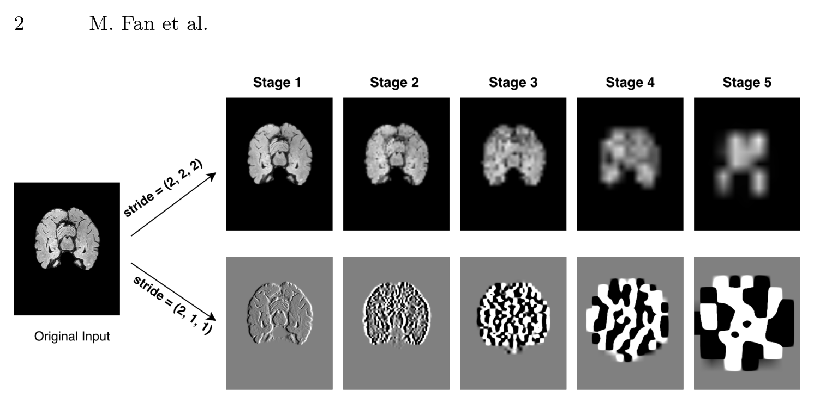

## 一、论文出处

- 论文标题：Detail Consistent Stage-Wise Distillation for Efficient 3D MRI Segmentation
- 会议：MICCAI 2026
- 论文链接：https://arxiv.org/abs/2605.26382v1
- 模块名：Detail Consistent Stage（细节一致性阶段模块，属于 DCD 蒸馏框架里的核心可插拔单元）

先交代一句背景：这篇论文整体是一个「阶段式知识蒸馏」框架，用来把 nnU-Net 这类重型 3D 分割网络压到轻量学生网络。但整篇框架不是我们这里要讲的东西——我们要拆出来的是它里面那个真正能单独塞进网络的子模块：**Detail Consistent Stage**，也就是在每一个编码器阶段上，把教师和学生的特征在小波分解后的「方向性细节分量」上做对齐的那个单元。

## 二、模块图（截自论文原文）



图注解读：输入是同一阶段上教师特征与学生特征，先各自做小波分解，拆成低频近似分量和若干方向的高频细节分量；模块只对高频细节分量做对齐（低频那部分交给常规特征蒸馏或干脆不管），从而把「小病灶、锐利边界」这类结构线索按尺度逐级传下去。

## 三、核心思想与作用

3D 医学分割网络（尤其是 nnU-Net 这种多分辨率结构）在压缩时最疼的问题不是整体精度掉，而是**细节掉**：每下采样一次，小病灶和边界就被抹平一点，等到最深层，细结构基本没了。常规蒸馏只在特征图整体上做 L2 或余弦对齐，低频的「大块组织」占主导，高频细节被淹没，学生学到的还是粗轮廓。

Detail Consistent Stage 的思路很直接：**别在原始特征空间对齐，换到小波域去对齐，而且只盯细节分量。**

- 小波分解把特征拆成 1 个低频（LL）+ 3 个方向高频（LH、HL、HH，分别对应水平、垂直、对角边缘）。
- 低频分量承载语义和整体形状，高频分量承载边缘、纹理、小结构。
- 模块在**每个编码器阶段**上，对教师和学生的高频分量做一致性约束，等于逼着学生在每一级尺度上都别把细节丢掉。

它的即插即用价值在于：这是一个**纯训练期的辅助模块**，推理时可以直接扔掉，不增加任何部署开销。你不需要改网络结构，只要在训练循环里挂上它，就能给任意「教师-学生」配对加一层细节对齐监督。它不绑定 nnU-Net，也不绑定 3D——2D U-Net 一样能用。

## 四、在 U-Net 里的插入位置

插入位置是**编码器每个 stage 的输出特征**上，教师和学生一一对应。

具体说：

- 教师网络和学生网络各自有一个编码器，假设都有 4 个 stage（分辨率 1/1、1/2、1/4、1/8）。
- 在第 i 个 stage 的编码器输出处，取教师特征 `f_t^i` 和学生特征 `f_s^i`。
- 把这一对特征喂给 Detail Consistent Stage 模块，算一个细节一致性损失。
- 所有 stage 的损失加权求和，加到总损失里。

它**不插在解码器**，也**不改前向通路**。你可以理解成：它是一根挂在编码器各阶段上的「监督探针」，只在训练时通电。如果你的学生和教师通道数不一致，模块内部用一个 1x1 卷积把学生投影到教师通道数即可，这也是它保持即插即用的关键设计。

## 五、复现代码（PyTorch，逐行中文注释）

下面给出一个可用的实现。核心是：小波分解用固定的 Haar 滤波器（不学习，保证稳定），只对高频分量算对齐损失。

```python
import torch
import torch.nn as nn
import torch.nn.functional as F


class HaarWaveletDecompose(nn.Module):
    """
    固定 Haar 小波分解，不参与训练。
    输入: (B, C, D, H, W) 或 (B, C, H, W)
    输出: LL, LH, HL, HH 四个分量，空间尺寸各减半。
    用 depthwise conv 实现，等价于对每个通道独立做小波变换。
    """

    def __init__(self):
        super().__init__()
        # 3D Haar 的四个滤波器，形状 (2,2,2)，分别对应 LL / LH / HL / HH
        # 这里用 2x2x2 的核，stride=2，实现一次下采样分解
        ll = torch.ones(1, 1, 2, 2, 2) / 8.0          # 低频近似：全 1 平均
        lh = torch.tensor([[[[[1, 1], [1, 1]], [[-1, -1], [-1, -1]]]]],
                          dtype=torch.float32) / 8.0   # 沿深度方向的差分
        hl = torch.tensor([[[[[1, 1], [-1, -1]], [[1, 1], [-1, -1]]]]],
                          dtype=torch.float32) / 8.0   # 沿高度方向的差分
        hh = torch.tensor([[[[[1, -1], [1, -1]], [[-1, 1], [-1, 1]]]]],
                          dtype=torch.float32) / 8.0   # 对角方向差分
        # 堆成 (4,1,2,2,2)，作为 depthwise 卷积核
        kernels = torch.cat([ll, lh, hl, hh], dim=0)   # (4,1,2,2,2)
        self.register_buffer("kernels", kernels)       # 注册为 buffer，不训练

    def forward(self, x):
        # x: (B, C, D, H, W)
        c = x.shape[1]
        # 把卷积核复制到每个通道，做 depthwise 卷积
        weight = self.kernels.repeat(c, 1, 1, 1, 1)    # (4C,1,2,2,2)
        # padding=0, stride=2，输出 (B, 4C, D/2, H/2, W/2)
        out = F.conv3d(x, weight, stride=2, groups=c)
        # 拆回四个分量，每个 (B, C, D/2, H/2, W/2)
        ll, lh, hl, hh = torch.chunk(out, 4, dim=1)
        return ll, lh, hl, hh


class DetailConsistentStage(nn.Module):
    """
    单个编码器阶段上的细节一致性模块。
    训练期使用：对齐教师与学生在小波高频分量上的一致性。
    推理期可整体丢弃，不影响学生网络前向。
    """

    def __init__(self, student_channels, teacher_channels, use_proj=True):
        super().__init__()
        self.wavelet = HaarWaveletDecompose()
        # 学生通道数可能与教师不同，用 1x1 卷积投影对齐
        if use_proj and student_channels != teacher_channels:
            self.proj = nn.Conv3d(student_channels, teacher_channels, 1)
        else:
            self.proj = nn.Identity()

    def forward(self, feat_student, feat_teacher):
        # 学生特征先投影到教师通道数
        fs = self.proj(feat_student)
        ft = feat_teacher

        # 各自做小波分解，只取三个高频细节分量
        _, s_lh, s_hl, s_hh = self.wavelet(fs)
        _, t_lh, t_hl, t_hh = self.wavelet(ft)

        # 逐方向计算一致性损失（这里用 L1，对细节更敏感）
        loss = 0.0
        for s_d, t_d in [(s_lh, t_lh), (s_hl, t_hl), (s_hh, t_hh)]:
            loss = loss + F.l1_loss(s_d, t_d.detach())  # 教师梯度不回传
        return loss / 3.0


class MultiStageDetailConsistency(nn.Module):
    """
    把多个阶段的 DetailConsistentStage 打包，统一算加权损失。
    student_channels / teacher_channels 是各阶段通道数列表。
    """

    def __init__(self, student_channels, teacher_channels, stage_weights=None):
        super().__init__()
        assert len(student_channels) == len(teacher_channels)
        self.stages = nn.ModuleList([
            DetailConsistentStage(sc, tc)
            for sc, tc in zip(student_channels, teacher_channels)
        ])
        # 各阶段损失权重，默认等权
        if stage_weights is None:
            stage_weights = [1.0] * len(student_channels)
        self.stage_weights = stage_weights

    def forward(self, student_feats, teacher_feats):
        # student_feats / teacher_feats: 各阶段特征列表
        total = 0.0
        for stage, w, sf, tf in zip(
            self.stages, self.stage_weights, student_feats, teacher_feats
        ):
            total = total + w * stage(sf, tf)
        return total
```

## 六、插入示例（几行塞进你的网络）

假设你已经有一个教师网络和一个学生网络，各自在 forward 里返回编码器各阶段特征。

```python
# 1. 初始化模块（通道数按你网络实际填）
dcd = MultiStageDetailConsistency(
    student_channels=[32, 64, 128, 256],
    teacher_channels=[32, 64, 128, 256],
    stage_weights=[1.0, 1.0, 1.0, 1.0],
).cuda()

# 2. 训练循环里，取两个网络的编码器特征
student_feats = student_net.encode(x)   # 返回各阶段特征列表
with torch.no_grad():
    teacher_feats = teacher_net.encode(x)

# 3. 算分割主损失 + 细节一致性损失
seg_loss = criterion(student_logits, label)
dcd_loss = dcd(student_feats, teacher_feats)
loss = seg_loss + 0.5 * dcd_loss        # 权重按经验调

loss.backward()
optimizer.step()
```

推理时**不要调用 dcd**，直接跑学生网络即可，零额外开销。

## 七、实测经验与注意点

- **权重别给太大**：细节一致性是辅助监督，主损失还是分割损失。权重过大容易让学生过度拟合教师的高频噪声，反而在边界处抖动。建议从 0.1~0.5 起调。
- **教师特征要 detach**：教师是冻结的，但保险起见在损失里对教师分量做 `.detach()`，避免意外回传。
- **小波核固定，不要学**：Haar 核是正交且固定的，学它反而引入不稳定。论文里也是固定分解。
- **通道对齐很关键**：学生和教师通道数不一致时，投影层是必须的。投影层只在训练期存在，推理丢弃，所以不影响部署。
- **对 2D 也适用**：把 `conv3d` 换成 `conv2d`、核换成 2x2 即可，逻辑完全一样。
- **深层阶段收益递减**：越深的阶段分辨率越低，高频细节本来就少，权重可以适当调低；浅层阶段（高分辨率）往往是细节对齐收益最大的地方。
- **不要指望它提升整体 Dice 很多**：它的价值主要体现在小结构、细边界类指标上，整体 Dice 可能只微涨，但边界质量肉眼可见变好。

## 八、完整工程

把上面的代码整理成一个可直接 import 的文件结构：

```
detail_consistent_stage/
├── __init__.py
├── wavelet.py          # HaarWaveletDecompose
├── dcd_stage.py        # DetailConsistentStage + MultiStageDetailConsistency
└── example.py          # 插入示例
```

`__init__.py`：

```python
from .wavelet import HaarWaveletDecompose
from .dcd_stage import DetailConsistentStage, MultiStageDetailConsistency

__all__ = [
    "HaarWaveletDecompose",
    "DetailConsistentStage",
    "MultiStageDetailConsistency",
]
```

使用方式就是第六节那几行。整个模块不依赖任何第三方小波库，纯 PyTorch 实现，可以直接拷进你的训练工程。它的定位始终是**训练期即插即用的细节对齐单元**，不是网络结构的一部分——这一点在复现和调参时一定要记住。
