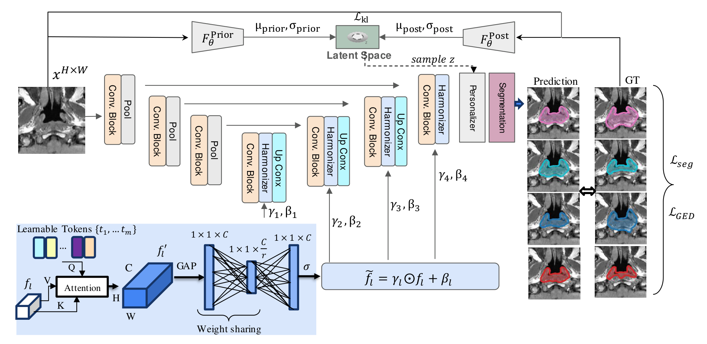

## 一、论文出处

- 论文：Harmonized Feature Conditioning and Frequency-Prompt Personalization for Multi-Rater Medical Segmentation
- 会议：CVPR 2026
- 链接：https://arxiv.org/abs/2605.08210v1

这篇论文整体是一个多标注者（multi-rater）医学分割的概率框架，核心想解决的是：同一张片子不同医生勾的边界不一样，现有做法要么强行取共识标签，要么把标注差异当噪声，结果模型过度自信、校准很差。框架里真正能被我们拆出来单独用的，是那个轻量的 **Harmonizer Network**——它做的是「自适应特征条件化 + 频域个性化」这件事。本文只讲这个可插拔子模块，框架整体不展开。

## 二、模块图（截自论文原文）



图注：Harmonizer 接收主干特征，先用条件化分支（FiLM 式的缩放/平移）对特征做逐通道调制，再用频域分支生成一组频率 prompt 去抑制扫描仪/设备带来的采集伪影，两路输出相加后回注主干。

## 三、核心思想与作用

一句话概括：**它把「设备伪影」和「标注者差异」在特征层面解耦，用条件化 + 频域 prompt 两条路分别处理，然后把干净的特征还给你原来的网络。**

拆开看两个分支：

1. **特征条件化（Feature Conditioning）**：本质是 FiLM（Feature-wise Linear Modulation）。用一个小的超网络从全局上下文（比如全局池化后的向量）预测出逐通道的 `gamma` 和 `beta`，对主干特征做 `gamma * x + beta`。它的作用是让同一套卷积核能根据输入内容自适应地调整响应强度，而不是死板地一套权重打天下。

2. **频域个性化（Frequency-Prompt）**：把特征变换到频域（通常是 2D FFT），在频谱上乘一组可学习的 prompt（可以理解为对特定频率成分的增益/抑制），再变回来。医学影像里扫描仪差异、重建伪影往往集中在特定频段，直接在频域做调制比在空域堆卷积更高效，参数量也小。

为什么说它「即插即用」：这两个分支都是纯特征到特征的映射，输入输出张量形状完全一致（`[B, C, H, W] -> [B, C, H, W]`），不改变通道数、不改变分辨率，所以你可以把它当成一个「特征净化层」塞进 U-Net 的任意一个 stage 后面，主干结构一行都不用改。

## 四、在 U-Net 里的插入位置

几个常见且合理的插法：

- **编码器每个 stage 输出之后**：在浅层抑制设备伪影，让后续下采样拿到更干净的特征。这是最推荐的默认位置。
- **瓶颈层（bottleneck）之后**：这里感受野最大、语义最强，条件化调制在这里收益通常最明显。
- **解码器跳跃连接汇合处**：如果标注差异主要体现在边界，放在解码端能直接影响最终边界质量。

不建议的做法：每个 stage 都插一遍。Harmonizer 本身有 FFT 和超网络，插太多会明显拖慢训练，而且浅层特征信噪比低，频域调制未必划算。一般选 2~3 个位置即可。

## 五、复现代码（PyTorch，逐行中文注释）

下面是一个可直接用的 `Harmonizer` 实现，包含条件化分支和频域 prompt 分支。

```python
import torch
import torch.nn as nn
import torch.nn.functional as F


class FrequencyPrompt(nn.Module):
    """频域个性化分支：在频谱上做可学习的增益调制。"""

    def __init__(self, channels, prompt_size=8):
        super().__init__()
        # 可学习的频率 prompt，形状 [C, prompt_size, prompt_size]
        # 用一个小尺寸频谱模板，再插值到实际特征尺寸，避免参数量随分辨率爆炸
        self.prompt = nn.Parameter(torch.ones(channels, prompt_size, prompt_size))
        self.prompt_size = prompt_size
        # 逐通道的可学习缩放，初始为 0，保证插入初期不破坏原网络行为
        self.scale = nn.Parameter(torch.zeros(1, channels, 1, 1))

    def forward(self, x):
        # x: [B, C, H, W]
        B, C, H, W = x.shape
        # 1) 实数 FFT，得到复数频谱；rfft2 只返回非冗余的一半，省显存
        x_freq = torch.fft.rfft2(x, norm='ortho')  # [B, C, H, W//2+1]

        # 2) 把可学习 prompt 插值到当前频谱尺寸
        prompt = self.prompt.unsqueeze(0)  # [1, C, p, p]
        prompt = F.interpolate(
            prompt, size=x_freq.shape[-2:], mode='bilinear', align_corners=False
        )  # [1, C, H, W//2+1]

        # 3) 频谱乘以 prompt（复数乘法，prompt 为实数增益）
        x_freq = x_freq * prompt

        # 4) 逆变换回空域
        x_out = torch.fft.irfft2(x_freq, s=(H, W), norm='ortho')

        # 5) 残差回注，scale 初始为 0，训练中逐渐学出频域修正量
        return x + self.scale * x_out


class Harmonizer(nn.Module):
    """即插即用模块：特征条件化 + 频域个性化。"""

    def __init__(self, channels, reduction=8, prompt_size=8):
        super().__init__()
        # ---- 条件化分支：从全局上下文预测 gamma / beta ----
        hidden = max(channels // reduction, 8)
        self.gap = nn.AdaptiveAvgPool2d(1)          # 全局平均池化，拿到通道描述子
        self.fc = nn.Sequential(
            nn.Conv2d(channels, hidden, 1),          # 降维
            nn.GELU(),
            nn.Conv2d(hidden, channels * 2, 1),      # 一次性预测 gamma 和 beta
        )
        # 初始化为接近恒等：gamma≈1, beta≈0
        nn.init.zeros_(self.fc[-1].weight)
        nn.init.zeros_(self.fc[-1].bias)

        # ---- 频域分支 ----
        self.freq = FrequencyPrompt(channels, prompt_size)

        # 输出前的轻量融合，稳定训练
        self.proj = nn.Conv2d(channels, channels, 1)

    def forward(self, x):
        # x: [B, C, H, W]
        # 1) 条件化：预测逐通道 gamma / beta
        ctx = self.gap(x)                            # [B, C, 1, 1]
        params = self.fc(ctx)                        # [B, 2C, 1, 1]
        gamma, beta = params.chunk(2, dim=1)         # 各 [B, C, 1, 1]
        gamma = 1.0 + gamma                          # 以 1 为中心，初始接近恒等
        x_cond = gamma * x + beta                    # FiLM 调制

        # 2) 频域个性化：抑制设备/采集伪影
        x_freq = self.freq(x_cond)

        # 3) 融合并残差回注，保证梯度顺畅
        out = self.proj(x_freq)
        return x + out
```

几个实现上的取舍说明：

- `scale` 和 `fc` 最后一层都初始化为 0，是为了让模块插入时**初始等价于恒等映射**，不会一上来就把预训练主干的特征打乱，这点对即插即用很关键。
- 频域 prompt 用 `prompt_size x prompt_size` 的小模板 + 插值，而不是直接对全分辨率频谱学参数，否则参数量和显存都会失控。
- 用 `rfft2 / irfft2` 而不是 `fft2`，因为实输入频谱是共轭对称的，省一半计算。

## 六、插入示例（几行塞进你的网络）

假设你有一个标准 U-Net，编码器第 3 个 stage 输出 `feat`，通道数 256：

```python
# 初始化一次，放在 __init__ 里
self.harmonizer = Harmonizer(channels=256)

# 在 forward 里，拿到编码器特征后直接套一层
feat = self.encoder_stage3(x)      # [B, 256, H/8, W/8]
feat = self.harmonizer(feat)       # 形状不变，直接往下走
```

就这两行。形状不变、通道不变，后面的解码器、跳跃连接全都不用动。想插在瓶颈层就换成瓶颈的通道数，逻辑一样。

## 七、实测经验与注意点

- **初始恒等很重要**：如果你把 `scale` 或 `fc` 最后一层初始成随机值，插入预训练模型后 loss 会先炸一下。按上面代码初始化为 0，训练曲线会平滑很多。
- **FFT 有显存和速度开销**：`rfft2` 在 512×512 特征上不算便宜。如果显存吃紧，优先插在分辨率较低的中深层，别插在 H/2、W/2 的浅层。
- **别指望它单独涨点**：这个模块解决的是「多标注者 + 设备差异」场景下的特征净化问题。如果你的数据是单标注、单一设备，收益会很小，甚至可能因为多了参数而略降。它更适合多中心、多标注的数据集。
- **prompt_size 别设太大**：8 或 16 足够，设大了等于在频域堆参数，容易过拟合，也失去「轻量」的意义。
- **和 BatchNorm 的交互**：条件化分支会改变特征分布，如果主干用了 BN，建议在 Harmonizer 之后不要立刻接 BN，或者干脆把主干换成 GroupNorm / LayerNorm，训练更稳。
- **多标注场景的用法**：论文里 Harmonizer 是和概率框架配合的。你如果只想要这个即插即用模块，可以把它当成一个「特征域的数据增强/去偏」组件，单独用也能提升边界鲁棒性，只是拿不到论文里那套概率校准的好处。

## 八、完整工程

把上面的 `FrequencyPrompt` 和 `Harmonizer` 两个类存成一个 `harmonizer.py`，就是一个独立的即插即用模块文件，不依赖论文框架的任何其他部分。使用时：

```python
from harmonizer import Harmonizer

# 在你的网络 __init__ 里
self.harm = Harmonizer(channels=256, reduction=8, prompt_size=8)

# 在 forward 里
x = self.harm(x)
```

整个模块约 30 行核心代码，参数量随通道数线性增长，可以放心塞进任何基于卷积的分割网络（U-Net、nnU-Net、TransUNet 的卷积分支等）。如果你要做多标注者分割，建议配合一个能输出多假设的分割头一起用，Harmonizer 负责把输入特征里的设备伪影压掉，分割头再去建模标注者之间的真实分歧。
