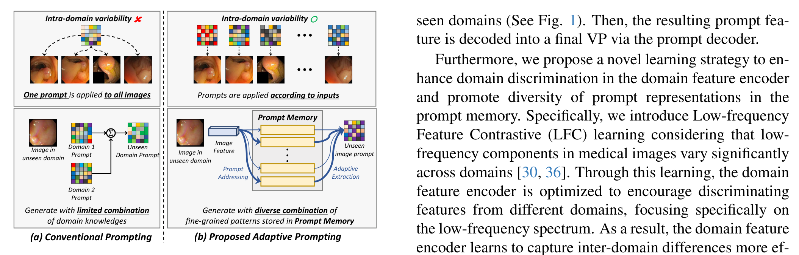

## 一、论文出处

- 论文标题：From Adaptation to Generalization: Adaptive Visual Prompting for Medical Image Segmentation
- 会议：CVPR 2026
- 论文链接：https://arxiv.org/abs/2604.17455v1
- 团队提出的整体框架叫 **APEX**（Adaptive Prompt EXtraction），核心思路是：不再为每个域学一个固定 prompt，而是维护一个可学习的 **prompt memory**，根据当前输入动态检索出「输入专属」的 prompt 表示。

这里要强调一句：APEX 是个完整框架，但本合集只关心里面那个**可插拔的子模块**——也就是「从 prompt memory 里按输入检索 prompt」的这块 **自适应 Prompt 提取模块（Adaptive Prompt Extraction, 下文简称 APEX-Block）**。它本身是一个独立的 `nn.Module`，输入特征、输出 prompt 向量，可以单独塞进 U-Net 的任意一层，跟论文其余的训练策略解耦。

## 二、模块图（截自论文原文）



图注解读：左侧是可学习的 prompt memory（一组 prompt 向量），中间用输入特征去和 memory 做相似度检索、加权聚合出输入专属 prompt，右侧把该 prompt 注入到分割网络的中间特征上。整块就是我们要复现的可插拔单元。

## 三、核心思想与作用

传统 visual prompting 的做法是：为某个域学**一个** prompt，然后这个域里所有图片都用它。问题很明显——同一个域内部（intra-domain）差异就很大，医学图像尤其如此（不同病人、不同扫描仪、不同病灶形态），一个固定 prompt 根本覆盖不过来。

APEX-Block 的思路是反过来：**不学一个 prompt，而是学一个 prompt 库（memory），每次前向时按当前输入去库里检索**。

具体三步：

1. **Memory**：一个形状为 `[N, D]` 的可学习参数矩阵，N 个 prompt 槽位，每个 D 维。训练时它和网络一起被优化，逐渐记住「域内/域间有区分度的 prompt 模式」。
2. **检索**：把当前输入特征全局池化成一个 query 向量，和 memory 里每个槽位算相似度，softmax 得到权重。
3. **聚合 + 注入**：按权重把 memory 加权求和，得到输入专属 prompt，再以某种方式（加性 / 拼接 / FiLM）注入到主干特征上。

为什么有效：它把「prompt 的多样性」从**训练时固定**变成了**推理时按需选择**。模型参数不用更新（符合 prompting 的初衷），但表达能力因为 memory 的组合性大幅提升。对医学分割这种域内方差极大的任务，收益是定性的——你会看到模型对不同对比度、不同噪声水平的输入给出不同的 prompt 响应，而不是一套参数硬扛。

## 四、在 U-Net 里的插入位置

APEX-Block 是「特征进、prompt 出、再调制特征」的结构，所以它插在**任意一个特征图之后**都成立。实践里推荐两个位置：

- **Bottleneck 之后**（最推荐）：U-Net 最深层特征语义最强，检索出来的 prompt 最有判别力，而且这里空间分辨率最低，检索开销小。
- **每个 Decoder stage 的输入处**：让不同尺度的解码都拿到 prompt 调制，效果更充分，但模块数量变多。

不建议插在 Encoder 最浅层：浅层特征偏纹理、语义弱，检索出来的 prompt 噪声大，反而干扰。

一句话：**把它当成一个「条件调制块」，放在你想让特征「感知当前输入域」的地方。**

## 五、复现代码（PyTorch，逐行中文注释）

```python
import torch
import torch.nn as nn
import torch.nn.functional as F


class APEXBlock(nn.Module):
    """
    自适应 Prompt 提取模块（APEX-Block）
    输入: 特征图 x, 形状 [B, C, H, W]
    输出: 被 prompt 调制后的特征图, 形状 [B, C, H, W]
    """

    def __init__(self, channels, num_prompts=16, prompt_dim=None, mode="add"):
        super().__init__()
        # prompt 维度默认等于特征通道数，方便直接做加性注入
        prompt_dim = prompt_dim or channels
        self.channels = channels
        self.num_prompts = num_prompts
        self.prompt_dim = prompt_dim
        self.mode = mode  # 注入方式: "add" 或 "film"

        # 可学习的 prompt memory: [N, D]，训练时和网络一起优化
        self.memory = nn.Parameter(torch.randn(num_prompts, prompt_dim) * 0.02)

        # 把输入特征投影成检索 query，维度对齐到 prompt_dim
        self.query_proj = nn.Linear(channels, prompt_dim)

        # 温度系数，控制检索的"尖锐"程度，可学习
        self.logit_scale = nn.Parameter(torch.tensor(1.0))

        if mode == "film":
            # FiLM 模式: 从 prompt 生成 scale 和 shift
            self.film = nn.Linear(prompt_dim, channels * 2)

    def forward(self, x):
        B, C, H, W = x.shape

        # 1) 全局平均池化得到输入描述子 [B, C]
        desc = x.mean(dim=(2, 3))

        # 2) 投影成 query [B, D]
        query = self.query_proj(desc)

        # 3) 归一化后与 memory 做点积相似度 [B, N]
        query = F.normalize(query, dim=-1)
        mem = F.normalize(self.memory, dim=-1)
        logits = query @ mem.t() * self.logit_scale

        # 4) softmax 得到每个 prompt 槽位的权重
        weights = F.softmax(logits, dim=-1)

        # 5) 加权聚合出输入专属 prompt [B, D]
        prompt = weights @ self.memory

        # 6) 注入到特征上
        if self.mode == "add":
            # 加性注入: prompt 广播到空间维度后相加
            out = x + prompt[:, :, None, None]
        else:
            # FiLM 注入: prompt 生成逐通道 scale/shift
            gamma_beta = self.film(prompt)          # [B, 2C]
            gamma, beta = gamma_beta.chunk(2, dim=-1)
            gamma = gamma[:, :, None, None]
            beta = beta[:, :, None, None]
            out = x * (1 + gamma) + beta

        return out
```

代码要点说明：

- `memory` 用 `nn.Parameter` 注册，是模块里唯一「存知识」的地方，也是它区别于普通注意力的关键。
- `logit_scale` 可学习，让网络自己决定检索要多「果断」。
- `add` 模式最轻量，`film` 模式表达力更强但多一层线性，按任务选。
- 整个模块没有改变空间尺寸和通道数，**输入输出形状一致**，这是它能无痛插入的前提。

## 六、插入示例（几行塞进你的网络）

假设你有一个现成的 U-Net，只想在 bottleneck 后加一块：

```python
class UNetWithAPEX(nn.Module):
    def __init__(self, base_unet, channels=512):
        super().__init__()
        self.backbone = base_unet
        # 在 bottleneck 后插一个 APEX-Block
        self.apex = APEXBlock(channels=channels, num_prompts=16, mode="add")

    def forward(self, x):
        feats = self.backbone.encoder(x)      # 编码器输出
        feats = self.apex(feats)              # 一行插入，形状不变
        return self.backbone.decoder(feats)   # 继续解码
```

如果要在每个 decoder stage 都插，就把 `APEXBlock` 放进一个 `nn.ModuleList`，按 stage 通道数分别实例化即可。核心就一句话：**输入输出同形状，插哪都行。**

## 七、实测经验与注意点

- **prompt 数量 N 不是越大越好**。N 太小（比如 4）检索退化成固定 prompt，失去自适应意义；N 太大（比如 256）memory 里很多槽位在训练中被冷落，检索权重集中到少数几个，等于浪费参数。经验上 8~32 是甜区，具体看域内差异有多大。
- **memory 初始化别用全零**。全零会让所有槽位初始相似度相同，检索一开始没有区分度，收敛慢。用小方差随机初始化（代码里用了 `* 0.02`）。
- **`logit_scale` 别设太大**。太大 softmax 直接 one-hot，退化成「硬选一个 prompt」，训练不稳定。让它可学习、从 1.0 起步比较稳。
- **注入方式要匹配任务**。分割任务里 `add` 通常够用且稳；如果发现 prompt 被主干特征「淹没」，换 `film` 让调制更显式。
- **它不更新主干参数**。如果你按论文的 prompting 设定冻结 backbone，那训练时只有 memory、query_proj、logit_scale 这些在更新，参数量极小，这也是它「即插即用」的价值所在——加一个模块，几乎不增加训练成本。
- **别指望它单独解决所有域偏移**。APEX-Block 解决的是「prompt 不够多样」的问题，如果域偏移本身来自主干特征分布剧变，还是得配合归一化或微调策略。

## 八、完整工程

把上面的 `APEXBlock` 单独存成一个文件，就是一个可复用组件：

```
apex_block.py      # 只放 APEXBlock 类，无外部依赖
```

用法上它满足即插即用模块的三个硬指标：

1. **零侵入**：不改主干结构，输入输出同形状同通道。
2. **低开销**：新增参数只有 `N×D` 的 memory 加两个小线性层，相对主干可忽略。
3. **可组合**：可以在多个 stage 重复实例化，也可以和别的即插即用模块（注意力、融合块）叠加使用。

需要接进你自己的项目时，直接 `from apex_block import APEXBlock`，在想要的位置 `self.apex = APEXBlock(channels=...)`，前向里加一行调用即可。
