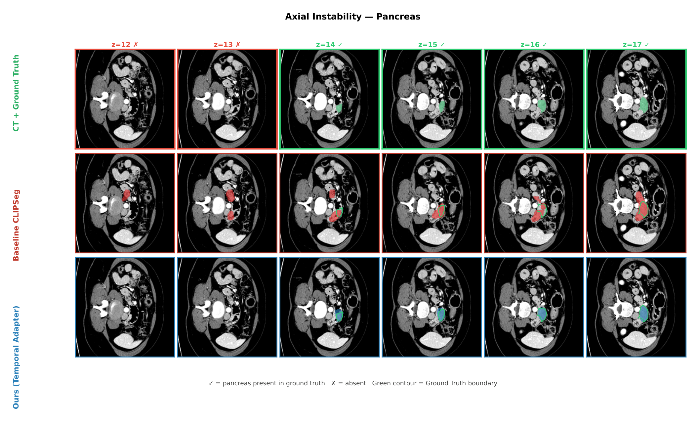

## 一、论文出处

- 论文：T-Gated Adapter: A Lightweight Temporal Adapter for Vision-Language Medical Segmentation
- 会议：CVPR 2026
- 链接：https://arxiv.org/abs/2604.08167v1

这篇论文整体上是一个面向 3D 医学分割的视觉-语言（VLM）适配框架，背景动机很直白：VLM 在 2D 切片上单帧推理时，分割结果往往在切片之间抖动、出现解剖上不连续的噪声，因为它压根没看到相邻切片。论文的解法是给 VLM 挂一个**时序适配器**，让相邻切片的信息互相校准。

但注意，本合集收的是**可插拔子模块**，不是整篇框架。这篇里真正能单独抠出来、塞进任意 2D 分割网络的东西，就是那个 **T-Gated Adapter（时序门控适配块）**，下文简称 **T 模块**。它做的事只有一件：拿相邻切片（或相邻时序帧）的特征，用门控方式对当前帧特征做一次轻量残差修正。框架整体怎么串、怎么训，这里只当背景一句带过。

## 二、模块图（截自论文原文）



图注解读：T 模块的输入是当前帧特征与邻帧特征，先各自过一层轻量投影，再算门控权重，最后以残差形式加回当前帧。整块没有大卷积、没有跨帧注意力堆叠，参数量很小，所以能随手插进已有 backbone 的某个 stage 后面。

## 三、核心思想与作用

一句话：**用邻帧信息给当前帧特征做门控残差修正，抑制切片间抖动。**

拆开看三个点：

1. **邻帧提供的是"上下文先验"，不是直接替换。** 当前帧特征 `x_t` 是主，邻帧 `x_{t-1}`、`x_{t+1}` 只用来算一个门控信号 `g`，`g` 决定"当前帧哪些通道该被邻帧修正、修正多少"。这样即使邻帧本身有噪声，也不会把噪声直接灌进来。

2. **门控是逐通道的。** 门控向量维度对齐通道数，相当于给每个通道一个 0~1 的开关。解剖结构在通道维度上通常有语义分工，逐通道门控比整帧加权更细，也更省参数。

3. **残差形式保证即插即用。** 输出是 `x_t + g * Δ`，`Δ` 是邻帧投影后的增量。当门控趋近 0 时，模块退化成恒等映射，等于没插。这一点很关键：插进预训练网络时，初始阶段不会破坏原有特征，训练更稳。

它解决的问题边界要说清楚：T 模块**不负责跨帧对齐**（没有光流、没有可变形卷积），也不做长程时序建模。它只做"相邻帧的局部一致性修正"。如果你的数据切片间距很大、解剖变化剧烈，它的收益会打折。

## 四、在 U-Net 里的插入位置

U-Net 是 2D 单帧结构，本身没有时序概念。要插 T 模块，前提是你的输入是**切片序列**（比如一次喂 3 张相邻切片，或视频帧），而不是孤立单帧。

推荐插入位置，按优先级：

1. **Bottleneck（最推荐）。** 分辨率最低、通道最多，这里做门控修正计算量小、感受野大，对全局解剖连续性影响最直接。缺点是空间细节少，对细小结构帮助有限。

2. **Decoder 的每个上采样 stage 之后。** 逐级恢复细节时同步做时序一致性，效果更细，但显存和耗时上升明显。一般只在最后 1~2 个 decoder stage 插。

3. **Encoder 浅层不建议插。** 浅层特征以纹理、边缘为主，跨帧差异大，门控容易学乱，收益低还费算力。

如果你用的是 3D U-Net，那 T 模块的"邻帧"可以换成"相邻深度切片"，插在 encoder 各 stage 后同样成立，逻辑不变。

## 五、复现代码（PyTorch，逐行中文注释）

下面是一个可直接用的 `TemporalGatedAdapter`。输入约定为 `(B, T, C, H, W)`，`T` 是邻域帧数（含当前帧），默认取 3（前一帧、当前帧、后一帧）。模块只修正中间那一帧。

```python
import torch
import torch.nn as nn


class TemporalGatedAdapter(nn.Module):
    """
    T-Gated Adapter：轻量时序门控适配块。
    输入: x (B, T, C, H, W)，T 为邻域帧数，中间帧为当前帧。
    输出: (B, C, H, W)，当前帧被邻帧门控修正后的特征。
    """

    def __init__(self, channels, reduction=4, neighbor=True):
        super().__init__()
        self.channels = channels
        self.neighbor = neighbor  # 是否使用邻帧；False 时退化为恒等

        # 邻帧增量投影：把邻帧特征压成与当前帧同维的增量 Δ
        # 用 1x1 卷积，逐像素、跨通道混合，参数量极小
        self.delta_proj = nn.Conv2d(channels, channels, kernel_size=1, bias=False)

        # 门控网络：先全局池化拿到通道描述，再经瓶颈 MLP 输出逐通道门控
        hidden = max(channels // reduction, 8)  # 瓶颈维度，防止通道太小时塌成 0
        self.gate = nn.Sequential(
            nn.AdaptiveAvgPool2d(1),          # (B, C, 1, 1) 全局上下文
            nn.Conv2d(channels, hidden, 1),   # 降维
            nn.ReLU(inplace=True),
            nn.Conv2d(hidden, channels, 1),   # 升回通道数
            nn.Sigmoid(),                     # 门控值压到 0~1
        )

        # 零初始化增量投影，使模块初始近似恒等映射，插入预训练网络不破坏特征
        nn.init.zeros_(self.delta_proj.weight)

    def forward(self, x):
        # x: (B, T, C, H, W)
        if not self.neighbor or x.dim() != 5 or x.size(1) < 2:
            # 没有邻帧可用时，直接返回中间帧（或原张量），保证接口安全
            if x.dim() == 5:
                return x[:, x.size(1) // 2]
            return x

        t_mid = x.size(1) // 2          # 当前帧在时间维的索引
        cur = x[:, t_mid]               # (B, C, H, W) 当前帧特征

        # 邻帧取平均，作为上下文先验；避免对帧序敏感
        neigh = torch.cat([x[:, :t_mid], x[:, t_mid + 1:]], dim=1)  # (B, T-1, C, H, W)
        neigh = neigh.mean(dim=1)       # (B, C, H, W)

        delta = self.delta_proj(neigh)  # (B, C, H, W) 邻帧增量
        g = self.gate(cur)              # (B, C, 1, 1) 逐通道门控

        # 残差门控修正：门控趋 0 时输出≈当前帧
        return cur + g * delta
```

几个实现细节值得说明：

- `delta_proj` 用 1x1 卷积而不是 3x3，是为了保持"轻量"这个卖点，也避免在低分辨率 bottleneck 上引入多余空间平滑。
- 门控用 `AdaptiveAvgPool2d(1)` 做全局池化，是 SE 风格的做法，参数量只有 `2*C*C/reduction` 级别，对显存几乎无感。
- `nn.init.zeros_(self.delta_proj.weight)` 是**关键**。零初始化让初始 `Δ=0`，模块一开始就是恒等映射，插进预训练 U-Net 不会立刻掉点，训练时再慢慢学出门控。

## 六、插入示例（几行塞进你的网络）

假设你有一个现成的 2D U-Net，在 bottleneck 处插 T 模块。核心就是改一下 forward 的输入形状，把单帧 `(B,C,H,W)` 变成序列 `(B,T,C,H,W)`。

```python
class UNetWithTAdapter(nn.Module):
    def __init__(self, base_unet, channels=512):
        super().__init__()
        self.unet = base_unet
        # 在 bottleneck 后插入 T 模块
        self.t_adapter = TemporalGatedAdapter(channels)

    def forward(self, x):
        # x: (B, T, C_in, H, W)，T 张相邻切片
        B, T = x.shape[:2]
        # 把序列拍平送进 encoder，逐帧提特征
        feats = self.unet.encoder(x.reshape(B * T, *x.shape[2:]))  # (B*T, C, h, w)
        C, h, w = feats.shape[1:]
        feats = feats.reshape(B, T, C, h, w)                       # 还原时间维
        feats = self.t_adapter(feats)                              # (B, C, h, w) 门控修正
        return self.unet.decoder(feats)                            # 接回 decoder
```

如果不想动 encoder 的输入形状，也可以只在 decoder 末端插：把 decoder 输出的多帧特征堆成 `(B,T,C,H,W)`，过一遍 T 模块，再取中间帧算 loss。这样改动更小，适合先验证收益。

## 七、实测经验与注意点

定性地说，这类门控适配块在**切片连续性差**的数据上收益最明显，比如层厚较大、器官边界跨切片跳变的情况。几点经验：

1. **邻帧数别贪多。** 3 帧（前/当前/后）通常够用，5 帧以上收益递减，显存和 IO 成本却线性涨。医学数据切片间距大时，隔帧取邻帧反而比紧邻帧更有效。

2. **零初始化不能省。** 我见过直接随机初始化 `delta_proj` 导致插入后前几个 epoch 掉点明显的案例。零初始化 + 门控 sigmoid，能让模块"从恒等开始学"。

3. **门控别加太强的正则。** 有人喜欢给门控加稀疏惩罚逼它接近 0，结果模块学不动。除非你明确要压缩，否则不加。

4. **和 BatchNorm 的交互要注意。** 如果 T 模块插在 BN 之后，邻帧均值会改变统计分布。稳妥做法是插在 BN 之前，或给邻帧分支单独做归一化。

5. **推理时的邻帧来源。** 训练时邻帧是真实相邻切片；推理时如果按整卷滑窗，邻帧天然可得。但如果是单张切片在线推理，就得缓存上一张的特征，这时要注意 batch 维和状态管理，别把不同病例的帧混在一起。

6. **它不解决对齐问题。** 如果相邻切片间器官位移很大（比如呼吸运动明显的腹部 CT），纯门控修正能力有限，得配合配准或可变形对齐，那是另一个模块的事。

## 八、完整工程

把上面的代码整理成一个可独立测试的文件，方便你直接跑通再往自己网络里搬。

```python
# t_adapter.py
import torch
import torch.nn as nn


class TemporalGatedAdapter(nn.Module):
    def __init__(self, channels, reduction=4, neighbor=True):
        super().__init__()
        self.channels = channels
        self.neighbor = neighbor
        self.delta_proj = nn.Conv2d(channels, channels, 1, bias=False)
        hidden = max(channels // reduction, 8)
        self.gate = nn.Sequential(
            nn.AdaptiveAvgPool2d(1),
            nn.Conv2d(channels, hidden, 1),
            nn.ReLU(inplace=True),
            nn.Conv2d(hidden, channels, 1),
            nn.Sigmoid(),
        )
        nn.init.zeros_(self.delta_proj.weight)

    def forward(self, x):
        if not self.neighbor or x.dim() != 5 or x.size(1) < 2:
            return x[:, x.size(1) // 2] if x.dim() == 5 else x
        t_mid = x.size(1) // 2
        cur = x[:, t_mid]
        neigh = torch.cat([x[:, :t_mid], x[:, t_mid + 1:]], dim=1).mean(dim=1)
        delta = self.delta_proj(neigh)
        g = self.gate(cur)
        return cur + g * delta


if __name__ == "__main__":
    # 自测：B=2, T=3, C=64, H=W=32
    m = TemporalGatedAdapter(64)
    x = torch.randn(2, 3, 64, 32, 32)
    y = m(x)
    print("out:", y.shape)                       # 期望 (2, 64, 32, 32)
    print("params:", sum(p.numel() for p in m.parameters()))
    # 验证初始近似恒等：零初始化下 delta=0，输出应等于中间帧
    print("identity check:", torch.allclose(y, x[:, 1], atol=1e-6))
```

跑通后你会看到 `identity check: True`，这就是它能"无痛插入"的底气。参数量在 `C=64` 时只有几千，放到 bottleneck 上基本可以忽略。
