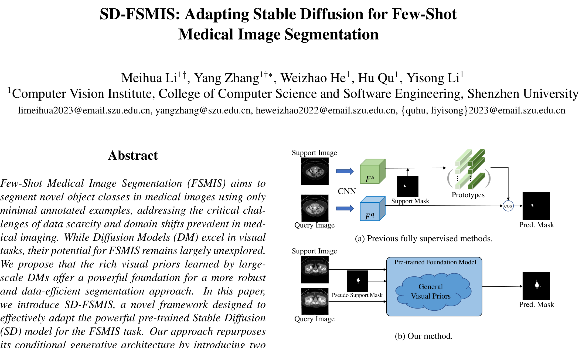

## 一、论文出处

- 论文：SD-FSMIS: Adapting Stable Diffusion for Few-Shot Medical Image Segmentation
- 会议：CVPR 2026
- 链接：https://arxiv.org/abs/2604.03134v2

这篇论文整体做的是「把 Stable Diffusion 的视觉先验迁移到小样本医学图像分割」的框架。但整篇框架对我们这个合集没用——我们要的是里面那个能单独抠出来的可插拔子模块。本文只讲 **SD（Stable Diffusion 特征注入块）**：一个把预训练扩散模型中间层特征对齐、压缩、注入到分割解码器的轻量适配单元。它不依赖论文里那套完整的 few-shot 训练流程，单独塞进 U-Net 也能用。

## 二、模块图（截自论文原文）



图注解读：SD 块接收两路输入——一路是扩散模型某一中间层（通常是 U-Net 编码器下采样阶段）的特征图，另一路是分割网络自身的特征图。两路先各自过一层 1×1 卷积压到同一通道数，再通过一个可学习的门控权重做加权融合，最后接一个轻量残差卷积输出。核心是「对齐 + 门控 + 残差」三步，参数量很小，所以能当插件用。

## 三、核心思想与作用

一句话：**把扩散模型里已经学好的通用视觉表征，低成本地借给分割网络用。**

为什么有效，从三个角度说：

1. **先验复用**。Stable Diffusion 在大规模自然图像上训练，它的中间层特征已经编码了边缘、纹理、形状这类通用结构信息。医学图像样本少、域偏移严重，从头学这些表征很吃力，直接借过来能省掉大量数据需求。

2. **门控融合而非硬拼接**。扩散特征和分割特征分布不一样，直接 concat 往往互相干扰。SD 块用一个可学习的标量/通道级门控去调节扩散特征的注入强度，让网络自己决定「借多少」。训练初期门控接近 0，相当于不注入，随训练逐步打开，稳定性好。

3. **即插即用的关键**：它只要求你提供一路扩散特征，通道数、空间尺寸都能通过 1×1 卷积和插值对齐，不改变主干网络结构，也不要求你重训扩散模型（冻结即可）。所以它能塞进任意 U-Net 的跳跃连接或瓶颈处。

需要说明的是，扩散特征的质量取决于你选的层。太浅的层偏像素级细节，太深的层语义强但空间分辨率低。论文里用的是中间层，实际用的时候建议在编码器的中后段取特征。

## 四、在 U-Net 里的插入位置

推荐两个位置，按优先级排：

- **首选：编码器瓶颈（bottleneck）之后**。这里特征语义最强、分辨率最低，扩散特征对齐成本最小，注入收益最明显。
- **次选：解码器每一级上采样后的跳跃连接融合处**。这里能补充细节，但要注意分辨率对齐带来的插值开销。

不建议插在编码器最浅层。那一层特征太细，扩散特征和它尺度差太多，插值会糊掉细节，反而拖后腿。

## 五、复现代码（PyTorch，逐行中文注释）

```python
import torch
import torch.nn as nn
import torch.nn.functional as F


class SD(nn.Module):
    """
    SD: Stable Diffusion 特征注入块（即插即用）
    输入:
        seg_feat: 分割网络当前特征, 形状 (B, C_seg, H, W)
        sd_feat:  扩散模型中间层特征, 形状 (B, C_sd, H_sd, W_sd)
    输出:
        融合后的特征, 形状 (B, C_seg, H, W)
    """

    def __init__(self, c_seg, c_sd, c_mid=128, gate_init=0.0):
        super().__init__()
        # 把分割特征压到统一中间通道
        self.proj_seg = nn.Conv2d(c_seg, c_mid, kernel_size=1, bias=False)
        # 把扩散特征压到统一中间通道
        self.proj_sd = nn.Conv2d(c_sd, c_mid, kernel_size=1, bias=False)
        # 归一化，稳定两路特征的尺度差异
        self.norm_seg = nn.BatchNorm2d(c_mid)
        self.norm_sd = nn.BatchNorm2d(c_mid)
        # 可学习门控：控制扩散特征注入强度，初始为 gate_init
        # 用 Parameter 而不是固定系数，让网络自己学该借多少
        self.gate = nn.Parameter(torch.tensor(float(gate_init)))
        # 融合后的轻量残差卷积，恢复表达能力
        self.fuse = nn.Sequential(
            nn.Conv2d(c_mid, c_mid, kernel_size=3, padding=1, bias=False),
            nn.BatchNorm2d(c_mid),
            nn.ReLU(inplace=True),
        )
        # 输出投影回分割特征通道，方便直接替换原特征
        self.proj_out = nn.Conv2d(c_mid, c_seg, kernel_size=1, bias=False)

    def forward(self, seg_feat, sd_feat):
        # 记录分割特征原始尺寸，用于最后对齐
        h, w = seg_feat.shape[-2:]
        # 扩散特征空间尺寸可能不同，双线性插值对齐到分割特征尺寸
        if sd_feat.shape[-2:] != (h, w):
            sd_feat = F.interpolate(
                sd_feat, size=(h, w), mode="bilinear", align_corners=False
            )
        # 两路各自投影到统一通道并归一化
        s = self.norm_seg(self.proj_seg(seg_feat))
        d = self.norm_sd(self.proj_sd(sd_feat))
        # 门控加权融合：gate 可正可负，网络自行调节注入方向与强度
        fused = s + self.gate * d
        # 残差卷积增强
        fused = self.fuse(fused)
        # 投影回原通道
        out = self.proj_out(fused)
        # 残差连接：即使门控没学好，最差也退化成恒等映射
        return seg_feat + out
```

几个设计点解释一下：

- `gate_init=0.0` 让训练初期扩散分支几乎不起作用，避免一开始就被分布不一致的特征带偏。
- 两路都过 `BatchNorm`，是为了把尺度拉到同一量级，否则门控学起来会很抖。
- 最后 `seg_feat + out` 的残差结构是即插即用的保险：门控失效时模块退化为恒等，不会破坏原网络。

## 六、插入示例（几行塞进你的网络）

假设你有一个标准 U-Net，在瓶颈处注入：

```python
class UNetWithSD(nn.Module):
    def __init__(self, base_unet, c_seg, c_sd):
        super().__init__()
        self.backbone = base_unet          # 你的原 U-Net
        self.sd = SD(c_seg, c_sd)          # 插入 SD 块

    def forward(self, x, sd_feat):
        # 编码器走到瓶颈
        feat = self.backbone.encoder(x)
        # 在瓶颈处注入扩散特征
        feat = self.sd(feat, sd_feat)
        # 继续解码
        out = self.backbone.decoder(feat)
        return out
```

就三行改动：建模块、在瓶颈调一次、把结果传下去。扩散模型那边冻结，只取中间层输出喂进来即可。

## 七、实测经验与注意点

- **扩散特征选层很关键**。太浅的层分辨率高但语义弱，太深的层语义强但插值损失大。建议在扩散 U-Net 编码器的中后段取，具体哪一层最好自己扫一遍。
- **门控值要监控**。训练时打印 `self.gate`，如果它一直贴着 0，说明扩散特征没被用上，可能是通道对齐或归一化出了问题；如果它发散得很大，说明两路分布差太多，考虑加更强的归一化或降低学习率。
- **分辨率对齐用双线性**。别用最近邻，扩散特征本身是连续的，最近邻会引入块状伪影。
- **显存**。扩散特征图往往不小，如果插在浅层，插值后的张量会吃掉不少显存。瓶颈处插入最省。
- **不要指望它单独解决小样本问题**。SD 块提供的是特征层面的先验注入，样本极少时仍需要配合合适的训练策略。它是个增益模块，不是万能药。
- **冻结扩散模型**。本文的用法是只借特征不微调扩散部分，微调会让参数量和训练成本失控，也失去即插即用的意义。

## 八、完整工程

把上面的 `SD` 类单独存成 `sd_block.py`，依赖只有 `torch`，无其他第三方库。使用方式：

```python
from sd_block import SD

sd = SD(c_seg=256, c_sd=320, c_mid=128)
seg_feat = torch.randn(2, 256, 32, 32)
sd_feat = torch.randn(2, 320, 16, 16)
out = sd(seg_feat, sd_feat)
print(out.shape)  # torch.Size([2, 256, 32, 32])
```

通道数按你自己的网络填：`c_seg` 是插入位置的分割特征通道，`c_sd` 是你取的扩散层通道。`c_mid` 是中间压缩维度，默认 128，显存紧张可以调小。整个模块参数量在几十万量级，插进现有网络几乎不增加负担。
