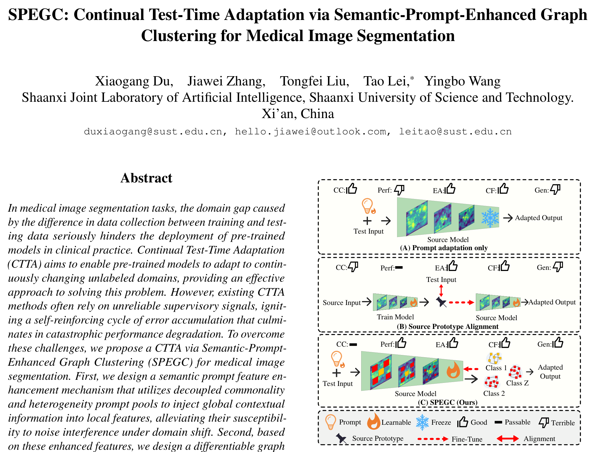

## 一、论文出处

SPEGC 出自 CVPR 2026 的论文 *SPEGC: Continual Test-Time Adaptation via Semantic-Prompt-Enhanced Graph Clustering for Medical Image Segmentation*（arXiv:2603.11492v1）。

先说清楚定位：这篇论文整体是一个面向**持续测试时自适应（Continual Test-Time Adaptation, CTTA）**的完整框架，解决的是医学图像分割模型在部署阶段遇到连续变化的无标注目标域时，如何在线适应、又不被错误监督信号带偏的问题。论文的核心痛点是：现有 CTTA 方法依赖不可靠的伪标签或熵最小化信号，容易形成"错误累积 → 性能崩溃"的自增强循环。

但本合集只关心一件事：**它里面那个可以单独抠出来、塞进任意分割网络的即插即用子模块**。我们把它命名为 SPEGC 模块，本质是一个**语义提示增强的图聚类块**——它接收特征图，输出经过语义提示调制、并在特征空间做图聚类聚合后的增强特征。框架里的教师-学生、记忆库、持续适应调度这些，都不属于本模块，本文不展开。

## 二、模块图（截自论文原文）



图注解读：输入特征先经过语义提示（semantic prompt）分支生成一组可学习的提示向量，与特征做交互得到语义增强表示；随后在特征像素/区域之间构建相似度图，做图聚类式的聚合，把语义相近的特征互相拉近、抑制域偏移带来的分布漂移，最后输出与原特征同形状的增强特征，可直接接回主干。

## 三、核心思想与作用

一句话概括：**用可学习的语义提示给特征"定锚"，再用图聚类把特征按语义结构重新聚合，从而在无标注、跨域的场景下稳住特征分布。**

拆开看有三层意思：

1. **语义提示（Semantic Prompt）**：一组可学习参数，充当"语义锚点"。它不依赖任何标签，靠反向传播或在线更新去逼近当前域下的语义中心。作用是给特征一个稳定的参照系，避免特征被目标域的噪声分布牵着走。

2. **图聚类（Graph Clustering）**：把特征图上的空间位置（或区域）看作图的节点，节点间相似度作为边权，做一次软聚类式的消息传递。语义相近的节点互相增强，语义离群的节点被抑制。这一步直接对抗的是域偏移导致的特征散乱。

3. **即插即用价值**：整个模块是"特征进、特征出"的形态，输入输出通道和空间尺寸保持一致，不改变主干的任何结构假设。你可以把它当成一个加强版的注意力/特征精炼块，插在编码器-解码器之间的瓶颈处，或者插在解码器的每一级。

它和普通注意力的区别在于：注意力是"按相关性加权"，而这里是"按语义结构聚类再聚合"，多了一个显式的语义锚定机制，这也是它在跨域场景下比纯注意力更稳的原因。

## 四、在 U-Net 里的插入位置

推荐两个位置，按性价比排序：

- **首选：瓶颈层（bottleneck）**。也就是编码器下采样到底、解码器上采样之前的那一层。这里空间分辨率最低、通道数最高，特征语义最抽象，做图聚类的计算量可控，语义提示的调制效果也最明显。跨域偏移在深层特征上体现得最集中，在这里纠偏收益最大。

- **次选：解码器每一级的上采样之后**。如果你显存和算力允许，可以在每个 skip connection 融合之后、进入下一个卷积块之前插入。这样能逐级修正特征分布，但计算量随分辨率上升而增加，低分辨率层插、高分辨率层慎插。

不建议插在编码器浅层：浅层特征以纹理、边缘为主，语义结构弱，图聚类意义不大，反而增加开销。

## 五、复现代码（PyTorch，逐行中文注释）

下面给出一个可直接运行的 SPEGC 模块实现。为保持即插即用，输入输出形状完全一致。

```python
import torch
import torch.nn as nn
import torch.nn.functional as F


class SPEGC(nn.Module):
    """
    Semantic-Prompt-Enhanced Graph Clustering 模块（即插即用版）。
    输入:  (B, C, H, W)
    输出:  (B, C, H, W)  形状不变，可直接接回主干。
    """

    def __init__(self, channels, num_prompts=8, reduction=4, temperature=0.1):
        super().__init__()
        self.channels = channels
        self.num_prompts = num_prompts          # 语义提示向量的个数（语义锚点数量）
        self.temperature = temperature          # 图聚类 softmax 的温度系数，越小越"硬"

        # ---- 语义提示分支 ----
        # 一组可学习的提示向量，形状 (num_prompts, channels)，充当语义锚点
        self.prompts = nn.Parameter(torch.randn(num_prompts, channels) * 0.02)

        # 把提示向量投影成 query，把输入特征投影成 key/value，做提示-特征交互
        self.to_q = nn.Conv2d(channels, channels, 1)   # 特征 -> query
        self.to_k = nn.Linear(channels, channels)      # 提示 -> key
        self.to_v = nn.Linear(channels, channels)      # 提示 -> value

        # ---- 特征精炼 ----
        # 交互后的语义增强特征与原特征融合，用 1x1 卷积降维再升维，控制参数量
        self.fuse = nn.Sequential(
            nn.Conv2d(channels * 2, channels // reduction, 1, bias=False),
            nn.BatchNorm2d(channels // reduction),
            nn.GELU(),
            nn.Conv2d(channels // reduction, channels, 1, bias=False),
        )

        # ---- 图聚类聚合 ----
        # 用可学习的缩放因子控制聚类残差强度，初始化为小值，保证训练初期接近恒等映射
        self.gamma = nn.Parameter(torch.zeros(1))

    def forward(self, x):
        B, C, H, W = x.shape
        N = H * W  # 空间位置数量，即图节点数

        # ===== 1. 语义提示增强 =====
        # 特征投影为 query: (B, C, H, W) -> (B, N, C)
        q = self.to_q(x).flatten(2).transpose(1, 2)          # (B, N, C)

        # 提示向量投影为 key / value: (P, C) -> (P, C)
        k = self.to_k(self.prompts)                          # (P, C)
        v = self.to_v(self.prompts)                          # (P, C)

        # 提示-特征注意力：每个空间位置对每个语义锚点的响应
        # (B, N, C) @ (C, P) -> (B, N, P)
        attn = torch.matmul(q, k.t()) / (C ** 0.5)
        attn = F.softmax(attn, dim=-1)                       # 在提示维度归一化

        # 用响应加权聚合提示向量，得到语义增强特征: (B, N, P) @ (P, C) -> (B, N, C)
        semantic = torch.matmul(attn, v)                     # (B, N, C)
        semantic = semantic.transpose(1, 2).reshape(B, C, H, W)  # 还原成特征图

        # 与原特征拼接后融合，得到语义增强后的特征
        enhanced = self.fuse(torch.cat([x, semantic], dim=1))    # (B, C, H, W)

        # ===== 2. 图聚类聚合 =====
        # 把增强特征展平为节点: (B, C, N)
        feat = enhanced.flatten(2)                           # (B, C, N)

        # 计算节点间相似度图: (B, N, N)，用点积相似度
        # 先做 L2 归一化，让相似度落在 [-1, 1]，数值更稳
        feat_norm = F.normalize(feat, dim=1)                 # (B, C, N)
        sim = torch.matmul(feat_norm.transpose(1, 2), feat_norm)  # (B, N, N)

        # 温度缩放 + softmax，得到软聚类分配矩阵（每个节点对各节点的归属权重）
        adj = F.softmax(sim / self.temperature, dim=-1)      # (B, N, N)

        # 图聚类消息传递：按归属权重聚合节点特征
        clustered = torch.matmul(feat, adj.transpose(1, 2))  # (B, C, N)
        clustered = clustered.reshape(B, C, H, W)            # 还原成特征图

        # ===== 3. 残差输出 =====
        # gamma 初始为 0，训练初期输出等于 enhanced，随训练逐步引入聚类修正
        out = enhanced + self.gamma * clustered
        return out
```

几个实现上的说明：

- `prompts` 用 `randn * 0.02` 初始化，避免初始响应过于尖锐。
- `gamma` 初始化为 0，这是关键——保证模块插入预训练网络时，一开始不破坏原有特征，训练稳定后再逐步生效。
- 相似度图是 `N × N`，`N = H × W`。瓶颈层分辨率低时没问题，高分辨率层要小心显存。

## 六、插入示例（几行塞进你的网络）

假设你有一个标准 U-Net，想在瓶颈层插入 SPEGC：

```python
class UNetWithSPEGC(nn.Module):
    def __init__(self, in_ch=1, num_classes=2, base_ch=64):
        super().__init__()
        # ... 这里省略编码器、解码器定义 ...
        self.bottleneck_ch = base_ch * 8          # 瓶颈层通道数
        self.spegc = SPEGC(self.bottleneck_ch)    # 实例化即插即用模块

    def forward(self, x):
        # ... 编码器下采样 ...
        feat = self.encoder(x)                    # 到达瓶颈层特征
        feat = self.spegc(feat)                   # 一行插入，形状不变
        # ... 解码器上采样 ...
        return self.decoder(feat)
```

如果要在解码器每一级插入，把 `SPEGC(ch)` 放进对应层的 `forward` 里，注意通道数要匹配该级特征通道。

## 七、实测经验与注意点

1. **gamma 初始化必须为 0**。这是插入预训练模型不崩的前提。如果直接随机初始化 gamma，模块一上来就大幅改动特征，预训练权重白费。

2. **图聚类的计算量是 O(N²)**。瓶颈层 `H=W=16` 时 `N=256`，`256×256` 的相似度矩阵完全可接受；但如果你插在 `H=W=128` 的层，`N=16384`，矩阵是 `16384²`，显存直接爆。高分辨率层要么别插，要么先做下采样再算相似度。

3. **温度系数 `temperature` 要调**。默认 0.1 偏"硬"，聚类分配接近 one-hot；如果发现训练不稳，调大到 0.5~1.0 让分配更平滑。这个参数对效果影响不小，建议作为超参搜索的一项。

4. **提示数量 `num_prompts` 不是越多越好**。8~16 通常够用。太多会让语义锚点冗余、注意力分散，还增加参数量。

5. **跨域收益 > 同域收益**。这个模块的设计初衷是对抗域偏移，所以在同分布数据上提升可能不明显，甚至因为额外参数带来轻微过拟合。它的价值在测试域和训练域分布不一致时才体现出来。别拿同域实验去否定它。

6. **和 BN 的配合**。模块里用了 BatchNorm，在 CTTA 场景下 BN 统计量的更新策略本身就很关键。如果你的框架对 BN 有特殊处理（比如冻结、或者用测试时统计量），要保证模块内的 BN 和主干策略一致，否则会引入额外的不稳定。

7. **别把它当成万能注意力**。它比普通注意力重，收益集中在语义结构纠偏上。如果你的任务本身域偏移很小，用轻量注意力性价比更高。

## 八、完整工程

把上面的模块封装成一个独立文件，方便直接 import：

```python
# spegc.py
import torch
import torch.nn as nn
import torch.nn.functional as F


class SPEGC(nn.Module):
    def __init__(self, channels, num_prompts=8, reduction=4, temperature=0.1):
        super().__init__()
        self.channels = channels
        self.num_prompts = num_prompts
        self.temperature = temperature

        self.prompts = nn.Parameter(torch.randn(num_prompts, channels) * 0.02)
        self.to_q = nn.Conv2d(channels, channels, 1)
        self.to_k = nn.Linear(channels, channels)
        self.to_v = nn.Linear(channels, channels)

        self.fuse = nn.Sequential(
            nn.Conv2d(channels * 2, channels // reduction, 1, bias=False),
            nn.BatchNorm2d(channels // reduction),
            nn.GELU(),
            nn.Conv2d(channels // reduction, channels, 1, bias=False),
        )
        self.gamma = nn.Parameter(torch.zeros(1))

    def forward(self, x):
        B, C, H, W = x.shape
        N = H * W

        q = self.to_q(x).flatten(2).transpose(1, 2)
        k = self.to_k(self.prompts)
        v = self.to_v(self.prompts)

        attn = F.softmax(torch.matmul(q, k.t()) / (C ** 0.5), dim=-1)
        semantic = torch.matmul(attn, v).transpose(1, 2).reshape(B, C, H, W)

        enhanced = self.fuse(torch.cat([x, semantic], dim=1))

        feat = enhanced.flatten(2)
        feat_norm = F.normalize(feat, dim=1)
        sim = torch.matmul(feat_norm.transpose(1, 2), feat_norm)
        adj = F.softmax(sim / self.temperature, dim=-1)
        clustered = torch.matmul(feat, adj.transpose(1, 2)).reshape(B, C, H, W)

        return enhanced + self.gamma * clustered
```

使用方式：

```python
from spegc import SPEGC

# 在任意通道数为 C 的特征处插入
block = SPEGC(channels=512, num_prompts=8, temperature=0.1)
y = block(x)   # x: (B, 512, H, W) -> y: (B, 512, H, W)
```

工程建议：

- 把 `SPEGC` 单独放一个文件，方便在多个网络里复用。
- 训练时把 `gamma` 和 `prompts` 的学习率单独设大一点（比如主干的 5~10 倍），因为它们是从零/小值开始学的新参数，需要更快收敛。
- 如果做 CTTA，`prompts` 可以在测试时在线更新，`gamma` 建议冻结，避免测试阶段引入不稳定。

这个模块的定位就是"一个能塞进 U-Net 瓶颈层的特征精炼块"，别把它和整篇论文的 CTTA 框架混为一谈。框架负责调度和适应策略，模块负责特征层面的语义锚定与聚类纠偏，两者职责分开，你只取模块即可。
