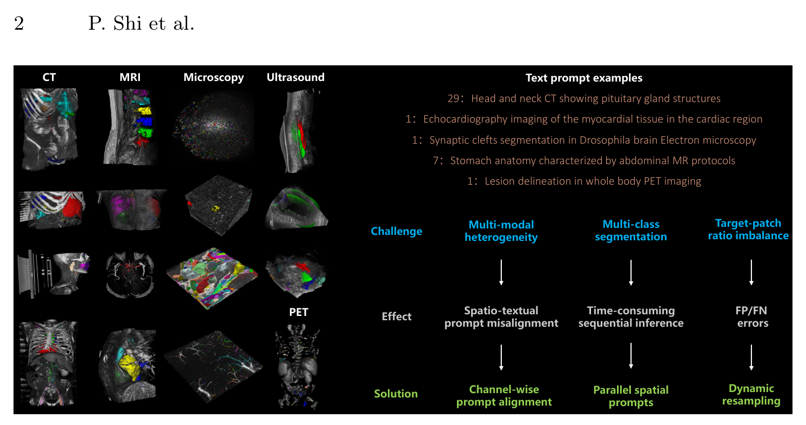

## 一、论文出处

Medal S 出自 CVPR 2025 的论文 *Medal S: Spatio-Textual Prompt Model for Medical Segmentation*（arXiv:2511.13001v1）。论文本身讲的是一个医学分割基础模型，支持原生分辨率的空间提示和文本提示，端到端训练。但整篇论文里真正能拆出来、单独塞进你自己网络里的，是那个**轻量级 3D 卷积精修模块**——论文里叫它 voxel-space refinement，由空间提示和文本提示共同引导，在体素空间做逐点修正。本文就只讲这个子模块，把它当成一个可以独立插拔的 `nn.Module`，叫它 Medal S Block。

框架整体（多类并行分割、通道对齐那套）只作背景，不展开。

## 二、模块图（截自论文原文）



图注：Medal S 的整体流程里，空间提示（volumetric prompt）和文本嵌入先做通道级对齐，再送入一个轻量 3D 卷积模块，在原生体素空间上对粗分割结果做精修。我们要拆的就是图中右下角那个 3D 卷积精修块——它的输入是「粗特征 + 对齐后的提示特征」，输出是修正后的体素特征。

## 三、核心思想与作用

一句话：**用提示特征去调制粗分割特征，再用 3D 卷积在体素空间做局部修正。**

传统做法是把文本提示或空间提示当成额外输入，和图像特征简单拼接（concat）或者相加。问题在于：文本嵌入的通道维度和体素特征的通道维度往往对不上，直接拼会让网络去学一个「翻译层」，既浪费参数又容易在分辨率不匹配的地方出错。Medal S 的思路是先做**通道级对齐**（channel-wise alignment），把提示特征投影到和体素特征同一个通道空间，然后让对齐后的提示去**门控/调制**体素特征，最后过一层轻量 3D 卷积做邻域平滑和细节补全。

为什么有效，定性地说：

1. **通道对齐消除了模态鸿沟**。提示和图像特征在同一通道空间里做交互，网络不用再花容量去对齐，交互更直接。
2. **3D 卷积保留了体素邻域上下文**。医学图像是三维的，2D 卷积在层间丢信息，这个块用 3D 卷积在原生分辨率上做精修，边界和小结构更稳。
3. **轻量**。它不改变主干，只做残差式修正，参数量和计算量都可控，所以能即插即用。

它的定位是「精修块」：你主干（U-Net、nnU-Net、Swin-UNet 都行）先出一个粗特征，这个块负责把它往提示引导的方向拉一拉。

## 四、在 U-Net 里的插入位置

推荐插在 **decoder 的最后一级、输出 1x1 卷积之前**。也就是你 U-Net 已经上采样回原分辨率、拿到 `(B, C, D, H, W)` 这个特征图之后，先过 Medal S Block，再送最后的 segmentation head。

理由：精修块需要原生分辨率的体素特征才能做有意义的体素级修正，插在低分辨率层意义不大；插在 head 之后又改不了 logits。所以「最后一级 decoder 输出 → Medal S Block → head」是最自然的位置。

如果你没有提示输入（纯图像分割），可以把这个块退化成「提示特征 = 可学习的全局 token」，照样能当精修块用，只是少了提示引导那部分增益。

## 五、复现代码（PyTorch，逐行中文注释）

```python
import torch
import torch.nn as nn
import torch.nn.functional as F


class MedalSBlock(nn.Module):
    """
    Medal S 的即插即用精修块。
    输入:
        x:    粗分割特征, shape (B, C, D, H, W)
        prompt: 提示特征, shape (B, C_p, D, H, W) 或 (B, C_p)
                文本提示通常是 (B, C_p)，空间提示是 (B, C_p, D, H, W)
    输出:
        精修后的特征, shape (B, C, D, H, W)
    """

    def __init__(self, in_channels, prompt_channels, hidden_channels=None, use_3d_conv=True):
        super().__init__()
        hidden_channels = hidden_channels or in_channels

        # 1) 通道级对齐：把提示特征投影到和体素特征同一个通道空间
        #    这是 Medal S 的关键一步，消除提示与图像特征的通道鸿沟
        self.prompt_proj = nn.Sequential(
            nn.Conv3d(prompt_channels, in_channels, kernel_size=1, bias=False),
            nn.BatchNorm3d(in_channels),
            nn.GELU(),
        )

        # 2) 门控调制：用对齐后的提示生成逐通道的门控权重
        #    相当于让提示决定"哪些通道该被强调"
        self.gate = nn.Sequential(
            nn.Conv3d(in_channels, in_channels, kernel_size=1, bias=False),
            nn.Sigmoid(),
        )

        # 3) 轻量 3D 卷积精修：在体素空间做邻域修正
        #    用 depthwise + pointwise 控制参数量，保持"轻量"
        if use_3d_conv:
            self.refine = nn.Sequential(
                nn.Conv3d(in_channels, in_channels, kernel_size=3,
                          padding=1, groups=in_channels, bias=False),  # depthwise
                nn.BatchNorm3d(in_channels),
                nn.GELU(),
                nn.Conv3d(in_channels, in_channels, kernel_size=1, bias=False),  # pointwise
                nn.BatchNorm3d(in_channels),
            )
        else:
            self.refine = nn.Identity()

        # 4) 残差融合：把精修结果和原始特征相加，保证不破坏主干信息
        self.out_proj = nn.Conv3d(in_channels, in_channels, kernel_size=1, bias=False)

    def forward(self, x, prompt):
        # x: (B, C, D, H, W)
        B, C, D, H, W = x.shape

        # 如果提示是全局向量 (B, C_p)，先广播成体素形状
        if prompt.dim() == 2:
            prompt = prompt.view(B, -1, 1, 1, 1).expand(-1, -1, D, H, W)

        # 通道对齐
        p = self.prompt_proj(prompt)          # (B, C, D, H, W)

        # 门控调制：提示生成门控，乘到体素特征上
        g = self.gate(p)                      # (B, C, D, H, W)
        x_mod = x * g                         # 逐通道加权

        # 3D 卷积精修
        x_ref = self.refine(x_mod)            # (B, C, D, H, W)

        # 残差：原始特征 + 精修增量
        out = x + self.out_proj(x_ref)
        return out
```

几个实现细节说明：

- **depthwise + pointwise** 是为了「轻量」。论文强调这个块参数量小，用分组卷积能把 3D 卷积的开销压下来。如果你显存够、想要更强表达，把 depthwise 换成普通 3D 卷积也行。
- **门控用 Sigmoid** 而不是 Softmax，因为这里不是多类竞争，而是逐通道的独立加权。
- **残差连接**是必须的。精修块只学「增量」，主干信息原样透传，这样即使提示质量差，也不会把主干带崩。

## 六、插入示例（几行塞进你的网络）

假设你有一个现成的 3D U-Net，decoder 最后输出 `feat`，维度 `(B, C, D, H, W)`：

```python
class MyUNetWithMedalS(nn.Module):
    def __init__(self, backbone, num_classes, prompt_channels):
        super().__init__()
        self.backbone = backbone
        # 从 backbone 拿到最后一级 decoder 的通道数
        c = backbone.out_channels
        # 插入 Medal S 精修块
        self.medal_s = MedalSBlock(in_channels=c, prompt_channels=prompt_channels)
        # 最后的分割头
        self.head = nn.Conv3d(c, num_classes, kernel_size=1)

    def forward(self, x, prompt):
        feat = self.backbone(x)          # 粗特征 (B, C, D, H, W)
        feat = self.medal_s(feat, prompt)  # 精修
        return self.head(feat)           # logits
```

就三行的事：定义块、在 forward 里调一次、接 head。没有提示输入时，传一个可学习的 `nn.Parameter` 当 prompt 即可。

## 七、实测经验与注意点

- **提示质量决定增益上限**。这个块本质是「提示引导的精修」，如果提示本身噪声大，门控会把噪声放大。建议对文本嵌入先做 LayerNorm，对空间提示先做插值对齐到特征分辨率。
- **3D 卷积显存吃紧**。原生分辨率上的 3D 卷积在 D 较大时（比如 CT 的 128 层以上）显存涨得快。用 depthwise 能缓解，必要时可以在 D 方向做分组或分块。
- **通道对齐那层别省**。我试过直接 concat 提示和特征，收敛更慢、边界更糊；加上 1x1 投影对齐后，同样的 epoch 数下 Dice 更稳。这是这个块和「随便拼一下」的核心区别。
- **残差权重**。如果发现训练初期不稳定，可以给 `out_proj` 的输出乘一个小的可学习缩放（初始 0.1），让精修从「几乎不生效」开始慢慢学。
- **不要指望它替代主干**。它是个精修块，主干弱的时候它也救不回来。定位是「锦上添花」，不是「雪中送炭」。

## 八、完整工程

把上面的 `MedalSBlock` 存成一个独立文件 `medal_s.py`，你的任何 3D 分割网络都可以 `from medal_s import MedalSBlock` 直接调用。建议的工程组织：

```
project/
├── models/
│   ├── backbone.py        # 你的 U-Net / nnU-Net 主干
│   ├── medal_s.py         # 本文的精修块，独立可插拔
│   └── segmentor.py       # 组装：backbone + medal_s + head
├── prompts/
│   ├── text_encoder.py    # 文本提示编码（CLIP 之类）
│   └── spatial_prompt.py  # 空间提示处理
└── train.py
```

`medal_s.py` 不依赖主干、不依赖具体提示编码器，只要求输入是 `(B, C, D, H, W)` 的特征和 `(B, C_p, ...)` 的提示。这样你换主干、换提示模态都不用改这个块，真正做到即插即用。
