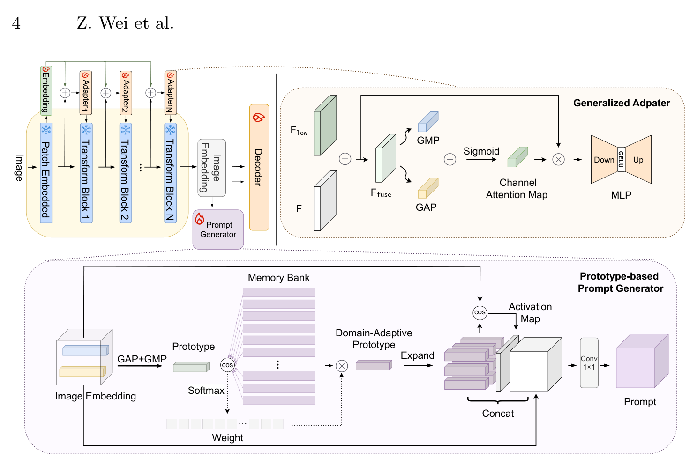

## 一、论文出处

- 论文：Prompting Segment Anything Model with Domain-Adaptive Prototype for Generalizable Medical Image Segmentation
- 会议：MICCAI 2024
- 链接：https://arxiv.org/abs/2409.12522v1

这篇论文整体是一个叫 DAPSAM 的微调框架，用来把 SAM 适配到医学图像的单源域泛化（SDG）任务上。但整篇框架不是我们要讲的东西——我们要拆的是里面那个**可插拔的子模块：域自适应原型提示块（Domain-Adaptive Prototype Prompt, DAPP）**。它做的事情很干净：拿一组可学习的、按域统计出来的原型向量，去生成 prompt token，喂给 SAM 的 prompt encoder。这个块本身可以脱离 SAM 单独存在，也可以塞进任何带 prompt / 条件分支的分割网络里，甚至能当一种"可学习条件嵌入"用在 U-Net 的 bottleneck 上。

## 二、模块图（截自论文原文）



图注：图中核心是原型提示生成这条支路——图像特征先经过原型匹配/聚合，得到域自适应原型，再由它生成 prompt 向量注入到分割主干。我们关注的就是这条支路里那个可独立抽出来的模块，而不是整个 DAPSAM 训练流程。

## 三、核心思想与作用

一句话概括：**用一组可学习的原型向量，把"当前输入属于哪个域"这件事编码成 prompt，去调制分割网络的特征。**

传统域泛化方法要么做数据增强（风格迁移、频域扰动），要么做特征对齐（对抗、MMD），要么堆很重的解耦结构。这些方法的问题是对每个新域都得重新设计或重新训练。DAPP 换了个思路：不显式对齐特征，而是维护一个原型库（prototype bank），每个原型是一段可学习的向量，代表一种"域风格"或"域语义模式"。输入图像的特征和这些原型做相似度匹配，加权聚合出当前样本的域自适应原型，再投影成 prompt token。

它为什么有效，我的理解有三点：

1. **原型是参数化的域先验**。相比从零学一个域分类器，原型库把"域"压缩成少量向量，参数量小、不易过拟合，在单源域泛化里尤其重要——你只有一个源域，硬学域判别器很容易崩。
2. **prompt 是一种轻量调制**。prompt token 注入主干时，改动的是条件信息而不是主干权重，所以插进已有网络时对原结构侵入很小，这也是它"即插即用"的根本原因。
3. **匹配是软性的**。softmax 加权聚合意味着一个样本可以同时沾多个原型，对域边界模糊的医学图像（不同设备、不同中心但解剖结构相似）更稳。

需要说清楚的是：这个模块本身不负责分割，它负责**生成条件**。分割能力还是来自被它调制的那个主干（SAM 或 U-Net）。所以把它当"即插即用模块"用时，你要接受它是个**条件生成器**，不是分割头。

## 四、在 U-Net 里的插入位置

有三种插法，按侵入程度从低到高：

1. **Bottleneck 条件注入（推荐）**：把 DAPP 的输出 prompt 向量，在 U-Net 最深层特征上做 cross-attention 或直接相加。改动最小，显存开销可控，适合先验证有没有效果。
2. **Skip connection 调制**：在每一层 skip 特征上注入对应尺度的 prompt。效果通常更好，但要为每个尺度准备 prompt 投影，参数和显存都涨。
3. **Decoder 条件融合**：只在 decoder 每一级注入。介于两者之间。

实际做实验时我建议先上第 1 种。因为 DAPP 的原型匹配依赖全局语义，浅层特征语义弱，硬塞进去收益不明显还容易训不稳。深层特征语义强，和原型匹配更自然。

## 五、复现代码（PyTorch，逐行中文注释）

下面是一个可独立使用的 `DomainAdaptivePrototypePrompt`，输入是主干特征图，输出是同形状的调制后特征（内部完成原型匹配 + prompt 生成 + 注入）。为了通用，注入方式用 cross-attention，你也可以换成相加。

```python
import torch
import torch.nn as nn
import torch.nn.functional as F


class DomainAdaptivePrototypePrompt(nn.Module):
    """
    域自适应原型提示块（DAPP 的可插拔版本）。
    输入: 主干特征 x, 形状 [B, C, H, W]
    输出: 被 prompt 调制后的特征, 形状 [B, C, H, W]
    """

    def __init__(self, channels, num_prototypes=8, prompt_dim=128, num_heads=4):
        super().__init__()
        self.channels = channels
        self.num_prototypes = num_prototypes

        # 原型库: 每个原型是一段可学习向量, 维度等于特征通道数
        # 用 nn.Parameter 而不是 buffer, 因为要参与梯度更新
        self.prototypes = nn.Parameter(torch.randn(num_prototypes, channels) * 0.02)

        # 把特征投影到匹配空间, 避免直接在高维通道上算相似度
        self.feat_proj = nn.Conv2d(channels, prompt_dim, kernel_size=1)

        # 把聚合后的原型投影成 prompt token
        self.prompt_proj = nn.Sequential(
            nn.Linear(channels, prompt_dim),
            nn.GELU(),
            nn.Linear(prompt_dim, prompt_dim),
        )

        # cross-attention: query 来自特征, key/value 来自 prompt
        self.attn = nn.MultiheadAttention(
            embed_dim=prompt_dim, num_heads=num_heads, batch_first=True
        )

        # 输出投影回原通道, 并做残差
        self.out_proj = nn.Linear(prompt_dim, channels)
        self.norm = nn.LayerNorm(channels)

    def forward(self, x):
        B, C, H, W = x.shape

        # 1) 特征投影到匹配空间: [B, C, H, W] -> [B, D, H, W]
        f = self.feat_proj(x)

        # 2) 展平成 token 序列: [B, D, H*W] -> [B, H*W, D]
        f_flat = f.flatten(2).transpose(1, 2)

        # 3) 原型投影到同一匹配空间: [P, C] -> [P, D]
        proto = self.prototypes  # [P, C]

        # 4) 计算每个 token 与每个原型的相似度: [B, H*W, P]
        #    用余弦相似度, 对尺度不敏感, 训练更稳
        f_norm = F.normalize(f_flat, dim=-1)
        p_norm = F.normalize(proto, dim=-1)
        sim = torch.einsum("bnd,pd->bnp", f_norm, p_norm)  # [B, N, P]

        # 5) softmax 得到软分配权重, 温度系数控制锐度
        weight = F.softmax(sim * 10.0, dim=-1)  # [B, N, P]

        # 6) 加权聚合原型, 得到每个位置的域自适应原型: [B, N, C]
        #    weight: [B, N, P], proto: [P, C]
        adaptive_proto = torch.einsum("bnp,pc->bnc", weight, proto)

        # 7) 生成 prompt token: [B, N, D]
        prompt = self.prompt_proj(adaptive_proto)

        # 8) cross-attention: 特征作 query, prompt 作 key/value
        attn_out, _ = self.attn(f_flat, prompt, prompt)  # [B, N, D]

        # 9) 投影回原通道并 reshape 回特征图: [B, N, C] -> [B, C, H, W]
        attn_out = self.out_proj(attn_out)  # [B, N, C]
        attn_out = attn_out.transpose(1, 2).reshape(B, C, H, W)

        # 10) 残差 + LayerNorm(在通道维上), 保证训练稳定
        out = x + attn_out
        out = out.permute(0, 2, 3, 1)  # [B, H, W, C]
        out = self.norm(out)
        out = out.permute(0, 3, 1, 2)  # [B, C, H, W]
        return out
```

几点说明：

- 原型库初始化用很小的随机值，避免一开始 softmax 就被某个原型主导。
- 相似度乘了温度 10.0，这个值可以调。太小则分配太软，太大则退化成硬聚类，单源域泛化里太硬反而不好。
- LayerNorm 放在通道维，是因为特征图空间维太大，用 BatchNorm 在小 batch 下不稳。

## 六、插入示例（几行塞进你的网络）

假设你有一个标准 U-Net，想在 bottleneck 处插入：

```python
class UNetWithDAPP(nn.Module):
    def __init__(self, in_ch=1, num_classes=2, base_ch=64):
        super().__init__()
        # ... 这里省略 encoder / decoder 定义 ...
        self.bottleneck_ch = base_ch * 8
        # 只加这一行, 就完成了插入
        self.dapp = DomainAdaptivePrototypePrompt(self.bottleneck_ch)

    def forward(self, x):
        # ... encoder 前向, 得到 bottleneck 特征 ...
        feat = self.bottleneck(x)          # [B, C, H, W]
        feat = self.dapp(feat)             # 一行调用, 形状不变
        # ... decoder 继续 ...
        return self.decoder(feat)
```

如果要在多尺度 skip 上插，就为每个尺度建一个 DAPP 实例，通道数对齐即可。注意每个尺度的 `num_prototypes` 可以不同，浅层少一点、深层多一点。

## 七、实测经验与注意点

- **原型数量别贪多**。单源域泛化场景下，源域本身风格就单一，原型开太多会退化成对源域的过拟合。我一般从 4 到 8 起步，超过 16 基本没增益。
- **匹配空间维度要够**。`prompt_dim` 太小（比如 32）时相似度区分度不够，原型会塌缩成一个。建议不低于 64。
- **训练初期原型会乱跳**。因为原型和主干一起从零训，前几个 epoch 分配权重接近均匀。可以加一个原型多样性正则（比如让原型两两余弦相似度尽量低），或者前几个 epoch 冻结原型只训主干。
- **它不是万能药**。DAPP 解决的是"域风格"层面的泛化，如果目标域的解剖结构本身就和源域差很远（比如源域是肝脏、目标域是脑），原型匹配帮不上忙，因为语义层面就对不上。
- **显存**。cross-attention 的复杂度是 token 数的平方。bottleneck 特征图如果还是 32×32，token 数 1024，还好；如果放到浅层 128×128，token 数 16384，attention 会爆显存。所以强烈建议只在深层用。
- **和 SAM 的关系**。原论文里 prompt 是喂给 SAM 的 prompt encoder 的。如果你不用 SAM，就把它当条件嵌入用，注入方式换成相加或 FiLM 也成立，效果取决于你的主干。

## 八、完整工程

一个可直接跑的最小工程结构如下，方便你复制到本地验证：

```
dapp_module/
├── model.py          # DomainAdaptivePrototypePrompt + 示例 U-Net
├── train.py          # 训练脚本
├── dataset.py        # 数据加载
└── configs/
    └── default.yaml  # 超参配置
```

`model.py` 就是上面第五节的代码加上一个简单 U-Net 封装。`train.py` 里关键是把 `self.dapp` 的参数加进优化器，学习率可以和主干一致，也可以单独给原型库更小的学习率（比如主干的 0.1 倍），因为原型更新太快会不稳定。

验证时建议做两件事：一是打印原型之间的余弦相似度矩阵，看有没有塌缩；二是可视化 softmax 分配权重，看不同域的样本是不是真的激活了不同原型。如果所有样本的分配都差不多，说明模块没学到域信息，得回头调温度或原型初始化。

这个模块的价值在于它把"域泛化"这件事从改网络结构变成了加一个轻量条件模块，插拔成本低，适合快速验证。但别指望它单独解决所有域偏移问题，它更像是一个便宜的、可组合的先验注入手段。
