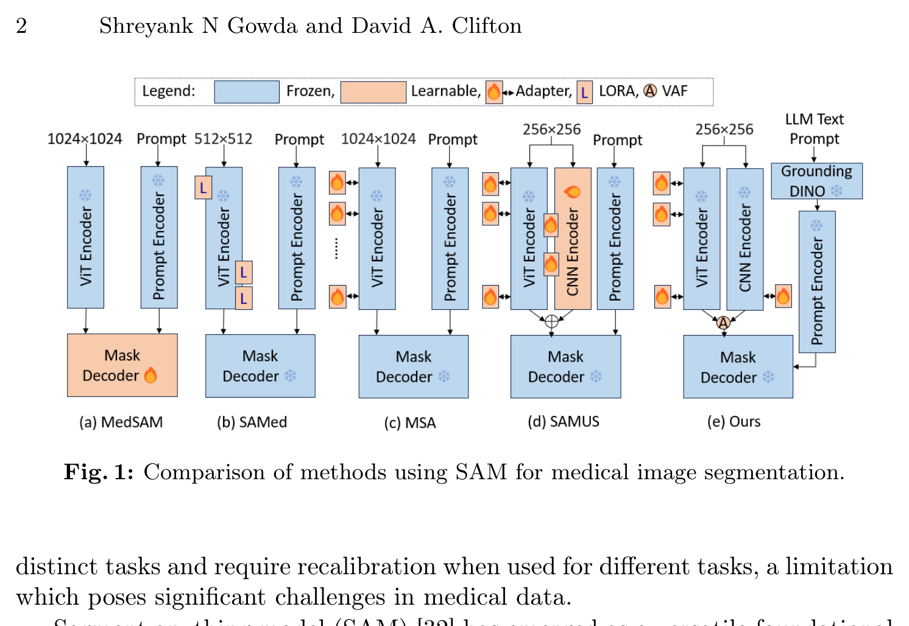

## 一、论文出处

- 论文：CC-SAM: SAM with Cross-feature Attention and Context for Ultrasound Image Segmentation
- 会议：ECCV 2024
- 链接：https://arxiv.org/abs/2408.00181v1

CC-SAM 整体是一个把 SAM 搬到超声分割上的完整框架：冻结的 CNN 分支做图像编码、跨特征注意力做融合、再加一个上下文模块补全局信息。但整篇论文里真正能"抠出来单独用"的，是那个叫 **CC（Context / Cross-feature Context）** 的上下文子模块。本文只讲这个子模块，框架本身一句带过：它是为了让 SAM 在低对比、弱边界、小目标的超声图上别那么拉胯。

## 二、模块图（截自论文原文）



图注：CC 的核心是一条"全局池化 → 瓶颈降维 → 再升维 → 与原特征相乘"的轻量通路。它不改变特征图的空间尺寸和通道数，只在通道维度上重新分配权重，本质是一个带瓶颈结构的通道上下文注意力。注意它和 SE 的区别：CC 强调的是把全局上下文压成一个紧凑描述子后再回注到特征上，用来补 SAM 那类大模型在医学图上缺失的全局一致性。

## 三、核心思想与作用

先说它想解决什么问题。超声图像有几个老大难：对比度低、边界糊、目标形状千奇百怪、还经常很小。SAM 这种在自然图像上训出来的大模型，局部纹理抓得不错，但对"这张图整体是什么器官、目标大概在哪一片区域"这种全局语义不敏感，容易在弱边界处糊成一片。

CC 的思路很朴素：**给每个通道算一个全局上下文权重**。具体做法是对特征图做全局平均池化，把 H×W 压成 1×1，得到一个通道描述子；然后用一个瓶颈（先降维再升维）学通道之间的非线性关系；最后 sigmoid 出权重，逐通道乘回原特征。这样每个通道都能"看到"整张图的统计信息，而不是只盯着自己那点局部感受野。

它为什么有效，我的判断是两点：

1. **补全局一致性**。医学图里同一个器官在不同位置的表现差异很大，纯局部卷积容易把同一目标的不同部分判成两类。全局池化把整图信息压进来，等于给每个位置一个"全局参照"。
2. **代价极低**。没有额外的大卷积核，没有自注意力那套 O(N²)，就是池化 + 两个 1×1 卷积。参数量和计算量都可以忽略，插进任何 backbone 都不心疼。

所以它的即插即用价值很直接：**任何通道数固定的特征图，塞进去就能用，输出形状不变，可以直接替换或串在卷积块后面。**

## 四、在 U-Net 里的插入位置

U-Net 的编码器每个 stage 输出一个特征图，解码器每个 stage 也有一个。CC 因为是通道注意力、不依赖空间尺寸，所以**编码器和解码器的每个 stage 后面都能插**。

我的建议是分两种用法：

- **省算力版**：只插在编码器最深的 1~2 个 stage（也就是分辨率最低、通道最多的那几层）。这里全局信息最有价值，而且特征图小，池化开销可以忽略。
- **全插版**：编码器 + 解码器每个 stage 都插。适合显存宽裕、追求精度的情况。解码器插的时候注意，它接在 skip connection 拼接之后，通道数会翻倍，CC 的 `channels` 参数要跟着改。

不要插在 bottleneck 之后又插在 decoder 第一层，那样同一份全局信息被重复注入，收益递减还多花时间。挑关键层插就行。

## 五、复现代码（PyTorch，逐行中文注释）

```python
import torch
import torch.nn as nn


class CC(nn.Module):
    """
    CC: Context / Cross-feature Context 模块（ECCV 2024, CC-SAM）
    即插即用的通道上下文注意力，输入输出形状完全一致。
    """

    def __init__(self, channels, reduction=16):
        super().__init__()
        # 瓶颈的中间维度，至少为 1，避免通道太少时降成 0
        hidden = max(channels // reduction, 1)

        # 全局平均池化：把 H×W 压成 1×1，得到每个通道的全局描述子
        self.gap = nn.AdaptiveAvgPool2d(1)

        # 瓶颈：先降维，学通道间的非线性关系，再升回原通道数
        self.fc = nn.Sequential(
            nn.Conv2d(channels, hidden, kernel_size=1, bias=False),  # 降维
            nn.ReLU(inplace=True),                                   # 非线性
            nn.Conv2d(hidden, channels, kernel_size=1, bias=False),  # 升维
        )

        # sigmoid 把权重压到 (0,1)，作为逐通道的缩放系数
        self.sigmoid = nn.Sigmoid()

    def forward(self, x):
        # x: (B, C, H, W)
        # 1) 全局上下文：每个通道一个标量
        context = self.gap(x)              # (B, C, 1, 1)

        # 2) 瓶颈建模通道间关系，再映射回 C 维权重
        weight = self.fc(context)          # (B, C, 1, 1)

        # 3) 归一化到 (0,1)
        weight = self.sigmoid(weight)      # (B, C, 1, 1)

        # 4) 逐通道相乘，广播回 H×W；形状不变
        return x * weight                  # (B, C, H, W)
```

这段代码里唯一需要你按自己网络调的就是 `channels` 和 `reduction`。`reduction=16` 是常见默认值，通道数很少（比如 16、32）时建议改成 8 或 4，否则瓶颈太窄学不动。

## 六、插入示例（几行塞进你的网络）

最省事的用法，直接串在一个卷积块后面：

```python
class ConvBlock(nn.Module):
    def __init__(self, in_ch, out_ch):
        super().__init__()
        self.conv = nn.Sequential(
            nn.Conv2d(in_ch, out_ch, 3, padding=1, bias=False),
            nn.BatchNorm2d(out_ch),
            nn.ReLU(inplace=True),
        )
        # 在卷积块输出后接一个 CC，通道数对齐 out_ch
        self.cc = CC(out_ch)

    def forward(self, x):
        x = self.conv(x)
        x = self.cc(x)   # 形状不变，直接返回
        return x
```

如果你只想在编码器深层插，可以这样：

```python
# 假设 enc4 输出 256 通道
self.cc_deep = CC(256)

# forward 里
f = self.enc4(x)
f = self.cc_deep(f)   # 只对深层特征做全局上下文增强
```

解码器接 skip 拼接后通道翻倍的情况：

```python
# up 之后与 skip 拼接，通道变成 512
x = torch.cat([up, skip], dim=1)   # (B, 512, H, W)
x = CC(512)(x)                     # channels 跟着改成 512
```

## 七、实测经验与注意点

- **形状一定不变**，这是它最好用的地方。你可以在任何地方插，不用担心后面层的通道对不上，也不用改 skip connection 的通道数。
- **别指望它单独涨很多点**。CC 是个"锦上添花"的模块，它补的是全局一致性，对边界细节帮助有限。如果你的问题主要是边界糊，光加 CC 不够，得配合边界相关的损失或模块。
- **reduction 别设太大**。通道数小的网络里，`channels // 16` 很容易变成 1 甚至 0，瓶颈退化成单通道，表达能力就没了。小网络建议 `reduction=4` 或 `8`。
- **插入层数要克制**。全插一遍通常比只插深层多花时间，但精度提升不一定成正比。我一般先只插编码器最深的两个 stage，看效果再决定要不要铺开。
- **和 SE 的关系**。CC 的结构和 SE 非常像，区别主要在论文里它被用来做跨特征/上下文的融合语境。如果你只是想要通道注意力，SE 也能用；CC 的价值在于它被验证过能配合 SAM 这类大模型补医学图的全局信息。复现时按上面的代码写就行，不用纠结名字。
- **训练稳定性**。sigmoid 权重初始接近 0.5，乘上去相当于把特征整体缩放，一般不会炸。如果发现训练初期 loss 抖动，可以在 CC 后面加个 BN 或者把 CC 放在 BN 之前。

## 八、完整工程

把上面的代码整理成一个可直接 import 的文件，方便你塞进自己的项目：

```python
# cc.py
import torch
import torch.nn as nn


class CC(nn.Module):
    """即插即用通道上下文模块（ECCV 2024, CC-SAM）"""

    def __init__(self, channels, reduction=16):
        super().__init__()
        hidden = max(channels // reduction, 1)
        self.gap = nn.AdaptiveAvgPool2d(1)
        self.fc = nn.Sequential(
            nn.Conv2d(channels, hidden, 1, bias=False),
            nn.ReLU(inplace=True),
            nn.Conv2d(hidden, channels, 1, bias=False),
        )
        self.sigmoid = nn.Sigmoid()

    def forward(self, x):
        w = self.sigmoid(self.fc(self.gap(x)))
        return x * w


if __name__ == "__main__":
    # 自测：形状不变
    x = torch.randn(2, 64, 32, 32)
    m = CC(64)
    y = m(x)
    print(y.shape)  # torch.Size([2, 64, 32, 32])
```

用法就三步：把 `cc.py` 拷进项目、在需要的层实例化 `CC(channels)`、在 forward 里把特征过一遍。没有别的依赖，也不需要改网络结构。
