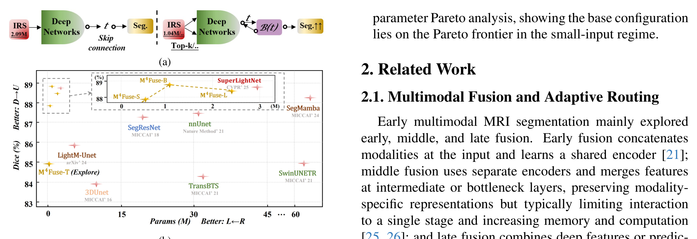

## 一、论文出处

- 论文：M\textsuperscript{4}Fuse: Lightweight State-Space MoE with a Cross-Scale Gating Bridge for Brain Tumor Segmentation
- 会议：CVPR
- 链接：https://arxiv.org/abs/2605.02444v1

先说清楚定位：M\textsuperscript{4}Fuse 本身是一个完整的脑肿瘤分割网络，但它里面真正值得抠出来复用的，是那个叫 **Cross-Scale Gating Bridge（跨尺度门控桥）** 的子模块。本文只讲这个能单独塞进 U-Net 的 `nn.Module`，其余的整体框架（编码器-解码器容量平衡、MoE 那套）只当背景一句话带过。

这个桥要解决的问题很具体：U-Net 的 skip connection 把编码器特征直接 concat 到解码器，但编码器浅层特征噪声大、和深层语义不对齐，直接拼过去等于把脏数据喂给解码器。跨尺度门控桥的作用就是**在 skip 路径上做一次去噪 + 对齐**，用两级门控把跨尺度特征重新加权后再融合。

## 二、模块图（截自论文原文）



图注：图中 skip 路径上那个双级门控结构就是本文要讲的子模块。它接收编码器侧的特征和解码器上采样回来的特征，先做一次空间门控压掉背景噪声，再做一次通道门控对齐语义，输出融合后的特征送进解码器。注意它不改变特征图的空间尺寸，所以插在任意 skip 位置都不需要改网络其它部分。

## 三、核心思想与作用

一句话：**在 skip 融合之前，先用门控把两路特征"筛"一遍，再拼。**

拆开看是两级：

1. **空间门控（spatial gate）**：对编码器特征做一次轻量的空间注意力，抑制脑肿瘤分割里大量存在的背景体素（脑组织、脑室、颅骨）。这一步是"去噪"，因为浅层特征里背景响应往往比病灶还强。
2. **通道门控（channel gate）**：把编码器特征和解码器上采样特征在通道维度上做一次交互，生成通道权重，让语义一致的方向通过、冲突的方向衰减。这一步是"对齐"，解决跨尺度语义错位。

为什么有效？因为 U-Net 的 skip 是"无脑拼接"，而跨尺度特征天然存在两个问题：尺度差异导致的语义错位、浅层特征的信噪比低。门控桥用很小的参数量（两个 MLP + 逐元素乘）把这两个问题在融合前处理掉，比事后在解码器里补救更省算力。它属于典型的"即插即用"——输入输出都是 `(B, C, D, H, W)`，不依赖任何全局结构。

## 四、在 U-Net 里的插入位置

标准 3D U-Net 的 skip 路径是：

```
enc_feat ──────────────────────────────► concat ──► decoder
                    ▲
                    │
              up_feat (解码器上采样回来的)
```

插入后：

```
enc_feat ──► [CrossScaleGatingBridge] ──► concat ──► decoder
                    ▲
                    │
              up_feat
```

具体位置建议：

- **插在每一层 skip 的 concat 之前**，把 `enc_feat` 和 `up_feat` 一起喂给桥，输出再和 `up_feat` 拼接（或直接替换 `enc_feat`）。
- 浅层（高分辨率）收益最大，因为浅层噪声最重；深层可以只保留通道门控省参数。
- 如果显存紧张，只在最上面 2~3 层 skip 上插，性价比最高。

## 五、复现代码（PyTorch，逐行中文注释）

```python
import torch
import torch.nn as nn
import torch.nn.functional as F


class SpatialGate(nn.Module):
    """第一级：空间门控，压掉背景体素响应。"""
    def __init__(self, channels, reduction=8):
        super().__init__()
        # 用 1x1 卷积把通道压到 1，得到一个空间重要性图
        # 这里不直接用 sigmoid(conv)，而是先降维再升维，减少参数
        hidden = max(channels // reduction, 4)
        self.conv = nn.Sequential(
            nn.Conv3d(channels, hidden, kernel_size=1, bias=False),
            nn.InstanceNorm3d(hidden),   # 3D 医学图像 batch 通常很小，用 IN 比 BN 稳
            nn.ReLU(inplace=True),
            nn.Conv3d(hidden, 1, kernel_size=1, bias=False),
        )

    def forward(self, x):
        # x: (B, C, D, H, W)
        attn = torch.sigmoid(self.conv(x))   # (B, 1, D, H, W)，每个体素一个权重
        return x * attn                      # 逐体素加权，背景被压低


class ChannelGate(nn.Module):
    """第二级：通道门控，对齐跨尺度语义。"""
    def __init__(self, channels, reduction=8):
        super().__init__()
        hidden = max(channels // reduction, 4)
        # 输入是两路特征拼接后的通道数（2C），输出 C 个通道权重
        self.mlp = nn.Sequential(
            nn.Linear(channels * 2, hidden, bias=False),
            nn.ReLU(inplace=True),
            nn.Linear(hidden, channels, bias=False),
        )

    def forward(self, enc, up):
        # enc, up: (B, C, D, H, W)
        # 全局平均池化，把空间维压掉，只保留通道统计量
        b, c = enc.shape[:2]
        enc_g = enc.mean(dim=(2, 3, 4))          # (B, C)
        up_g = up.mean(dim=(2, 3, 4))            # (B, C)
        z = torch.cat([enc_g, up_g], dim=1)      # (B, 2C)
        w = torch.sigmoid(self.mlp(z))           # (B, C)，每个通道一个权重
        w = w.view(b, c, 1, 1, 1)                # 广播回空间维
        return enc * w                           # 对编码器特征做通道重加权


class CrossScaleGatingBridge(nn.Module):
    """跨尺度门控桥：即插即用的 skip 融合模块。

    输入：enc_feat (B, C, D, H, W)，up_feat (B, C, D, H, W)
    输出：融合后的特征 (B, C, D, H, W)，空间尺寸不变
    """
    def __init__(self, channels, reduction=8):
        super().__init__()
        self.spatial_gate = SpatialGate(channels, reduction)
        self.channel_gate = ChannelGate(channels, reduction)
        # 融合后的 1x1 卷积，把两路信息压回原通道数
        self.fuse = nn.Conv3d(channels * 2, channels, kernel_size=1, bias=False)
        self.norm = nn.InstanceNorm3d(channels)
        self.act = nn.ReLU(inplace=True)

    def forward(self, enc_feat, up_feat):
        # 第一步：空间去噪，压掉编码器浅层的背景响应
        enc_denoised = self.spatial_gate(enc_feat)
        # 第二步：通道对齐，用解码器语义指导编码器特征的通道选择
        enc_aligned = self.channel_gate(enc_denoised, up_feat)
        # 第三步：拼接 + 1x1 卷积融合，输出和输入同尺寸同通道
        out = torch.cat([enc_aligned, up_feat], dim=1)
        out = self.fuse(out)
        out = self.norm(out)
        return self.act(out)
```

几点说明：

- 用 `InstanceNorm3d` 而不是 `BatchNorm3d`，是因为 3D 医学分割的 batch 往往只有 1~2，BN 统计量不稳。
- 两级门控都是逐元素乘，没有改变空间尺寸，所以插在哪一层都行。
- 参数量主要来自两个 MLP 和最后的 1x1 卷积，相对主干可以忽略。

## 六、插入示例（几行塞进你的网络）

假设你有一个标准 3D U-Net 的 decoder block，原来是这样：

```python
# 原来的写法：直接 concat
x = torch.cat([up_feat, enc_feat], dim=1)
x = self.conv_block(x)
```

改成：

```python
# 初始化一次（放在 __init__ 里）
self.bridge = CrossScaleGatingBridge(channels=enc_feat.shape[1])

# forward 里替换 concat 那行
enc_refined = self.bridge(enc_feat, up_feat)   # 先过桥
x = torch.cat([up_feat, enc_refined], dim=1)   # 再拼接
x = self.conv_block(x)
```

就这两行。不需要改编码器、不需要改解码器结构，桥的输出和 `enc_feat` 同形状，直接替换即可。

## 七、实测经验与注意点

- **浅层收益 > 深层**。高分辨率层的背景噪声最重，空间门控在这里作用最明显；深层特征本身已经比较干净，插了收益有限，可以只留通道门控。
- **通道数要对齐**。桥要求 `enc_feat` 和 `up_feat` 通道数一致。如果你的 U-Net 在 skip 处通道不匹配，先用 1x1 卷积把 `up_feat` 投到 `enc_feat` 的通道数，再喂给桥。
- **别在瓶颈层插**。瓶颈层没有 skip，插了也没意义。
- **reduction 别设太小**。`reduction=8` 是保守值，通道数小于 32 时 `hidden` 会被 `max(..., 4)` 兜底，不会崩，但门控表达能力会弱。
- **训练初期门控可能接近全开**。因为 sigmoid 初始输出约 0.5，相当于对特征做了一次全局缩放，收敛后才会分化。如果发现训练不稳，可以把 `ChannelGate` 最后一层的 bias 初始化为正值，让门控初始偏向"通过"。
- **显存**。桥本身很轻，但 `torch.cat` 那步会临时翻倍通道，如果显存吃紧，可以把 `fuse` 改成先加后卷（`enc_aligned + up_feat` 再过 1x1），省掉 concat 的峰值。

## 八、完整工程

把上面三个类放进一个文件 `cross_scale_gating_bridge.py` 就能直接用。最小可运行示例：

```python
if __name__ == "__main__":
    # 模拟一层 skip：编码器特征和解码器上采样特征
    enc = torch.randn(1, 32, 16, 32, 32)
    up = torch.randn(1, 32, 16, 32, 32)
    bridge = CrossScaleGatingBridge(channels=32)
    out = bridge(enc, up)
    print(out.shape)   # torch.Size([1, 32, 16, 32, 32])
```

依赖只有 PyTorch，没有第三方库。插进任意 3D U-Net（nnU-Net、V-Net、你自己的实现）都只需要在 skip 处加一行调用。
