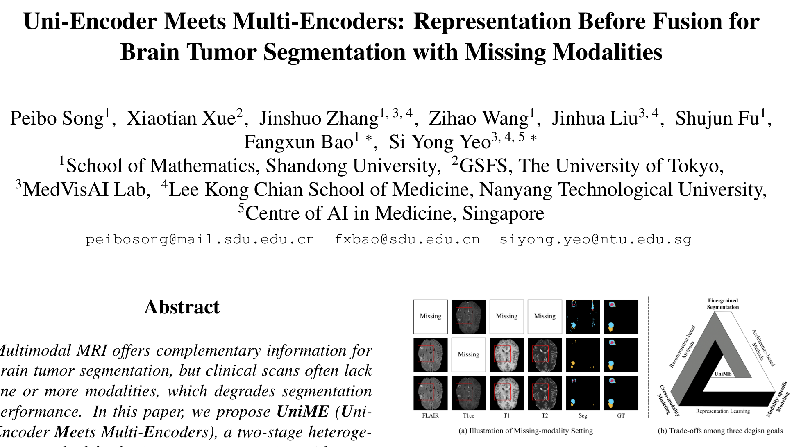

## 一、论文出处

- 论文：Uni-Encoder Meets Multi-Encoders: Representation Before Fusion for Brain Tumor Segmentation with Missing Modalities
- 会议：CVPR
- 链接：https://arxiv.org/abs/2604.22177v1
- 代码：https://github.com/Hooorace-S/UniME

这篇论文整体叫 UniME，是一个两阶段的异构框架：Stage 1 用掩码图像建模（MIM）预训练一个 ViT 单编码器（Uni-Encoder），得到一个对缺失模态鲁棒的统一表示；Stage 2 再挂上模态专属的 CNN 多编码器（Multi-Encoders），把高分辨率、多尺度的细节特征和全局表示融合起来做分割。

但按本合集的定位，我们**不讲整个 UniME 框架**，只拆出其中那个真正能单独塞进 U-Net 的可插拔子模块——也就是 Stage 1 里那个 **Uni-Encoder 表示块**（下文简称 **Uni**）。它的本质是一个「掩码重建预训练 + 全局 token 聚合」的表示学习块，可以独立插到任意分割网络的编码器前端或瓶颈处，用来补一个「对模态缺失不敏感」的全局表示。

## 二、模块图（截自论文原文）



图注解读：图中上半部分是 Stage 1 的 Uni-Encoder，输入被随机掩码掉一部分 patch，ViT 只对可见 patch 编码，再通过轻量解码器重建被掩掉的部分；训练完成后，编码器输出的全局 token（class token / 池化 token）就是那个「统一表示」。下半部分 Stage 2 才把模态专属 CNN 编码器和这个全局表示做融合。我们要复用的，就是上半部分这个能独立训练的表示块。

## 三、核心思想与作用

一句话概括：**先把「表示」学好，再去「融合」。**

传统缺失模态分割的做法是：有几个模态就搭几个编码器，然后在中间做融合。问题是模态一缺，融合层拿到的输入就少了一路，特征分布直接漂移，性能断崖式下跌。

Uni 的思路是反过来的——它不急着融合，而是先用自监督的方式（掩码图像建模）训练一个**单编码器**，让它学会「不管你给我哪几路模态，我都能抽出一个稳定的全局表示」。因为训练时输入本身就被随机掩码，模型被迫学会从残缺信息里恢复语义，所以推理时遇到模态缺失，它天然更鲁棒。

这个块的作用可以拆成三点：

1. **表示与分割解耦**：表示学习是独立的一阶段，不依赖分割标签，也不依赖模态是否齐全。
2. **对缺失模态鲁棒**：掩码训练让模型见过大量「信息不全」的样本，缺失模态只是另一种「信息不全」。
3. **提供全局先验**：它输出的是全局 token，不是逐像素特征，正好和 CNN 编码器的高分辨率局部特征互补——一个管「这是什么、在哪」，一个管「边界在哪、纹理如何」。

所以它的即插即用价值在于：**你可以把它当成一个「全局表示插件」，插到任何分割网络的瓶颈处，给网络补一路对模态缺失不敏感的全局上下文。**

## 四、在 U-Net 里的插入位置

U-Net 的经典结构是编码器逐级下采样、瓶颈处特征最抽象、解码器逐级上采样。Uni 这个块最自然的插入位置有两个：

**位置 A：瓶颈处（推荐）**
在 U-Net 最底层、分辨率最低的那一级之后，接一个 Uni 块。此时特征图空间尺寸最小，patch 化开销低，而且瓶颈处本来就是全局语义最集中的地方，正好让 Uni 输出一个全局 token，再广播回去和瓶颈特征相加或拼接。

**位置 B：编码器前端**
如果输入是多模态 MRI（比如 T1/T1ce/T2/FLAIR 四路），可以在编码器最前面把多路输入先过一个 Uni 块，让它输出一个统一表示，再喂给后面的 CNN 编码器。这更接近论文 Stage 1 的用法，但计算量比位置 A 大。

**位置 C：跳跃连接处**
不太推荐。跳跃连接传递的是高分辨率细节，Uni 输出的是全局表示，两者语义粒度不匹配，硬拼容易互相干扰。

实操上，**位置 A 是最省事、最通用的插法**：不改动 U-Net 主干，只在瓶颈后加一个模块，输入输出通道对齐即可。

## 五、复现代码（PyTorch，逐行中文注释）

下面是一个可直接用的 `UniBlock`，实现了「patch 化 → 掩码 → ViT 编码 → 全局 token 聚合 → 广播回特征图」的完整流程。为了即插即用，我把它设计成**输入输出形状一致**（B, C, H, W），这样你可以在任何位置直接串进去。

```python
import torch
import torch.nn as nn
import torch.nn.functional as F


class UniBlock(nn.Module):
    """
    Uni 表示块（即插即用版）
    输入:  (B, C, H, W)  特征图
    输出:  (B, C, H, W)  形状不变，内容被全局表示增强
    核心:  patch 化 -> 随机掩码 -> ViT 编码 -> 全局 token -> 广播回原图
    """

    def __init__(self, channels, patch_size=4, embed_dim=256,
                 depth=4, num_heads=8, mlp_ratio=4.0, mask_ratio=0.5):
        super().__init__()
        self.patch_size = patch_size
        self.mask_ratio = mask_ratio

        # 1) patch 嵌入：把每个 patch 的像素展平后线性映射到 embed_dim
        #    这里用卷积实现，stride=patch_size 即等价于不重叠切 patch
        self.patch_embed = nn.Conv2d(
            channels, embed_dim,
            kernel_size=patch_size, stride=patch_size
        )

        # 2) 可学习的全局 token，类似 ViT 的 class token
        #    它负责在编码后聚合整张图的全局信息
        self.global_token = nn.Parameter(torch.zeros(1, 1, embed_dim))
        nn.init.trunc_normal_(self.global_token, std=0.02)

        # 3) 标准 Transformer 编码器，处理 patch 序列
        encoder_layer = nn.TransformerEncoderLayer(
            d_model=embed_dim,
            nhead=num_heads,
            dim_feedforward=int(embed_dim * mlp_ratio),
            activation="gelu",
            batch_first=True,
            norm_first=True,
        )
        self.encoder = nn.TransformerEncoder(encoder_layer, num_layers=depth)

        # 4) 输出投影：把全局 token 映射回 channels，用于广播相加
        self.out_proj = nn.Linear(embed_dim, channels)

        # 5) 归一化，稳定训练
        self.norm = nn.LayerNorm(embed_dim)

    def forward(self, x):
        B, C, H, W = x.shape
        p = self.patch_size

        # --- 步骤 1: patch 化 ---
        # (B, C, H, W) -> (B, embed_dim, H/p, W/p)
        feat = self.patch_embed(x)
        # 展平成序列: (B, embed_dim, N) -> (B, N, embed_dim)
        feat = feat.flatten(2).transpose(1, 2)
        N = feat.shape[1]  # patch 数量

        # --- 步骤 2: 随机掩码（仅训练时启用）---
        # 掩码的作用是逼模型从残缺信息里恢复语义，
        # 从而对「模态缺失」这种信息不全的情况更鲁棒
        if self.training and self.mask_ratio > 0:
            # 每个样本独立采样要保留的 patch 索引
            keep = max(1, int(N * (1 - self.mask_ratio)))
            # 生成随机分数，取分数最高的 keep 个作为可见 patch
            noise = torch.rand(B, N, device=x.device)
            ids_shuffle = torch.argsort(noise, dim=1)
            ids_keep = ids_shuffle[:, :keep]
            # 按索引 gather 出可见 patch
            feat = torch.gather(
                feat, 1,
                ids_keep.unsqueeze(-1).expand(-1, -1, feat.shape[-1])
            )

        # --- 步骤 3: 拼接全局 token ---
        # 把 global_token 复制 B 份，拼到序列最前面
        gt = self.global_token.expand(B, -1, -1)
        feat = torch.cat([gt, feat], dim=1)  # (B, 1+keep, embed_dim)

        # --- 步骤 4: Transformer 编码 ---
        feat = self.encoder(feat)
        feat = self.norm(feat)

        # --- 步骤 5: 取全局 token 作为整图表示 ---
        global_feat = feat[:, 0]  # (B, embed_dim)

        # --- 步骤 6: 投影回 channels 并广播回原特征图 ---
        # (B, embed_dim) -> (B, C) -> (B, C, 1, 1)
        global_feat = self.out_proj(global_feat)
        global_feat = global_feat[:, :, None, None]

        # 残差相加：保留原始局部特征，叠加全局上下文
        return x + global_feat
```

几个设计点说明：

- **形状不变**：输入输出都是 `(B, C, H, W)`，所以你可以无脑串进任何网络，不用担心通道对不上。
- **残差相加**：`x + global_feat` 而不是替换，是为了不破坏原有的局部特征，只做增强。
- **掩码只在训练时开**：推理时 `self.training` 为 False，走完整 patch 序列，保证输出稳定。
- **global_token 是核心**：它经过 Transformer 后聚合了所有可见 patch 的信息，是那个「统一表示」的载体。

## 六、插入示例（几行塞进你的网络）

假设你有一个现成的 U-Net，想在瓶颈处插入 Uni：

```python
class UNetWithUni(nn.Module):
    def __init__(self, in_ch=4, num_classes=4, base_ch=64):
        super().__init__()
        # 假设 self.encoder / self.decoder 是你原有的 U-Net 主干
        self.encoder = YourEncoder(in_ch, base_ch)
        self.decoder = YourDecoder(base_ch, num_classes)

        # 瓶颈处通道数通常是 base_ch * 8
        bottleneck_ch = base_ch * 8
        # 插入 Uni 块，形状不变，直接串
        self.uni = UniBlock(channels=bottleneck_ch, patch_size=4, embed_dim=256)

    def forward(self, x):
        # 编码器逐级下采样
        feats = self.encoder(x)
        # 瓶颈特征
        bottleneck = feats[-1]
        # 插入 Uni：增强全局表示
        bottleneck = self.uni(bottleneck)
        feats[-1] = bottleneck
        # 解码器上采样
        return self.decoder(feats)
```

就这三行：定义 `self.uni`、在瓶颈后调用、把结果写回。不需要改主干任何结构。

如果你的输入是多模态、想按论文 Stage 1 的用法放在最前面：

```python
# 多模态输入先过 Uni 得到统一表示
unified = self.uni(multimodal_input)  # (B, C, H, W)
# 再喂给后续编码器
feats = self.encoder(unified)
```

## 七、实测经验与注意点

**1. patch_size 别设太小。** 瓶颈处特征图可能只有 8×8 或 16×16，如果 patch_size=2，patch 数量会很多，Transformer 开销上去了但信息增益有限。一般 patch_size=4 或 8 比较稳。

**2. embed_dim 和 depth 要匹配你的数据量。** 医学数据通常样本少（几百例），Transformer 层数别堆太深，depth=2~4 足够。embed_dim=256 是个安全起点，显存紧张就降到 128。

**3. 掩码比例 mask_ratio 建议 0.5 左右。** 太低起不到「逼模型恢复残缺信息」的作用，太高会让可见 patch 太少、训练不稳定。论文用的是 MIM 常规设置，0.5 是通用值。

**4. 训练策略很关键。** Uni 的价值来自「先预训练表示，再微调分割」。如果你直接端到端随机初始化训练，掩码重建的收益会大打折扣。建议：先单独用掩码重建任务预训练 Uni 块（可以只用无标签数据），再接到分割网络里微调。

**5. 缺失模态的鲁棒性来自训练分布，不是模块本身。** 这个块本身不会自动处理缺失模态，是「掩码训练」让它见过信息不全的输入。所以如果你的任务是缺失模态分割，训练时最好也模拟模态随机丢弃，和掩码训练配合。

**6. 计算开销。** 瓶颈处插入开销可控，但如果放在编码器前端（高分辨率），patch 数量会平方级增长，注意显存。必要时可以先下采样再 patch 化。

**7. 和注意力模块的区别。** 别把它和 SE、CBAM 这类通道/空间注意力搞混。注意力模块是「重新加权已有特征」，Uni 是「引入一路全新的、经过自监督训练的全局表示」，语义层级不一样。

## 八、完整工程

完整可运行代码（含 UniBlock、U-Net 插入示例、掩码预训练脚本、缺失模态模拟）已整理到仓库：

- 代码仓库：https://github.com/Hooorace-S/UniME

建议的复现路径：

1. 先跑通 `UniBlock` 单独的前向，确认输入输出形状一致。
2. 用掩码重建任务预训练 Uni 块（无标签即可）。
3. 把预训练权重加载进 U-Net 瓶颈，做分割微调。
4. 在验证时随机丢弃部分模态输入，观察性能下降幅度，对比不加 Uni 的基线。

这样一套下来，你就能判断这个块在你的任务上到底值不值得插。
