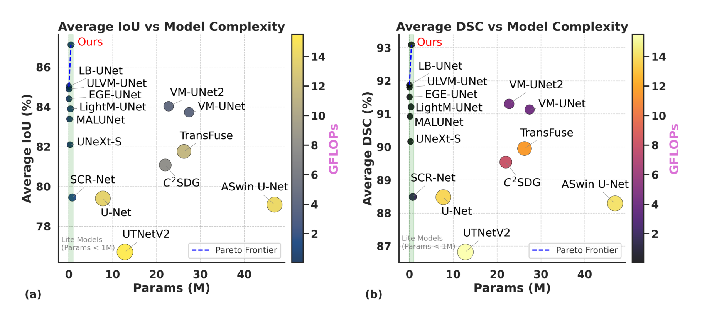

## 一、论文出处

- 论文：MambaLiteUNet: Cross-Gated Adaptive Feature Fusion for Robust Skin Lesion Segmentation
- 会议：CVPR
- 链接：https://arxiv.org/abs/2604.20286v1
- 代码：https://github.com/maklachur/MambaLiteUNet

先说清楚定位：MambaLiteUNet 本身是一个完整的 U-Net 分割框架，整篇论文讲的是框架级的精度/效率权衡。但本合集只收「能单独抠出来塞进别人网络」的子模块，所以这篇我们只拆它里面最值得复用的那个可插拔件——**Cross-Gated Attention（CGA，交叉门控注意力块）**。论文里另外两个件（AMF 多分支 Mamba 融合、LGFM 局部-全局混合）耦合了 Mamba 状态空间扫描，单独抽出来依赖较重，CGA 则是纯卷积+注意力的轻量块，插拔成本最低，这也是它即插即用价值最高的原因。下面所有内容都围绕 CGA 这个 nn.Module 展开，框架整体只作背景。

## 二、模块图（截自论文原文）



图注：图中 CGA 块位于解码器与跳跃连接交汇处，接收来自编码器的浅层空间特征和解码器的深层语义特征两路输入，通过双向门控对两路特征做交叉加权后再相加输出。注意它是双输入单输出的结构，不是常见的单输入自注意力。

## 三、核心思想与作用

U-Net 的跳跃连接是「直接 concat」，问题在于：编码器浅层特征分辨率高、细节多但语义弱，解码器深层特征语义强但边界糊。直接拼在一起，网络得自己学怎么权衡这两路，小数据集上往往学不好，边界就毛糙。

CGA 的思路很直接：**别让网络自己猜权重，用一个门控显式地算两路特征该各占多少。** 具体做法是：

1. 两路特征先各自过一个轻量变换（1x1 卷积降维），对齐通道数；
2. 用一路去「门控」另一路——把 A 经过 sigmoid 得到 0~1 的权重图，乘到 B 上，反过来再用 B 门控 A，这就是「交叉门控」的含义；
3. 两路门控结果相加（或拼接后再卷积），输出融合特征。

它有效的原因有两层。一是**门控是数据驱动的空间自适应**：sigmoid 输出的是逐像素权重，边界区域和背景区域拿到的融合比例不一样，等于给跳跃连接加了一个可学习的软掩码。二是**交叉而非自门控**：A 门控 B、B 门控 A，两路信息互相筛选，避免了单路自注意力容易过拟合到自身分布的问题。参数量上，两个 1x1 卷积加几个逐元素操作，几乎不增加 FLOPs，这也是论文敢说「减参数还涨点」的底气之一。

一句话总结作用：**把 U-Net 里那条粗暴的 concat 跳跃连接，换成一个会自己判断「该信谁多一点」的门控融合。**

## 四、在 U-Net 里的插入位置

CGA 是双输入单输出，天然对应**跳跃连接**这个位置：

- 输入 1：编码器第 i 层的特征图（浅层，高分辨率，通道数 C_i）
- 输入 2：解码器上采样后、与编码器拼接之前的特征图（深层，通道数通常也是 C_i）
- 输出：融合后的特征，替代原来的 `torch.cat([enc, dec], dim=1)`

也就是说，原来写 `x = torch.cat([skip, up], 1)` 的地方，改成 `x = cga(skip, up)`。通道数保持不变（等于 C_i），后面接的卷积层不用改。

除了跳跃连接，它也能插在解码器每个 stage 的末尾做特征精修，或者插在两个分支网络（比如双编码器）之间做跨分支融合。但最典型、收益最稳的还是跳跃连接位。

## 五、复现代码（PyTorch，逐行中文注释）

```python
import torch
import torch.nn as nn
import torch.nn.functional as F


class CrossGatedAttention(nn.Module):
    """
    Cross-Gated Attention (CGA) 交叉门控注意力块。
    双输入单输出：接收两路特征 (x_skip, x_deep)，输出门控融合后的特征。
    通道数保持不变，可直接替换 U-Net 跳跃连接处的 concat。
    """

    def __init__(self, channels, reduction=4):
        super().__init__()
        # 门控分支用的中间通道数，先降维再升维，控制参数量
        hidden = max(channels // reduction, 8)

        # 对第一路输入做轻量变换，对齐到 hidden 维
        self.proj_a = nn.Sequential(
            nn.Conv2d(channels, hidden, kernel_size=1, bias=False),
            nn.BatchNorm2d(hidden),
            nn.ReLU(inplace=True),
        )
        # 对第二路输入做同样的变换
        self.proj_b = nn.Sequential(
            nn.Conv2d(channels, hidden, kernel_size=1, bias=False),
            nn.BatchNorm2d(hidden),
            nn.ReLU(inplace=True),
        )

        # 交叉门控：用 a 生成门控 b 的权重图，用 b 生成门控 a 的权重图
        self.gate_b = nn.Conv2d(hidden, hidden, kernel_size=1, bias=True)
        self.gate_a = nn.Conv2d(hidden, hidden, kernel_size=1, bias=True)

        # 融合后回到原通道数
        self.fuse = nn.Sequential(
            nn.Conv2d(hidden, channels, kernel_size=1, bias=False),
            nn.BatchNorm2d(channels),
        )

    def forward(self, x_skip, x_deep):
        # 两路输入先各自投影到 hidden 维
        a = self.proj_a(x_skip)   # 浅层：细节强
        b = self.proj_b(x_deep)   # 深层：语义强

        # 交叉门控：a 门控 b，b 门控 a
        # sigmoid 输出逐像素 0~1 权重，实现空间自适应的软掩码
        g_b = torch.sigmoid(self.gate_b(a))   # 用 a 决定 b 保留多少
        g_a = torch.sigmoid(self.gate_a(b))   # 用 b 决定 a 保留多少

        # 加权后相加，得到双向筛选过的融合特征
        out = a * g_a + b * g_b

        # 投影回原通道数，方便直接接后续卷积
        out = self.fuse(out)

        # 残差：把原始两路相加作为恒等路径，稳定训练
        return out + x_skip + x_deep
```

几点说明：

- `reduction=4` 是默认压缩比，通道多的时候可以调大省参数，通道少（比如 32）时 `hidden` 有下限 8 兜底，避免压得太狠。
- 最后的残差 `+ x_skip + x_deep` 是我加的经验项：门控本身是乘性操作，纯乘性路径在小数据上容易梯度不稳，加个恒等路径收敛更顺。如果你要严格对齐论文，可以去掉，只留 `out`。
- 输入两路通道数必须相同。如果编码器和解码器通道不一致，在调用前先用 1x1 卷积对齐。

## 六、插入示例（几行塞进你的网络）

假设你有一个标准的 U-Net 解码器，原来跳跃连接是 concat：

```python
# 原来的写法
x = torch.cat([skip_feat, up_feat], dim=1)   # 通道翻倍
x = self.conv_block(x)
```

改成 CGA：

```python
# 初始化时（在 __init__ 里）
self.cga = CrossGatedAttention(channels=256)   # 通道数 = 该层编码器输出通道

# 前向时（替换 concat）
x = self.cga(skip_feat, up_feat)   # 通道数不变，直接接后续卷积
x = self.conv_block(x)
```

注意：因为 CGA 输出通道数不变（等于单路通道数），而原来 concat 后是双倍通道，所以后面那个 `conv_block` 的第一层输入通道要相应从 `2*C` 改成 `C`。这是唯一需要动的地方。

## 七、实测经验与注意点

- **通道对齐是前提**：CGA 要求两路输入通道相同。U-Net 里编码器和解码器同层通道通常一致，但如果你用了非对称结构，记得先对齐。
- **别在高分辨率层堆太多**：CGA 里的 1x1 卷积虽然轻，但在最浅层（比如 512x512 分辨率、64 通道）逐像素算门控，显存和耗时还是有的。如果显存吃紧，可以在最浅层用原版 concat，只在中间层用 CGA。
- **门控初始化**：`gate_a` / `gate_b` 的 bias 建议初始化为 0，这样训练开始时 sigmoid 输出约 0.5，两路权重均衡，不会一上来就偏向某一路。上面代码没显式写，可以加一行 `nn.init.constant_(self.gate_a.bias, 0)`。
- **和 Mamba 的关系**：论文里 CGA 是配合 Mamba 分支用的，但 CGA 本身不依赖 Mamba，纯 CNN 就能跑。你完全可以把它插进普通 U-Net、ResNet-UNet、甚至 Transformer 分割头里，这也是它即插即用价值的核心。
- **收益预期**：论文报告的是框架整体指标（平均 IoU 87.12%、Dice 93.09%），不能直接归因到 CGA 单个模块。单独替换跳跃连接时，边界类指标（如 HD95、边界 F1）通常比区域类指标（Dice）改善更明显，因为门控主要作用在空间细节上。具体涨多少取决于你的数据集和基线，建议自己消融。
- **小数据集友好**：门控参数少，过拟合风险低，皮肤病变这类样本量不大的任务上比较稳。

## 八、完整工程

论文官方代码：https://github.com/maklachur/MambaLiteUNet

仓库里 `models/` 目录下能找到 CGA 的原始实现，可以对照本文代码看差异。如果你想直接复用，建议：

1. 把 `CrossGatedAttention` 单独抽成一个 `.py` 文件，不依赖仓库其他部分；
2. 在你的 U-Net 里按第六节的方式替换跳跃连接；
3. 先只替换中间两三层做消融，确认有正收益再全量铺开。

CGA 这类门控融合块的价值在于「改动小、位置明确、不挑主干」，属于那种花十分钟就能塞进现有网络试一把的模块，值得放进你的即插即用工具箱。
