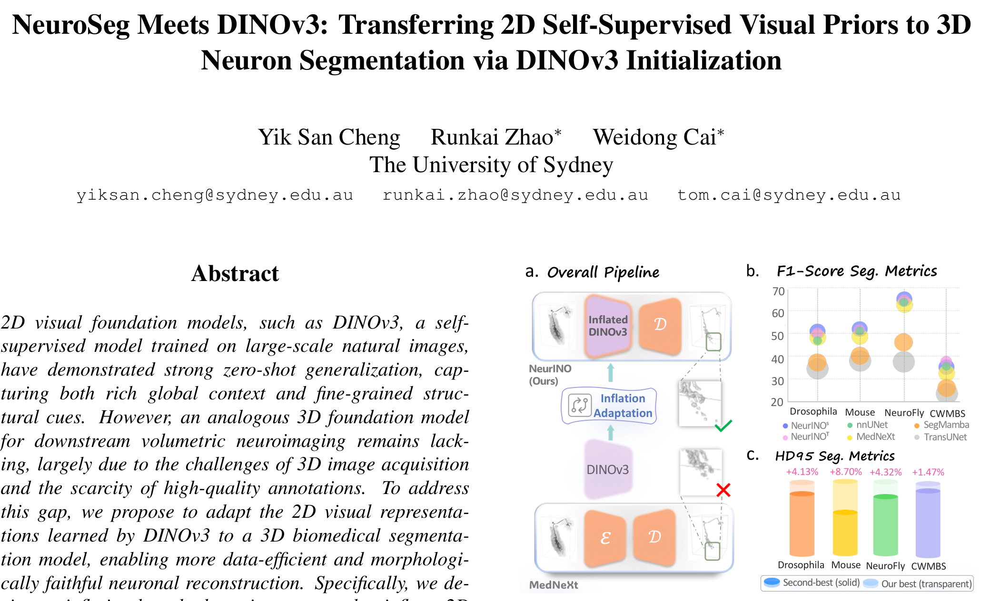

## 一、论文出处

- 论文标题：NeuroSeg Meets DINOv3: Transferring 2D Self-Supervised Visual Priors to 3D Neuron Segmentation via DINOv3 Initialization
- 会议：CVPR
- 论文链接：https://arxiv.org/abs/2603.23104v1
- 代码：https://github.com/yy0007/NeurINO

这篇论文整体是一个面向 3D 神经元分割的完整框架（NeurINO），但对我们「即插即用模块」合集来说，真正值得单独拎出来的是一个可插拔的子模块：**基于 inflation 的 2D→3D 权重适配块**。它做的事情很具体——把 DINOv3 这类 2D 自监督 ViT 学到的卷积/线性算子，沿时间（深度）维度"膨胀"成 3D 算子，从而让一个 3D 分割网络在初始化阶段就继承 2D 视觉基础模型的语义先验。这个块可以脱离 NeurINO 框架，单独塞进任意 3D U-Net 的编码器里。

## 二、模块图（截自论文原文）



图注：左侧是 DINOv3 的 2D 预训练权重，中间是 inflation 适配块把 2D 算子沿深度轴复制/插值成 3D 算子，右侧是膨胀后的 3D 编码器接入神经元分割头。核心可插拔单元就是中间那个 inflation 算子转换块。

## 三、核心思想与作用

先说清楚这个模块解决什么问题。

3D 神经元体数据（显微成像、电镜堆栈）标注极其昂贵，公开的高质量 3D 预训练模型几乎没有。而 2D 自然图像上训出来的 DINOv3，零样本泛化能力很强，既有全局语义又有细粒度结构线索。矛盾就在于：2D 先验怎么迁移到 3D 体数据上。

inflation 的思路非常直接：一个 2D 卷积核是 `(C_out, C_in, kH, kW)`，把它变成 3D 核 `(C_out, C_in, kD, kH, kW)`。最朴素的做法是沿新增的深度轴复制 kD 次，再除以 kD 做归一化，保证输出响应量级不炸。对 ViT 里的线性层同理，把 2D patch 的权重沿深度方向扩展。

为什么有效？两个层面：

1. **语义先验继承**。DINOv3 在自然图像上学到的边缘、纹理、局部结构响应，对神经元这种细长、分叉、对比度低的结构同样有判别力。用膨胀后的权重初始化，等于让 3D 网络从一个"已经会看结构"的起点开始训练，而不是随机初始化。
2. **数据效率**。神经元数据集通常只有几十到几百个样本，从头训 3D 网络极易过拟合。膨胀初始化相当于把 2D 大模型的知识作为正则，收敛更快、更稳。

需要强调：这个模块本身**不引入新参数**，它只是一个权重初始化/转换算子。插进网络后，前向计算和普通 3D 卷积完全一样，推理零开销。这也是它作为即插即用模块的最大价值——你不需要改网络结构，只需要改初始化方式。

论文里还配了一个 topology-aware skeleton loss（拓扑感知骨架损失）来约束神经元树状结构的保真度，但那属于训练策略，不是可插拔的网络模块，本文不展开。

## 四、在 U-Net 里的插入位置

这个模块的插入位置和普通"加一个注意力块"不一样，它作用在**权重初始化阶段**，而不是前向路径上。具体来说：

- **编码器主干**：3D U-Net 的每个 stage 通常由若干 `Conv3d` 组成。把 DINOv3 对应的 2D 卷积/线性权重膨胀后，作为这些 `Conv3d` 的初始权重。这是最主要的插入点。
- **下采样/上采样层**：如果用了带参数的 3D 卷积做 stride 下采样，同样可以膨胀初始化；纯 `MaxPool3d` 则无需处理。
- **解码器**：一般保持随机初始化或 Kaiming 初始化即可，因为解码器更依赖任务特定的上采样细节，强行膨胀收益不明显。
- **分割头**：输出通道是任务类别数，和 DINOv3 对不上，通常不膨胀。

一句话：**插在编码器的 3D 卷积初始化上**。如果你的 U-Net 编码器是纯 3D 卷积堆叠，那这个模块几乎可以无脑套用。

## 五、复现代码（PyTorch，逐行中文注释）

下面给出核心的 inflation 适配块。为了让它真正"即插即用"，我把它写成一个函数 + 一个可选的 `nn.Module` 封装，负责把 2D 权重膨胀成 3D 并加载进目标 `Conv3d`。

```python
import torch
import torch.nn as nn


def inflate_2d_to_3d_weight(w2d: torch.Tensor, kernel_depth: int = 3,
                            mode: str = "copy") -> torch.Tensor:
    """
    把 2D 卷积权重膨胀成 3D 卷积权重。

    参数:
        w2d: 形状 (C_out, C_in, kH, kW) 的 2D 卷积权重
        kernel_depth: 目标 3D 卷积的深度核大小 kD
        mode: "copy" 沿深度轴复制; "center" 只在中心层放原权重, 其余置零

    返回:
        形状 (C_out, C_in, kD, kH, kW) 的 3D 权重
    """
    assert w2d.dim() == 4, "输入必须是 4D 的 2D 卷积权重"
    c_out, c_in, kh, kw = w2d.shape

    if mode == "copy":
        # 在深度维新增一维, 然后沿该维复制 kD 次
        w3d = w2d.unsqueeze(2).repeat(1, 1, kernel_depth, 1, 1)
        # 关键: 除以 kD 做归一化, 保证输出响应量级与 2D 时一致
        w3d = w3d / kernel_depth
    elif mode == "center":
        # 只在深度方向中心层保留原权重, 其余层为零
        w3d = torch.zeros(c_out, c_in, kernel_depth, kh, kw,
                          dtype=w2d.dtype, device=w2d.device)
        center = kernel_depth // 2
        w3d[:, :, center, :, :] = w2d
    else:
        raise ValueError(f"不支持的 mode: {mode}")

    return w3d


def inflate_2d_to_3d_bias(b2d: torch.Tensor, kernel_depth: int = 3) -> torch.Tensor:
    """
    偏置项不随深度膨胀, 直接沿用即可。
    这里保留函数是为了接口统一, 方便后续扩展。
    """
    return b2d.clone()


class InflatedConv3d(nn.Conv3d):
    """
    一个可以直接替换 nn.Conv3d 的即插即用卷积层。
    支持从 2D 权重初始化, 前向计算与普通 Conv3d 完全一致。
    """

    def __init__(self, in_channels, out_channels, kernel_size,
                 stride=1, padding=0, dilation=1, groups=1, bias=True):
        # 如果传入的是整数, 统一成三元组
        if isinstance(kernel_size, int):
            kernel_size = (kernel_size, kernel_size, kernel_size)
        super().__init__(in_channels, out_channels, kernel_size,
                         stride, padding, dilation, groups, bias)

    @torch.no_grad()
    def load_from_2d(self, w2d: torch.Tensor, b2d: torch.Tensor = None,
                     mode: str = "copy"):
        """
        用 2D 权重初始化本层。

        参数:
            w2d: (C_out, C_in, kH, kW) 的 2D 权重
            b2d: 可选, (C_out,) 的 2D 偏置
            mode: 膨胀模式, 见 inflate_2d_to_3d_weight
        """
        kd = self.weight.shape[2]  # 本层深度核大小
        w3d = inflate_2d_to_3d_weight(w2d, kernel_depth=kd, mode=mode)

        # 形状必须严格匹配, 否则说明通道数或核大小对不上
        assert w3d.shape == self.weight.shape, \
            f"膨胀后权重形状 {w3d.shape} 与目标层 {self.weight.shape} 不匹配"

        self.weight.copy_(w3d)

        if b2d is not None and self.bias is not None:
            assert b2d.shape == self.bias.shape, "偏置形状不匹配"
            self.bias.copy_(b2d)


def inflate_vit_linear_to_3d(w2d: torch.Tensor, depth_tokens: int) -> torch.Tensor:
    """
    针对 ViT 线性层的膨胀: 把 2D patch 的投影权重沿深度方向扩展。
    这里给出一个简化版, 实际使用时需根据 patch 划分方式调整。

    参数:
        w2d: (out_dim, in_dim) 的线性层权重, in_dim 对应 2D patch 展平
        depth_tokens: 深度方向 token 数
    """
    out_dim, in_dim = w2d.shape
    # 假设 in_dim = C * kH * kW, 这里只做示意性的复制扩展
    # 真实场景需要按 patch 结构 reshape 后再沿深度复制
    w3d = w2d.unsqueeze(0).repeat(depth_tokens, 1, 1)
    return w3d
```

代码里有两个细节值得说：

- `mode="copy"` 时除以 `kernel_depth`，这是 inflation 的标准操作。不除的话，3D 卷积在深度方向累加 kD 次，输出会放大 kD 倍，训练初期直接梯度爆炸。
- `mode="center"` 是另一种常见策略，只在中心层放权重，其余置零。它更保守，适合深度方向语义差异大的场景。两种都可以试，论文里主要用的是复制式。

## 六、插入示例（几行塞进你的网络）

假设你有一个普通的 3D U-Net 编码器，把第一层 `Conv3d` 换成 `InflatedConv3d`，然后加载 DINOv3 的对应权重即可。

```python
# 假设 dinov3_conv2d_weight 是你从 DINOv3 里取出的某个 2D 卷积权重
# 形状为 (C_out, C_in, 3, 3)
dinov3_conv2d_weight = torch.randn(64, 3, 3, 3)  # 这里用随机数占位

# 原来的一层
# conv1 = nn.Conv3d(3, 64, kernel_size=3, padding=1)

# 替换成可膨胀的版本
conv1 = InflatedConv3d(3, 64, kernel_size=3, padding=1)

# 用 2D 权重初始化
conv1.load_from_2d(dinov3_conv2d_weight, mode="copy")

# 之后照常接进你的 U-Net
# x = conv1(x)
```

如果不想改网络定义，也可以写一个遍历函数，在模型构建后统一给编码器的 `Conv3d` 层做膨胀初始化：

```python
def init_encoder_from_2d(model, weight_dict, mode="copy"):
    """
    遍历模型, 把名字能对上的 Conv3d 层用 2D 权重膨胀初始化。
    weight_dict: {层名: (w2d, b2d)} 的字典
    """
    for name, module in model.named_modules():
        if isinstance(module, nn.Conv3d) and name in weight_dict:
            w2d, b2d = weight_dict[name]
            kd = module.weight.shape[2]
            w3d = inflate_2d_to_3d_weight(w2d, kernel_depth=kd, mode=mode)
            if w3d.shape == module.weight.shape:
                with torch.no_grad():
                    module.weight.copy_(w3d)
                    if b2d is not None and module.bias is not None:
                        module.bias.copy_(b2d)
                print(f"已膨胀初始化: {name}")
            else:
                print(f"跳过(形状不匹配): {name}")
```

这样你的网络结构一行不用改，只在训练前调一次 `init_encoder_from_2d` 就行。

## 七、实测经验与注意点

几点踩坑经验，都是实际迁移时会遇到的：

1. **通道数对不上是常态**。DINOv3 的通道配置和你自己 U-Net 的通道配置大概率不一致。能对上的层就膨胀，对不上的层老老实实用 Kaiming 初始化，不要硬凑。强行 reshape 只会引入噪声。

2. **除以 kD 这一步千万别漏**。我见过有人复制完直接加载，结果第一个 epoch loss 就 NaN。原因是深度方向累加导致激活值放大，配合 BN 或 LayerNorm 直接把统计量带偏。

3. **膨胀初始化后建议先冻结编码器几个 epoch**。让解码器和分割头先适应一下，再解冻联合训练。神经元数据少，一上来就全网络微调容易把 2D 先验冲掉。

4. **学习率要调小**。继承来的权重已经是一个不错的起点，用从头训练的学习率会把先验破坏掉。经验上编码器学习率比解码器低一个量级比较稳。

5. **`copy` 和 `center` 两种模式值得都试**。各向异性强的体数据（比如深度分辨率远低于平面分辨率）用 `center` 往往更好，因为深度方向本来就不该复制平面权重。

6. **这个模块对推理速度零影响**。它只改初始化，前向图和普通 3D U-Net 一模一样。所以如果你的场景对推理延迟敏感，这个模块是安全的。

7. **别指望它单独解决所有问题**。inflation 提供的是好的起点，不是万能药。论文里还配合了骨架损失等训练策略。单靠膨胀初始化，提升是有的，但别期待翻天覆地。

## 八、完整工程

论文官方代码在 https://github.com/yy0007/NeurINO 。仓库里包含完整的 NeurINO 框架、DINOv3 权重加载脚本、inflation 适配实现以及四个数据集的训练配置。

如果你只想拿这个即插即用模块，建议直接看仓库里负责权重转换的那部分代码，把它抽出来配合本文的 `InflatedConv3d` 使用即可。核心逻辑就是本文第五节那几十行，不依赖框架其余部分。

需要提醒的是，DINOv3 的权重需要单独下载，且不同版本的 ViT 结构（patch size、通道数）对应的线性层形状不同，膨胀前务必确认形状匹配。仓库的 README 里有权重下载和转换的说明，照着走一遍就能跑通。
