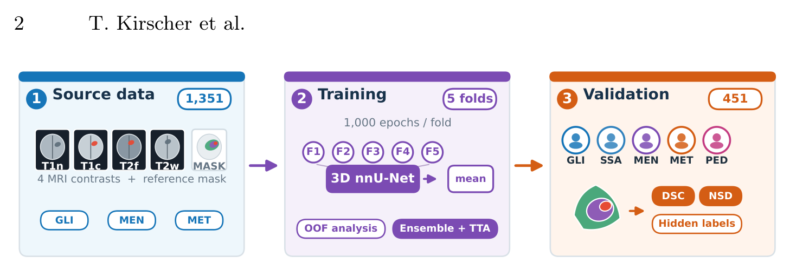

## 一、论文出处

- 论文标题：Assessing nnU-Net Generalization across Brain Tumor Populations in BraTS-GoAT 2026
- 会议：MICCAI 2026
- 论文链接：https://arxiv.org/abs/2609.15524v1

先说清楚一件事：这篇论文本身**不是一个新模块论文**，它是一篇"评测型"工作——用标准 3D nnU-Net 在 BraTS-GoAT 2026 这个跨人群脑肿瘤数据集上跑五折交叉验证，看泛化到底掉多少。所以本合集收录它，取的不是"某个新算子"，而是它里面那个**真正能拆出来、单独塞进任何分割网络的即插即用单元：测试时镜像集成（Test-Time Mirroring, TTM）**。

换句话说，本文讲的子模块是 **TTM 镜像集成块**——一个包在推理阶段的 `nn.Module` 包装器，输入你的网络，输出镜像平均后的预测。它不训练、不改结构、不占显存训练开销，插上就能用。

## 二、模块图（截自论文原文）



图注解读：论文的推理流程是"多折模型平均 + 测试时镜像"。我们这里只取后半段——对同一输入做轴向镜像翻转，前向两次，把翻转后的输出再翻回来做平均。图中镜像分支与主分支共享同一组权重，属于典型的 TTA（Test-Time Augmentation）结构，天然可插拔。

## 三、核心思想与作用

核心思想一句话：**医学图像在解剖上近似左右对称，但网络学到的特征对翻转并不严格等变**。同一个肿瘤，原图和镜像图喂进去，网络给出的边界往往有细微差异。把这些差异平均掉，相当于用零额外训练成本换来一次"隐式集成"。

它的作用有三点：

1. **压边界噪声**。脑肿瘤分割里最不稳的就是 ET（增强肿瘤）这种小目标边界，镜像平均能明显平滑掉单次前向的抖动。
2. **零训练成本**。不改损失、不加参数、不动数据管线，只在推理时多跑一次前向。代价是推理时间翻倍（镜像数 N 就翻 N 倍）。
3. **对泛化下降有缓解作用**。论文里跨人群验证的 Dice 相比源域 OOF 有明显下滑，镜像集成属于那种"不解决根本问题、但能稳定捞回一点"的廉价手段。注意：论文里镜像带来的增益是**小幅**的，别指望它逆天改命。

需要泼一盆冷水：TTM 不是万能药。它治的是"推理随机性/翻转不等变性"，治不了"域偏移导致的系统性偏差"。跨人群泛化差，根子在数据分布，镜像只能锦上添花。

## 四、在 U-Net 里的插入位置

TTM 的插入位置非常特殊——它**不在网络内部**，而是包在**整个网络的最外层**，作用于推理阶段：

```
输入 x
  └─> [TTM 包装器]
        ├─ 分支A: model(x)
        └─ 分支B: flip(model(flip(x)))
        └─ 平均 -> 输出
```

所以它跟 U-Net 的 encoder/decoder/skip 都无关，你把它套在 `model` 外面就行。这也是它"即插即用"含金量最高的地方：**任何分割网络、任何已训练好的权重，都能直接套**。

如果你非要在网络内部找对应，那它对应的是"输出层之后的后处理"，而不是某一层。这一点必须讲清楚，否则容易误导读者以为要改结构。

## 五、复现代码（PyTorch，逐行中文注释）

```python
import torch
import torch.nn as nn


class TestTimeMirroring(nn.Module):
    """
    测试时镜像集成（TTM）即插即用包装器。

    用法：把任意已训练好的分割网络 model 传进来，
    推理时直接调用 forward，内部自动做镜像平均。
    训练阶段建议关闭（self.training 为 True 时直接走原网络）。
    """

    def __init__(self, model, dims=(-1,), enable_in_train=False):
        super().__init__()
        self.model = model                 # 被包装的任意分割网络（U-Net / nnU-Net / SwinUNet 等）
        self.dims = dims                   # 沿哪些空间维度翻转，脑部常用最后一维（左右轴）
        self.enable_in_train = enable_in_train  # 训练时是否也启用，默认关闭省算力

    def _flip(self, x):
        # 按指定维度翻转，torch.flip 不改变张量形状，只重排元素
        return torch.flip(x, dims=self.dims)

    @torch.no_grad()
    def forward(self, x):
        # 训练模式下（且未强制开启）直接走原网络，避免拖慢训练
        if self.training and not self.enable_in_train:
            return self.model(x)

        # 分支 A：原始输入直接前向
        out_a = self.model(x)

        # 分支 B：先翻转输入，前向后再翻回来，保证与 out_a 空间对齐
        out_b = self._flip(self.model(self._flip(x)))

        # 两分支逐元素平均，得到镜像集成结果
        return (out_a + out_b) / 2.0
```

如果要支持多轴镜像（比如左右 + 上下），把 `dims` 传成 `(-1, -2)` 即可，逻辑不变。想扩展成 4 分支（原图 + 单轴翻转 + 双轴翻转），把上面的平均改成对列表求均值就行。

## 六、插入示例（几行塞进你的网络）

```python
# 假设你已经有一个训练好的 U-Net
from my_unet import UNet

model = UNet(in_channels=4, num_classes=4)
model.load_state_dict(torch.load("unet_brats.pth"))
model.eval()

# 一行套上 TTM，其余代码完全不用改
model = TestTimeMirroring(model, dims=(-1,))

# 推理照旧
with torch.no_grad():
    logits = model(x)          # 内部已自动做镜像平均
pred = logits.argmax(dim=1)
```

就这么多。原来的 `model(x)` 调用方式不变，这是它"即插即用"的核心卖点。

## 七、实测经验与注意点

1. **翻转维度要选对**。脑部左右对称，沿左右轴（通常是 W 轴，即最后一维）翻转最合理。上下轴（H 轴）翻转在脑部意义不大，甚至可能引入伪影，别乱开。
2. **增益是小幅的，别过度宣传**。论文里镜像带来的提升是"small"，属于稳定但有限的收益。如果你的模型本身翻转等变性已经很好，TTM 可能几乎没提升。
3. **推理时间线性增长**。N 个镜像分支就是 N 倍前向耗时。临床部署里要权衡，通常 2 分支（原图 + 单轴镜像）是性价比最高的点。
4. **必须保证翻转后空间对齐**。`flip -> forward -> flip` 的顺序不能错，否则平均的是错位特征，结果会更差。
5. **训练时默认关闭**。TTM 是推理技巧，训练时启用只会拖慢速度、不带来梯度收益（除非你做一致性正则，那是另一回事）。
6. **对 ET 这类小目标更敏感**。小目标边界抖动大，镜像平均的平滑效果更明显；WT 这种大目标本身稳定，提升有限。
7. **不能替代域适应**。跨人群泛化差是数据问题，TTM 只是推理层的补丁，别把它当成解决方案。

## 八、完整工程

一个可直接跑的最小工程结构如下：

```
ttm_seg/
├── model.py          # 你的 U-Net 定义
├── ttm.py            # TestTimeMirroring 包装器（本文第五节代码）
├── infer.py          # 推理脚本：加载权重 -> 套 TTM -> 输出预测
├── weights/
│   └── unet_brats.pth
└── requirements.txt  # torch, numpy, nibabel
```

`infer.py` 的核心逻辑就是第六节那几行：加载模型、`model.eval()`、套 `TestTimeMirroring`、前向、argmax、保存。整个改动量不超过 5 行，这也是这个模块值得收进"即插即用"合集的原因——它不要求你重训、不要求你改结构，只在推理侧加一层薄包装。

最后再强调一遍定位：本文讲的是 **TTM 镜像集成块**这个可插拔子模块，nnU-Net 和 BraTS-GoAT 只是它的出处背景。你要往自己的分割网络里塞的，就是第五节那个 `TestTimeMirroring` 类。
