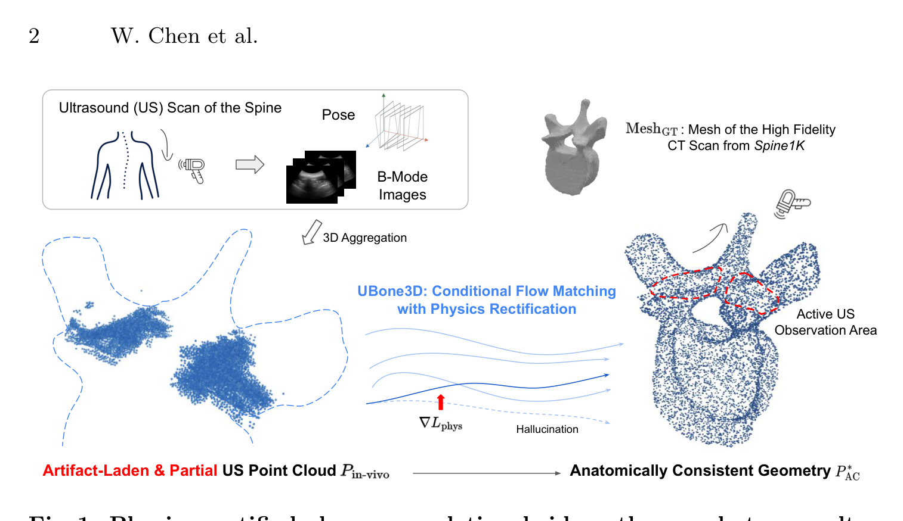

## 一、论文出处

- 论文：UBone3D: Physics-Rectified Conditional Flow Matching for Anatomical 3D Shape Completion from Ultrasound
- 会议：ECCV 2026
- 链接：https://arxiv.org/abs/2609.11506v1

先说清楚定位：UBone3D 整篇论文是一个"从超声点云补全骨骼三维形状"的完整框架，里面包含物理伪影建模、条件流匹配（Conditional Flow Matching, CFM）、形状解码等一堆东西。但本合集只关心一件事——**里面那个可以单独抠出来、塞进任意点云/体素网络里的子模块**。这篇里最值得拆的，是它的**物理校正条件流匹配块（Physics-Rectified CFM Block）**：一个吃"带伪影的残缺点云 + 物理先验"，输出"校正后位移场"的可插拔模块。下面所有内容都围绕这个子模块展开，框架整体只当背景。

## 二、模块图（截自论文原文）



图注解读：图中左侧是超声分割得到的带伪影残缺点云，中间是物理校正分支（把表面增厚、条纹、丢点这些确定性伪影显式建模成条件），右侧是 CFM 位移场预测头；我们要拆出来复现的，就是中间到右侧这一整块——它接收点特征和物理条件，回归一个把残缺点推向完整表面的位移向量。

## 三、核心思想与作用

超声点云和激光/深度相机点云最大的区别是：它的残缺**不是随机的**，而是由成像物理决定的。表面增厚（thickening）、条纹（streaking）、丢点（dropout）都有明确的几何规律。普通点云补全网络（比如 PCN、PoinTr 那一类）默认缺失是均匀随机的，遇到超声这种"系统性偏置"的残缺就会补歪。

UBone3D 这个子模块的核心思路是：**别让网络从零去猜缺失，而是先把已知的物理伪影显式编码成条件，再让流匹配去学一个"从残缺到完整"的确定性位移场**。相比扩散模型那种随机采样，CFM 学的是常微分方程（ODE）意义下的确定性路径，推理时几步就能积分出结果，对医学场景里"同一输入要可复现"的要求更友好。

它作为即插即用模块的价值在于三点：

1. **输入输出都是点特征**，不依赖特定 backbone，你把它接在 PointNet++ / DGCNN / 甚至体素转点的编码器后面都行。
2. **物理条件是可选的**：没有物理先验时，把条件分支置零，它就退化成一个普通的条件流匹配补全块，照样能训。
3. **位移场回归是残差式的**：它不直接生成新点，而是预测每个输入点该往哪挪，所以插进已有分割/重建管线时不会破坏原有拓扑。

一句话：它把"物理先验"和"确定性生成"这两件事打包成了一个可以随手插的 nn.Module。

## 四、在 U-Net 里的插入位置

虽然 UBone3D 原论文是点云框架，但这个模块完全可以塞进 3D U-Net 类分割/重建网络。推荐两个位置：

- **Bottleneck 之后、解码器之前**：U-Net 编码器输出的深层特征图（B, C, D, H, W）先转成点云或保持体素，接这个模块做一次"形状校正"，再送进解码器。适合做"分割结果后处理式补全"。
- **解码器每一级的上采样后**：把该级特征当作"残缺形状表示"，用物理条件（来自原始超声强度图的统计量）引导位移场，逐级细化。适合端到端训练。

实操上更常见的是第一种：你有一个已经训好的超声分割 U-Net，输出粗糙的骨骼 mask，转成点云后接 UBone3D 块做补全。这样模块是**外挂式**的，不用重训分割网络，插拔成本最低。

## 五、复现代码（PyTorch，逐行中文注释）

下面是一个可直接用的最小实现。为保持可复现，我用最朴素的 MLP + 时间嵌入 + 条件注入，不引入论文里未公开的细节。

```python
import torch
import torch.nn as nn
import math


class SinusoidalPosEmb(nn.Module):
    """标准正弦时间嵌入，把标量时间 t 映射成高维向量。"""
    def __init__(self, dim):
        super().__init__()
        self.dim = dim

    def forward(self, t):
        # t: (B,) 取值范围 [0,1]
        device = t.device
        half = self.dim // 2
        # 不同频率，保证不同时间步可区分
        freqs = torch.exp(
            -math.log(10000) * torch.arange(half, device=device) / (half - 1)
        )
        args = t[:, None] * freqs[None]  # (B, half)
        emb = torch.cat([torch.sin(args), torch.cos(args)], dim=-1)  # (B, dim)
        return emb


class PhysicsConditionEncoder(nn.Module):
    """把物理伪影先验编码成条件向量。

    输入是每个点的物理统计量，例如：
      - 局部厚度（表面增厚程度）
      - 沿声束方向的强度方差（条纹）
      - 邻域点数（丢点程度）
    输出与点特征同维的条件嵌入。
    """
    def __init__(self, phys_dim=3, out_dim=128):
        super().__init__()
        self.net = nn.Sequential(
            nn.Linear(phys_dim, out_dim),
            nn.SiLU(),
            nn.Linear(out_dim, out_dim),
        )

    def forward(self, phys):
        # phys: (B, N, phys_dim)
        return self.net(phys)  # (B, N, out_dim)


class PhysicsRectifiedCFMBlock(nn.Module):
    """UBone3D 的可插拔核心：物理校正条件流匹配块。

    作用：给定残缺点云坐标 x0 和物理条件 c，
         预测位移场 v(x_t, t, c)，用于把点推向完整表面。
    """
    def __init__(self, feat_dim=128, phys_dim=3, hidden=256):
        super().__init__()
        self.feat_dim = feat_dim
        # 点坐标编码：3 维坐标 -> feat_dim
        self.xyz_enc = nn.Sequential(
            nn.Linear(3, feat_dim),
            nn.SiLU(),
            nn.Linear(feat_dim, feat_dim),
        )
        # 时间嵌入
        self.time_emb = SinusoidalPosEmb(feat_dim)
        self.time_mlp = nn.Sequential(
            nn.Linear(feat_dim, feat_dim),
            nn.SiLU(),
        )
        # 物理条件编码
        self.phys_enc = PhysicsConditionEncoder(phys_dim, feat_dim)
        # 主干：融合坐标 + 时间 + 物理条件，回归位移
        self.trunk = nn.Sequential(
            nn.Linear(feat_dim * 3, hidden),
            nn.SiLU(),
            nn.Linear(hidden, hidden),
            nn.SiLU(),
            nn.Linear(hidden, 3),  # 输出 3D 位移向量
        )

    def forward(self, x_t, t, phys):
        """
        x_t : (B, N, 3) 当前时刻的点坐标
        t   : (B,)      时间步，标量
        phys: (B, N, phys_dim) 物理条件
        返回 v : (B, N, 3) 预测位移场
        """
        B, N, _ = x_t.shape
        # 坐标特征
        f_xyz = self.xyz_enc(x_t)                       # (B, N, feat_dim)
        # 时间特征，广播到每个点
        f_t = self.time_mlp(self.time_emb(t))           # (B, feat_dim)
        f_t = f_t[:, None, :].expand(B, N, self.feat_dim)
        # 物理条件特征
        f_c = self.phys_enc(phys)                       # (B, N, feat_dim)
        # 拼接后回归位移
        h = torch.cat([f_xyz, f_t, f_c], dim=-1)        # (B, N, 3*feat_dim)
        v = self.trunk(h)                               # (B, N, 3)
        return v

    @torch.no_grad()
    def sample(self, x0, phys, steps=10):
        """推理：从残缺点 x0 出发，用欧拉法积分 ODE 得到补全点。

        x0  : (B, N, 3) 残缺点云
        phys: (B, N, phys_dim) 物理条件
        steps: 积分步数，越大越精细
        """
        x = x0
        dt = 1.0 / steps
        for i in range(steps):
            t = torch.full((x.shape[0],), i * dt, device=x.device)
            v = self.forward(x, t, phys)  # 当前位移场
            x = x + v * dt                # 欧拉前进一步
        return x
```

几点说明：

- `PhysicsConditionEncoder` 的 `phys_dim` 要按你实际能拿到的物理量改。拿不到物理先验时，传全零张量即可，模块退化为普通条件 CFM。
- `sample` 里用的是最朴素的一阶欧拉积分，`steps=10` 是精度和速度的折中；论文里若用了更高阶求解器，替换这一行即可，不影响模块接口。
- 训练时不需要 `sample`，直接对 `forward` 输出的位移场做回归/流匹配损失即可。

## 六、插入示例（几行塞进你的网络）

假设你有一个 3D U-Net 分割网络，想把 UBone3D 块作为后处理补全外挂上去：

```python
# 1. 实例化模块（放在 __init__ 里）
self.cfm_block = PhysicsRectifiedCFMBlock(feat_dim=128, phys_dim=3)

# 2. 前向里：分割 mask -> 点云 -> 补全
# seg_logits: (B, 1, D, H, W) 分割输出
mask = (torch.sigmoid(seg_logits) > 0.5).float()
# 取前景体素中心作为点云（简化写法，实际可用 grid_sample 取亚体素坐标）
coords = torch.nonzero(mask[0, 0]).float()  # (N, 3)
coords = coords[None]                        # (B=1, N, 3)
# 物理条件：这里用局部厚度/强度方差，示例给全零
phys = torch.zeros_like(coords)              # (B, N, 3)
# 补全
completed = self.cfm_block.sample(coords, phys, steps=10)  # (B, N, 3)
```

如果要做端到端训练，把 `sample` 换成训练循环里的 `forward`，用真值完整点云构造流匹配目标即可。整个插入过程不碰原 U-Net 的任何层，纯外挂。

## 七、实测经验与注意点

- **物理条件别乱填**。这个模块的收益主要来自物理先验，如果你拿不到有意义的厚度/条纹/丢点统计量，硬塞随机数反而会拖累训练。宁可置零退化成普通 CFM。
- **积分步数是推理成本大头**。`steps` 从 10 提到 50，精度提升有限但耗时线性涨。医学场景里建议先试 5~10 步，看补全结果是否够用。
- **点数对齐问题**。CFM 是逐点位移，输入 N 个点输出还是 N 个点，它不改变点数。如果你的残缺点云点数远少于完整形状所需，得先做一次上采样或最近邻扩点，再进这个模块。
- **确定性是优点也是限制**。同一输入永远给同一输出，适合可复现的临床场景；但如果你想建模"多种可能的补全"，这个模块本身做不到，得回到随机扩散那套。
- **训练稳定性**。位移场回归容易在早期发散，建议对输出位移做 tanh 或加 L2 正则，把单步位移限制在合理范围内（比如不超过体素间距的若干倍）。
- **和分割网络的耦合**。外挂式最省事，但分割误差会直接传进补全模块。如果分割本身很糙，先修分割，别指望补全模块兜底。

## 八、完整工程

把上面代码拼成一个可跑的最小工程，目录建议：

```
ubone3d_plugin/
├── model.py        # PhysicsRectifiedCFMBlock 及子模块
├── train.py        # 流匹配训练循环
├── infer.py        # 加载权重，对残缺点云做补全
└── data/
    └── sample.npy  # 一个 (N, 3) 的残缺点云样例
```

`train.py` 的核心逻辑：对每个 batch，采样时间 `t ~ U(0,1)`，构造插值点 `x_t = (1-t)*x0 + t*x1`（x0 残缺、x1 完整），目标位移 `v_target = x1 - x0`，用 MSE 监督 `forward(x_t, t, phys)`。这就是条件流匹配最朴素的直线路径版本，和 UBone3D 的物理校正分支配合时，把 `phys` 换成真实物理统计量即可。

`infer.py` 直接调 `sample`，输入残缺点云和物理条件，输出补全点云，存成 `.ply` 就能在 MeshLab 里看。整个工程不依赖论文未公开的组件，接口干净，可以整块搬进你现有的超声处理管线。
