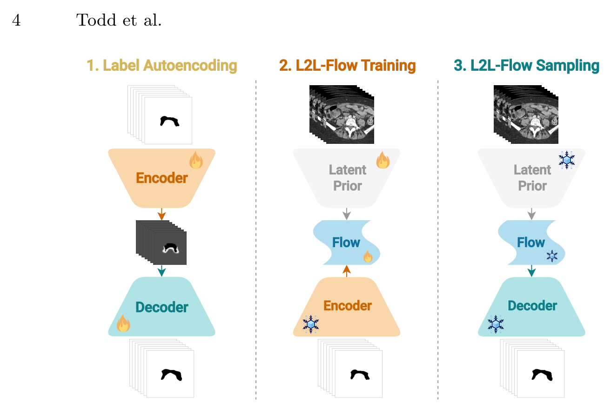

## 一、论文出处

- 论文：Latent-to-Latent Flow for Volumetric Stochastic Segmentation
- 会议：MICCAI 2026
- 链接：https://arxiv.org/abs/2609.07460v1

这篇论文整体做的是"体积随机分割"——给定一张 3D 医学图像，输出不是一个确定的分割 mask，而是一组能反映标注者之间分歧的样本。它属于不确定性建模 / 概率分割这条线，背景是：医学分割里 inter-observer variability 很常见，但大规模体数据几乎拿不到多标注，所以想用生成模型把"标注分布"学出来。

但注意，本合集收的是**可插拔子模块**，不是整个框架。这篇里真正能拆出来、单独塞进别人网络的东西，是它那套 **latent-to-latent flow 机制**——我下面统一叫它 **Latent 模块**。它干的事：在潜空间里学一个从"简单先验"到"目标潜编码分布"的流（flow matching），从而让一个原本确定性的分割网络变成能采样、能表达不确定性的网络。框架整体（编码器、解码器、训练流程）这里只当背景，一句带过。

## 二、模块图（截自论文原文）



图注解读：图中展示的是潜空间里的 flow 路径——左侧是采样自先验的潜变量，中间经过若干步 flow matching 的向量场积分，右侧落到与图像潜编码对齐的目标分布上。关键点在于**整个变换都发生在 latent 空间**，而不是像素空间，所以它足够轻，可以作为一个独立模块挂到已有分割网络的瓶颈层上。

## 三、核心思想与作用

先说清楚它解决什么问题。

普通分割网络（U-Net 那一类）是确定性的：同一张图进去，同一个 mask 出来。但临床上同一张图不同医生标出来的边界就是不一样，这种分歧本身是有信息量的——放疗计划、手术规划里，"这块到底算不算肿瘤浸润区"的不确定性直接决定保守还是激进。

想建模这种不确定性，最直接的办法是生成模型：学一个条件分布 p(mask | image)，采样多次就得到多个合理标注。但直接在像素/体素空间做生成，3D 数据维度爆炸，算不动。于是这篇走潜空间路线：先把图像压到一个低维潜编码 z，然后在 z 上学分布。

Latent 模块的核心就是：**用 flow matching 在潜空间学一个从先验（比如标准高斯）到目标潜分布的可逆变换**。flow matching 的好处是训练目标简单（回归一个向量场），比 diffusion 的采样步数少、比 GAN 稳。学完之后，你从先验采样一个 z0，积分几步得到 z1，z1 就对应一个合理的分割结果。

它的即插即用价值在于：

1. **只动瓶颈层**。它作用在 latent 上，不碰编码器和解码器的结构，所以能挂到任何带瓶颈特征的网络（U-Net、nnU-Net、Swin-UNet 都行）。
2. **确定性网络 → 随机网络**，改动量极小。原来瓶颈输出一个 z，现在让 z 服从一个学出来的分布，采样即可。
3. **轻**。潜空间维度远小于体素空间，flow 网络通常就是几层 MLP 或小卷积，参数量和显存开销都可控。

一句话：它把"不确定性建模"这件事从像素空间搬到了潜空间，代价小到可以当插件用。

## 四、在 U-Net 里的插入位置

标准 U-Net 的结构是：编码器逐级下采样 → 瓶颈（最低分辨率、通道最多）→ 解码器逐级上采样 + 跳连。

Latent 模块插在**瓶颈特征之后、解码器之前**。具体来说：

- 编码器输出瓶颈特征 `h`（形状 `[B, C, D, H, W]`，2D 时是 `[B, C, H, W]`）。
- 用一个轻量投影把 `h` 压成潜编码 `z`（如果瓶颈通道已经够小，也可以直接拿 `h` 当 z）。
- Latent 模块在 `z` 上学 flow：训练时把 `z` 当作目标分布的一个样本，学从先验到它的向量场；推理时从先验采样、积分，得到 `z'`。
- `z'` 再投影回瓶颈通道，送进解码器。

这样解码器看到的瓶颈特征就带上了随机性，多次采样就得到多个分割结果。跳连不受影响，编码器也不用改。

如果你不想动瓶颈，也可以把它挂在**编码器输出的全局池化向量**上（类似分类头那个位置），但那样空间信息损失大，随机性表达会弱一些。推荐还是瓶颈。

## 五、复现代码（PyTorch，逐行中文注释）

下面是一个最小可用的实现。flow matching 的核心是：给定目标样本 z1 和先验样本 z0，构造插值路径 z_t = (1-t)·z0 + t·z1，让网络 v_θ(z_t, t) 去回归目标速度 (z1 - z0)。推理时从 z0 出发，沿学到的速度场积分。

```python
import torch
import torch.nn as nn
import torch.nn.functional as F


class SinusoidalTimeEmbedding(nn.Module):
    """把标量时间 t 编码成向量，供网络感知当前处于 flow 的哪一步。"""
    def __init__(self, dim):
        super().__init__()
        self.dim = dim

    def forward(self, t):
        # t: [B]，取值在 [0, 1]
        half = self.dim // 2
        # 不同频率的正弦基，频率随维度指数增长
        freqs = torch.exp(
            -torch.arange(half, device=t.device, dtype=t.dtype)
            * (torch.log(torch.tensor(10000.0, device=t.device)) / (half - 1))
        )
        args = t[:, None] * freqs[None]  # [B, half]
        # 拼接 sin 和 cos，得到 [B, dim]
        return torch.cat([torch.sin(args), torch.cos(args)], dim=-1)


class VelocityNet(nn.Module):
    """预测向量场 v(z_t, t)。这里用几层 MLP，潜空间维度小，够用。"""
    def __init__(self, latent_dim, hidden_dim=256, time_dim=64):
        super().__init__()
        self.time_embed = SinusoidalTimeEmbedding(time_dim)
        # 输入是潜编码 + 时间编码
        self.net = nn.Sequential(
            nn.Linear(latent_dim + time_dim, hidden_dim),
            nn.SiLU(),
            nn.Linear(hidden_dim, hidden_dim),
            nn.SiLU(),
            nn.Linear(hidden_dim, latent_dim),  # 输出与潜编码同维
        )

    def forward(self, z_t, t):
        # z_t: [B, latent_dim]，t: [B]
        te = self.time_embed(t)          # [B, time_dim]
        x = torch.cat([z_t, te], dim=-1) # 拼接
        return self.net(x)               # 预测速度 [B, latent_dim]


class Latent(nn.Module):
    """
    即插即用的潜空间 flow matching 模块。
    训练：传入编码器给出的潜编码 z1，内部采样 z0 和 t，回归速度。
    推理：从先验采样 z0，积分若干步得到 z1。
    """
    def __init__(self, latent_dim, hidden_dim=256, time_dim=64, steps=10):
        super().__init__()
        self.latent_dim = latent_dim
        self.steps = steps  # 推理时的积分步数，步数越多越准但越慢
        self.velocity = VelocityNet(latent_dim, hidden_dim, time_dim)

    def forward(self, z1):
        """训练前向：返回 flow matching 损失。z1: [B, latent_dim]"""
        B = z1.shape[0]
        device = z1.device
        # 1) 从标准高斯先验采样起点 z0
        z0 = torch.randn_like(z1)
        # 2) 在 [0,1] 上均匀采样时间 t
        t = torch.rand(B, device=device)
        # 3) 构造线性插值路径 z_t = (1-t) z0 + t z1
        t_ = t[:, None]
        z_t = (1 - t_) * z0 + t_ * z1
        # 4) 目标速度就是路径的导数：d z_t / dt = z1 - z0
        target = z1 - z0
        # 5) 网络预测速度，用 MSE 回归
        pred = self.velocity(z_t, t)
        loss = F.mse_loss(pred, target)
        return loss

    @torch.no_grad()
    def sample(self, n, device):
        """推理：从先验采样 n 个潜编码，积分得到目标分布样本。"""
        # 起点：标准高斯
        z = torch.randn(n, self.latent_dim, device=device)
        dt = 1.0 / self.steps
        # 欧拉法沿速度场积分，从 t=0 走到 t=1
        for i in range(self.steps):
            t = torch.full((n,), i * dt, device=device)
            v = self.velocity(z, t)
            z = z + v * dt
        return z  # [n, latent_dim]
```

几点说明：

- 这里把潜编码当成一个**扁平向量**处理。如果你的瓶颈特征是 3D 特征图，可以先 `flatten` 再进模块，或者把 `VelocityNet` 换成小卷积（把时间编码 broadcast 到通道上）。扁平化最简单，也最稳。
- 路径用的是最简单的线性插值（conditional flow matching 里的 rectified path），目标速度就是 `z1 - z0`，实现干净。
- 推理用欧拉法，`steps` 一般 10 左右就够，比 diffusion 动辄几十上百步省很多。

## 六、插入示例（几行塞进你的网络）

假设你有一个现成的 U-Net，瓶颈特征叫 `bottleneck`，形状 `[B, C, D, H, W]`。插入方式：

```python
# 初始化时（__init__ 里）
self.latent_dim = 128
self.to_latent = nn.Linear(C * D * H * W, self.latent_dim)   # 压到潜空间
self.from_latent = nn.Linear(self.latent_dim, C * D * H * W) # 还原回瓶颈
self.latent = Latent(self.latent_dim)

# 训练时（forward 里）
z1 = self.to_latent(bottleneck.flatten(1))   # 编码器瓶颈 -> 潜编码
loss_flow = self.latent(z1)                  # flow matching 损失，加进总 loss
# 训练阶段解码器仍用真实的 z1，保证分割精度
bottleneck = self.from_latent(z1).view_as(bottleneck)

# 推理时（采样多个分割结果）
z_samples = self.latent.sample(n=5, device=bottleneck.device)  # 采 5 个
for z in z_samples:
    b = self.from_latent(z).view(B, C, D, H, W)
    mask = self.decoder(b)   # 每个 z 得到一个分割结果
```

总损失大概是 `loss_seg + λ * loss_flow`，λ 取 0.1~1 之间调。训练时解码器用真实 z1（重建路径），推理时才用采样得到的 z'，这是 flow/diffusion 类方法的常规做法。

## 七、实测经验与注意点

- **潜维度别设太大**。flow matching 在低维空间才轻。128~256 通常够，设到上千的话 MLP 会变重，而且先验到目标的路径更难学。
- **训练和推理的输入要一致**。训练时解码器吃的是真实 z1，推理时吃的是采样 z'。如果 z' 和 z1 分布对不齐，分割质量会掉。缓解办法：训练后期可以混一点采样得到的 z' 喂给解码器，做个对齐。
- **积分步数是速度/精度的权衡**。10 步一般够，追求质量可以加到 20，但别指望像 diffusion 那样靠步数堆出质变。
- **先验选标准高斯最省事**。理论上可以用别的先验，但高斯采样方便、和 flow matching 的线性路径配合好，没必要折腾。
- **别指望它提升确定性分割的 Dice**。这个模块的价值是表达不确定性、给出多样化的合理标注，不是把单次分割精度刷高。评估要看的是样本多样性、和真实多标注分布的匹配度这类指标。
- **2D 和 3D 都能用**。3D 体数据维度大，但正因为它在潜空间做，才扛得住；这也是论文强调的点。你如果做 2D 分割，同样能挂，只是收益相对小一些。
- **和已有不确定性方法比**：MC Dropout 便宜但表达力弱，deep ensemble 要训多个网络，这个模块介于两者之间——一个网络、加个轻量 flow 头，就能采样。

## 八、完整工程

把上面的代码拼起来就是一个可运行的最小工程。目录建议：

```
latent_flow/
├── latent.py        # 本文的 Latent 模块 + VelocityNet
├── unet.py          # 你的 U-Net，瓶颈处接 Latent
├── train.py         # 训练循环，loss = loss_seg + λ * loss_flow
└── infer.py         # 推理，多次采样得到多个分割结果
```

`train.py` 的核心就三行：前向拿到瓶颈 → 算 `loss_flow` → 反传。`infer.py` 调 `latent.sample(n=...)` 循环解码即可。

需要提醒的是，论文里的完整框架还包含它自己的编码器设计和训练细节，我这里只抽了 Latent 这个可插拔模块。你要复现整篇论文的结果，得回去看原文的框架部分；但如果只是想给自己的分割网络加个不确定性采样能力，上面这套就够了。
