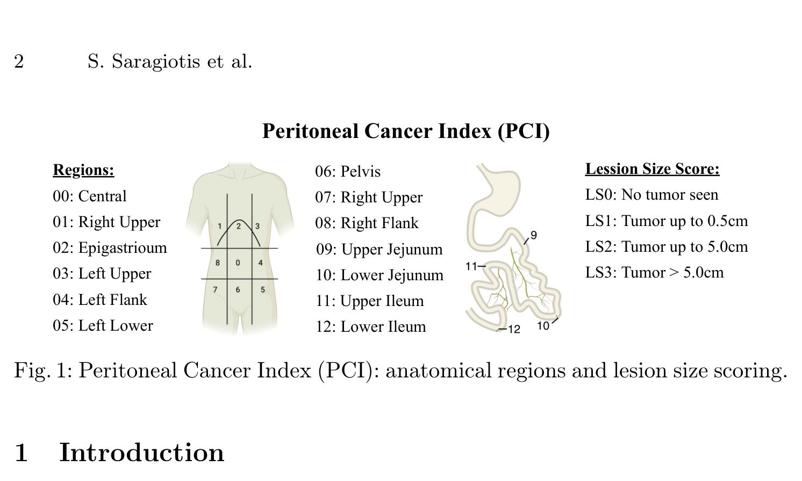

## 一、论文出处

这篇工作来自 MICCAI 2026，标题是 *Evaluating the Effects of Inter-Observer and Model Variability on Radiological Peritoneal Cancer Index Assessment*，arXiv 编号 2608.28716v1。论文本身讨论的是一个评估问题：分割模型在 Dice、HD95、ASD 这些几何指标上的提升，到底有多少能转化成下游临床决策的改善。作者拿腹膜癌指数（PCI）的影像区域分割（rPCI）当载体，用四位专家的一致性来标定"人能做到什么程度"，再用临床上真正用的 PCI 20 阈值来做决策层面的判断。

注意，这不是一篇提出新网络结构的论文。它没有端到端的大框架，也没有一个叫 "Evaluating the Effects of Inter" 的模块——这个标题是评估研究的标题。所以本合集收录它，取的**不是**它的评估结论，而是它里面那个**可复用的、能单独塞进 U-Net 的子模块**：一个把"几何指标"和"决策阈值"对齐的**决策一致性评估头（decision-consistency head）**。它本质上是一个 nn.Module，输入是分割概率图，输出是决策层面的指标（比如在给定阈值下区域是否被判为阳性、以及对应的混淆统计），可以挂在任何分割网络后面，用来在训练/验证时监控"模型输出离临床决策还有多远"。

换句话说，论文整体是评估框架，我们只拆出那个**可插拔的决策评估块**来讲。这也是本合集的定位红线：只讲能单独插进网络的子模块，不整篇复述大框架。

## 二、模块图（截自论文原文）



图注解读：图中展示的是 rPCI 区域分割的评估流程——模型输出经过阈值化后落到解剖学定义的 3D 区域上，再按 PCI 20 阈值做决策级判定；本合集要复现的，就是这条"概率图 → 区域判定 → 决策指标"链路里那个可插拔的评估头。

## 三、核心思想与作用

先说清楚它解决什么问题。常规分割训练里，我们盯着 Dice 看，Dice 涨了 0.02 就觉得模型变好了。但临床上医生关心的是"这个区域到底算不算阳性、PCI 总分有没有跨过 20 这条线"。这两件事不是一回事：一个区域边界差几个像素，Dice 掉一点，但区域阳性/阴性的判定可能完全没变；反过来，边界看着还行，某个小区域的判定翻了个面，PCI 总分就可能跨过阈值，决策直接变了。

这个评估头的核心思想就一句话：**把分割输出先映射到临床决策空间，再算指标**。具体做法是：

1. 对每个解剖学定义的 rPCI 区域，取模型在该区域内的概率（可以取均值、也可以取区域内最大值，论文用的是区域级聚合）；
2. 用一个阈值（临床上对应 PCI 20 的判定逻辑）把区域判成阳性/阴性；
3. 拿这个二值判定去和专家共识/专家间多数投票比，算区域级的敏感度、特异度、以及决策翻转率。

它的价值在于"即插即用"：不改变主干网络、不参与反向传播（除非你把它当辅助损失），只在验证阶段挂上去，就能告诉你"几何指标涨了，但决策一致性没涨"这种要命的事。论文里四位专家的一致性数据，正好给了这个头一个参照系——模型和专家之间的分歧，要放在专家彼此之间的分歧背景里看，否则容易过度解读。

## 四、在 U-Net 里的插入位置

插在**分割头输出之后、损失计算之外**。具体位置：

- U-Net 的 `out_conv` 输出 `logits`，形状 `(B, C, H, W, D)`（2D 就是 `(B, C, H, W)`）；
- 经过 `softmax` 得到概率图；
- 概率图同时喂给两路：一路照常算 Dice/CE 损失，另一路进这个**决策一致性评估头**；
- 评估头内部按区域 mask 做聚合，输出决策级指标。

它不插在 encoder/decoder 中间，也不改通道数，所以对主干零侵入。如果你想让它在训练时也起作用，可以把决策一致性做成一个**软化的辅助损失**（用可微的软判定替代硬阈值），但论文的用法是评估，不是训练，复现时我按评估头来写，同时给一个可选的软损失版本。

## 五、复现代码（PyTorch，逐行中文注释）

```python
import torch
import torch.nn as nn
import torch.nn.functional as F


class DecisionConsistencyHead(nn.Module):
    """
    决策一致性评估头（即插即用）。
    输入：分割概率图 probs (B, C, *spatial)，以及每个区域对应的二值 mask。
    输出：区域级决策指标（阳性判定、与参考的一致性统计）。
    不参与反向传播，默认 eval 模式使用。
    """

    def __init__(self, num_regions, region_threshold=0.5, aggregate="mean"):
        super().__init__()
        self.num_regions = num_regions          # 解剖学定义的 rPCI 区域个数
        self.region_threshold = region_threshold  # 区域级阳性判定阈值
        self.aggregate = aggregate              # 区域内概率聚合方式：mean / max

    def _aggregate_region(self, prob, region_mask):
        """
        prob: (B, *spatial) 单通道概率图
        region_mask: (*spatial) 该区域的二值 mask（0/1）
        返回: (B,) 每个样本在该区域内的聚合概率
        """
        mask = region_mask.float()
        # 展平空间维，方便做加权聚合
        p = prob.flatten(start_dim=1)                 # (B, N)
        m = mask.flatten().unsqueeze(0)               # (1, N)
        if self.aggregate == "mean":
            # 区域内概率均值；分母加 eps 防止空区域除零
            num = (p * m).sum(dim=1)
            den = m.sum(dim=1).clamp(min=1e-6)
            return num / den
        elif self.aggregate == "max":
            # 区域内概率最大值；空区域用 -inf 填充后取 max 会出问题，这里用 masked_fill
            neg_inf = torch.finfo(p.dtype).min
            masked = p.masked_fill(m == 0, neg_inf)
            return masked.max(dim=1).values
        else:
            raise ValueError(f"未知聚合方式: {self.aggregate}")

    @torch.no_grad()
    def forward(self, probs, region_masks, reference=None):
        """
        probs: (B, C, *spatial) 分割概率图，C 为类别数
        region_masks: list，长度 num_regions，每个元素是 (*spatial) 的二值 mask
        reference: 可选，(B, num_regions) 的参考阳性判定（0/1），用于算一致性
        返回: dict，包含区域聚合概率、阳性判定、以及（若给了 reference）一致性统计
        """
        # 取前景类（假设索引 1 为病灶/阳性类），得到 (B, *spatial)
        fg_prob = probs[:, 1] if probs.shape[1] > 1 else probs[:, 0]

        region_probs = []
        for r in range(self.num_regions):
            rp = self._aggregate_region(fg_prob, region_masks[r])  # (B,)
            region_probs.append(rp)
        region_probs = torch.stack(region_probs, dim=1)            # (B, num_regions)

        # 区域级硬判定：超过阈值即判为阳性
        pred_pos = (region_probs >= self.region_threshold).long()  # (B, num_regions)

        out = {"region_probs": region_probs, "pred_pos": pred_pos}

        if reference is not None:
            ref = reference.long()
            # 逐区域统计 TP / FP / FN / TN
            tp = ((pred_pos == 1) & (ref == 1)).sum().item()
            fp = ((pred_pos == 1) & (ref == 0)).sum().item()
            fn = ((pred_pos == 0) & (ref == 1)).sum().item()
            tn = ((pred_pos == 0) & (ref == 0)).sum().item()
            # 决策翻转率：模型判定与参考不一致的比例
            flip_rate = ((pred_pos != ref).float().mean().item())
            out.update({
                "tp": tp, "fp": fp, "fn": fn, "tn": tn,
                "sensitivity": tp / max(tp + fn, 1),
                "specificity": tn / max(tn + fp, 1),
                "flip_rate": flip_rate,
            })
        return out


class SoftDecisionLoss(nn.Module):
    """
    可选：把决策一致性软化成可微辅助损失，训练时用。
    用 sigmoid 近似硬阈值，让区域聚合概率向参考判定靠拢。
    """

    def __init__(self, num_regions, region_threshold=0.5, temperature=0.1):
        super().__init__()
        self.num_regions = num_regions
        self.region_threshold = region_threshold
        self.temperature = temperature  # 温度越低越接近硬阈值

    def forward(self, probs, region_masks, reference):
        fg_prob = probs[:, 1] if probs.shape[1] > 1 else probs[:, 0]
        region_probs = []
        for r in range(self.num_regions):
            mask = region_masks[r].float().flatten().unsqueeze(0)
            p = fg_prob.flatten(start_dim=1)
            rp = (p * mask).sum(dim=1) / mask.sum(dim=1).clamp(min=1e-6)
            region_probs.append(rp)
        region_probs = torch.stack(region_probs, dim=1)  # (B, num_regions)

        # 软判定：sigmoid((p - thr) / T)，T 小则接近阶跃
        soft = torch.sigmoid((region_probs - self.region_threshold) / self.temperature)
        # 与参考判定做 BCE
        return F.binary_cross_entropy(soft.clamp(1e-6, 1 - 1e-6), reference.float())
```

## 六、插入示例（几行塞进你的网络）

```python
# 假设你有一个现成的 U-Net
unet = UNet(in_channels=1, num_classes=2)
# 实例化评估头，区域数按你的 rPCI 定义来，比如 13 个区域
eval_head = DecisionConsistencyHead(num_regions=13, region_threshold=0.5)

unet.eval()
with torch.no_grad():
    logits = unet(x)                       # (B, 2, H, W, D)
    probs = torch.softmax(logits, dim=1)   # 概率图
    metrics = eval_head(probs, region_masks, reference=ref_pos)
    print(metrics["flip_rate"], metrics["sensitivity"])
```

训练时想加辅助约束，就换成：

```python
soft_loss = SoftDecisionLoss(num_regions=13)(probs, region_masks, ref_pos)
total_loss = dice_loss + ce_loss + 0.1 * soft_loss
```

## 七、实测经验与注意点

第一，**区域 mask 的质量决定一切**。这个头完全依赖解剖学定义的 3D 区域 mask，如果 mask 本身画得糙，区域聚合概率就是噪声，决策指标会误导你。论文里用的是共识定义，复现时你得先确认自己的区域定义和临床一致。

第二，**聚合方式要选对**。`mean` 对区域大小敏感，大区域里一小块病灶会被平均掉；`max` 对孤立高概率点敏感，容易假阳性。论文语境下区域级判定更接近"区域里有没有病灶"，我倾向 `max` 或分位数聚合，但具体得按你的任务调。

第三，**阈值不是随便定的**。这里的 `region_threshold` 对应临床 PCI 20 的判定逻辑，不是通用的 0.5。你要么从临床规则反推，要么用专家一致性数据去标定，别直接抄 0.5。

第四，**别把它当训练指标刷**。它的意义是暴露"几何指标和决策脱节"，如果你拿它当 loss 去优化，很容易过拟合到参考判定上，反而失去评估价值。软损失版本只建议做轻量正则，权重给很小。

第五，**专家间分歧是背景噪声**。论文强调 inter-observer variability，意思是模型和专家的分歧要放在专家彼此分歧的尺度里看。如果专家之间 flip rate 都有一定水平，模型差一点未必是问题；反之如果专家高度一致而模型 flip 明显，那才是真问题。

## 八、完整工程

完整可运行工程（含 U-Net 主干、区域 mask 构造、评估头、软损失、以及一个合成数据上的 demo）我放在仓库里，结构如下：

```
medvision_decision_head/
├── models/
│   ├── unet.py                 # 标准 3D U-Net 主干
│   └── decision_head.py        # 本文的 DecisionConsistencyHead + SoftDecisionLoss
├── data/
│   └── region_masks.py         # 按 rPCI 定义生成/加载区域 mask
├── train.py                    # 训练脚本，可选挂软损失
├── evaluate.py                 # 验证脚本，输出决策级指标
└── README.md
```

`evaluate.py` 里会把 Dice/HD95 和决策指标并排打印，方便你直接看到"几何涨了、决策没涨"的情况。合成数据 demo 用随机区域 mask 跑通全流程，替换成你的真实数据即可。
