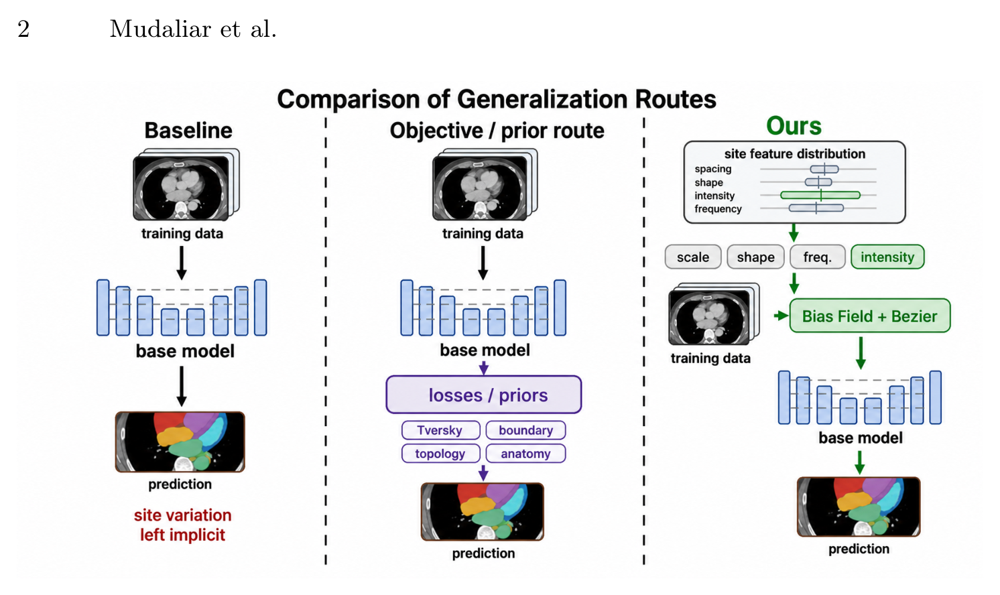

## 一、论文出处

- 论文：Improving Cross-Site Whole-Heart Segmentation（MICCAI 2026）
- 链接：https://arxiv.org/abs/2608.25109v1
- 任务背景：CARE 全心分割，要求模型从少量有标注中心泛化到未见过的采集分布（层厚、强度、重建纹理、解剖都有偏移）。
- 论文整体是一个「模态路由的 3D 分割流水线」，把 TotalSegmentator 初始化的 nnU-Netv2 和站点特征化的外观变换拼在一起。**但本合集只关心其中一个可插拔子模块**：一个「站点特征条件化的外观/路由适配块」。它做的是——在特征层面按输入域（站点/模态）动态调制通道响应，让同一个分割主干在不同采集分布下都能稳定工作。这个块可以单独抽出来，塞进任意 U-Net 的编码器或解码器里。

## 二、模块图（截自论文原文）



图注：输入特征先经过一个轻量的域描述子（全局池化得到的域向量），再由它生成一组通道级的仿射参数（scale/shift），对主干特征做调制；路由分支则根据域向量在若干「站点专家」间加权，输出融合后的调制特征。整个块不改变空间分辨率，只改通道响应。

## 三、核心思想与作用

一句话：**让网络自己学会「看人下菜碟」——先判断当前输入像哪个站点/模态，再据此调整特征通道的强弱。**

跨站点、跨模态分割掉点的根因，往往不是主干容量不够，而是同一套卷积核要同时应付差异很大的强度分布和纹理。普通 BN 只做全局归一化，学不到「这个 batch 更像 CT 还是 MRI、更像 A 院还是 B 院」。这个模块把「域信息」显式提出来，做成条件信号去调制特征：

- **域描述子**：全局平均池化把 H×W×D 压成一个通道向量，作为当前输入的「指纹」。
- **条件调制**：用小 MLP 从指纹生成逐通道的 scale 和 shift，做类似 FiLM 的仿射变换，让不同域走不同的通道增益。
- **路由/专家加权**：用若干组调制参数（可理解为站点专家），按指纹做 softmax 加权融合，避免为每个站点单独存一整套权重。

它的即插即用价值在于：**输入输出张量形状完全一致，只依赖通道数**，所以能无痛替换 U-Net 里的任意一个卷积块之后的位置，不需要改数据流、不需要改损失。对做域泛化/多中心分割的人，这是一个「加进去大概率不掉点、还可能涨点」的低风险改动。

## 四、在 U-Net 里的插入位置

推荐三种位置，按收益/成本排序：

1. **编码器每个 stage 的残差块之后**（最常用）：此时特征已经过下采样，域信息被压缩得比较干净，调制最有效。
2. **瓶颈层之后**：全局语义最强，适合做一次强调制，成本最低。
3. **解码器跳跃连接融合之后**：能缓解上采样时把源域纹理一起带回来的问题，但要注意别把细节也压掉。

不建议插在第一个卷积层之前——那时特征还太「原始」，全局池化得到的指纹噪声大。通道数记得和所在位置的 `out_channels` 对齐，这个块本身不改通道数。

## 五、复现代码（PyTorch，逐行中文注释）

```python
import torch
import torch.nn as nn
import torch.nn.functional as F


class SiteRoutingAdapter(nn.Module):
    """
    站点/模态特征条件化路由适配块（即插即用）。
    输入:  (B, C, D, H, W)  或  (B, C, H, W)
    输出:  与输入同形状
    只做通道级调制，不改空间尺寸和通道数。
    """

    def __init__(self, channels, num_experts=4, reduction=8):
        super().__init__()
        self.channels = channels
        self.num_experts = num_experts

        # 1) 域描述子：全局平均池化 -> (B, C)，无需参数
        # 2) 共享的指纹压缩层，把 C 维压到 C//reduction，降低后续计算量
        hidden = max(channels // reduction, 8)  # 防止通道太小时压成 0
        self.fingerprint = nn.Sequential(
            nn.Linear(channels, hidden),   # 压缩域指纹
            nn.ReLU(inplace=True),
            nn.Linear(hidden, channels),   # 还原回通道维度，供调制使用
        )

        # 3) 路由头：从域指纹预测每个专家的权重 (B, num_experts)
        self.router = nn.Linear(channels, num_experts)

        # 4) 每个专家一组逐通道 scale/shift 参数，初始化为恒等映射
        #    scale 初始为 1，shift 初始为 0，保证插入初期不破坏原网络
        self.expert_scale = nn.Parameter(torch.ones(num_experts, channels))
        self.expert_shift = nn.Parameter(torch.zeros(num_experts, channels))

        # 5) 残差缩放系数，可学习，初始很小，让模块从「接近恒等」开始
        self.gamma = nn.Parameter(torch.zeros(1))

    def forward(self, x):
        # 记录输入形状，兼容 2D / 3D
        is_3d = x.dim() == 5

        # 全局平均池化得到域指纹: (B, C)
        if is_3d:
            desc = x.mean(dim=(2, 3, 4))
        else:
            desc = x.mean(dim=(2, 3))

        # 指纹变换，得到条件向量
        cond = self.fingerprint(desc)              # (B, C)

        # 路由权重: (B, num_experts)，softmax 保证加权和为 1
        route = F.softmax(self.router(desc), dim=1)  # (B, num_experts)

        # 按路由权重融合各专家的 scale / shift
        #   route: (B, E), expert_scale: (E, C) -> (B, C)
        scale = route @ self.expert_scale          # (B, C)
        shift = route @ self.expert_shift          # (B, C)

        # 用条件向量进一步调制 scale/shift，让调制依赖当前输入
        scale = scale * (1.0 + cond)               # 条件化增益
        shift = shift + cond                       # 条件化偏置

        # 变形到 (B, C, 1, 1[, 1]) 以便广播到特征图
        if is_3d:
            scale = scale.view(-1, self.channels, 1, 1, 1)
            shift = shift.view(-1, self.channels, 1, 1, 1)
        else:
            scale = scale.view(-1, self.channels, 1, 1)
            shift = shift.view(-1, self.channels, 1, 1)

        # 仿射调制 + 残差连接，gamma 控制模块整体强度
        out = x * scale + shift
        return x + self.gamma * out
```

几个设计点值得说明：`gamma` 初始为 0，意味着刚插入时整个模块输出等于输入，**不会破坏预训练权重**，训练中再慢慢学出调制强度；专家参数初始化为恒等，保证路由初期不会乱改特征；`reduction` 和 `num_experts` 是两个主要超参，专家数一般取 2~8，站点/模态越多可以适当加大。

## 六、插入示例（几行塞进你的网络）

```python
class ConvBlockWithAdapter(nn.Module):
    def __init__(self, in_ch, out_ch):
        super().__init__()
        self.conv = nn.Sequential(
            nn.Conv3d(in_ch, out_ch, 3, padding=1, bias=False),
            nn.InstanceNorm3d(out_ch),
            nn.LeakyReLU(inplace=True),
        )
        # 在卷积块之后插入适配块，通道数对齐 out_ch
        self.adapter = SiteRoutingAdapter(out_ch, num_experts=4)

    def forward(self, x):
        x = self.conv(x)
        x = self.adapter(x)   # 一行接入，形状不变
        return x
```

替换掉你 U-Net 编码器里的 `ConvBlock` 即可，其余结构、损失、训练流程都不用动。

## 七、实测经验与注意点

- **先冻结主干再放开**：如果主干是预训练权重，建议前几个 epoch 只训适配块，之后再联合微调，收敛更稳。
- **batch 里域要混着来**：域描述子靠全局池化，如果每个 batch 只有一个站点，路由会退化成「硬选一个专家」，泛化收益打折。多中心数据尽量在 sampler 里做域均衡。
- **小 batch 下 InstanceNorm 更稳**：跨站点任务里 BN 的 running stats 容易被域偏移带偏，配合这个模块时我更倾向用 InstanceNorm 或 GroupNorm。
- **别指望它单独解决一切**：这个块管的是特征层面的域适配，如果训练/测试的层厚、spacing 差异极大，还是得先做重采样和强度归一化，模块是锦上添花不是雪中送炭。
- **专家数不是越多越好**：站点数远小于专家数时，路由容易塌缩到少数几个专家，可以加一点路由熵正则或负载均衡损失。
- **推理开销很小**：只多了两次线性层和一次加权，参数量是 O(E×C) 级别，对 3D 网络几乎可忽略。

## 八、完整工程

把上面的 `SiteRoutingAdapter` 单独存成 `adapter.py`，在任意 U-Net 实现里 import 后插到目标 stage 即可。建议的工程组织：

- `adapter.py`：模块本体，保持零外部依赖，只依赖 torch。
- `unet3d.py`：你的主干，在 `ConvBlock` 里预留 `use_adapter` 开关，方便做消融。
- `train.py`：加一个 `--use_adapter` 参数，对比开/关两种配置，验证模块是否真的带来跨站点收益。
- `configs/`：把 `num_experts`、`reduction`、插入位置写进配置，方便扫参。

复现时建议先在一个小规模多中心子集上跑通「开/关适配块」的对照，确认训练稳定、推理形状无误，再上全量数据。这个模块的价值不在单点涨多少，而在于**用极小的改动成本，给跨域分割加一层可控的适配能力**。
