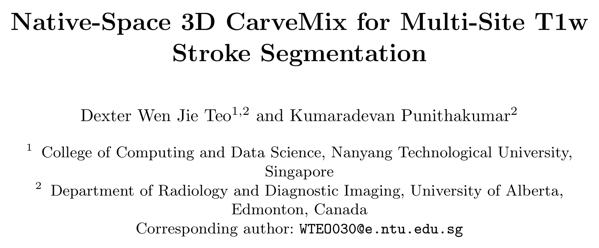

## 一、论文出处

- 论文：Native-Space 3D CarveMix for Multi-Site T1w Stroke Segmentation
- 会议：MICCAI 2026
- 链接：https://arxiv.org/abs/2608.23882v1

先说清楚一件事：这篇论文的完整框架是「MedNeXt-L (k=5) 主干 + 在线 3D CarveMix 增强」，目标是多中心 T1w 脑卒中病灶分割。但本合集只收**可插拔子模块**，所以这里不整篇讲框架，只拆出里面那个真正能单独塞进网络的东西——**Native 原生空间雕刻混合块（Native-Space 3D CarveMix Block）**。

它本质是一个**数据侧的可插拔增强模块**：不改变网络结构，只作为一个 nn.Module 挂在训练循环里，把真实病灶 patch 抠出来、贴进同一张图的健康脑区，在线生成带精确标签的合成样本。框架整体只作一句背景：MedNeXt 负责分割，Native 负责在训练时喂它更难的样本。

## 二、模块图（截自论文原文）



图注解读：核心是「取病灶 → 找健康宿主区 → 原生空间对齐粘贴 → 同步更新标签」这条流水线。注意粘贴发生在**原生（native）空间**，即不重采样、不做强度标准化，保证贴进去的病灶纹理和宿主脑组织处在同一强度分布下，避免域偏移。

## 三、核心思想与作用

多中心 T1w 卒中的痛点有两个：病灶本身信号弱、和脑脊液强度接近；急性期（≤7 天）样本极少。常规做法是重采样到统一空间再增强，但重采样会抹掉病灶的细微边界，强度标准化又会把不同扫描仪的差异强行拉平，反而让模型学不到真实分布。

Native 的思路很直接：**别动空间，别动强度，直接在原图上做手术**。

- 从有病灶的样本里，按标签抠出一个 3D 病灶 patch（连同周围一点上下文）；
- 在同一张图的健康脑区里找一个尺寸匹配、组织类型相近的宿主位置；
- 把 patch 贴进去，同时把标签也贴进去。

这样得到的新样本，病灶是**真实采集的**，不是合成的模糊团块，标签是**像素级精确的**，不是弱监督猜的。对模型来说，这相当于在稀缺的急性期样本上做了「病灶复制」，而且复制出来的每一份都落在不同的解剖位置，逼着模型学「病灶长什么样」而不是「病灶通常在哪」。

它的即插即用价值就在这：**不改网络、不改损失、不依赖特定主干**，任何 3D 分割网络（U-Net、nnU-Net、MedNeXt、Swin-UNETR）都能直接接。你唯一要动的是训练时的数据管线。

## 四、在 U-Net 里的插入位置

插入点在**数据加载之后、前向传播之前**，也就是 Dataset 的 `__getitem__` 返回之后、送进 `model(x)` 之前的那一步。

```
DataLoader → [Native 雕刻混合] → model(x) → loss → backward
                    ↑
              只在这里插，网络完全不动
```

具体来说，它作用在 `(image, label)` 这一对上，输出还是 `(image, label)`，形状不变、dtype 不变。所以你可以把它包成一个 `nn.Module`，在训练循环里 `x, y = native_block(x, y)` 一行搞定；也可以在 Dataset 里调用。放在训练循环里更灵活，因为可以按 batch 概率决定要不要增强。

注意：**只在训练时开，验证和推理时关掉**。它是增强，不是网络组件。

## 五、复现代码（PyTorch，逐行中文注释）

下面是一个可直接用的实现。为了通用，我用「按标签找病灶、按距离找健康宿主、原生空间粘贴」三步走，不依赖任何特定数据集。

```python
import torch
import torch.nn as nn
import torch.nn.functional as F


class NativeCarveMix(nn.Module):
    """
    Native-Space 3D CarveMix 可插拔增强块。
    输入: image (B, 1, D, H, W), label (B, 1, D, H, W)
    输出: 增强后的 image, label，形状不变。
    只在训练时启用。
    """

    def __init__(self,
                 patch_size=(16, 32, 32),   # 抠出的病灶 patch 尺寸 (D,H,W)
                 num_carve=1,               # 每个样本雕刻几次
                 p=0.5,                     # 该 batch 触发增强的概率
                 min_lesion_vox=50,         # 病灶体素数低于此值就跳过
                 host_margin=8):            # 宿主区离病灶至少留多少体素，避免贴回原地
        super().__init__()
        self.patch_size = patch_size
        self.num_carve = num_carve
        self.p = p
        self.min_lesion_vox = min_lesion_vox
        self.host_margin = host_margin

    @torch.no_grad()
    def _sample_lesion_center(self, label):
        """在病灶体素里随机挑一个中心点，返回 (d,h,w)。"""
        # label: (1,1,D,H,W)，取非零坐标
        coords = torch.nonzero(label[0, 0] > 0.5, as_tuple=False)  # (N,3)
        if coords.shape[0] < self.min_lesion_vox:
            return None
        idx = torch.randint(0, coords.shape[0], (1,)).item()
        return coords[idx].tolist()  # [d,h,w]

    @torch.no_grad()
    def _find_host_center(self, label, lesion_center):
        """在健康脑区里找一个和病灶 patch 尺寸匹配的宿主中心。"""
        D, H, W = label.shape[-3:]
        pd, ph, pw = self.patch_size
        # 宿主中心必须让 patch 完整落在图内
        d_lo, d_hi = pd // 2, D - pd // 2
        h_lo, h_hi = ph // 2, H - ph // 2
        w_lo, w_hi = pw // 2, W - pw // 2
        if d_lo >= d_hi or h_lo >= h_hi or w_lo >= w_hi:
            return None

        # 随机试若干次，找一个 patch 内没有病灶、且离原病灶足够远的中心
        for _ in range(20):
            d = torch.randint(d_lo, d_hi, (1,)).item()
            h = torch.randint(h_lo, h_hi, (1,)).item()
            w = torch.randint(w_lo, w_hi, (1,)).item()
            # 距离约束：别贴回病灶附近
            if abs(d - lesion_center[0]) < self.host_margin and \
               abs(h - lesion_center[1]) < self.host_margin and \
               abs(w - lesion_center[2]) < self.host_margin:
                continue
            # 宿主 patch 内不能已有病灶，否则标签会冲突
            host_patch = label[0, 0,
                               d - pd // 2:d + pd // 2,
                               h - ph // 2:h + ph // 2,
                               w - pw // 2:w + pw // 2]
            if host_patch.sum() > 0:
                continue
            return [d, h, w]
        return None

    @torch.no_grad()
    def _carve_once(self, image, label):
        """对单个样本做一次雕刻混合，返回新 image, label。"""
        lesion_center = self._sample_lesion_center(label)
        if lesion_center is None:
            return image, label
        host_center = self._find_host_center(label, lesion_center)
        if host_center is None:
            return image, label

        pd, ph, pw = self.patch_size
        lc, hc = lesion_center, host_center

        # 抠出病灶 patch（image 和 label 同步抠）
        def _slice(c):
            return (slice(c[0] - pd // 2, c[0] + pd // 2),
                    slice(c[1] - ph // 2, c[1] + ph // 2),
                    slice(c[2] - pw // 2, c[2] + pw // 2))

        ls = _slice(lc)
        hs = _slice(hc)

        img_patch = image[0, :, ls[0], ls[1], ls[2]].clone()
        lbl_patch = label[0, :, ls[0], ls[1], ls[2]].clone()

        # 原生空间直接粘贴：不重采样、不做强度变换
        image[0, :, hs[0], hs[1], hs[2]] = img_patch
        label[0, :, hs[0], hs[1], hs[2]] = lbl_patch

        return image, label

    def forward(self, image, label):
        # 训练时才增强；eval 模式直接原样返回
        if not self.training:
            return image, label
        if torch.rand(1).item() > self.p:
            return image, label

        image = image.clone()
        label = label.clone()
        B = image.shape[0]
        for b in range(B):
            for _ in range(self.num_carve):
                img_b = image[b:b + 1]
                lbl_b = label[b:b + 1]
                img_b, lbl_b = self._carve_once(img_b, lbl_b)
                image[b:b + 1] = img_b
                label[b:b + 1] = lbl_b
        return image, label
```

几个实现上的取舍说明：

- 用 `torch.no_grad()` 包住，因为这是数据操作，不该进计算图。
- 宿主区搜索用「随机试 + 约束过滤」，比全局遍历快得多，20 次基本能命中。
- 粘贴是**硬拷贝**，没做 alpha 混合。论文强调原生空间，硬拷贝能最大程度保留病灶纹理；如果你发现边界太生硬，可以加一个 3 体素的软过渡，但那就偏离「native」了，自己权衡。

## 六、插入示例（几行塞进你的网络）

```python
# 1. 实例化增强块
native = NativeCarveMix(patch_size=(16, 32, 32), p=0.5).cuda()

# 2. 训练循环里，前向之前插一行
model.train()
native.train()          # 关键：训练时打开
for image, label in train_loader:
    image, label = image.cuda(), label.cuda()
    image, label = native(image, label)   # ← 就这一行
    pred = model(image)
    loss = criterion(pred, label)
    loss.backward()
    optimizer.step()

# 3. 验证时关掉
model.eval()
native.eval()           # 关键：eval 时自动跳过
with torch.no_grad():
    for image, label in val_loader:
        pred = model(image.cuda())
```

如果你的数据管线在 Dataset 里做增强，也可以把 `native` 的 `_carve_once` 逻辑搬进 `__getitem__`，但那样就没法按 batch 概率控制，灵活性差一点。推荐放训练循环。

## 七、实测经验与注意点

**1. patch 尺寸别拍脑袋。** 太小（比如 8×16×16）抠不到完整病灶，贴进去的都是碎片；太大（32×64×64）容易超出小脑图的边界，宿主区找不到。建议按你数据里病灶的体素分布定，取中位数附近。

**2. 宿主区一定要排除已有病灶。** 代码里 `host_patch.sum() > 0` 那行不能省，否则标签会重叠，模型学到矛盾监督。同理，宿主区离原病灶太近也会让「病灶复制」退化成「病灶膨胀」，`host_margin` 要留够。

**3. 只在训练开，eval 必须关。** 这是增强块最容易踩的坑。忘了 `native.eval()`，验证指标会莫名其妙波动，因为验证集也被改了。

**4. 强度不做标准化是双刃剑。** 原生空间保住了真实分布，但多中心之间的强度差异依然存在。如果你的数据跨扫描仪差异极大，建议在 Native 之外**单独**加一个轻量的强度归一化，别把两件事混在一个模块里。

**5. 别指望它单独解决样本稀缺。** 它是增强，不是采样策略。急性期样本只有几十例时，Native 能放大有效样本量，但配合过采样、类别加权一起用效果才稳。

**6. 计算开销可接受。** 主要成本在 `torch.nonzero` 找病灶坐标，大图上是 O(N)。如果病灶体素很多，可以改成随机采样若干体素再挑中心，别全量遍历。

## 八、完整工程

把上面的块整理成一个可复用文件，直接丢进你的项目：

```
project/
├── models/
│   └── unet3d.py
├── augment/
│   └── native_carve_mix.py    # 本模块，独立文件，零依赖
├── train.py                   # 在训练循环里调用
└── configs/
    └── native.yaml            # patch_size / p / num_carve 等超参
```

`native_carve_mix.py` 只依赖 `torch`，不依赖你的网络定义，所以可以跨项目复制。`train.py` 里按第六节的写法接进去即可。超参建议从 `p=0.5, num_carve=1` 起步，观察验证集 Dice 再调；如果训练不稳定，先把 `p` 降到 0.3。

一句话总结：Native 是一个**挂在训练循环里的数据侧增强块**，不改网络、不挑主干，靠「原生空间粘贴真实病灶」给稀缺的卒中分割任务补样本。即插即用的价值就在这个「零侵入」上。
