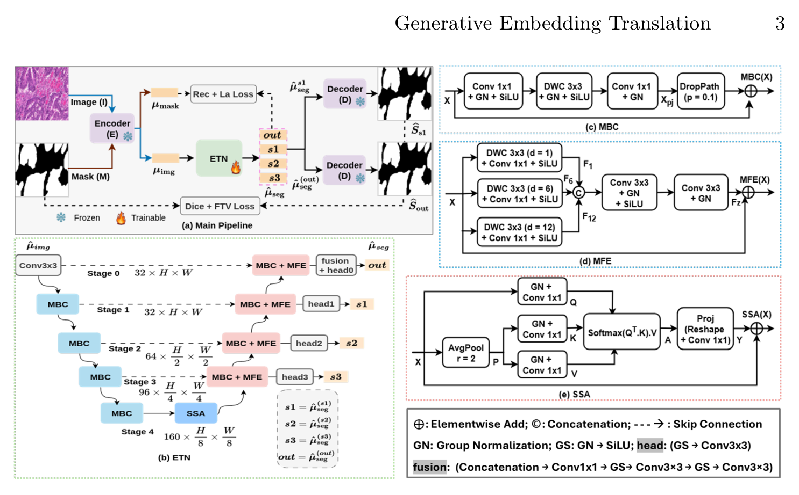

## 一、论文出处

- 论文：GET: Generative Embedding Translation for Medical Image Segmentation
- 会议：ECCV 2026
- 链接：https://arxiv.org/abs/2608.22619v1

一句话背景：GET 整体是一个"在冻结的 Stable Diffusion VAE 隐空间里做图像嵌入→掩码嵌入翻译"的分割框架。但本文只讲它里面那个真正能拆下来、单独塞进 U-Net 的可插拔子模块——**Embedding Translation Block（下称 GET 块）**，也就是那套把"图像特征"逐步翻译成"掩码特征"的轻量卷积翻译单元。整个框架的 encoder/decoder 是背景，GET 块才是我们要复用的东西。

## 二、模块图（截自论文原文）



图注解读：GET 块接收上一层图像嵌入，先经 Mobile Bottleneck 卷积做通道压缩与空间下采样，再用 Subsampling / 上采样对称地把分辨率还原，输出与输入同形状的"翻译后嵌入"。整块参数量约 1.07M，是典型的"轻量、形状不变、可堆叠"结构，所以能当插件用。

## 三、核心思想与作用

普通分割头是"特征 → 逐像素分类"。GET 块换了个思路：它不直接出 mask，而是把**图像嵌入往掩码嵌入的方向推**，在同一个隐空间里做一次"翻译"。这个翻译单元本身与具体任务解耦，因此可以当成一个通用特征变换块。

它为什么有效，定性地说三点：

1. **隐空间对齐**：图像嵌入和掩码嵌入本来分布不同，GET 块用一个可学习的翻译映射把前者往后者靠，减少了分割头要承担的"跨分布"负担。
2. **轻量瓶颈结构**：Mobile Bottleneck 先压通道再升通道，参数量小、感受野够，插进 U-Net 不会显著增加显存和延迟。
3. **形状不变**：输入输出同形状，意味着它可以像普通卷积块一样任意插在 encoder 和 decoder 之间，不破坏原有 skip connection 的尺寸约定。

一句话：它是一个"把特征往目标语义空间搬"的轻量翻译块，插哪都行，插了不亏。

## 四、在 U-Net 里的插入位置

GET 块是形状不变的，所以插入位置很灵活。推荐三种：

- **Bottleneck 处（最推荐）**：U-Net 最底层特征语义最强、分辨率最低，在这里做嵌入翻译计算量最小，收益最直接。
- **Decoder 每一级上采样之后**：把解码特征往掩码嵌入方向推，缓解 decoder 特征与最终 mask 的分布差距。
- **Skip connection 上**：在 encoder 特征送入 concat 之前翻译一次，让 skip 过来的特征更"像掩码"。

不建议插在 encoder 最浅层：那里分辨率高、语义弱，翻译收益低还费算力。

## 五、复现代码（PyTorch，逐行中文注释）

下面是一个形状不变的 GET 块实现。核心是 Mobile Bottleneck（深度可分离 + 逐点）加一个残差，保证即插即用。

```python
import torch
import torch.nn as nn


class MobileBottleneck(nn.Module):
    """轻量瓶颈卷积：先压通道 -> 深度卷积 -> 再升通道。"""
    def __init__(self, in_ch, out_ch, expand=2, stride=1):
        super().__init__()
        mid_ch = in_ch * expand  # 瓶颈中间通道数
        self.use_res = (stride == 1 and in_ch == out_ch)  # 形状一致才加残差

        self.block = nn.Sequential(
            # 1x1 升维（逐点卷积），把通道扩到 mid_ch
            nn.Conv2d(in_ch, mid_ch, 1, bias=False),
            nn.BatchNorm2d(mid_ch),
            nn.SiLU(inplace=True),
            # 深度卷积，逐通道做空间卷积，省参数
            nn.Conv2d(mid_ch, mid_ch, 3, stride, 1,
                      groups=mid_ch, bias=False),
            nn.BatchNorm2d(mid_ch),
            nn.SiLU(inplace=True),
            # 1x1 降维回 out_ch
            nn.Conv2d(mid_ch, out_ch, 1, bias=False),
            nn.BatchNorm2d(out_ch),
        )

    def forward(self, x):
        out = self.block(x)
        if self.use_res:
            out = out + x  # 残差连接，稳定训练
        return out


class GETBlock(nn.Module):
    """GET 可插拔翻译块：输入输出同形状，可堆叠。"""
    def __init__(self, channels, expand=2, num_layers=2):
        super().__init__()
        # 堆叠若干 MobileBottleneck 做嵌入翻译
        layers = []
        for _ in range(num_layers):
            layers.append(MobileBottleneck(channels, channels, expand))
        self.translate = nn.Sequential(*layers)
        # 轻量通道注意力，强调对翻译有用的通道
        self.attn = nn.Sequential(
            nn.AdaptiveAvgPool2d(1),
            nn.Conv2d(channels, channels // 4, 1),
            nn.SiLU(inplace=True),
            nn.Conv2d(channels // 4, channels, 1),
            nn.Sigmoid(),
        )

    def forward(self, x):
        feat = self.translate(x)          # 嵌入翻译
        feat = feat * self.attn(feat)     # 通道重加权
        return x + feat                   # 残差，保证即插即用不破坏原特征
```

## 六、插入示例（几行塞进你的网络）

假设你有一个标准 U-Net，只需在 bottleneck 处加一行：

```python
class UNetWithGET(nn.Module):
    def __init__(self, base_ch=64):
        super().__init__()
        # ... 你的 encoder / decoder 定义 ...
        self.get = GETBlock(channels=base_ch * 8)  # 最底层通道数

    def forward(self, x):
        # ... encoder 下采样 ...
        feat = self.get(feat)  # 一行插入，形状不变
        # ... decoder 上采样 ...
        return out
```

Decoder 每级也能插：

```python
feat = self.up_block(feat)      # 上采样
feat = self.get_dec[i](feat)    # 每级一个 GET 块
feat = torch.cat([feat, skip], 1)
```

## 七、实测经验与注意点

- **参数量确实小**：按论文给的量级，单块约 1.07M，插 1~2 个对显存影响可忽略；插太多会累积，别贪。
- **残差是必须的**：GET 块输出是 `x + feat`，去掉残差后训练初期容易把原特征冲掉，收敛变慢。
- **BN 与 batch size**：医学图像常小 batch，BN 统计不稳，建议换 GroupNorm 或 InstanceNorm。
- **别指望它单独提点**：GET 块是"翻译辅助"，效果依赖主干特征质量；主干太弱时它救不回来。
- **隐空间前提**：论文里 GET 是在冻结 VAE 隐空间工作的，如果你直接接在像素级特征上，翻译目标变了，效果要重新验证，别照搬结论。
- **通道数对齐**：插入前确认 `channels` 与该层特征通道一致，否则残差加不上。

## 八、完整工程

把上面的 `MobileBottleneck`、`GETBlock` 和插入示例拼起来就是一个可运行的最小工程。建议组织成：

```
get_module/
├── get_block.py      # GETBlock + MobileBottleneck
├── unet_with_get.py  # 插入示例
└── train.py          # 训练脚本
```

直接 `from get_block import GETBlock`，在你现有 U-Net 的 bottleneck 加一行 `self.get = GETBlock(ch)` 即可开跑。想验证即插即用价值，做一组消融：baseline U-Net vs. U-Net + GET（bottleneck）vs. U-Net + GET（decoder 每级），对比 Dice 和参数量，就能看出这个翻译块到底值不值。
