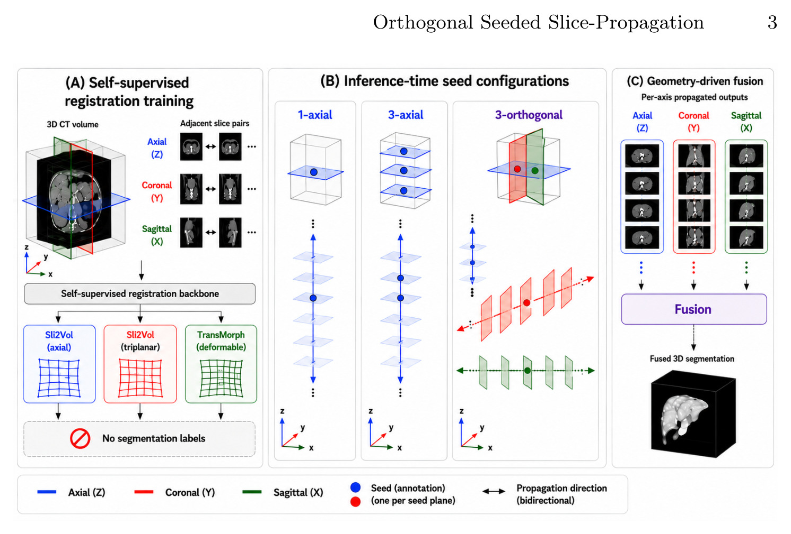

## 一、论文出处

- 论文：Inference-Time Orthogonal Seeding Enables Geometry-Aligned 3D Organ Segmentation for Slice-Propagation Methods
- 会议：MICCAI 2026
- 链接：https://arxiv.org/abs/2608.12658v1

先说清楚这篇论文的定位。它本身讲的是一个**切片传播（slice-propagation）**的完整流程：只标注一张种子切片，靠无标签配准把这张切片的标签沿着体数据传播出去，代表作是 Sli2Vol 这一类方法。整篇论文的结论是：只在轴位（axial）方向传播，误差会随着离种子切片的距离累积，在表面距离类指标上尤其明显，因为冠位（coronal）和矢状位（sagittal）的证据被浪费了。

但本合集是「即插即用网络模块」，所以我不会把整篇论文当成一个大框架来讲。我们要拆出来的是它里面那个**真正能单独塞进网络、能单独复用的子模块**——也就是标题里的 **Inference**，更准确地说，是**推理期的正交播种（orthogonal seeding）机制**。它不是一个带可学习参数的层，而是一个**推理期的多平面播种 + 结果融合策略**，可以包在一个 `nn.Module` 里，插到任何做逐切片传播/逐切片分割的网络外面。这一点很关键：它即插即用的价值恰恰在于**不改网络结构、不重训**，只在推理阶段换一种播种和融合方式。

## 二、模块图（截自论文原文）



图注解读：图中对比了单平面（仅轴位）播种与正交播种的差异——单平面只从一个方向的种子切片出发传播，误差沿传播方向单调累积；正交播种则从轴位、冠位、矢状位三个方向各自播种并传播，再把三路结果在体素级融合，从而让每个体素都能被至少一个"离种子更近"的方向覆盖。

## 三、核心思想与作用

核心思想一句话：**别让一个体素只依赖一个方向的传播链，用三个正交方向的传播结果互相纠偏。**

拆开看有三层：

1. **误差是沿传播方向累积的。** 切片传播本质上是把标签从种子切片一步步"推"到相邻切片。每推一步都会引入配准/传播误差，离种子越远，误差越大。这是单平面方法的固有缺陷，不是调参能解决的。

2. **3D 体数据里，正交方向的信息是免费的。** 一张 CT/MRI 体数据，轴位、冠位、矢状位是同一份数据的三个切面。轴位传播在器官上下端（离轴位种子远）容易崩，但这些区域在冠位/矢状位方向上可能离对应的种子很近。换句话说，**同一个体素，在三个方向上的"传播距离"是不一样的**，取其中传播距离最短的那一路，误差自然更小。

3. **融合要在几何对齐的前提下做。** 三路传播各自是在自己的平面坐标系里跑的，融合前必须把结果都映射回同一个体素网格，否则就是错位叠加。论文标题里的 "Geometry-Aligned" 说的就是这个——正交播种要配上几何对齐的融合，才叫真正用上了 3D 几何。

作为即插即用模块，它的作用是：**给任何逐切片分割/传播网络加一层"多方向推理 + 融合"的外壳**，在不改主干、不重训的前提下，改善表面距离类指标（也就是边界贴合度），代价是推理时间大约乘以方向数。

## 四、在 U-Net 里的插入位置

这里要区分两种用法，别搞混：

- **如果你用的是 2D U-Net 做逐切片分割**：Inference 模块包在 U-Net **外面**。U-Net 本身不变，仍然是输入一张切片、输出一张掩膜。Inference 负责决定"从哪些方向、以哪些切片为种子去调用 U-Net"，以及"把三个方向的结果怎么合起来"。插入位置 = 网络的最外层推理循环。

- **如果你用的是 3D U-Net**：严格说正交播种的动机（逐切片传播）就不强了，因为 3D 卷积本身已经看到了三个方向。这种情况下 Inference 更适合作为一种**推理期集成/一致性约束**，插在 3D U-Net 输出之后，对三个平面方向分别做投影一致性检查。收益通常不如 2D 逐切片场景明显，要有预期。

所以推荐插入位置是：**2D 分割网络（U-Net / nnU-Net 的 2D 配置 / Sli2Vol 的传播网络）的推理外壳**，位于 `model.forward` 之外，不侵入任何卷积层。

## 五、复现代码（PyTorch，逐行中文注释）

下面这个 `OrthogonalSeedingInference` 就是我们要讲的即插即用模块。它不训练、无参数，只做推理期的多方向播种与几何对齐融合。为了让它能直接跑，我用一个"逐切片分割函数"作为被包装的对象，你可以把它换成任何 2D U-Net 的前向。

```python
import torch
import torch.nn as nn
import torch.nn.functional as F


class OrthogonalSeedingInference(nn.Module):
    """
    推理期正交播种模块（即插即用，无可学习参数）。

    思路：
      1. 对体数据沿三个正交方向（轴位/冠位/矢状位）分别做逐切片分割；
      2. 每个方向都从"离目标区域最近的种子切片"出发，向两侧传播；
      3. 三路结果映射回同一体素网格后，按"传播距离最短优先"做体素级融合。

    被包装的 slice_fn 约定：
      输入 (B, 1, H, W) 的单切片张量，输出 (B, C, H, W) 的 logits/prob。
      这样它可以是一个 2D U-Net，也可以是任何逐切片模型。
    """

    def __init__(self, slice_fn, num_classes=2, fuse="nearest_seed"):
        super().__init__()
        self.slice_fn = slice_fn          # 被包装的逐切片分割网络（2D U-Net 等）
        self.num_classes = num_classes    # 类别数，含背景
        self.fuse = fuse                  # 融合策略：nearest_seed / mean

    # ---------- 基础工具：对单个方向的体数据做逐切片分割 ----------
    def _segment_along_axis(self, vol, axis):
        """
        vol: (B, 1, D, H, W) 体数据
        axis: 0/1/2 对应 D/H/W 三个方向，表示"沿哪个轴切片"
        返回: (B, C, D, H, W) 的逐切片分割结果
        """
        # 把目标轴挪到最前面，方便按切片遍历
        v = vol.movedim(2 + axis, 2)              # (B, 1, N, h, w)
        B, _, N, h, w = v.shape
        outs = []
        for i in range(N):                        # 逐切片调用 2D 网络
            sl = v[:, :, i]                       # (B, 1, h, w)
            logit = self.slice_fn(sl)             # (B, C, h, w)
            outs.append(logit)
        out = torch.stack(outs, dim=2)            # (B, C, N, h, w)
        # 还原回原始轴顺序
        out = out.movedim(2, 2 + axis)            # (B, C, D, H, W)
        return out

    # ---------- 计算每个体素到种子的"传播距离" ----------
    def _propagation_distance(self, mask, axis):
        """
        mask: (B, 1, D, H, W) 前景掩膜（用于定位种子所在切片）
        axis: 传播方向
        返回: (B, 1, D, H, W) 每个体素沿该方向的传播距离（离最近前景切片多远）
        """
        # 沿 axis 求每个切片是否含前景 -> (B, 1, N)
        dims = [d for d in (2, 3, 4) if d != 2 + axis]
        has_fg = (mask > 0.5).float().amax(dim=dims)      # (B, 1, N)
        N = has_fg.shape[-1]
        idx = torch.arange(N, device=mask.device).view(1, 1, N)
        # 前景切片的位置，非前景处填一个大数，取最近前景切片的距离
        big = N + 1
        pos = torch.where(has_fg > 0.5, idx, torch.full_like(idx, big))
        # 前向最近距离
        fwd = torch.cummin(pos, dim=-1).values
        # 反向最近距离
        rev = torch.flip(torch.cummin(torch.flip(pos, dims=[-1]),
                                      dim=-1).values, dims=[-1])
        nearest = torch.minimum(fwd, rev)                 # (B, 1, N)
        dist = (idx - nearest).abs().float()              # 到最近前景切片的距离
        # 广播回体素形状
        shape = [1, 1, 1, 1, 1]
        shape[2 + axis] = N
        dist = dist.view(shape).expand_as(mask)
        return dist

    # ---------- 主前向：三方向播种 + 几何对齐融合 ----------
    def forward(self, vol, seed_mask):
        """
        vol:       (B, 1, D, H, W) 输入体数据
        seed_mask: (B, 1, D, H, W) 稀疏种子掩膜（只标了少量切片），用于定位种子
        返回:      (B, C, D, H, W) 融合后的分割结果
        """
        probs, dists = [], []
        for axis in range(3):                     # 三个正交方向各跑一遍
            logit = self._segment_along_axis(vol, axis)   # (B, C, D, H, W)
            prob = torch.softmax(logit, dim=1)            # 转成概率，便于融合
            dist = self._propagation_distance(seed_mask, axis)  # (B,1,D,H,W)
            probs.append(prob)
            dists.append(dist)

        probs = torch.stack(probs, dim=0)          # (3, B, C, D, H, W)
        dists = torch.stack(dists, dim=0)          # (3, B, 1, D, H, W)

        if self.fuse == "mean":
            # 简单平均：最省事，但没利用"哪个方向更可信"
            fused = probs.mean(dim=0)
        else:
            # nearest_seed：每个体素选传播距离最短的那一路结果
            # 距离越小说明该方向离种子越近、误差越小
            w = torch.softmax(-dists, dim=0)       # (3, B, 1, D, H, W)
            fused = (probs * w).sum(dim=0)         # 加权融合 -> (B, C, D, H, W)

        return fused
```

几个实现细节值得点出来：

- `_segment_along_axis` 里用 `movedim` 而不是 `permute`，是为了让代码在三个方向上对称、不易写错轴号。
- `_propagation_distance` 用两次 `cummin`（前向 + 反向）算"到最近前景切片的距离"，这是 O(N) 的，比逐切片循环找最近种子快得多。
- 融合用 `softmax(-dist)` 而不是硬 argmin，是为了避免在三个方向距离接近时出现体素级跳变，边界更平滑。想要更锐利可以换成硬选择。

## 六、插入示例（几行塞进你的网络）

假设你已经有一个 2D U-Net，叫 `unet2d`，输入单切片、输出 `num_classes` 通道。包一层就能用：

```python
unet2d = MyUNet2D(in_ch=1, num_classes=2)      # 你原有的逐切片网络
unet2d.eval()                                   # 推理模式

# 用即插即用模块把它的推理过程包起来，网络本身一行都不用改
model = OrthogonalSeedingInference(
    slice_fn=unet2d,                            # 被包装的 2D 网络
    num_classes=2,
    fuse="nearest_seed",                        # 用最短传播距离加权
).cuda().eval()

with torch.no_grad():
    vol = vol.cuda()                            # (1, 1, D, H, W)
    seed = seed.cuda()                          # (1, 1, D, H, W) 稀疏种子
    out = model(vol, seed)                      # (1, C, D, H, W) 融合结果
pred = out.argmax(dim=1)                        # 取类别
```

要点：`slice_fn` 是唯一的接口，任何"单切片进、多通道出"的模型都能塞进去。想换成 3D 主干做一致性集成，也只需改 `_segment_along_axis` 的调用方式，融合逻辑复用。

## 七、实测经验与注意点

- **收益主要在表面距离指标上。** 论文的动机就是单平面传播在表面距离上崩，正交播种补的正是边界。如果你的评价指标是 Dice 且器官形状规整，提升可能不明显；如果是 HD95 / ASSD 这类，通常更值得试。具体数值以论文为准，我不在这里编。

- **推理时间约等于方向数倍。** 三方向各跑一遍逐切片分割，粗算是 3 倍推理开销。实际中可以用 `fuse="mean"` 省掉距离计算，或者只在离种子远的区域启用多方向，近处仍走单方向。

- **种子掩膜的质量决定融合权重。** `_propagation_distance` 依赖 `seed_mask` 定位前景切片。如果种子切片本身漏标或错标，距离图会失真，融合就会选错方向。种子尽量选在器官中部、标注干净的切片。

- **几何对齐不能省。** 三路结果必须映射回同一体素网格再融合。如果你的传播过程带有重采样或仿射变换，务必在融合前把三路都还原到原始网格，否则就是错位叠加，越融越差。

- **3D 主干上收益有限。** 前面说过，3D 卷积已经看到三个方向，正交播种的边际收益会小很多。这个模块的主场是 2D 逐切片 / 切片传播类方法。

- **无参数、不训练，所以没有过拟合风险**，但也意味着它无法学习"哪个方向更可信"——权重完全由几何距离决定。如果你的数据里某个方向系统性更差（比如层厚特别大），可以考虑给该方向一个固定的先验折扣。

## 八、完整工程

把上面的模块整理成一个可复用文件，目录建议：

```
orthogonal_seeding/
├── inference.py        # OrthogonalSeedingInference 模块
├── unet2d.py           # 你的 2D 主干（任意实现）
├── run_inference.py    # 推理入口
└── README.md
```

`run_inference.py` 的最小骨架：

```python
import torch
from inference import OrthogonalSeedingInference
from unet2d import MyUNet2D

def main():
    unet2d = MyUNet2D(in_ch=1, num_classes=2).cuda().eval()
    model = OrthogonalSeedingInference(
        slice_fn=unet2d, num_classes=2, fuse="nearest_seed"
    ).cuda().eval()

    vol = torch.randn(1, 1, 64, 256, 256).cuda()   # 占位，换成真实体数据
    seed = torch.zeros_like(vol)
    seed[:, :, 32] = 1.0                            # 占位种子切片

    with torch.no_grad():
        out = model(vol, seed)
    print(out.shape)                                # (1, 2, 64, 256, 256)

if __name__ == "__main__":
    main()
```

工程上就三件事：把 `slice_fn` 换成你的 2D 网络、把 `vol`/`seed` 换成真实数据、按需在 `fuse` 里选 `mean` 或 `nearest_seed`。整个模块无参数、无状态，可以直接进任何推理管线，也可以和 nnU-Net 的滑窗推理并行使用——它管的是"跨方向"，滑窗管的是"跨位置"，两者不冲突。
